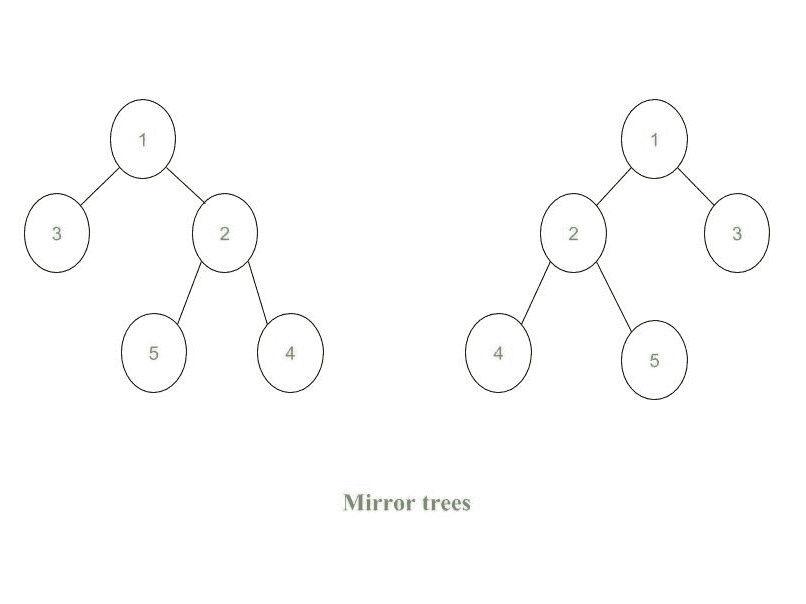

# 使用层级顺序遍历

检查两棵树是否互为镜像

> 原文:[https://www . geeksforgeeks . org/check-如果两棵树是彼此的镜像-使用级别顺序遍历/](https://www.geeksforgeeks.org/check-if-two-trees-are-mirror-of-each-other-using-level-order-traversal/)

给定两个二叉树，任务是检查这两个二叉树是否是彼此的镜像。
**一个二叉树的镜像:**一个二叉树 T 的镜像是另一个二叉树 M(T)，所有非叶节点的左右子节点互换。



上图中的树是彼此的镜子。

已经讨论了[递归解](https://www.geeksforgeeks.org/check-if-two-trees-are-mirror/)和使用有序遍历来检查两个二叉树是否是彼此的镜像的[迭代方法。在这篇文章中，已经讨论了使用](https://www.geeksforgeeks.org/iterative-method-check-two-trees-mirror/)[级顺序遍历](https://www.geeksforgeeks.org/level-order-tree-traversal/)的解决方案。
想法是使用一个队列，其中需要检查是否相等的两个树的两个节点一起存在。在级别顺序遍历的每一步，从队列中获取两个节点，检查它们的相等性，然后插入这些节点的下两个需要检查相等性的子节点。在插入步骤中，插入第一个树节点的第一个左子节点和第二个树节点的右子节点。在插入第一个树节点的右子节点和第二个树节点的左子节点之后。如果在任何阶段，一个节点为空，另一个节点不为空，那么这两个树就不是彼此的镜像。
以下是上述方法的实施:

## C++

```
// C++ implementation to check whether the two
// binary trees are mirrors of each other or not
#include <bits/stdc++.h>
using namespace std;

// Structure of a node in binary tree
struct Node {
    int data;
    struct Node *left, *right;
};

// Function to create and return
// a new node for a binary tree
struct Node* newNode(int data)
{
    struct Node* temp = new Node();
    temp->data = data;
    temp->left = temp->right = NULL;
    return temp;
}

// Function to check whether the two binary trees
// are mirrors of each other or not
string areMirrors(Node* a, Node* b)
{
    // If both are NULL, then are mirror.
    if (a == NULL && b == NULL)
        return "Yes";

    // If only one is NULL, then not
    // mirror.
    if (a == NULL || b == NULL)
        return "No";

    queue<Node*> q;

    // Push root of both trees in queue.
    q.push(a);
    q.push(b);

    while (!q.empty()) {

        // Pop two elements of queue, to
        // get two nodes and check if they
        // are symmetric.
        a = q.front();
        q.pop();

        b = q.front();
        q.pop();

        // If data value of both nodes is
        // not same, then not mirror.
        if (a->data != b->data)
            return "No";

        // Push left child of first tree node
        // and right child of second tree node
        // into queue if both are not NULL.
        if (a->left && b->right) {
            q.push(a->left);
            q.push(b->right);
        }

        // If any one of the nodes is NULL and
        // other is not NULL, then not mirror.
        else if (a->left || b->right)
            return "No";

        // Push right child of first tree node
        // and left child of second tree node
        // into queue if both are not NULL.
        if (a->right && b->left) {
            q.push(a->right);
            q.push(b->left);
        }

        // If any one of the nodes is NULL and
        // other is not NULL, then not mirror.
        else if (a->right || b->left)
            return "No";
    }

    return "Yes";
}
// Driver Code
int main()
{
    // 1st binary tree formation
    /*
            1
           / \
          3   2
             / \
            5   4
        */
    Node* root1 = newNode(1);
    root1->left = newNode(3);
    root1->right = newNode(2);
    root1->right->left = newNode(5);
    root1->right->right = newNode(4);

    // 2nd binary tree formation
    /*
            1
           / \
          2   3
         / \
        4   5
        */
    Node* root2 = newNode(1);
    root2->left = newNode(2);
    root2->right = newNode(3);
    root2->left->left = newNode(4);
    root2->left->right = newNode(5);

    cout << areMirrors(root1, root2);
    return 0;
}
```

## Java 语言(一种计算机语言，尤用于创建网站)

```
// Java implementation to check whether the two
// binary trees are mirrors of each other or not
import java.util.*;

class GFG
{

// Structure of a node in binary tree
static class Node
{
    int data;
    Node left, right;
};

// Function to create and return
// a new node for a binary tree
static Node newNode(int data)
{
    Node temp = new Node();
    temp.data = data;
    temp.left = temp.right = null;
    return temp;
}

// Function to check whether the two binary trees
// are mirrors of each other or not
static String areMirrors(Node a, Node b)
{
    // If both are null, then are mirror.
    if (a == null && b == null)
        return "Yes";

    // If only one is null, then not
    // mirror.
    if (a == null || b == null)
        return "No";

    Queue<Node> q = new LinkedList<Node>();

    // Push root of both trees in queue.
    q.add(a);
    q.add(b);

    while (q.size() > 0)
    {

        // remove two elements of queue, to
        // get two nodes and check if they
        // are symmetric.
        a = q.peek();
        q.remove();

        b = q.peek();
        q.remove();

        // If data value of both nodes is
        // not same, then not mirror.
        if (a.data != b.data)
            return "No";

        // Push left child of first tree node
        // and right child of second tree node
        // into queue if both are not null.
        if (a.left != null && b.right != null)
        {
            q.add(a.left);
            q.add(b.right);
        }

        // If any one of the nodes is null and
        // other is not null, then not mirror.
        else if (a.left != null || b.right != null)
            return "No";

        // Push right child of first tree node
        // and left child of second tree node
        // into queue if both are not null.
        if (a.right != null && b.left != null)
        {
            q.add(a.right);
            q.add(b.left);
        }

        //If any one of the nodes is null and
        // other is not null, then not mirror.
        else if (a.right != null || b.left != null)
            return "No";
    }

    return "Yes";
}

// Driver Code
public static void main(String args[])
{
    // 1st binary tree formation
    /*
            1
        / \
        3 2
            / \
            5 4
        */
    Node root1 = newNode(1);
    root1.left = newNode(3);
    root1.right = newNode(2);
    root1.right.left = newNode(5);
    root1.right.right = newNode(4);

    // 2nd binary tree formation
    /*
            1
        / \
        2 3
        / \
        4 5
        */
    Node root2 = newNode(1);
    root2.left = newNode(2);
    root2.right = newNode(3);
    root2.left.left = newNode(4);
    root2.left.right = newNode(5);

    System.out.print(areMirrors(root1, root2));
}
}

// This code is contributed by Arnab Kundu
```

## 蟒蛇 3

```
# Python3 implementation to check whether the two
# binary trees are mirrors of each other or not

# Structure of a node in binary tree
class Node: 

    def __init__(self, data):
        self.data = data
        self.left = None
        self.right = None

# Function to check whether the two binary
# trees are mirrors of each other or not
def areMirrors(a, b):

    # If both are NULL, then are mirror.
    if a == None and b == None:
        return "Yes"

    # If only one is NULL, then not mirror.
    if a == None or b == None:
        return "No"

    q = []

    # append root of both trees in queue.
    q.append(a)
    q.append(b)

    while len(q) > 0: 

        # Pop two elements of queue,
        # to get two nodes and check
        # if they are symmetric.
        a = q.pop(0)
        b = q.pop(0)

        # If data value of both nodes is
        # not same, then not mirror.
        if a.data != b.data:
            return "No"

        # append left child of first tree node
        # and right child of second tree node
        # into queue if both are not NULL.
        if a.left and b.right: 
            q.append(a.left)
            q.append(b.right)

        # If any one of the nodes is NULL and
        # other is not NULL, then not mirror.
        elif a.left or b.right:
            return "No"

        # Append right child of first tree node
        # and left child of second tree node
        # into queue if both are not NULL.
        if a.right and b.left: 
            q.append(a.right)
            q.append(b.left)

        # If any one of the nodes is NULL and
        # other is not NULL, then not mirror.
        elif a.right or b.left:
            return "No"

    return "Yes"

# Driver Code
if __name__ == "__main__":

    # 1st binary tree formation
    root1 = Node(1)
    root1.left = Node(3)
    root1.right = Node(2)
    root1.right.left = Node(5)
    root1.right.right = Node(4)

    # 2nd binary tree formation
    root2 = Node(1)
    root2.left = Node(2)
    root2.right = Node(3)
    root2.left.left = Node(4)
    root2.left.right = Node(5)

    print(areMirrors(root1, root2))

# This code is contributed by Rituraj Jain
```

## C#

```
// C# implementation to check whether the two
// binary trees are mirrors of each other or not
using System;
using System.Collections.Generic;

class GFG
{

// Structure of a node in binary tree
public class Node
{
    public int data;
    public Node left, right;
};

// Function to create and return
// a new node for a binary tree
static Node newNode(int data)
{
    Node temp = new Node();
    temp.data = data;
    temp.left = temp.right = null;
    return temp;
}

// Function to check whether the two binary trees
// are mirrors of each other or not
static String areMirrors(Node a, Node b)
{
    // If both are null, then are mirror.
    if (a == null && b == null)
        return "Yes";

    // If only one is null, then not
    // mirror.
    if (a == null || b == null)
        return "No";

    Queue<Node> q = new Queue<Node>();

    // Push root of both trees in queue.
    q.Enqueue(a);
    q.Enqueue(b);

    while (q.Count > 0)
    {

        // remove two elements of queue, to
        // get two nodes and check if they
        // are symmetric.
        a = q.Peek();
        q.Dequeue();

        b = q.Peek();
        q.Dequeue();

        // If data value of both nodes is
        // not same, then not mirror.
        if (a.data != b.data)
            return "No";

        // Push left child of first tree node
        // and right child of second tree node
        // into queue if both are not null.
        if (a.left != null && b.right != null)
        {
            q.Enqueue(a.left);
            q.Enqueue(b.right);
        }

        // If any one of the nodes is null and
        // other is not null, then not mirror.
        else if (a.left != null || b.right != null)
            return "No";

        // Push right child of first tree node
        // and left child of second tree node
        // into queue if both are not null.
        if (a.right != null && b.left != null)
        {
            q.Enqueue(a.right);
            q.Enqueue(b.left);
        }

        //If any one of the nodes is null and
        // other is not null, then not mirror.
        else if (a.right != null || b.left != null)
            return "No";
    }
    return "Yes";
}

// Driver Code
public static void Main(String []args)
{
    // 1st binary tree formation
    /*
            1
        / \
        3 2
            / \
            5 4
        */
    Node root1 = newNode(1);
    root1.left = newNode(3);
    root1.right = newNode(2);
    root1.right.left = newNode(5);
    root1.right.right = newNode(4);

    // 2nd binary tree formation
    /*
            1
        / \
        2 3
        / \
        4 5
        */
    Node root2 = newNode(1);
    root2.left = newNode(2);
    root2.right = newNode(3);
    root2.left.left = newNode(4);
    root2.left.right = newNode(5);

    Console.Write(areMirrors(root1, root2));
}
}

// This code is contributed by Princi Singh
```

## java 描述语言

```
<script>

// JavaScript implementation to check whether the two
// binary trees are mirrors of each other or not

// Structure of a node in binary tree
class Node
{
    constructor()
    {
        this.data = 0;
        this.left = null;
        this.right = null;
    }
};

// Function to create and return
// a new node for a binary tree
function newNode(data)
{
    var temp = new Node();
    temp.data = data;
    temp.left = temp.right = null;
    return temp;
}

// Function to check whether the two binary trees
// are mirrors of each other or not
function areMirrors(a, b)
{
    // If both are null, then are mirror.
    if (a == null && b == null)
        return "Yes";

    // If only one is null, then not
    // mirror.
    if (a == null || b == null)
        return "No";

    var q = [];

    // Push root of both trees in queue.
    q.push(a);
    q.push(b);

    while (q.length > 0)
    {

        // remove two elements of queue, to
        // get two nodes and check if they
        // are symmetric.
        a = q[0];
        q.shift();

        b = q[0];
        q.shift();

        // If data value of both nodes is
        // not same, then not mirror.
        if (a.data != b.data)
            return "No";

        // Push left child of first tree node
        // and right child of second tree node
        // into queue if both are not null.
        if (a.left != null && b.right != null)
        {
            q.push(a.left);
            q.push(b.right);
        }

        // If any one of the nodes is null and
        // other is not null, then not mirror.
        else if (a.left != null || b.right != null)
            return "No";

        // Push right child of first tree node
        // and left child of second tree node
        // into queue if both are not null.
        if (a.right != null && b.left != null)
        {
            q.push(a.right);
            q.push(b.left);
        }

        //If any one of the nodes is null and
        // other is not null, then not mirror.
        else if (a.right != null || b.left != null)
            return "No";
    }
    return "Yes";
}

// Driver Code
// 1st binary tree formation
/*
        1
    / \
    3 2
        / \
        5 4
    */
var root1 = newNode(1);
root1.left = newNode(3);
root1.right = newNode(2);
root1.right.left = newNode(5);
root1.right.right = newNode(4);
// 2nd binary tree formation
/*
        1
    / \
    2 3
    / \
    4 5
    */
var root2 = newNode(1);
root2.left = newNode(2);
root2.right = newNode(3);
root2.left.left = newNode(4);
root2.left.right = newNode(5);
document.write(areMirrors(root1, root2));

</script>
```

**Output:** 

```
Yes
```

**时间复杂度:**O(N)
T3】辅助空间: O(N)