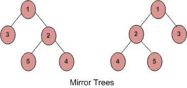

# 检查两棵树是否镜像

> 原文:[https://www . geesforgeks . org/check-if-two-trees-is-mirror/](https://www.geeksforgeeks.org/check-if-two-trees-are-mirror/)

给定两个二叉树，写一个函数，如果两个树是彼此的镜像，则返回真，否则返回假。例如，对于下列输入树，函数应该返回 true。



这个问题不同于这里讨论的问题。
要使两棵树‘a’和‘b’成为镜像，以下三个条件必须成立:

1.  它们的根节点的密钥必须相同
2.  “a”的左树根和“b”的右树根是镜像。
3.  “a”的右子树和“b”的左子树是镜像。

下面是上述想法的实现。

## C++

```
// C++ program to check if two trees are mirror
// of each other
#include<bits/stdc++.h>
using namespace std;

/* A binary tree node has data, pointer to
   left child and a pointer to right child */
struct Node
{
    int data;
    Node* left, *right;
};

/* Given two trees, return true if they are
   mirror of each other */
/*As function has to return bool value instead integer value*/
bool areMirror(Node* a, Node* b)
{
    /* Base case : Both empty */
    if (a==NULL && b==NULL)
        return true;

    // If only one is empty
    if (a==NULL || b == NULL)
        return false;

    /* Both non-empty, compare them recursively
     Note that in recursive calls, we pass left
     of one tree and right of other tree */
    return  a->data == b->data &&
            areMirror(a->left, b->right) &&
            areMirror(a->right, b->left);
}

/* Helper function that allocates a new node */
Node* newNode(int data)
{
    Node* node = new Node;
    node->data  = data;
    node->left  =  node->right  = NULL;
    return(node);
}

/* Driver program to test areMirror() */
int main()
{
    Node *a = newNode(1);
    Node *b = newNode(1);
    a->left = newNode(2);
    a->right = newNode(3);
    a->left->left  = newNode(4);
    a->left->right = newNode(5);

    b->left = newNode(3);
    b->right = newNode(2);
    b->right->left = newNode(5);
    b->right->right = newNode(4);

    areMirror(a, b)? cout << "Yes" : cout << "No";

    return 0;
}
```

## Java 语言(一种计算机语言，尤用于创建网站)

```
// Java program to see if two trees
// are mirror of each other

// A binary tree node
class Node
{
    int data;
    Node left, right;

    public Node(int data)
    {
        this.data = data;
        left = right = null;
    }
}

class BinaryTree
{
    Node a, b;

    /* Given two trees, return true if they are
       mirror of each other */
    boolean areMirror(Node a, Node b)
    {
        /* Base case : Both empty */
        if (a == null && b == null)
            return true;

        // If only one is empty
        if (a == null || b == null)
            return false;

        /* Both non-empty, compare them recursively
           Note that in recursive calls, we pass left
           of one tree and right of other tree */
        return a.data == b.data
                && areMirror(a.left, b.right)
                && areMirror(a.right, b.left);
    }

    // Driver code to test above methods
    public static void main(String[] args)
    {
        BinaryTree tree = new BinaryTree();
        Node a = new Node(1);
        Node b = new Node(1);
        a.left = new Node(2);
        a.right = new Node(3);
        a.left.left = new Node(4);
        a.left.right = new Node(5);

        b.left = new Node(3);
        b.right = new Node(2);
        b.right.left = new Node(5);
        b.right.right = new Node(4);

        if (tree.areMirror(a, b) == true)
            System.out.println("Yes");
        else
            System.out.println("No");

    }
}

// This code has been contributed by Mayank Jaiswal(mayank_24)
```

## 蟒蛇 3

```
# Python3 program to check if two
# trees are mirror of each other

# A binary tree node
class Node:
    def __init__(self, data):
        self.data = data
        self.left = None
        self.right = None

# Given two trees, return true
# if they are mirror of each other
def areMirror(a, b):

    # Base case : Both empty
    if a is None and b is None:
        return True

    # If only one is empty
    if a is None or b is None:
        return False

    # Both non-empty, compare them
    # recursively. Note that in
    # recursive calls, we pass left
    # of one tree and right of other tree
    return (a.data == b.data and
            areMirror(a.left, b.right) and
            areMirror(a.right , b.left))

# Driver code
root1 = Node(1)
root2 = Node(1)

root1.left = Node(2)
root1.right = Node(3)
root1.left.left = Node(4)
root1.left.right = Node(5)

root2.left = Node(3)
root2.right = Node(2)
root2.right.left = Node(5)
root2.right.right = Node(4)

if areMirror(root1, root2):
    print ("Yes")
else:
    print ("No")

# This code is contributed by AshishR
```

## C#

```
using System;

// c# program to see if two trees
// are mirror of each other

// A binary tree node
public class Node
{
    public int data;
    public Node left, right;

    public Node(int data)
    {
        this.data = data;
        left = right = null;
    }
}

public class BinaryTree
{
    public Node a, b;

    /* Given two trees, return true if they are
    mirror of each other */
    public virtual bool areMirror(Node a, Node b)
    {
        /* Base case : Both empty */
        if (a == null && b == null)
        {
            return true;
        }

        // If only one is empty
        if (a == null || b == null)
        {
            return false;
        }

        /* Both non-empty, compare them recursively
        Note that in recursive calls, we pass left
        of one tree and right of other tree */
        return a.data == b.data && areMirror(a.left, b.right)
                            && areMirror(a.right, b.left);
    }

    // Driver code to test above methods
    public static void Main(string[] args)
    {
        BinaryTree tree = new BinaryTree();
        Node a = new Node(1);
        Node b = new Node(1);
        a.left = new Node(2);
        a.right = new Node(3);
        a.left.left = new Node(4);
        a.left.right = new Node(5);

        b.left = new Node(3);
        b.right = new Node(2);
        b.right.left = new Node(5);
        b.right.right = new Node(4);

        if (tree.areMirror(a, b) == true)
        {
            Console.WriteLine("Yes");
        }
        else
        {
            Console.WriteLine("No");
        }

    }
}

// This code is contributed by Shrikant13
```

## java 描述语言

```
<script>
// javascript program to see if two trees
// are mirror of each other

// A binary tree node
class Node {

     Node(data) {
        this.data = data;
        this.left = this.right = null;
    }
}

var a, b;

    /*
     * Given two trees, return true if they are mirror of each other
     */
    function areMirror( a,  b) {
        /* Base case : Both empty */
        if (a == null && b == null)
            return true;

        // If only one is empty
        if (a == null || b == null)
            return false;

        /*
         * Both non-empty, compare them recursively Note that in recursive calls, we
         * pass left of one tree and right of other tree
         */
        return a.data == b.data && areMirror(a.left, b.right) && areMirror(a.right, b.left);
    }

    // Driver code to test above methods

         a = new Node(1);
         b = new Node(1);
        left = new Node(2);
        right = new Node(3);
        left.left = new Node(4);
        left.right = new Node(5);

        left = new Node(3);
        right = new Node(2);
        right.left = new Node(5);
        right.right = new Node(4);

        if (areMirror(a, b) == true)
            document.write("Yes");
        else
            document.write("No");

// This code contributed by umadevi9616
</script>
```

**输出:**

```
Yes
```

**时间复杂度:** O(n)
[**迭代法检查两棵树是否互为镜像**](https://www.geeksforgeeks.org/iterative-method-check-two-trees-mirror/)

？list = plqm7 alhxfyshcxd 7 r1j 0k y9 ZG _ gbb1 dbk
本文由**阿希什·古普塔**供稿。如果发现有不正确的地方，请写评论，或者想分享更多关于以上讨论话题的信息