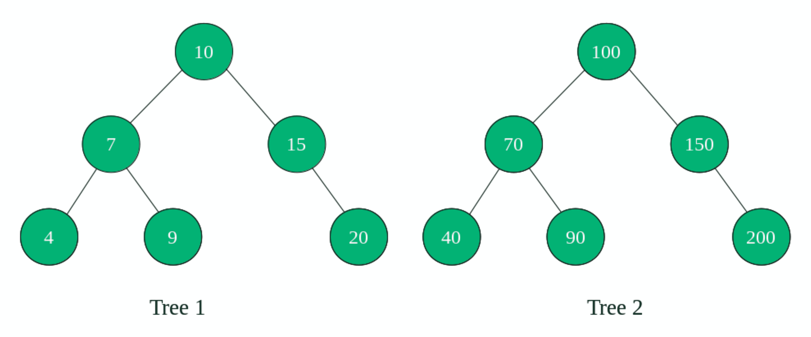

# 检查两棵树的结构是否相同

> 原文:[https://www . geesforgeks . org/check-如果两棵树具有相同的结构/](https://www.geeksforgeeks.org/check-if-two-trees-have-same-structure/)

给定两个二叉树。任务是编写一个程序来检查这两棵树的结构是否相同。



在上图中，树 1 和树 2 在结构上是相同的。也就是说，它们具有相同的结构。
**注**:这个问题不同于[检查两棵树是否相同](https://www.geeksforgeeks.org/write-c-code-to-determine-if-two-trees-are-identical/)，因为这里我们只需要比较两棵树的结构，不需要比较它们节点处的值。

其思想是沿着相同的路径同时遍历两棵树，并不断检查这两棵树是否都存在节点。
**算法** :

1.  如果两棵树都是空的，那么返回 1。
2.  否则如果两棵树都不是空的:
    *   递归检查左子树，即调用 isSameStructure(tree 1-> left _ subtree，tree2->left_subtree)
    *   递归检查右子树，即调用 isSameStructure(tree 1-> right _ subtree，tree2->right_subtree)
    *   如果以上两个步骤中返回的值为真，则返回 1。
3.  否则返回 0(一个是空的，另一个不是)。

以下是上述算法的实现:

## C++

```
// C++ program to check if two trees have
// same structure
#include <iostream>
using namespace std;

// A binary tree node has data, pointer to left child
// and a pointer to right child
struct Node
{
    int data;
    struct Node* left;
    struct Node* right;
};

// Helper function that allocates a new node with the
// given data and NULL left and right pointers.
Node* newNode(int data)
{
    Node* node = new Node;
    node->data = data;
    node->left = NULL;
    node->right = NULL;

    return(node);
}

// Function to check if two trees have same
// structure
int isSameStructure(Node* a, Node* b)
{
    // 1\. both empty
    if (a==NULL && b==NULL)
        return 1;

    // 2\. both non-empty -> compare them
    if (a!=NULL && b!=NULL)
    {
        return
        (
            isSameStructure(a->left, b->left) &&
            isSameStructure(a->right, b->right)
        );
    }

    // 3\. one empty, one not -> false
    return 0;
}

// Driver code
int main()
{
    Node *root1 = newNode(10);
    Node *root2 = newNode(100);
    root1->left = newNode(7);
    root1->right = newNode(15);
    root1->left->left = newNode(4);
    root1->left->right = newNode(9);
    root1->right->right = newNode(20);

    root2->left = newNode(70);
    root2->right = newNode(150);
    root2->left->left = newNode(40);
    root2->left->right = newNode(90);
    root2->right->right = newNode(200);

    if (isSameStructure(root1, root2))
        printf("Both trees have same structure");
    else
        printf("Trees do not have same structure");

    return 0;
}
```

## Java 语言(一种计算机语言，尤用于创建网站)

```
// Java program to check if two trees have
// same structure
class GFG
{

// A binary tree node has data,
// pointer to left child and
// a pointer to right child
static class Node
{
    int data;
    Node left;
    Node right;
};

// Helper function that allocates a new node
// with the given data and null left
// and right pointers.
static Node newNode(int data)
{
    Node node = new Node();
    node.data = data;
    node.left = null;
    node.right = null;

    return(node);
}

// Function to check if two trees
// have same structure
static boolean isSameStructure(Node a, Node b)
{
    // 1\. both empty
    if (a == null && b == null)
        return true;

    // 2\. both non-empty . compare them
    if (a != null && b != null)
    {
        return
        (
            isSameStructure(a.left, b.left) &&
            isSameStructure(a.right, b.right)
        );
    }

    // 3\. one empty, one not . false
    return false;
}

// Driver code
public static void main(String args[])
{
    Node root1 = newNode(10);
    Node root2 = newNode(100);
    root1.left = newNode(7);
    root1.right = newNode(15);
    root1.left.left = newNode(4);
    root1.left.right = newNode(9);
    root1.right.right = newNode(20);

    root2.left = newNode(70);
    root2.right = newNode(150);
    root2.left.left = newNode(40);
    root2.left.right = newNode(90);
    root2.right.right = newNode(200);

    if (isSameStructure(root1, root2))
        System.out.printf("Both trees have same structure");
    else
        System.out.printf("Trees do not have same structure");
}
}

// This code is contributed by Arnab Kundu
```

## 蟒蛇 3

```
# Python3 program to check if two trees have
# same structure

# A binary tree node has data, pointer to left child
# and a pointer to right child
class Node:

    def __init__(self, data):

        self.left = None
        self.right = None
        self.data = data

# Helper function that allocates a new node with the
# given data and None left and right pointers.
def newNode(data):

    node = Node(data)
    return node

# Function to check if two trees have same
# structure
def isSameStructure(a, b):

    # 1\. both empty
    if (a == None and b == None):
        return 1;

    # 2\. both non-empty . compare them
    if (a != None and b != None):

        return (
            isSameStructure(a.left, b.left) and
            isSameStructure(a.right, b.right))

    # 3\. one empty, one not . false
    return 0;

# Driver code
if __name__=='__main__':

    root1 = newNode(10);
    root2 = newNode(100);
    root1.left = newNode(7);
    root1.right = newNode(15);
    root1.left.left = newNode(4);
    root1.left.right = newNode(9);
    root1.right.right = newNode(20);

    root2.left = newNode(70);
    root2.right = newNode(150);
    root2.left.left = newNode(40);
    root2.left.right = newNode(90);
    root2.right.right = newNode(200);

    if (isSameStructure(root1, root2)):
        print("Both trees have same structure");
    else:
        print("Trees do not have same structure");

# This code is contributed by rutvik_56
```

## C#

```
// C# program to check if two trees
// have same structure
using System;

class GFG
{

// A binary tree node has data,
// pointer to left child and
// a pointer to right child
public class Node
{
    public int data;
    public Node left;
    public Node right;
};

// Helper function that allocates a new node
// with the given data and null left
// and right pointers.
static Node newNode(int data)
{
    Node node = new Node();
    node.data = data;
    node.left = null;
    node.right = null;

    return(node);
}

// Function to check if two trees
// have same structure
static Boolean isSameStructure(Node a,
                               Node b)
{
    // 1\. both empty
    if (a == null && b == null)
        return true;

    // 2\. both non-empty . compare them
    if (a != null && b != null)
    {
        return
        (
            isSameStructure(a.left, b.left) &&
            isSameStructure(a.right, b.right)
        );
    }

    // 3\. one empty, one not . false
    return false;
}

// Driver code
public static void Main(String []args)
{
    Node root1 = newNode(10);
    Node root2 = newNode(100);
    root1.left = newNode(7);
    root1.right = newNode(15);
    root1.left.left = newNode(4);
    root1.left.right = newNode(9);
    root1.right.right = newNode(20);

    root2.left = newNode(70);
    root2.right = newNode(150);
    root2.left.left = newNode(40);
    root2.left.right = newNode(90);
    root2.right.right = newNode(200);

    if (isSameStructure(root1, root2))
        Console.Write("Both trees have " + 
                      "same structure");
    else
        Console.Write("Trees do not have" +
                      " same structure");
}
}

// This code is contributed by Rajput-Ji
```

## java 描述语言

```
<script>

// JavaScript program to check if two trees
// have same structure

// A binary tree node has data,
// pointer to left child and
// a pointer to right child
class Node
{
  constructor()
  {
    this.data = 0;
    this.left = null;
    this.right = null;
  }
};

// Helper function that allocates a new node
// with the given data and null left
// and right pointers.
function newNode(data)
{
    var node = new Node();
    node.data = data;
    node.left = null;
    node.right = null;
    return node;
}

// Function to check if two trees
// have same structure
function isSameStructure(a, b)
{
    // 1\. both empty
    if (a == null && b == null)
        return true;

    // 2\. both non-empty . compare them
    if (a != null && b != null)
    {
        return isSameStructure(a.left, b.left) &&
        isSameStructure(a.right, b.right) ;
    }

    // 3\. one empty, one not . false
    return false;
}

// Driver code
var root1 = newNode(10);
var root2 = newNode(100);
root1.left = newNode(7);
root1.right = newNode(15);
root1.left.left = newNode(4);
root1.left.right = newNode(9);
root1.right.right = newNode(20);
root2.left = newNode(70);
root2.right = newNode(150);
root2.left.left = newNode(40);
root2.left.right = newNode(90);
root2.right.right = newNode(200);
if (isSameStructure(root1, root2))
    document.write("Both trees have " + 
                  "same structure");
else
    document.write("Trees do not have" +
                  " same structure");

</script>
```

**Output:** 

```
Both trees have same structure
```