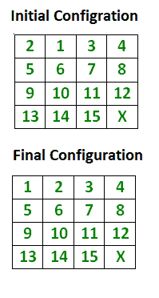
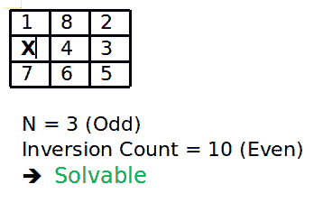
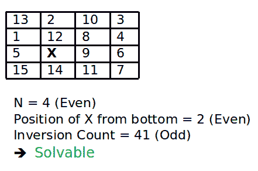
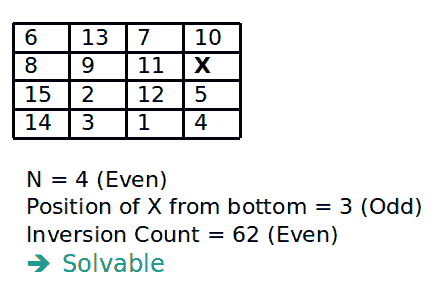
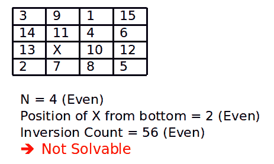
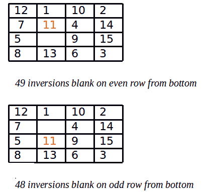

# 如何检查 15 个谜题的一个实例是否可解？

> 原文:[https://www . geesforgeks . org/check-instance-15-拼图-可解/](https://www.geeksforgeeks.org/check-instance-15-puzzle-solvable/)

给定一个 4×4 的板，有 15 个瓷砖(每个瓷砖有一个从 1 到 15 的数字)和一个空白空间。目标是利用空白空间将数字按顺序排列在瓷砖上。我们可以将四个相邻的(左、右、上、下)瓷砖滑入空白区域。例如

[](https://media.geeksforgeeks.org/wp-content/uploads/15-puzzle.png)

在这里，X 标记了元素可以移动到的位置，最终的配置总是保持不变，谜题是可以解决的。
一般来说，对于宽度为 N 的给定网格，我们可以通过遵循以下简单规则来检查一个 N * N–1 难题是否可解:

1.  如果 N 是奇数，那么在输入状态下，如果逆序数是偶数，则谜题实例是可解的。
2.  如果 N 为偶数，则解谜实例可解，如果
    *   空白在从底部开始计数的偶数行上(倒数第二、倒数第四等)。)且逆序数为奇数。
    *   空白在从底部(最后、倒数第三、倒数第五等)开始计数的奇数行上。)且逆序数为偶数。
3.  对于所有其他情况，难题实例是无法解决的。

**这里的倒装句是什么？**
如果我们假设平铺在单行中(1D 阵列)，而不是分散在 N 行中(2D 阵列)，则如果 a 出现在 b 之前，但 a 出现在 b 之前，则一对平铺(a，b)形成反转> b.
例如，考虑平铺在一行中，如下所示:
2 1 3 4 5 6 7 8 9 10 11 12 13 14 15 X
上述网格仅形成 1 个反转，即(2，1)。
**图解:**

[](https://media.geeksforgeeks.org/wp-content/cdn-uploads/15puz1.png)

[](https://media.geeksforgeeks.org/wp-content/cdn-uploads/15puz2.png)

[](https://media.geeksforgeeks.org/wp-content/cdn-uploads/15Puzz3.png)

[](https://media.geeksforgeeks.org/wp-content/cdn-uploads/15Puzz4.png)

下面是一个简单的 C++程序，用于检查给定的 15 个谜题的实例是否可解。该程序是通用的，可以扩展到任何网格宽度。

## C++

```
// C++ program to check if a given instance of N*N-1
// puzzle is solvable or not
#include <iostream>
#define N 4
using namespace std;

// A utility function to count inversions in given
// array 'arr[]'. Note that this function can be
// optimized to work in O(n Log n) time. The idea
// here is to keep code small and simple.
int getInvCount(int arr[])
{
    int inv_count = 0;
    for (int i = 0; i < N * N - 1; i++)
    {
        for (int j = i + 1; j < N * N; j++)
        {
            // count pairs(arr[i], arr[j]) such that
              // i < j but arr[i] > arr[j]
            if (arr[j] && arr[i] && arr[i] > arr[j])
                inv_count++;
        }
    }
    return inv_count;
}

// find Position of blank from bottom
int findXPosition(int puzzle[N][N])
{
    // start from bottom-right corner of matrix
    for (int i = N - 1; i >= 0; i--)
        for (int j = N - 1; j >= 0; j--)
            if (puzzle[i][j] == 0)
                return N - i;
}

// This function returns true if given
// instance of N*N - 1 puzzle is solvable
bool isSolvable(int puzzle[N][N])
{
    // Count inversions in given puzzle
    int invCount = getInvCount((int*)puzzle);

    // If grid is odd, return true if inversion
    // count is even.
    if (N & 1)
        return !(invCount & 1);

    else     // grid is even
    {
        int pos = findXPosition(puzzle);
        if (pos & 1)
            return !(invCount & 1);
        else
            return invCount & 1;
    }
}

/* Driver program to test above functions */
int main()
{

    int puzzle[N][N] =
    {
        {12, 1, 10, 2},
        {7, 11, 4, 14},
        {5, 0, 9, 15}, // Value 0 is used for empty space
        {8, 13, 6, 3},
    };
    /*
    int puzzle[N][N] = {{1, 8, 2},
                    {0, 4, 3},
                    {7, 6, 5}};

    int puzzle[N][N] = {
                    {13, 2, 10, 3},
                    {1, 12, 8, 4},
                    {5, 0, 9, 6},
                    {15, 14, 11, 7},
                };

    int puzzle[N][N] = {
                    {6, 13, 7, 10},
                    {8, 9, 11, 0},
                    {15, 2, 12, 5},
                    {14, 3, 1, 4},
                };

    int puzzle[N][N] = {
                    {3, 9, 1, 15},
                    {14, 11, 4, 6},
                    {13, 0, 10, 12},
                    {2, 7, 8, 5},
                };
    */

    isSolvable(puzzle)? cout << "Solvable":
                        cout << "Not Solvable";
    return 0;
}
```

## 服务器端编程语言（Professional Hypertext Preprocessor 的缩写）

```
<?php
//PHP  program to check if a given instance of N*N-1
// puzzle is solvable or not

$N= 4;

// A utility function to count inversions in given
// array 'arr[]'. Note that this function can be
// optimized to work in O(n Log n) time. The idea
// here is to keep code small and simple.

function  getInvCount( $arr)
{
    global $N;
     $inv_count = 0;
    for ($i = 0; $i < $N * $N - 1; $i++)
    {
        for ($j = $i + 1; $j < $N * $N; $j++)
        {
            // count pairs(arr[i], arr[j]) such that
              // i < j but arr[i] > arr[j]

                $inv_count++;
        }
    }
    return $inv_count;
}

// find Position of blank from bottom
function findXPosition($puzzle)
{
    global $N;
    // start from bottom-right corner of matrix
    for ($i = $N - 1; $i >= 0; $i--)
        for ($j = $N - 1; $j >= 0; $j--)
            if ($puzzle[$i][$j] == 0)
                return $N - $i;
}

// This function returns true if given
// instance of N*N - 1 puzzle is solvable
function  isSolvable( $puzzle)
{
    global $N;
    // Count inversions in given puzzle
    $invCount = getInvCount($puzzle);

    // If grid is odd, return true if inversion
    // count is even.
    if ($N & 1)
        return !($invCount & 1);

    else     // grid is even
    {
        $pos = findXPosition($puzzle);
        if ($pos & 1)
            return !($invCount & 1);
        else
            return $invCount & 1;
    }
}

/* Driver program to test above functions */

    $puzzle =
    array(
        array(12, 1, 10, 2),
        array(7, 11, 4, 14),
        array(5, 0, 9, 15), // Value 0 is used for empty space
        array(8, 13, 6, 3),
    );

    if(isSolvable($puzzle)==0)

            echo  "Solvable";
     else
            echo  "Not Solvable";

#This code is contributed by aj_36
?>
```

## 蟒蛇 3

```
# Python3 program to check if a given instance of N*N-1
# puzzle is solvable or not

# A utility function to count inversions in given
# array . Note that this function can be
# optimized to work in O(n Log n) time. The idea
# here is to keep code small and simple.
N=4
def getInvCount(arr):
    arr1=[]
    for y in arr:
        for x in y:
            arr1.append(x)
    arr=arr1
    inv_count = 0
    for i in range(N * N - 1):
        for j in range(i + 1,N * N):
            # count pairs(arr[i], arr[j]) such that
            # i < j and arr[i] > arr[j]
            if (arr[j] and arr[i] and arr[i] > arr[j]):
                inv_count+=1

    return inv_count

# find Position of blank from bottom
def findXPosition(puzzle):
    # start from bottom-right corner of matrix
    for i in range(N - 1,-1,-1):
        for j in range(N - 1,-1,-1):
            if (puzzle[i][j] == 0):
                return N - i

# This function returns true if given
# instance of N*N - 1 puzzle is solvable
def isSolvable(puzzle):
    # Count inversions in given puzzle
    invCount = getInvCount(puzzle)

    # If grid is odd, return true if inversion
    # count is even.
    if (N & 1):
        return ~(invCount & 1)

    else:    # grid is even
        pos = findXPosition(puzzle)
        if (pos & 1):
            return ~(invCount & 1)
        else:
            return invCount & 1

# Driver program to test above functions
if __name__ == '__main__':

    puzzle =[
        [12, 1, 10, 2,],
        [7, 11, 4, 14,],
        [5, 0, 9, 15,], # Value 0 is used for empty space
        [8, 13, 6, 3,],]

    print("Solvable") if  isSolvable(puzzle) else print("Not Solvable")
```

**Output**

```
Solvable
```

**时间复杂度** : O(n <sup>2</sup>

**空间复杂度** : O(n)

这是如何工作的？
**事实 1:对于奇数宽度的网格，所有合法的移动都保留了反转数的极性(偶数或奇数)。**
**事实证明 1**

*   沿着行(左或右)移动图块不会改变反转的数量，因此不会改变其极性。
*   沿着列移动图块(向上或向下)可以改变反转的数量。图块移动经过偶数个其他图块(N–1)。因此 move 要么将反转计数增加/减少 2，要么保持反转计数不变。

**事实 2:对于偶数宽度的网格，以下是不变的:(#逆序偶数)==(从底部开始奇数行为空白)。**

[](https://media.geeksforgeeks.org/wp-content/cdn-uploads/15puzz6.png)

示例:考虑上面的移动。左边的逆序数是 49，空白在从底部开始的偶数行。所以不变量的值是“false == false”，这是真的。右边的逆序数是 48，因为 11 输了两个逆序，但是 14 赢了一个。空白在底部的奇数行。所以不变量的值是“真= =真”，这仍然是真的。
**事实证明 2**

*   沿着行(左或右)移动图块不会改变反转的数量，也不会改变空白的行。
*   沿着列移动图块(向上或向下)确实会改变反转的数量。图块移动经过奇数个其他图块(N–1)。所以反转的次数是奇数次。空白的行也会改变，从奇数变成偶数，或者从偶数变成奇数。所以不变量的两半都改变了。所以它的价值得以保留。

**结合事实 1 +事实 2 =事实 3:**T2】

*   如果宽度是奇数，那么每个可解状态都有偶数个逆。
    如果宽度是偶数，那么每个可解状态都有
    *   如果空白在从底部开始计数的奇数行上，则为偶数个反转；
    *   如果空白在从底部开始计数的偶数行上，则为奇数个反转；

**事实证明 3:**

*   初始(求解)状态具有这些属性。
*   这些财产被每一个合法的举动所保护。
*   任何可解的状态都可以从初始状态通过一系列合法的动作达到。

**相关文章:**
[如何检查 8 拼图的一个实例是否可解？](https://www.geeksforgeeks.org/check-instance-8-puzzle-solvable/)
**来源:**
[https://www . cs . bham . AC . uk/~ MDR/teaching/modules 04/Java 2/tilessolvability . html](https://www.cs.bham.ac.uk/~mdr/teaching/modules04/java2/TilesSolvability.html)
本文由 **Aditya Goel** 供稿。如果您发现任何不正确的地方，请写评论，或者您想分享更多关于上面讨论的主题的信息