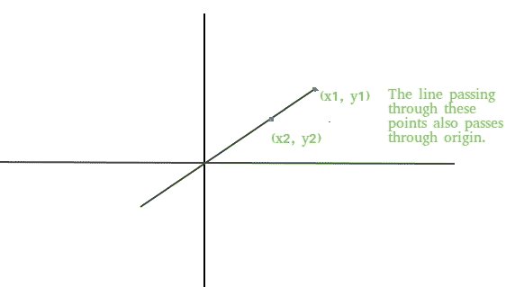

# 检查一条线是否通过原点

> 原文:[https://www.geeksforgeeks.org/check-line-passes-origin/](https://www.geeksforgeeks.org/check-line-passes-origin/)

给定一条直线的两个坐标(x1，y1)和(x2，y2)，求通过这些点的直线是否也通过原点。



示例:

```
Input : (x1, y1) = (10, 0)
        (x2, y2) = (20, 0)
Output : Yes
The line passing through these points
clearly passes through the origin as 
the line is x axis.

Input : (x1, y1) = (1, 28)
        (x2, y2) = (2, 56)
Output : Yes
```

**逼近:**直线通过两点(x1，y1)和(x2，y2)的方程由
y-y1 =((y2-y1)/(x2-x1))(x-x1)+c
如果直线也通过原点，那么 c=0，那么直线的方程就变成了
y-y1 =((y2-y1)/(x2-x1))(x-x1)
保持 x=0，y=0 在上面的方程中我们得到，
x1(y2-1)

## C++

```
/* C++ program to find if line passing through
   two coordinates also passes through origin
   or not */
#include <bits/stdc++.h>
using namespace std;

bool checkOrigin(int x1, int y1, int x2, int y2)
{
   return (x1 * (y2 - y1) == y1 * (x2 - x1));
}

// Driver code
int main()
{
    if (checkOrigin(1, 28, 2, 56) == true)
      cout << "Yes";
    else
      cout << "No";
    return 0;
}
```

## Java 语言(一种计算机语言，尤用于创建网站)

```
// Java program to find if line passing through
// two coordinates also passes through origin
// or not
import java.io.*;

class GFG {

    static boolean checkOrigin(int x1, int y1,
                                       int x2, int y2)
    {
        return (x1 * (y2 - y1) == y1 * (x2 - x1));
    }

    // Driver code
    public static void main (String[] args)
    {
        if (checkOrigin(1, 28, 2, 56) == true)
            System.out.println("Yes");
        else
            System.out.println("No");
    }
}

// This code is contributed by Ajit.
```

## 蟒蛇 3

```
# Python program to find if line
# passing through two coordinates
# also passes through origin or not

def checkOrigin(x1, y1, x2, y2):
    return (x1 * (y2 - y1) == y1 * (x2 - x1))

# Driver code
if (checkOrigin(1, 28, 2, 56) == True):
    print("Yes")
else:
    print("No")

# This code is contributed
# by Anant Agarwal.
```

## C#

```
// C# program to find if line passing through
// two coordinates also passes through origin
// or not
using System;

class GFG {

    static bool checkOrigin(int x1, int y1,
                            int x2, int y2)
    {
        return (x1 * (y2 - y1) == y1 * (x2 - x1));
    }

    // Driver code
    public static void Main()
    {
        if (checkOrigin(1, 28, 2, 56) == true)
            Console.WriteLine("Yes");
        else
            Console.WriteLine("No");
    }
}

// This code is contributed by vt_m.
```

## 服务器端编程语言（Professional Hypertext Preprocessor 的缩写）

```
<?php
// PHP program to find if
// line passing through
// two coordinates also
// passes through origin
// or not

function checkOrigin($x1, $y1,
                     $x2, $y2)
{
    return ($x1 * ($y2 - $y1) ==
              $y1 * ($x2 - $x1));
}

// Driver code
if (checkOrigin(1, 28, 2, 56) == true)
    echo("Yes");
else
    echo("No");

// This code is contributed by Ajit.
?>
```

## java 描述语言

```
<script>

// JavaScript program to find if line passing through
// two coordinates also passes through origin
// or not

    function checkOrigin(x1, y1, x2, y2)
    {
        return (x1 * (y2 - y1) == y1 * (x2 - x1));
    }

// Driver Code

        if (checkOrigin(1, 28, 2, 56) == true)
            document.write("Yes");
        else
            document.write("No");

           // This code is contributed by chinmoy1997pal.
</script>
```

**Output:** 

```
Yes
```