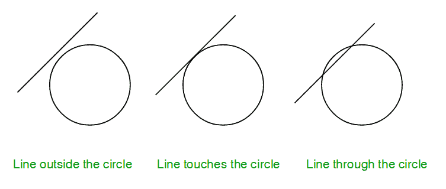
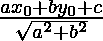

# 检查一条线是否接触或相交于一个圆

> 原文:[https://www . geesforgeks . org/check-line-touches-interverses-circle/](https://www.geeksforgeeks.org/check-line-touches-intersects-circle/)

给定圆心坐标和半径> 1 的圆和直线方程。任务是检查给定的线是否与圆碰撞。有三种可能:

1.  直线与圆相交。
2.  线接触圆。
3.  线在圆圈之外。



注:一条线的一般方程是 a*x + b*y + c = 0，所以输入中只给出常数 a、b、c。
**例:**

```
Input : radius = 5, center = (0, 0), 
        a = 1, b = -1, c = 0.
Output : Intersect

Input :  radius = 5, center = (0, 0), 
         a = 5, b = 0, c = 0.
Output : Touch

Input : radius = 5, center = (0, 0),
         a = 1, b = 1, c = -16.
Output : Outside
```

其思想是将圆心与直线的垂直距离与圆的半径进行比较。
算法:
1。找出圆心和给定直线之间的垂线(比如 p)。
2。将该距离 p 与半径 r 进行比较。
……)a)如果 p > r，则直线位于圆之外。
……(b)如果 p = r，则直线接触圆。
……(c)如果 p < r，则直线与圆相交。
**如何求垂直距离？**
直线与点的距离可以用下面的公式计算:

以上公式详见[维基](https://en.wikipedia.org/wiki/Distance_from_a_point_to_a_line)。

## C++

```
// CPP program to check if a line touches or 
// intersects or outside a circle.
#include <bits/stdc++.h>
using namespace std;

void checkCollision(int a, int b, int c, 
                  int x, int y, int radius)
{
    // Finding the distance of line from center.
    int dist = (abs(a * x + b * y + c)) / 
                     sqrt(a * a + b * b);

    // Checking if the distance is less than, 
    // greater than or equal to radius.
    if (radius == dist)
        cout << "Touch" << endl;
    else if (radius > dist)
        cout << "Intersect" << endl;
    else
        cout << "Outside" << endl;
}

// Driven Program
int main()
{
    int radius = 5;
    int x = 0, y = 0;
    int a = 3, b = 4, c = 25;
    checkCollision(a, b, c, x, y, radius);
    return 0;
}
```

## Java 语言(一种计算机语言，尤用于创建网站)

```
// Java program to check if a line touches or 
// intersects or outside a circle.

import java.io.*;

class GFG {

    static void checkCollision(int a, int b, int c, 
                               int x, int y, int radius)
    {
        // Finding the distance of line from center.
        double dist = (Math.abs(a * x + b * y + c)) / 
                        Math.sqrt(a * a + b * b);

        // Checking if the distance is less than, 
        // greater than or equal to radius.
        if (radius == dist)
            System.out.println ( "Touch" );
        else if (radius > dist)
            System.out.println( "Intersect") ;
        else
            System.out.println( "Outside") ;
    }

    // Driven Program
    public static void main (String[] args) 
    {
        int radius = 5;
        int x = 0, y = 0;
        int a = 3, b = 4, c = 25;
        checkCollision(a, b, c, x, y, radius);

    }
}

// This article is contributed by vt_m.
```

## 蟒蛇 3

```
# python program to check if a line
# touches or  intersects or outside
# a circle.

import math

def checkCollision(a, b, c, x, y, radius):

    # Finding the distance of line 
    # from center.
    dist = ((abs(a * x + b * y + c)) /
            math.sqrt(a * a + b * b))

    # Checking if the distance is less 
    # than, greater than or equal to radius.
    if (radius == dist):
        print("Touch")
    elif (radius > dist):
        print("Intersect")
    else:
        print("Outside")

# Driven Program
radius = 5
x = 0
y = 0
a = 3
b = 4
c = 25
checkCollision(a, b, c, x, y, radius)

# This code is contributed by Sam007
```

## C#

```
// C# program to check if a line touches or 
// intersects or outside a circle.
using System;

class GFG {

    static void checkCollision(int a, int b, int c, 
                            int x, int y, int radius)
    {
        // Finding the distance of line from center.
        double dist = (Math.Abs(a * x + b * y + c)) / 
                        Math.Sqrt(a * a + b * b);

        // Checking if the distance is less than, 
        // greater than or equal to radius.
        if (radius == dist)
            Console.WriteLine ("Touch");
        else if (radius > dist)
            Console.WriteLine("Intersect");
        else
            Console.WriteLine("Outside");
    }

    // Driven Program
    public static void Main () 
    {
        int radius = 5;
        int x = 0, y = 0;
        int a = 3, b = 4, c = 25;

        checkCollision(a, b, c, x, y, radius);

    }
}

// This article is contributed by vt_m.
```

## 服务器端编程语言（Professional Hypertext Preprocessor 的缩写）

```
<?php
// PHP program to check if a line  
// touches or intersects or outside 
// a circle.

function checkCollision($a, $b, $c, 
                        $x, $y, $radius)
{
    // Finding the distance 
    // of line from center.
    $dist = (abs($a * $x + $b * $y + $c)) / 
                   sqrt($a * $a + $b * $b);

    // Checking if the distance is less than, 
    // greater than or equal to radius.
    if ($radius == $dist)
        echo "Touch";
    else if ($radius > $dist)
        echo "Intersect";
    else
        echo "Outside" ;
}

// Driver Code
$radius = 5;
$x = 0;
$y = 0;
$a = 3;
$b = 4;
$c = 25;
checkCollision($a, $b, $c, $x, $y, $radius);

// This code is contributed by Sam007
?>
```

## java 描述语言

```
<script>

// JavaScript program to check if a line touches or 
// intersects or outside a circle.

function checkCollision(a, b, c, x, y, radius)
    {

        // Finding the distance of line from center.
        let dist = (Math.abs(a * x + b * y + c)) / 
                        Math.sqrt(a * a + b * b);

        // Checking if the distance is less than, 
        // greater than or equal to radius.
        if (radius == dist)
            document.write ( "Touch" );
        else if (radius > dist)
            document.write( "Intersect") ;
        else
            document.write( "Outside") ;
    }

// Driver Code
        let radius = 5;
        let x = 0, y = 0;
        let a = 3, b = 4, c = 25;
        checkCollision(a, b, c, x, y, radius);

// This code is contributed by susmitakundugoaldanga.
</script>
```

**输出:**

```
Touch
```

本文由 **Anuj Chauhan** 供稿。如果你喜欢 GeeksforGeeks 并想投稿，你也可以使用[write.geeksforgeeks.org](http://www.write.geeksforgeeks.org)写一篇文章或者把你的文章邮寄到 review-team@geeksforgeeks.org。看到你的文章出现在极客博客主页上，帮助其他极客。
如果你发现任何不正确的地方，或者你想分享更多关于上面讨论的话题的信息，请写评论。