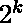

# 检查一个数是否可以表示为连续数的和

> 原文:[https://www . geesforgeks . org/check-number-can-expressed-sum-continuous-numbers/](https://www.geeksforgeeks.org/check-number-can-expressed-sum-consecutive-numbers/)

给定一个数字 n，任务是检查它是否可以表示为两个或多个连续数字的和。
示例:

```
Input  : n = 10 
Output : true
It can be expressed as sum of two consecutive
numbers 1 + 2 + 3 + 4.

Input  : n = 16  
Output : false
It cannot be expressed as sum of two consecutive
numbers.

Input  : n = 5  
Output : true
2 + 3 = 5
```

有一个直接快速的方法可以解决这个问题。如果一个数是 2 的幂，那么它不能表示为连续数的和，否则为是。
这个想法基于以下两个事实。
1)任何两个连续数字的和都是奇数，因为其中一个必须是偶数，另一个必须是奇数。
2)2<sup>n</sup>= 2<sup>n-1</sup>+2<sup>n-1</sup>
如果我们仔细看 1)和 2)，我们可以得到事实背后的直觉。
以下是上述思路的实现。

## C++

```
// C++ program to check if a number can
// be expressed as sum of consecutive numbers
#include<bits/stdc++.h>
using namespace std;

// This function returns true if n can be
// expressed sum of consecutive.
bool canBeSumofConsec(unsigned int n)
{
    // We basically return true if n is a
    // power of two
    return ((n&(n-1)) && n);
}

// Driver code
int main()
{
    unsigned int n = 15;
    canBeSumofConsec(n)? cout << "true" :
                         cout << "false";
    return 0;
}
```

## Java 语言(一种计算机语言，尤用于创建网站)

```
// Java program to check if a number can
// be expressed as sum of consecutive numbers

class Test
{
    // This function returns true if n can be
    // expressed sum of consecutive.
    static boolean canBeSumofConsec(int n)
    {
        // We basically return true if n is a
        // power of two
        return (((n&(n-1))!=0) && n!=0);
    }

    // Driver method
    public static void main(String[] args)
    {
        int n = 15;
        System.out.println(canBeSumofConsec(n) ? "true" : "false");
    }
}
```

## 蟒蛇 3

```
# Python 3 program to check if a number can
# be expressed as sum of consecutive numbers

# This function returns true if n
# can be expressed sum of consecutive.
def canBeSumofConsec(n) :

    # We basically return true if n is a
    # power of two
    return ((n&(n-1)) and n)

# Driver code
n = 15
if(canBeSumofConsec(n)) :
    print("true")
else :
    print("false")

# This code is contributed by Nikita Tiwari.
```

## C#

```
// C# program to check if a number can be
// expressed as sum of consecutive numbers
using System;

class Test
{
    // This function returns true if n
    // can be expressed sum of consecutive.
    static bool canBeSumofConsec(int n)
    {
        // We basically return true if n is a
        // power of two
        return (((n & (n - 1)) != 0) && n != 0);
    }

    // Driver Code
    public static void Main()
    {
        int n = 15;
        Console.Write(canBeSumofConsec(n) ? "True" : "False");
    }
}

// This code is contributed by Nitin Mittal.
```

## 服务器端编程语言（Professional Hypertext Preprocessor 的缩写）

```
<?php
// php program to check if a number
// can be expressed as sum of
// consecutive numbers

// This function returns true if n
// can be expressed sum of consecutive.
function canBeSumofConsec($n)
{

    // We basically return true if n is a
    // power of two
    return (($n & ($n - 1)) && $n);
}

// Driver code
    $n = 15;
    if(canBeSumofConsec($n))
        echo "true" ;
    else
        echo "false";

// This code is contributed by
// nitin mittal.
?>
```

## java 描述语言

```
<script>

// Javascript program to check if a number can
// be expressed as sum of consecutive numbers

    // This function returns true if n can be
    // expressed sum of consecutive.
    function canBeSumofConsec(n)
    {
        // We basically return true if n is a
        // power of two
        return (((n&(n-1))!=0) && n!=0);
    }

// function call

    let n = 15;
    document.write(canBeSumofConsec(n) ? "true" : "false");

</script>
```

**输出:**

```
True
```

时间复杂度:0(1)

辅助空间:0(1)

### **另一种方法:**

让选择用来表示 N 为连续数之和的数为 **X + 1，X + 2，X+3……。Y**

这些选定数字的总和= **第一个 Y 自然数的总和–第一个 X 自然数的总和**

```
Sum of first Y natural number = 
Sum of first X natural number = 
We know that, 
N = Sum of first Y natural number - Sum of first X natural number

Let Y - X = a, Y + X + 1 = b 
Y + X + 1 > Y - X, b > a
, 
2N = a * b
It means that <u>a and b are factor of 2N</u>, we know that <u>X and Y are integers</u> so, 
1\. b - a - 1 => multiple of 2 (Even number) 
2\. b + a + 1 => multiple of 2 (Even number)
```

这两个条件都必须满足

从 1 和 2 我们可以说**它们中的任何一个(a，b)应该是奇数，另一个应该是偶数**

所以如果数 **<u>(2N)</u>** 只有**个奇数因子(不可能，因为它是偶数(2N 不是 N) )** 或**只有偶数因子，我们就不能把它表示成任何连续自然数的和**

所以现在，我们必须现在**只检查它是否有奇数因子**

1.如果数字 **<u>(2N 不是 N)</u>****没有任何奇因子**(只包含**偶因子**的意思是可以将**表示为** )那么 **<u>我们就不能将其表示为连续数字的和</u>**

2.如果数字 **(2N 不是 N)** 有一个**奇数因子**，那么 **<u>我们可以把它表示为一个连续数字</u>** 的和

```
After this we have to only check whether we can represent <u>(2N as</u> <u>)</u> or not 
if Yes then answer is false or 0
if No then answer is true or 1
```

下面是上述想法的实现:

## C++14

```
#include <bits/stdc++.h>
using namespace std;

long long int canBeSumofConsec(long long int n)
{
    // Updating n with 2n
    n = 2 * n;
    // (n & (n - 1)) => Checking whether we can write 2n as 2^k
    // if yes (can't represent 2n as 2^k) then answer 1
    // if no (can represent 2n as 2^k) then answer 0
    return ((n & (n - 1)) != 0);
}

int main()
{
    long long int n = 10;
    cout<<canBeSumofConsec(n)<<"\n";
}
```

## C

```
#include <stdio.h>

long long int canBeSumofConsec(long long int n)
{
    // Updating n with 2n
    n = 2 * n;
    // (n & (n - 1)) => Checking whether we can write 2n as 2^k
    // if yes (can't represent 2n as 2^k) then answer 1
    // if no (can represent 2n as 2^k) then answer 0
    return ((n & (n - 1)) != 0);
}

int main()
{
    long long int n = 10;
    printf("%lld", canBeSumofConsec(n));
}
```

## Java 语言(一种计算机语言，尤用于创建网站)

```
import java.util.*;
class GFG{

 static int canBeSumofConsec( int n)
{
    // Updating n with 2n
    n = 2 * n;

    // (n & (n - 1)) => Checking whether we can write 2n as 2^k
    // if yes (can't represent 2n as 2^k) then answer 1
    // if no (can represent 2n as 2^k) then answer 0
    return ((n & (n - 1)) != 0)?1:0;
}

public static void main(String[] args)
{
    int n = 10;
    System.out.print(canBeSumofConsec(n)+"\n");
}
}

// This code is contributed by umadevi9616
```

## 蟒蛇 3

```
def canBeSumofConsec(n):

    # Updating n with 2n
    n = 2 * n;

    # (n & (n - 1)) => Checking whether we can write 2n as 2^k
    # if yes (can't represent 2n as 2^k) then answer 1
    # if no (can represent 2n as 2^k) then answer 0
    if((n & (n - 1)) != 0):
        return 1;
    else:
        return 0;

if __name__ == '__main__':
    n = 10;
    print(canBeSumofConsec(n));

# This code is contributed by umadevi9616
```

## C#

```
using System;

public class GFG {

    static int canBeSumofConsec(int n)
    {

        // Updating n with 2n
        n = 2 * n;

        // (n & (n - 1)) => Checking whether we can write 2n as 2^k
        // if yes (can't represent 2n as 2^k) then answer 1
        // if no (can represent 2n as 2^k) then answer 0
        return ((n & (n - 1)) != 0) ? 1 : 0;
    }

    public static void Main(String[] args) {
        int n = 10;
        Console.Write(canBeSumofConsec(n) + "\n");
    }
}

// This code is contributed by umadevi9616
```

## java 描述语言

```
<script>

    function canBeSumofConsec(n) {
        // Updating n with 2n
        n = 2 * n;

        // (n & (n - 1)) => Checking whether we can write 2n as 2^k
        // if yes (can't represent 2n as 2^k) then answer 1
        // if no (can represent 2n as 2^k) then answer 0
        return ((n & (n - 1)) != 0) ? 1 : 0;
    }

        var n = 10;
        document.write(canBeSumofConsec(n) + "\n");

// This code is contributed by umadevi9616
</script>
```

**Output**

```
1
```

时间复杂度:0(1)

辅助空间:0(1)

**参考:**
[http://www . cut-the-node . org/算数/unpertyofpowersoff 2 . shtml](http://www.cut-the-knot.org/arithmetic/UnpropertyOfPowersOf2.shtml)
本文由 **Sahil Chhabra(KILLER)** 供稿。如果你喜欢 GeeksforGeeks 并想投稿，你也可以用[write.geeksforgeeks.org](https://write.geeksforgeeks.org)写一篇文章或者把你的文章邮寄到 review-team@geeksforgeeks.org。看到你的文章出现在极客博客主页上，帮助其他极客。
如果发现有不正确的地方，或者想分享更多关于上述话题的信息，请写评论。