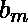
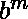
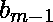
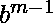

# 检查一个数字 N 是否以 b 为基数的 1 开头

> 原文:[https://www . geesforgeks . org/check-number-n-starts-1-B- base/](https://www.geeksforgeeks.org/check-number-n-starts-1-b-base/)

给定一个数字 N 和基数 b，如果基数 b 表示中的 N 以 1 开头，则打印是，否则打印否

**示例:**

```
Input : n = 6, b = 4
Output : Yes
6 can be written as  in base 4
so answer is Yes as it starts with 1
Input : n = 24, b = 2
Output : Yes
24 can be written as  in base 2
so answer is Yes as it starts with 1
Input :  n = 24, b = 7
Output : No
24 can be written as  in base 7
so answer is No as it starts with 3        
```

当一个数字 N 用基数“b”表示时，它被转换成 m+1 长度序列 [Tex]b_{m-1} [/Tex]…..意为 *  +  *  …..+  *  = N

基数 b 中最小的数字，以“1”开头，即 100..00 和 m+1 的基数为
，最大数字为 2*  -1。所以 N 应该在这个范围内。
 < = N < = 2*  -1
现在要注意的另一件事是 m 不能超过 floor(  (N))，因为当我们在 base-2 中表示任何数字时，它会被转换为只有 1 和 0 的序列，因此该序列的长度将总是大于任何其他 base 表示，并且它的长度将等于 floor(  (N))+1。

因此，为了检查给定的基数“b”，如果 N 以 1 开头，我们将从 m = 1 遍历到 m = floor(  (N))，并检查任何 m N 是否在范围 < = N < = 2*  -1 内，并相应地打印“是”或“否”。

## C++

```
// C++ program to check if number starts with
// one in base b representation
#include <bits/stdc++.h>
using namespace std;

// Returns true if n starts with  1 in
// base b representation
bool CheckIfstartsWithOne(int n, int b)
{
    // highest m can be log2(n)
    int m = log2(n);
    for (int i = 1; i <= m; i++) {
        // if b^m <= N <= 2*b^m - 1,
        // return true
        if (n >= pow(b, i) && n <= 2 * pow(b, i) - 1)
            return true;
    }
    return false;
}

// printing yes or no
void printYesORno(int n, int b)
{
    if (CheckIfstartsWithOne(n, b) == true)
        cout << "Yes" << endl;
    else if (CheckIfstartsWithOne(n, b) == false)
        cout << "No" << endl;
}

// driver function
int main()
{
    printYesORno(6, 4);
    printYesORno(24, 2);
    printYesORno(24, 7);
    printYesORno(24, 15);
}
```

## Java 语言(一种计算机语言，尤用于创建网站)

```
// Java program to check if number starts with
// one in base b representation

class GFG {

    // Returns true if n starts with 1 in
    // base b representation
    static boolean CheckIfstartsWithOne(int n, int b)
    {

        // highest m can be log2(n)
        int m = (int)(Math.log10(n) / Math.log10(2));
        for (int i = 1; i <= m; i++) {

            // if b^m <= N <= 2*b^m - 1,
            // return true
            if (n >= (int)Math.pow(b, i) &&
                n <= 2 * (int)Math.pow(b, i) - 1)
                return true;
        }

        return false;
    }

    // Driver method
    public static void main(String args[])
    {
        System.out.println(
           CheckIfstartsWithOne(6, 4) ? "Yes" : "No");

        System.out.println(
           CheckIfstartsWithOne(24, 2) ? "Yes" : "No");

        System.out.println(
           CheckIfstartsWithOne(24, 7) ? "Yes" : "No");

        System.out.println(
           CheckIfstartsWithOne(24, 15) ? "Yes" : "No");
    }
}
```

## 蟒蛇 3

```
# Python3 program to check
# if number starts with one
# in base b representation
import math

# Returns true if n
# starts with 1 in
# base b representation
def CheckIfstartsWithOne(n, b):

    # highest m can be log2(n)
    m = (int)(math.log2(n));
    for i in range (1, m + 1):

        # if b^m <= N <= 2*b^m - 1,
        #return true
        x = (int)(math.pow(b, i));
        if n >= x and n <= 2 * x - 1:
            return 1;
    return 0;

# printing yes or no
def printYesORno(n, b):
    if CheckIfstartsWithOne(n, b) == 1:
        print("Yes");
    if CheckIfstartsWithOne(n, b) == 0:
        print("No");

# Driver Code
printYesORno(6, 4);
printYesORno(24, 2);
printYesORno(24, 7);
printYesORno(24, 15);

# This code is contributed by mits.
```

## C#

```
// C# program to check if number starts with
// one in base b representation
using System;

class GFG{

// Returns true if n starts with 1 in
// base b representation
static bool CheckIfstartsWithOne(int n, int b)
{

    // highest m can be log2(n)
    int m = (int)(Math.Log10(n) / Math.Log10(2));
    for(int i = 1; i <= m; i++)
    {

        // if b^m <= N <= 2*b^m - 1,
        // return true
        if (n >= (int)Math.Pow(b, i) &&
            n <= 2 * (int)Math.Pow(b, i) - 1)
            return true;
    }

    return false;
}

// Driver code
public static void Main(String []args)
{
    Console.WriteLine(
       CheckIfstartsWithOne(6, 4) ? "Yes" : "No");

    Console.WriteLine(
       CheckIfstartsWithOne(24, 2) ? "Yes" : "No");

    Console.WriteLine(
       CheckIfstartsWithOne(24, 7) ? "Yes" : "No");

    Console.WriteLine(
       CheckIfstartsWithOne(24, 15) ? "Yes" : "No");
}
}

// This code is contributed by Princi Singh
```

## 服务器端编程语言（Professional Hypertext Preprocessor 的缩写）

```
<?php
// PHP program to check if
// number starts with one
// in base b representation

// Returns true if n starts
// with 1 in base b representation
function CheckIfstartsWithOne($n, $b)
{
    // highest m can be log2(n)
    $m = log($n, 2);
    for ($i = 1; $i <= $m; $i++)
    {
        // if b^m <= N <= 2*b^m - 1,
        // return true
        if ($n >= pow($b, $i) &&
                $n <= 2 * pow($b, $i) - 1)
            return true;
    }
    return false;
}

// printing yes or no
function printYesORno($n, $b)
{
    if (CheckIfstartsWithOne($n, $b) == true)
        echo "Yes" ,"\n";
    else if (CheckIfstartsWithOne($n, $b) == false)
        echo "No" ,"\n";
}

// Driver Code
printYesORno(6, 4);
printYesORno(24, 2);
printYesORno(24, 7);
printYesORno(24, 15);

// This code is contributed by ajit
?>
```

## java 描述语言

```
<script>
    // Javascript program to check if number starts
    // with one in base b representation

    // Returns true if n starts with
    // 1 in base b representation
    function CheckIfstartsWithOne(n, b)
    {

        // highest m can be log2(n)
        let m = parseInt(Math.log10(n) / Math.log10(2), 10);

        for (let i = 1; i <= m; i++)
        {

            // if b^m <= N <= 2*b^m - 1,
            // return true
            if (n >= Math.pow(b, i) && n <= 2 * Math.pow(b, i) - 1)
                return true;
        }

        return false;
    }

    document.write(CheckIfstartsWithOne(6, 4) ? "Yes" + "</br>" : "No" + "</br>");

    document.write(CheckIfstartsWithOne(24, 2) ? "Yes" + "</br>" : "No" + "</br>");

    document.write(CheckIfstartsWithOne(24, 7) ? "Yes" + "</br>" : "No" + "</br>");

    document.write(CheckIfstartsWithOne(24, 15) ? "Yes" : "No");

</script>
```

**输出:**

```
Yes
Yes
No
Yes
```

本文由 **Ayush Jha** 供稿。如果你喜欢 GeeksforGeeks 并想投稿，你也可以使用[write.geeksforgeeks.org](https://write.geeksforgeeks.org)写一篇文章或者把你的文章邮寄到 contribute@geeksforgeeks.org。看到你的文章出现在极客博客主页上，帮助其他极客。
如果你发现任何不正确的地方，或者你想分享更多关于上面讨论的话题的信息，请写评论。