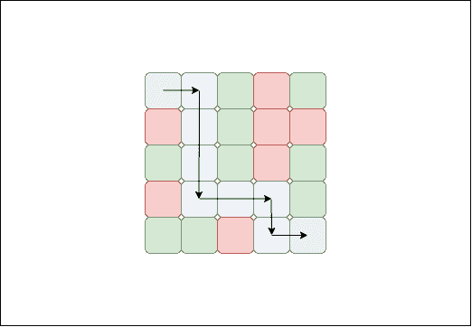
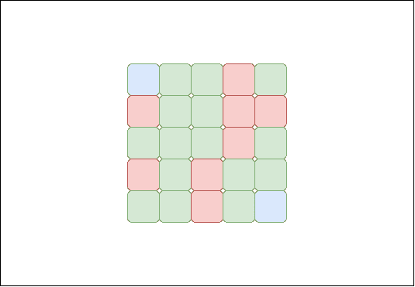

# 检查 2D 矩阵中的可能路径

> 原文:[https://www . geesforgeks . org/check-可能路径-2d-matrix/](https://www.geeksforgeeks.org/check-possible-path-2d-matrix/)

给定一个 2D 数组(m×n)。任务是检查是否有从左上角到右下角的路径。在矩阵中，-1 被认为是阻塞(不能通过这个单元)，0 被认为是路径单元(可以通过它)。

**注意:**左上角单元格始终包含 0

**示例:**

> **输入:** arr[][] = {{ 0，0，0，-1，0}，
> {-1，0，0，-1，-1}，
> { 0，0，0，-1，0}，
> {-1，0，0，0，0，0，0}，
> { 0，0，-1，0，0}}
> **输出:**是
> **解释:**
> 
> 
> 
> 红细胞被阻断，白细胞代表路径，绿色细胞不是阻断细胞。
> 
> **输入:** arr[][] = {{ 0，0，0，-1，0}，
> {-1，0，0，-1，-1}，
> { 0，0，0，-1，0}，
> {-1，0，-1，0，0，0}，
> { 0，0，-1，0，0}}
> **输出:**无
> **说明:**从开始到结束不存在路径。
> 
> 
> 
> 红细胞被阻断，白细胞代表路径，绿色细胞不是阻断细胞。

**<u>方法 1</u>**

*   **进场:**解决方法是执行 [BFS](https://www.geeksforgeeks.org/breadth-first-traversal-for-a-graph/) 或 [DFS](https://www.geeksforgeeks.org/depth-first-traversal-for-a-graph/) 查找是否有路径。不需要创建图表来执行 bfs，但是矩阵本身将被用作图表。从右上角开始遍历，如果有办法到达右下角，那么就有一条路径。
*   **算法:**
    1.  创建一个存储对(I，j)的队列，并将(0，0)插入队列。
    2.  运行一个循环，直到队列为空。
    3.  在每次迭代中，将队列 *(a，b)* 出列，如果前面的元素是目的地(行-1，列-1)，则返回 1，即有路径，并将 mat[a][b]的值更改为-1，即已访问。
    4.  否则插入矩阵[i][j]的值不是-1 的相邻索引。
*   **实施:**

## C++

```
// C++ program to find if there is path
// from top left to right bottom
#include <bits/stdc++.h>
using namespace std;

#define row 5
#define col 5

// to find the path from
// top left to bottom right
bool isPath(int arr[row][col])
{
    //directions
    int dir[4][2] = { {0,1}, {0,-1}, {1,0}, {-1,0}};

    //queue
    queue<pair<int,int> > q;

    //insert the top right corner.
    q.push(make_pair(0,0));

    //until queue is empty
    while(q.size()>0)
    {
        pair<int,int> p = q.front();
        q.pop();

        //mark as visited
        arr[p.first][p.second] = -1;

        //destination is reached.
        if(p == make_pair(row-1,col-1))
            return true;

        //check all four directions
        for(int i=0; i<4 ;i++)
        {
            //using the direction array
            int a = p.first + dir[i][0];
            int b = p.second + dir[i][1];

            //not blocked and valid
            if(arr[a][b]!=-1&& a>=0 && b>=0
                    && a<row && b<col)
            {
                q.push(make_pair(a,b));
            }
        }
    }
    return false;
}

// Driver Code
int main()
{
    // Given array
    int arr[row][col] = { { 0, 0, 0, -1, 0 },
                          { -1, 0, 0, -1, -1 },
                          { 0, 0, 0, -1, 0 },
                          { -1, 0, -1, 0, -1 },
                          { 0, 0, -1, 0, 0 } };

    // path from arr[0][0] to arr[row][col]
    if (isPath(arr))
      cout << "Yes";
    else
      cout << "No";

return 0;
}
```

## Java 语言(一种计算机语言，尤用于创建网站)

```
// Java program to find if there is path
// from top left to right bottom
import java.io.*;
import java.util.*;

class pair
{
    int Item1, Item2;
    pair(int f, int s)
    {
        Item1 = f;
        Item2 = s;
    }
}

class GFG{

static int row = 5;
static int col = 5;

// To find the path from
// top left to bottom right
static boolean isPath(int[][] arr)
{

    // Directions
    int[][] dir = { { 0, 1 }, { 0, -1 },
                    { 1, 0 }, { -1, 0 } };

    // Queue
    Queue<pair> q = new LinkedList<>();

    // Insert the top right corner.
    q.add(new pair(0, 0));

    // Until queue is empty
    while (q.size() > 0)
    {
        pair p = (q.peek());
        q.remove();

        // Mark as visited
        arr[p.Item1][ p.Item2] = -1;

        // Destination is reached.
        if (p == new pair(row - 1, col - 1))
            return true;

        // Check all four directions
        for(int i = 0; i < 4; i++)
        {

            // Using the direction array
            int a = p.Item1 + dir[i][0];
            int b = p.Item2 + dir[i][1];

            // Not blocked and valid
            if (a >= 0 && b >= 0 &&
                a < row && b < col &&
                  arr[a][ b] != -1)
            {
                q.add(new pair(a, b));
            }
        }
    }
    return false;
}

// Driver Code
public static void main(String[] args)
{

    // Given array
    int[][] arr = { { 0, 0, 0, -1, 0 },
                    { -1, 0, 0, -1, -1 },
                    { 0, 0, 0, -1, 0 },
                    { -1, 0, -1, 0, -1 },
                    { 0, 0, -1, 0, 0 } };

    // Path from arr[0][0] to arr[row][col]
    if (isPath(arr))
        System.out.println("Yes");
    else
        System.out.println("No");
}
}

// This code is contributed by avanitrachhadiya2155
```

## 蟒蛇 3

```
# Python3 program to find if there is path
# from top left to right bottom
row = 5
col = 5

# to find the path from
# top left to bottom right
def isPath(arr) :

    # directions
    Dir = [ [0, 1], [0, -1], [1, 0], [-1, 0]]

    # queue
    q = []

    # insert the top right corner.
    q.append((0, 0))

    # until queue is empty
    while(len(q) > 0) :
        p = q[0]
        q.pop(0)

        # mark as visited
        arr[p[0]][p[1]] = -1

        # destination is reached.
        if(p == (row - 1, col - 1)) :
            return True

        # check all four directions
        for i in range(4) :

            # using the direction array
            a = p[0] + Dir[i][0]
            b = p[1] + Dir[i][1]

            # not blocked and valid
            if(a >= 0 and b >= 0 and a < row and b < col and arr[a][b] != -1) :           
                q.append((a, b))
    return False

# Given array
arr = [ [ 0, 0, 0, -1, 0 ],
        [ -1, 0, 0, -1, -1 ],
        [ 0, 0, 0, -1, 0 ],
        [ -1, 0, -1, 0, -1 ],
        [ 0, 0, -1, 0, 0 ] ]

# path from arr[0][0] to arr[row][col]
if (isPath(arr)) :
    print("Yes")
else :
    print("No")

    # This code is contributed by divyesh072019
```

## C#

```
// C# program to find if there is path 
// from top left to right bottom
using System;
using System.Collections;

class GFG{

static int row = 5;
static int col = 5;

// To find the path from
// top left to bottom right
static bool isPath(int[,] arr)
{

    // Directions
    int[,] dir = { { 0, 1 }, { 0, -1 },
                   { 1, 0 }, { -1, 0 } };

    // Queue
    Queue q = new Queue();

    // Insert the top right corner.
    q.Enqueue(new Tuple<int, int>(0, 0));

    // Until queue is empty
    while (q.Count > 0)
    {
        Tuple<int, int> p = (Tuple<int, int>)(q.Peek());
        q.Dequeue();

        // Mark as visited
        arr[p.Item1, p.Item2] = -1;

        // Destination is reached. 
        if (p == new Tuple<int, int>(row - 1, col - 1))
            return true;

        // Check all four directions
        for(int i = 0; i < 4; i++)
        {

            // Using the direction array
            int a = p.Item1 + dir[i, 0];
            int b = p.Item2 + dir[i, 1];

            // Not blocked and valid
            if (a >= 0 && b >= 0 &&
               a < row && b < col &&
                  arr[a, b] != -1)
            {
                q.Enqueue(new Tuple<int, int>(a, b));
            }
        }
    }
    return false;
}

// Driver Code
static void Main()
{

    // Given array
    int[,] arr = { { 0, 0, 0, -1, 0 },
                   { -1, 0, 0, -1, -1 },
                   { 0, 0, 0, -1, 0 },
                   { -1, 0, -1, 0, -1 },
                   { 0, 0, -1, 0, 0 } };

    // Path from arr[0][0] to arr[row][col]
    if (isPath(arr))
        Console.Write("Yes");
    else
        Console.Write("No");
}
}

// This code is contributed by divyeshrabadiya07
```

## java 描述语言

```
<script>

// JavaScript program to find if there is path 
// from top left to right bottom

var row = 5;
var col = 5;

// To find the path from
// top left to bottom right
function isPath(arr)
{

    // Directions
    var dir = [ [ 0, 1 ], [ 0, -1 ],
                   [ 1, 0 ], [ -1, 0 ] ];

    // Queue
    var q = [];

    // Insert the top right corner.
    q.push([0, 0]);

    // Until queue is empty
    while (q.length > 0)
    {
        var p = q[0];
        q.shift();

        // Mark as visited
        arr[p[0]][p[1]] = -1;

        // Destination is reached. 
        if (p == [row - 1][col - 1])
            return true;

        // Check all four directions
        for(var i = 0; i < 4; i++)
        {

            // Using the direction array
            var a = p[0] + dir[i][0];
            var b = p[1] + dir[i][1];

            // Not blocked and valid
            if (a >= 0 && b >= 0 &&
               a < row && b < col &&
                  arr[a][b] != -1)
            {
                q.push([a,b]);
            }
        }
    }
    return false;
}

// Driver Code
// Given array
var arr = [ [ 0, 0, 0, -1, 0 ],
               [ -1, 0, 0, -1, -1 ],
               [ 0, 0, 0, -1, 0 ],
               [ -1, 0, -1, 0, -1 ],
               [ 0, 0, -1, 0, 0 ] ];

// Path from arr[0][0] to arr[row][col]
if (isPath(arr))
    document.write("Yes");
else
    document.write("No");

</script>
```

**输出:**

```
No
```

*   **复杂度分析:**
    *   **时间复杂度:** O(R*C)。
        矩阵的每个元素都可以在队列中插入一次，所以时间复杂度为 O(R*C)。
    *   **空间复杂度:** O(R*C)。
        要将所有元素存储在一个队列中，需要 O(R*C)空间。

**<u>方法二</u>**

*   **方法:**上述解决方案唯一的问题是使用了额外的空间。这种方法将消除对额外空间的需求。基本思路很相似。该算法也将执行 BFS，但需要额外的空间将通过标记阵列来消除。因此，首先运行一个循环，通过仅使用第一行和第一列来检查第一列和第一行的哪些元素可以从 0，0 访问。将它们标记为 1。现在逐行遍历矩阵，增加行和列的索引。如果单元格未被阻塞，则检查其相邻单元格是否标记为 1。如果标记为 1，则标记单元格 1。
*   **算法:**
    1.  将单元格 0，0 标记为 1。
    2.  运行一个从 0 到行长的循环，如果上面的单元格标记为 1，并且当前单元格没有被阻塞，那么将当前单元格标记为 1。
    3.  运行从 0 到列长的循环，如果左侧单元格标记为 1，并且当前单元格未被阻止，则将当前单元格标记为 1。
    4.  在行和列的递增索引中，从开始到结束逐行遍历矩阵。
    5.  如果单元格没有被阻塞，则检查它的任何相邻单元格(只检查上面的单元格和左边的单元格)。是否标记为 1。如果标记为 1，则标记单元格 1。
    6.  如果单元格(行-1，列-1)标记为 1，则返回 true，否则返回 false。
*   **实施:**

## C++

```
// C++ program to find if there is path
// from top left to right bottom
#include <iostream>
using namespace std;

#define row 5
#define col 5

// to find the path from
// top left to bottom right
bool isPath(int arr[row][col])
{
    // set arr[0][0] = 1
    arr[0][0] = 1;

    // Mark reachable (from top left) nodes
    // in first row and first column.
    for (int i = 1; i < row; i++)
        if (arr[i][0] != -1)
            arr[i][0] = arr[i - 1][0];  

    for (int j = 1; j < col; j++)
        if (arr[0][j] != -1)
            arr[0][j] = arr[0][j - 1];   

    // Mark reachable nodes in remaining
    // matrix.
    for (int i = 1; i < row; i++)
        for (int j = 1; j < col; j++)
          if (arr[i][j] != -1)
              arr[i][j] = max(arr[i][j - 1],
                            arr[i - 1][j]);      

    // return yes if right bottom
    // index is 1
    return (arr[row - 1][col - 1] == 1);
}

// Driver Code
int main()
{
    // Given array
    int arr[row][col] = { { 0, 0, 0, -1, 0 },
                          { -1, 0, 0, -1, -1 },
                          { 0, 0, 0, -1, 0 },
                          { -1, 0, -1, 0, -1 },
                          { 0, 0, -1, 0, 0 } };

    // path from arr[0][0] to arr[row][col]
    if (isPath(arr))
      cout << "Yes";
    else
      cout << "No";

return 0;
}
```

## Java 语言(一种计算机语言，尤用于创建网站)

```
// Java program to find if there is path
// from top left to right bottom
class GFG
{
    // to find the path from
    // top left to bottom right
    static boolean isPath(int arr[][])
    {
        // set arr[0][0] = 1
        arr[0][0] = 1;

        // Mark reachable (from top left) nodes
        // in first row and first column.
        for (int i = 1; i < 5; i++)
            if (arr[0][i] != -1)
                arr[0][i] = arr[0][i - 1];
        for (int j = 1; j < 5; j++)
            if (arr[j][0] != -1)
                arr[j][0] = arr[j - 1][0];

        // Mark reachable nodes in
        //  remaining matrix.
        for (int i = 1; i < 5; i++)
            for (int j = 1; j < 5; j++)
                if (arr[i][j] != -1)
                    arr[i][j] = Math.max(arr[i][j - 1],
                                        arr[i - 1][j]);

        // return yes if right
        // bottom index is 1
        return (arr[5 - 1][5 - 1] == 1);
    }

    //Driver code
    public static void main(String[] args)
    {
        // Given array
        int arr[][] = { { 0, 0, 0, -1, 0 },
                        { -1, 0, 0, -1, -1 },
                        { 0, 0, 0, -1, 0 },
                        { -1, 0, -1, 0, -1 },
                        { 0, 0, -1, 0, 0 } };

        // path from arr[0][0]
        // to arr[row][col]
        if (isPath(arr))
            System.out.println("Yes");
        else
            System.out.println("No");
    }
}
// This code is contributed
// by prerna saini
```

## 蟒蛇 3

```
# Python3 program to find if there
# is path from top left to right bottom
row = 5
col = 5

# to find the path from
# top left to bottom right
def isPath(arr):

    # set arr[0][0] = 1
    arr[0][0] = 1

    # Mark reachable (from top left)
    # nodes in first row and first column.
    for i in range(1, row):
        if (arr[i][0] != -1):
            arr[i][0] = arr[i-1][0]

    for j in range(1, col):
        if (arr[0][j] != -1):
            arr[0][j] = arr[0][j-1]

    # Mark reachable nodes in
    # remaining matrix.
    for i in range(1, row):
        for j in range(1, col):
            if (arr[i][j] != -1):
                arr[i][j] = max(arr[i][j - 1],
                                arr[i - 1][j])

    # return yes if right
    # bottom index is 1
    return (arr[row - 1][col - 1] == 1)

# Driver Code

# Given array
arr = [[ 0, 0, 0, -1, 0 ],
       [-1, 0, 0, -1, -1],
       [ 0, 0, 0, -1, 0 ],
       [-1, 0, -1, 0, -1],
       [ 0, 0, -1, 0, 0 ]]

# path from arr[0][0] to arr[row][col]
if (isPath(arr)):
    print("Yes")
else:
    print("No")

# This code is contributed
# by sahilshelangia
```

## C#

```
// C# program to find if there is path
// from top left to right bottom
using System;

class GFG
{
    // to find the path from
    // top left to bottom right
    static bool isPath(int [,]arr)
    {
        // set arr[0][0] = 1
        arr[0, 0] = 1;

        // Mark reachable (from top left) nodes
        // in first row and first column.
        for (int i = 1; i < 5; i++)
            if (arr[i, 0] != -1)
                arr[i, 0] = arr[i - 1, 0];
        for (int j = 1; j < 5; j++)
            if (arr[0,j] != -1)
                arr[0,j] = arr[0, j - 1];

        // Mark reachable nodes in
        // remaining matrix.
        for (int i = 1; i < 5; i++)
            for (int j = 1; j < 5; j++)
                if (arr[i, j] != -1)
                    arr[i, j] = Math.Max(arr[i, j - 1],
                                        arr[i - 1, j]);

        // return yes if right
        // bottom index is 1
        return (arr[5 - 1, 5 - 1] == 1);
    }

    //Driver code
    public static void Main()
    {
        // Given array
        int [,]arr = { { 0, 0, 0, -1, 0 },
                        { -1, 0, 0, -1, -1 },
                        { 0, 0, 0, -1, 0 },
                        { -1, 0, -1, 0, -1 },
                        { 0, 0, -1, 0, 0 } };

        // path from arr[0][0]
        // to arr[row][col]
        if (isPath(arr))
            Console.WriteLine("Yes");
        else
            Console.WriteLine("No");
    }
}

// This code is contributed
// by vt_m
```

## 服务器端编程语言（Professional Hypertext Preprocessor 的缩写）

```
<?php
// PHP program to find if
// there is path from top
// left to right bottom
$row = 5;
$col = 5;

// to find the path from
// top left to bottom right
function isPath($arr)
{
    global $row, $col;

    $arr[0][0] = 1;

    // Mark reachable (from
    // top left) nodes in
    // first row and first column.
    for ($i = 1; $i < $row; $i++)
        if ($arr[$i][0] != -1)
            $arr[$i][0] = $arr[$i - 1][0];

    for ($j = 1; $j < $col; $j++)
        if ($arr[0][$j] != -1)
            $arr[0][$j] = $arr[0][$j - 1];

    // Mark reachable nodes
    // in remaining matrix.
    for ($i = 1; $i < $row; $i++)
        for ($j = 1; $j < $col; $j++)
        if ($arr[$i][$j] != -1)
            $arr[$i][$j] = max($arr[$i][$j - 1],
                               $arr[$i - 1][$j]);

    // return yes if right
    // bottom index is 1
    return ($arr[$row - 1][$col - 1] == 1);
}

// Driver Code

// Given array
$arr = array(array(0, 0, 0, 1, 0),
             array(-1, 0, 0, -1, -1),
             array(0, 0, 0, -1, 0),
             array(-1, 0, -1, 0, -1),
             array(0, 0, -1, 0, 0));

// path from arr[0][0]
// to arr[row][col]
if (isPath($arr))
echo "Yes";
else
echo "No";

// This code is contributed by anuj_67.
?>
```

## java 描述语言

```
<script>

// JavaScript program to find if there is path
// from top left to right bottom
var arr = [[5], [5]]
// to find the path from
// top left to bottom right
function isPath(arr)
{
    // set arr[0][0] = 1
    arr[0][0] = 1;

    // Mark reachable (from top left) nodes
    // in first row and first column.
    for (var i = 1; i < 5; i++)
        if (arr[i][0] != -1)
            arr[i][0] = arr[i - 1][0];  

    for (var j = 1; j < 5; j++)
        if (arr[0][j] != -1)
            arr[0][j] = arr[0][j - 1];   

    // Mark reachable nodes in remaining
    // matrix.
    for (var i = 1; i < 5; i++)
        for (var j = 1; j < 5; j++)
          if (arr[i][j] != -1)
              arr[i][j] = Math.max(arr[i][j - 1],
                            arr[i - 1][j]);      

    // return yes if right bottom
    // index is 1
    return (arr[5 - 1][5 - 1] == 1);
}

// Driver Code

    // Given array
    var arr = [ [ 0, 0, 0, -1, 0 ],
                          [ -1, 0, 0, -1, -1 ],
                          [ 0, 0, 0, -1, 0 ],
                          [ -1, 0, -1, 0, -1 ],
                          [ 0, 0, -1, 0, 0 ] ];

    // path from arr[0][0] to arr[row][col]
    if (isPath(arr))
      document.write("Yes");
    else
      document.write("No");

// This code is contributed by Mayank Tyagi

</script>
```

**输出:**

```
No
```

*   **复杂度分析:**
    *   **时间复杂度:** O(R*C)。
        矩阵的每个元素都被遍历，所以时间复杂度为 O(R*C)。
    *   **空间复杂度:** O(1)。
        不需要额外的空间。