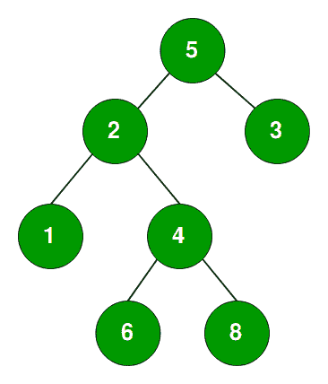

# 检查是否有给定顺序的根到叶路径

> 原文:[https://www . geesforgeks . org/check-root-leaf-path-给定-sequence/](https://www.geeksforgeeks.org/check-root-leaf-path-given-sequence/)

给定一棵二叉树和一个数组，任务是找出给定的数组序列是否作为给定树的根到叶路径存在。

**例:**

```
Input : arr[] = {5, 2, 4, 8} for above tree
Output: "Path Exist"

Input :  arr[] = {5, 3, 4, 9} for above tree
Output: "Path does not Exist"

```

这个问题的一个简单的解决方案是找到给定树中所有根到叶的路径，对于每个根到叶的路径，检查数组中的路径和给定序列是否相同。

这个问题的有效解决方案是遍历树一次，遍历树时，我们必须检查从根到当前节点的路径是否与根到叶路径的给定序列相同。下面是算法:

*   开始以**预定**的方式移动树。
*   每当我们在树中向下移动时，我们也按照根到叶路径的给定顺序移动一个索引。
*   如果**当前节点**等于 **arr【索引】**，这意味着直到该级别的树路径都是相同的。
*   现在剩下的路径要么在**的左子树**中，要么在**的右子树**中。
*   如果任何节点与**arr【index】**不匹配，这意味着当前路径与根到叶路径的给定序列不相同，因此我们返回并移入右子树。
*   Now when we are at **leaf node** and it is equal to **arr[index]** and there is no further element in given sequence of root to leaf path, this means that path exist in given tree.

    ## C++

    ```
    // C++ program to see if there is a root to leaf path
    // with given sequence.
    #include<bits/stdc++.h>
    using namespace std;

    /* A binary tree node has data, pointer to left child
    and a pointer to right child */
    struct Node
    {
        int data;
        struct Node* left, *right;
    };

    /* utility that allocates a new node with the
    given data and NULL left and right pointers. */
    struct Node* newnode(int data)
    {
        struct Node* node = new Node;
        node->data = data;
        node->left = node->right = NULL;
        return (node);
    }

    // Util function
    bool existPathUtil(struct Node *root, int arr[], int n, int index)
    {
        // If root is NULL or reached end of the array
        if(root == NULL or index==n) 
                return false; 

        // If current node is leaf
        if (root->left == NULL && root->right == NULL)
        {
            if((root->data == arr[index]) && (index == n-1)) 
                return true; 

           return false;
        } 

        // If current node is equal to arr[index] this means
        // that till this level path has been matched and
        // remaining path can be either in left subtree or
        // right subtree.
        return ((index < n) && (root->data == arr[index]) &&
                    (existPathUtil(root->left, arr, n, index+1) ||
                    existPathUtil(root->right, arr, n, index+1) ));
    }

    // Function to check given sequence of root to leaf path exist
    // in tree or not.
    // index represents current element in sequence of rooth to
    // leaf path
    bool existPath(struct Node *root, int arr[], int n, int index)
    {
        if(!root)
            return (n==0);

        return existPathUtil(root, arr, n, 0);
    }

    // Driver function to run the case
    int main()
    {
        // arr[] --> sequence of root to leaf path
        int arr[] = {5, 8, 6, 7};
        int n = sizeof(arr)/sizeof(arr[0]);
        struct Node *root = newnode(5);
        root->left = newnode(3);
        root->right = newnode(8);
        root->left->left = newnode(2);
        root->left->right = newnode(4);
        root->left->left->left = newnode(1);
        root->right->left = newnode(6);
        root->right->left->right = newnode(7);

        existPath(root, arr, n, 0)? cout << "Path Exists" :
                                    cout << "Path does not Exist";
        return 0;
    }
    ```

    ## Java 语言(一种计算机语言，尤用于创建网站)

    ```
    // Java program to see if there is a root to leaf path
    // with given sequence.
    import java.io.*;

    class Node
    {
        int data;
        Node left;
        Node right;

        Node(int data)
        {
            this.data = data;
            this.left = null;
            this.right = null;
        }
    }

    class GFG {

        // Util function
        static boolean existPathUtil(Node root, int arr[], 
                            int n, int index)
        {
            // If root is NULL or 
            // reached end of the array
            if(root == null || index==n) 
                    return false; 

            // If current node is leaf
            if (root.left == null && 
                            root.right == null)
            {
                if((root.data == arr[index]) && 
                                    (index == n-1)) 
                    return true; 

               return false;
            } 

            // If current node is equal to arr[index] this means
            // that till this level path has been matched and
            // remaining path can be either in left subtree or
            // right subtree.
            return ((index < n) && (root.data == arr[index]) 
                &&  (existPathUtil(root.left, arr, n, index+1)
                || existPathUtil(root.right, arr, n, index+1) ));
        }

        // Function to check given sequence of root 
        // to leaf path exist in tree or not.
        // index : current element in sequence of root to
        // leaf path
        static boolean existPath(Node root, int arr[], 
                                        int n, int index)
        {
            if(root == null)
                return (n==0);

            return existPathUtil(root, arr, n, 0);
        }

        public static void main (String[] args) {

        // arr[] : sequence of root to leaf path
        int arr[] = {5, 8, 6, 7};
        int n = arr.length;
        Node root = new Node(5);
        root.left = new Node(3);
        root.right = new Node(8);
        root.left.left = new Node(2);
        root.left.right = new Node(4);
        root.left.left.left = new Node(1);
        root.right.left = new Node(6);
        root.right.left.right = new Node(7);

        if(existPath(root, arr, n, 0))
            System.out.println("Path Exists");
        else
            System.out.println("Path does not Exist");

        }
    }
    ```

    ## 蟒蛇 3

    ```
    # Python program to see if
    # there is a root to leaf path
    # with given sequence

    # Class of Node
    class Node:

        # Constructor to create a 
        # node in Binary Tree
        def __init__(self, val):
            self.val = val
            self.left = None
            self.right = None

    # Util function   
    def existPathUtil(root, arr, n, index):

        # If root is NULL or reached 
        # end of the array
        if not root or index == n:
            return False

        # If current node is leaf
        if not root.left and not root.right:
            if root.val == arr[index] and index == n-1:
                return True
            return False

        # If current node is equal to arr[index] this means
        # that till this level path has been matched and
        # remaining path can be either in left subtree or
        # right subtree.
        return ((index < n) and (root.val == arr[index]) and \
                (existPathUtil(root.left, arr, n, index+1) or \
                existPathUtil(root.right, arr, n, index+1)))

    # Function to check given sequence of root to leaf path exist
    # in tree or not.
    # index represents current element in sequence of rooth to
    # leaf path         
    def existPath(root, arr, n, index):
        if not root:
            return (n == 0)

        return existPathUtil(root, arr, n, 0)

    # Driver Code
    if __name__ == "__main__":
        arr = [5, 8, 6, 7]
        n = len(arr)
        root = Node(5)
        root.left = Node(3)
        root.right = Node(8)
        root.left.left = Node(2)
        root.left.right = Node(4)
        root.left.left.left = Node(1)
        root.right.left = Node(6)
        root.right.left.right = Node(7)

        if existPath(root, arr, n, 0):
            print("Path Exists")
        else:
            print("Path does not Exist")
    ```

    ## C#

    ```
    // C# program to see if there
    // is a root to leaf path 
    // with given sequence. 
    using System;

    public class CheckForPath 
    {

        // function to check given sequence
        // of root to leaf path exist 
        // in tree or not. 
        // index represents current element
        // in sequence of rooth to 
        // leaf path 
        public static bool existPath(Node root,
                            int []arr, int index)
        {
            // If root is NULL, then there
            // must not be any element 
            // in array. 
            if(root == null)
            {
                return arr.Length == 0;
            }

            // If this node is a leaf and matches with last entry 
            // of array. 
            if((root.left == null && root.right == null) && 
                                    (root.data == arr[index] &&
                                    root.data == arr[arr.Length - 1]))
            {
                return true;
            }

            // If current node is equal to arr[index] this means 
            // that till this level path has been matched and 
            // remaining path can be either in left subtree or 
            // right subtree. 
            return (index < arr.Length && (root.data == arr[index] && 
                           (existPath(root.left,arr,index + 1) || 
                            existPath(root.right, arr, index + 1))));
        }

        // Driver code
        public static void Main() 
        {
            // arr[] is sequence of root to leaf path 
            int []arr = {5, 8, 6, 7}; 
            Node root=new Node(5);
            root.left=new Node(3);
            root.right=new Node(8);
            root.left.left = new Node(2); 
            root.left.right = new Node(4); 
            root.left.left.left = new Node(1); 
            root.right.left = new Node(6); 
            root.right.left.right = new Node(7); 

            if(existPath(root, arr, 0))
            {
                Console.Write("Path Exists");
            }
            else
            {
                Console.Write("Path does not Exist");
            }
        } 
    }

    /* A binary tree node has data, 
    pointer to left child and a
    pointer to right child */
    public class Node 
    { 
        public int data; 
        public Node left, right; 
        public Node(int data)
        {
            this.data = data;
            left = right = null;
        }
    };

    // This code is contributed Rajput-Ji 
    ```

    **Output:**

    ```
    Path Exists

    ```

    **时间复杂度:** O(n)

    本文由 **[沙莎克·米什拉(古卢)](https://www.facebook.com/shashank.mishra.92167)** 供稿。如果你喜欢 GeeksforGeeks 并想投稿，你也可以使用[contribute.geeksforgeeks.org](http://www.contribute.geeksforgeeks.org)写一篇文章或者把你的文章邮寄到 contribute@geeksforgeeks.org。看到你的文章出现在极客博客主页上，帮助其他极客。

    如果你发现任何不正确的地方，或者你想分享更多关于上面讨论的话题的信息，请写评论。