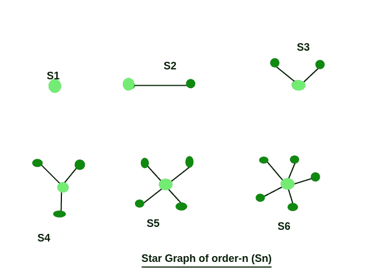

# 检查星图

> 原文:[https://www.geeksforgeeks.org/check-star-graph/](https://www.geeksforgeeks.org/check-star-graph/)

给你一个 n * n 矩阵，它代表一个有 n 个顶点的图，检查输入矩阵是否代表一个星形图。
**例:**

```
Input : Mat[][] = {{0, 1, 0},
                   {1, 0, 1},
                   {0, 1, 0}}
Output : Star graph

Input : Mat[][] = {{0, 1, 0},
                   {1, 1, 1},
                   {0, 1, 0}}
Output : Not a Star graph
```

**星图:**星图是一种特殊类型的图，其中 n-1 个顶点的度数为 1，单个顶点的度数为 n–1。这看起来像是 n–1 个顶点连接到一个中心顶点。一个有 n 个顶点的星图叫做 Sn。
下图为星图:



**逼近:**只需遍历整个矩阵，记录具有 1 度和 n-1 度的顶点数。如果度为 1 的顶点数是 n-1，度为 n-1 的顶点数是 1，那么我们的图应该是星形图，反之则不是。
T3【注:

*   对于 S1，必须只有一个没有边的顶点。
*   对于 S2 来说，必须有两个顶点，每个顶点都有一个度数，或者可以说，两个顶点都由一条边连接。
*   对于锡(n>2)，只需检查上述标准。

## C++

```
// CPP to find whether given graph is star or not
#include<bits/stdc++.h>
using namespace std;

// define the size of incidence matrix
#define size 4

// function to find star graph
bool checkStar(int mat[][size])
{
    // initialize number of vertex
    // with deg 1 and n-1
    int vertexD1 = 0, vertexDn_1 = 0;

    // check for S1
    if (size == 1)
        return (mat[0][0] == 0);

    // check for S2
    if (size == 2)    
       return (mat[0][0] == 0 && mat[0][1] == 1 && 
               mat[1][0] == 1 && mat[1][1] == 0 );

    // check for Sn (n>2)
    for (int i = 0; i < size; i++)
    {
        int degreeI = 0;
        for (int j = 0; j < size; j++)
            if (mat[i][j])
                degreeI++;

        if (degreeI == 1)
            vertexD1++;
        else if (degreeI == size-1)
            vertexDn_1++;
    }

    return (vertexD1 == (size-1) && 
            vertexDn_1 == 1);
}

// driver code
int main()
{
    int mat[size][size] = { {0, 1, 1, 1},
                            {1, 0, 0, 0},
                            {1, 0, 0, 0},
                            {1, 0, 0, 0}};

    checkStar(mat) ? cout << "Star Graph" : 
                     cout << "Not a Star Graph";
    return 0;
}
```

## Java 语言(一种计算机语言，尤用于创建网站)

```
// Java program to find whether 
// given graph is star or not
import java.io.*;

class GFG
{
    // define the size of
    // incidence matrix
    static int size = 4;

    // function to find
    // star graph
    static boolean checkStar(int mat[][])
    {
        // initialize number of 
        // vertex with deg 1 and n-1
        int vertexD1 = 0, 
            vertexDn_1 = 0;

        // check for S1
        if (size == 1)
            return (mat[0][0] == 0);

        // check for S2
        if (size == 2) 
        return (mat[0][0] == 0 && 
                mat[0][1] == 1 && 
                mat[1][0] == 1 &&
                mat[1][1] == 0);

        // check for Sn (n>2)
        for (int i = 0; i < size; i++)
        {
            int degreeI = 0;
            for (int j = 0; j < size; j++)
                if (mat[i][j] == 1)
                    degreeI++;

            if (degreeI == 1)
                vertexD1++;
            else if (degreeI == size - 1)
                vertexDn_1++;
        }

        return (vertexD1 == (size - 1) && 
                vertexDn_1 == 1);
    }

    // Driver code
    public static void main(String args[])
    {
        int mat[][] = {{0, 1, 1, 1},
                       {1, 0, 0, 0},
                       {1, 0, 0, 0},
                       {1, 0, 0, 0}};

        if (checkStar(mat))
            System.out.print("Star Graph"); 
        else
            System.out.print("Not a Star Graph");
    }
}

// This code is contributed by 
// Manish Shaw(manishshaw1)
```

## 蟒蛇 3

```
# Python to find whether 
# given graph is star
# or not

# define the size 
# of incidence matrix
size = 4

# def to 
# find star graph
def checkStar(mat) :

    global size

    # initialize number of 
    # vertex with deg 1 and n-1
    vertexD1 = 0
    vertexDn_1 = 0

    # check for S1
    if (size == 1) :
        return (mat[0][0] == 0)

    # check for S2
    if (size == 2) :
        return (mat[0][0] == 0 and 
                mat[0][1] == 1 and 
                mat[1][0] == 1 and 
                mat[1][1] == 0)

    # check for Sn (n>2)
    for i in range(0, size) :

        degreeI = 0
        for j in range(0, size) :
            if (mat[i][j]) :
                degreeI = degreeI + 1

        if (degreeI == 1) :
            vertexD1 = vertexD1 + 1

        elif (degreeI == size - 1):
            vertexDn_1 = vertexDn_1 + 1

    return (vertexD1 == (size - 1) and 
            vertexDn_1 == 1)

# Driver code
mat = [[0, 1, 1, 1],
       [1, 0, 0, 0],
       [1, 0, 0, 0],
       [1, 0, 0, 0]]

if(checkStar(mat)) :
    print ("Star Graph")
else :
    print ("Not a Star Graph")

# This code is contributed by 
# Manish Shaw(manishshaw1)
```

## C#

```
// C# to find whether given
// graph is star or not
using System;

class GFG
{
    // define the size of
    // incidence matrix
    static int size = 4;

    // function to find
    // star graph
    static bool checkStar(int [,]mat)
    {
        // initialize number of 
        // vertex with deg 1 and n-1
        int vertexD1 = 0, vertexDn_1 = 0;

        // check for S1
        if (size == 1)
            return (mat[0, 0] == 0);

        // check for S2
        if (size == 2) 
        return (mat[0, 0] == 0 && 
                mat[0, 1] == 1 && 
                mat[1, 0] == 1 &&
                mat[1, 1] == 0);

        // check for Sn (n>2)
        for (int i = 0; i < size; i++)
        {
            int degreeI = 0;
            for (int j = 0; j < size; j++)
                if (mat[i, j] == 1)
                    degreeI++;

            if (degreeI == 1)
                vertexD1++;
            else if (degreeI == size - 1)
                vertexDn_1++;
        }

        return (vertexD1 == (size - 1) && 
                vertexDn_1 == 1);
    }

    // Driver code
    static void Main()
    {
        int [,]mat = new int[4, 4]{{0, 1, 1, 1},
                                   {1, 0, 0, 0},
                                   {1, 0, 0, 0},
                                   {1, 0, 0, 0}};

        if (checkStar(mat))
            Console.Write("Star Graph"); 
        else
            Console.Write("Not a Star Graph");
    }
}
// This code is contributed by 
// Manish Shaw(manishshaw1)
```

## 服务器端编程语言（Professional Hypertext Preprocessor 的缩写）

```
<?php
// PHP to find whether 
// given graph is star
// or not

// define the size 
// of incidence matrix
$size = 4;

// function to 
// find star graph
function checkStar($mat)
{
    global $size;

    // initialize number of 
    // vertex with deg 1 and n-1
    $vertexD1 = 0;
    $vertexDn_1 = 0;

    // check for S1
    if ($size == 1)
        return ($mat[0][0] == 0);

    // check for S2
    if ($size == 2) 
    return ($mat[0][0] == 0 && 
            $mat[0][1] == 1 && 
            $mat[1][0] == 1 && 
            $mat[1][1] == 0 );

    // check for Sn (n>2)
    for ($i = 0; $i < $size; $i++)
    {
        $degreeI = 0;
        for ($j = 0; $j < $size; $j++)
            if ($mat[$i][$j])
                $degreeI++;

        if ($degreeI == 1)
            $vertexD1++;
        else if ($degreeI == $size - 1)
            $vertexDn_1++;
    }

    return ($vertexD1 == ($size - 1) && 
            $vertexDn_1 == 1);
}

// Driver code
$mat = array(array(0, 1, 1, 1),
             array(1, 0, 0, 0),
             array(1, 0, 0, 0),
             array(1, 0, 0, 0));

if(checkStar($mat))
    echo ("Star Graph");
else
    echo ("Not a Star Graph");

// This code is contributed by 
// Manish Shaw(manishshaw1)
?>
```

## java 描述语言

```
<script>

// Javascript to find whether given 
// graph is star or not

// define the size of incidence matrix
var size = 4;

// function to find star graph
function checkStar( mat)
{
    // initialize number of vertex
    // with deg 1 and n-1
    var vertexD1 = 0, vertexDn_1 = 0;

    // check for S1
    if (size == 1)
        return (mat[0][0] == 0);

    // check for S2
    if (size == 2)    
       return (mat[0][0] == 0 && mat[0][1] == 1 && 
               mat[1][0] == 1 && mat[1][1] == 0 );

    // check for Sn (n>2)
    for (var i = 0; i < size; i++)
    {
        var degreeI = 0;
        for (var j = 0; j < size; j++)
            if (mat[i][j])
                degreeI++;

        if (degreeI == 1)
            vertexD1++;
        else if (degreeI == size-1)
            vertexDn_1++;
    }

    return (vertexD1 == (size-1) && 
            vertexDn_1 == 1);
}

// driver code
var mat = [ [0, 1, 1, 1],
                        [1, 0, 0, 0],
                        [1, 0, 0, 0],
                        [1, 0, 0, 0]];
checkStar(mat) ? document.write( "Star Graph") : 
                 document.write( "Not a Star Graph");

</script>
```

**输出:**

```
Star Graph
```