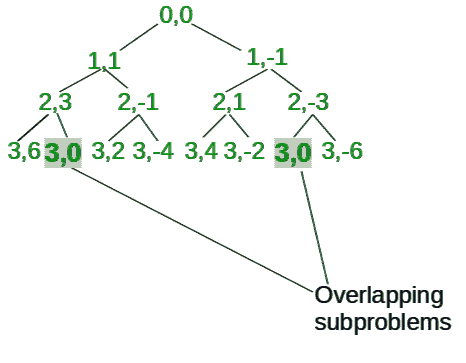

# 检查任何有效序列是否可被 M 整除

> 原文:[https://www . geesforgeks . org/check-valid-sequence-除尽-m/](https://www.geeksforgeeks.org/check-valid-sequence-divisible-m/)

给定一个 N 个整数的数组，在元素之间使用'+'和'-'检查是否有一种方法可以形成一个可以被 M 整除的数字序列

**示例:**

> **输入:** arr = {1，2，3，4，6}
> M = 4
> **输出:** True
> **解释:**
> 有一个有效的序列，即(1–2
> +3+4+6)，其计算结果为 12
> 可被 4 整除
> 
> **输入:** arr = {1，3，9}
> M = 2
> **输出:** False
> **解释:**
> 没有计算出
> 可被 M 整除的数字的序列

一个简单的解决方案是递归地考虑所有可能的场景。元素之间的‘+’或‘-’运算符，并保持存储结果的变量和。如果这个结果能被 M 整除，那么返回真，否则返回假。

递归实现如下:

## C++

```
bool isPossible(int index, int sum)
{
    // Base case
    if (index == n) {

        // check if sum is divisible by M
        if ((sum % M) == 0)
            return true;
        return false;
    }

    // recursively call by considering '+'
    // or '-' between index and index+1

    // 1.Try placing '+'
    bool placeAdd = isPossible(index + 1,
                        sum + arr[index]);

    // 2\. Try placing '-'
    bool placeMinus = isPossible(index + 1,
                         sum - arr[index]);

    if (placeAdd || placeMinus)
        return true;

    return false;
}
```

## Java 语言(一种计算机语言，尤用于创建网站)

```
static boolean isPossible(int index, int sum)
{

    // Base case
    if (index == n)
    {

        // Check if sum is divisible by M
        if ((sum % M) == 0)
            return true;

        return false;
    }

    // Recursively call by considering '+'
    // or '-' between index and index+1

    // 1.Try placing '+'
    boolean placeAdd = isPossible(index + 1,
                                 sum + arr[index]);

    // 2\. Try placing '-'
    boolean placeMinus = isPossible(index + 1,
                                   sum - arr[index]);

    if (placeAdd || placeMinus)
        return true;

    return false;
}

// This code is contributed by rutvik_56.
```

## 蟒蛇 3

```
def isPossible(index, sum):

    # Base case
    if (index == n):

        # check if sum is divisible by M
        if ((sum % M) == 0):
            return True;
        return False;

    # recursively call by considering '+'
    # or '-' between index and index+1

    # 1.Try placing '+'
    placeAdd = isPossible(index + 1, sum + arr[index]);

    # 2\. Try placing '-'
    placeMinus = isPossible(index + 1, sum - arr[index]);

    if (placeAdd or placeMinus):
        return True;

    return False;

# This code is contributed by pratham76.
```

## C#

```
static bool isPossible(int index, int sum)
{

    // Base case
    if (index == n)
    {

        // Check if sum is divisible by M
        if ((sum % M) == 0)
            return true;

        return false;
    }

    // Recursively call by considering '+'
    // or '-' between index and index+1

    // 1.Try placing '+'
    bool placeAdd = isPossible(index + 1,
                                 sum + arr[index]);

    // 2\. Try placing '-'
    bool placeMinus = isPossible(index + 1,
                                   sum - arr[index]);

    if (placeAdd || placeMinus)
        return true;

    return false;
}

// This code is contributed by divyesh072019
```

## java 描述语言

```
<script>
function isPossible(index , sum)
{

    // Base case
    if (index == n)
    {

        // Check if sum is divisible by M
        if ((sum % M) == 0)
            return true;

        return false;
    }

    // Recursively call by considering '+'
    // or '-' between index and index+1

    // 1.Try placing '+'
    let placeAdd = isPossible(index + 1,
                                 sum + arr[index]);

    // 2\. Try placing '-'
    let placeMinus = isPossible(index + 1,
                                   sum - arr[index]);
    if (placeAdd || placeMinus)
        return true;

    return false;
}

// This code is contributed by Amit Katiyar
</script>
```

有重叠的子问题，如下图所示(注意:图中表示递归树直到索引= 3)



**更好的方法:**使用动态规划来优化上述方法。

**方法 1:** 我们应用动态规划有两种状态:-
(i)索引，
(ii)求和
所以 DP[index][sum]存储我们当前所在的索引，sum 存储直到该索引形成的序列的评估结果。

下面是上述方法的实现:

## C++

```
// C++ program to check if any
// valid sequence is divisible by M
#include <bits/stdc++.h>
using namespace std;

const int MAX = 1000;

bool isPossible(int n, int index, int sum,
          int M, int arr[], int dp[][MAX])
{

    // Base case
    if (index == n) {

        // check if sum is divisible by M
        if ((sum % M) == 0)
            return true;
        return false;
    }

    // check if the current state
    // is already computed
    if (dp[index][sum] != -1)
        return dp[index][sum];

    // 1.Try placing '+'
    bool placeAdd = isPossible(n, index + 1,
               sum + arr[index], M, arr, dp);

    // 2\. Try placing '-'
    bool placeMinus = isPossible(n, index + 1,
                sum - arr[index], M, arr, dp);

    // calculate value of res for recursive case
    bool res = (placeAdd || placeMinus);

    // store the value for res for current
    // states and return for parent call
    dp[index][sum] = res;
    return res;
}
int main()
{
    int arr[] = { 1, 2, 3, 4, 6 };
    int n = sizeof(arr)/sizeof(arr[0]);
    int M = 4;

    int dp[n + 1][MAX];
    memset(dp, -1, sizeof(dp));

    bool res;
    res = isPossible(n, 0, 0, M, arr, dp);

    cout << (res ? "True" : "False") << endl;
    return 0;
}
```