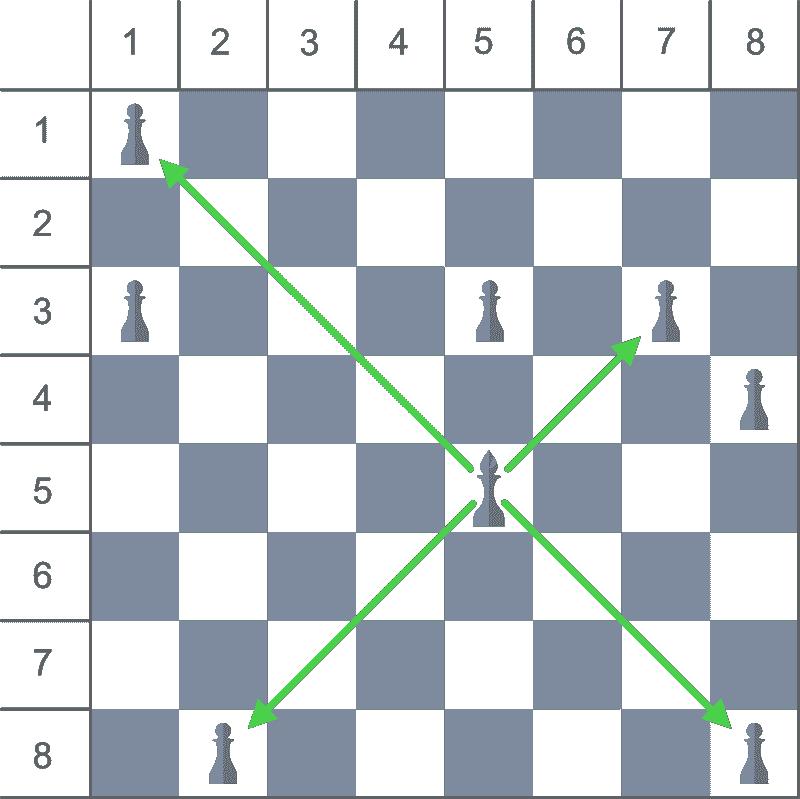
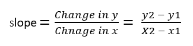
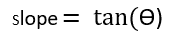

# 检查毕肖普是否能拿下棋子

> 原文:[https://www . geesforgeks . org/check-bishop-can-down-典当-or-not/](https://www.geeksforgeeks.org/check-whether-bishop-can-take-down-pawn-or-not/)

给定一个**主教**和一个**棋子**在 **8 * 8 棋盘**上的位置，任务是检查主教是否能一步拿下棋子。主教和棋子的位置用棋盘的行列号来表示。
**举例:**

> **输入:** bishopX = 5，bishopY = 5，BoNx = 1，BoNy = 1
> **输出:**是
> **输入:** bishopX = 5，bishopY = 5，BoNx = 1，BoNy = 3
> **输出:**否

**进场:**在一局棋中，毕肖普只能对角移动，每次移动的距离没有限制。如果以毕肖普的位置为原点，可以得出毕肖普只能在 **45** 度、 **135** 度、 **225** 度、 **315** 度角度进行攻击。因此，主教只有在棋子所处的位置使得从其位置获得的斜率等于 45 度或 135 度或 225 度或 315 度角的切线时，才能攻击棋子。



我们知道两点的斜率方程-



还有，



对于毕肖普的所有攻击角度(即 45°、135°、225°和 315°)，斜率值将为 1 或-1。

> tan(45)= 1
> tan(135)=-1
> tan(225)= 1
> tan(315)=-1

因此，对于角度 45°和 225°，斜率方程为

> **x2–x1 = y2–y1**T2】

对于角度 135 和 315，斜率方程为

> **-x2+x1 = y2–y1**T2】

1.  将毕肖普和典当的位置视为二维坐标上的点，检查两个等式中是否有任何一个为真
    *   **x2–x1 = y2–y1**
    *   **-x2+x1 = y2–y1**
2.  否则打印**否**。

以下是上述方法的实现:

## C++

```
// C++ implementation of above approach
#include <bits/stdc++.h>
using namespace std;

// Function that return true if
// the Bishop can take down the pawn
bool canTakeDown(int bishopX, int bishopY, int pawnX, int pawnY)
{

    // If pawn is at angle
    // 45 or 225 degree from
    // bishop's Position
    if (pawnX - bishopX == pawnY - bishopY)
        return true;

    // If pawn is at angle
    // 135 or 315 degree from
    // bishop's Position
    else if (-pawnX + bishopX == pawnY - bishopY)
        return true;

    else
        return false;
}

// Driver code
int main()
{
    // Bishop's Position
    int bishopX = 5, bishopY = 5;

    // Pawn's Position
    int pawnX = 1, pawnY = 1;

    if (canTakeDown(bishopX, bishopY, pawnX, pawnY))
        cout << "Yes";
    else
        cout << "No";
}
```

## Java 语言(一种计算机语言，尤用于创建网站)

```
// Java implementation of above approach
class GFG {

    // Function that return true if
    // the Bishop can take down the pawn
    static boolean canTakeDown(int bishopX, int bishopY, int pawnX, int pawnY)
    {

        // If pawn is at angle
        // 45 or 225 degree from
        // bishop's Position
        if (pawnX - bishopX == pawnY - bishopY)
            return true;

        // If pawn is at angle
        // 135 or 315 degree from
        // bishop's Position
        else if (-pawnX + bishopX == pawnY - bishopY)
            return true;

        else
            return false;
    }

    // Driver code
    public static void main(String[] args)
    {
        // Bishop's Position
        int bishopX = 5, bishopY = 5;

        // Pawn's Position
        int pawnX = 1, pawnY = 1;

        if (canTakeDown(bishopX, bishopY, pawnX, pawnY))
            System.out.println("Yes");
        else
            System.out.println("No");
    }
}
```

## 蟒蛇 3

```
# Python3 implementation of above approach

# Function that return true if
# the Bishop can take down the pawn
def canTakeDown(bishopX, bishopY, pawnX, pawnY) :

    # If pawn is at angle
    # 45 or 225 degree from
    # bishop's Position
    if (pawnX - bishopX == pawnY - bishopY) :
        return True

    # If pawn is at angle
    # 135 or 315 degree from
    # bishop's Position
    elif (-pawnX + bishopX == pawnY - bishopY):
        return True

    else:
        return False

# Driver code

# Bishop's Position
bishopX = 5
bishopY = 5

# Pawn's Position
pawnX = 1
pawnY = 1

if (canTakeDown(bishopX, bishopY, pawnX, pawnY)) :
    print("Yes")
else :
    print("No")
```

## C#

```
// C# implementation of above approach
using System;
class GFG {

    // Function that return true if
    // the Bishop can take down the pawn
    static bool canTakeDown(int bishopX, int bishopY, int pawnX, int pawnY)
    {

        // If pawn is at angle
        // 45 or 225 degree from
        // bishop's Position
        if (pawnX - bishopX == pawnY - bishopY)
            return true;

        // If pawn is at angle
        // 135 or 315 degree from
        // bishop's Position
        else if (-pawnX + bishopX == pawnY - bishopY)
            return true;

        else
            return false;
    }

    // Driver code
    public static void Main()
    {
        // Bishop's Position
        int bishopX = 5, bishopY = 5;

        // Pawn's Position
        int pawnX = 1, pawnY = 1;

        if (canTakeDown(bishopX, bishopY, pawnX, pawnY))
            Console.WriteLine("Yes");
        else
            Console.WriteLine("No");
    }
}
```

## 服务器端编程语言（Professional Hypertext Preprocessor 的缩写）

```
<?php
// PHP implementation of above approach

// Function that return true if
// the Bishop can take down the pawn
function canTakeDown($bishopX, $bishopY,
                       $pawnX, $pawnY)
{

    // If pawn is at angle
    // 45 or 225 degree from
    // bishop's Position
    if ($pawnX -
        $bishopX == $pawnY - $bishopY)
        return true;

    // If pawn is at angle
    // 135 or 315 degree from
    // bishop's Position
    else if (-$pawnX +
              $bishopX == $pawnY -
                          $bishopY)
        return true;

    else
        return false;
}

// Driver code

// Bishop's Position
$bishopX = 5;
$bishopY = 5;

// Pawn's Position
$pawnX = 1;
$pawnY = 1;

if (canTakeDown($bishopX, $bishopY,
                $pawnX, $pawnY))
    echo "Yes";
else
    echo "No";

// This code is contributed by jit_t
?>
```

## java 描述语言

```
<script>

// Javascript implementation of above approach

// Function that return true if
// the Bishop can take down the pawn
function canTakeDown(bishopX, bishopY, pawnX, pawnY)
{

    // If pawn is at angle
    // 45 or 225 degree from
    // bishop's Position
    if (pawnX - bishopX == pawnY - bishopY)
        return true;

    // If pawn is at angle
    // 135 or 315 degree from
    // bishop's Position
    else if (-pawnX + bishopX == pawnY - bishopY)
        return true;

    else
        return false;
}

// Driver code
// Bishop's Position
var bishopX = 5, bishopY = 5;
// Pawn's Position
var pawnX = 1, pawnY = 1;
if (canTakeDown(bishopX, bishopY, pawnX, pawnY))
    document.write( "Yes");
else
    document.write( "No");

</script>
```

**Output:** 

```
Yes
```