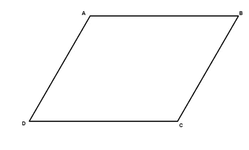

# 检查四个点是否构成平行四边形

> 原文:[https://www . geeksforgeeks . org/check-when-四点-make-平行四边形/](https://www.geeksforgeeks.org/check-whether-four-points-make-parallelogram/)

给定二维空间中的四个点，我们需要找出它们是否构成平行四边形。



平行四边形有四条边。两个相对的边是平行的，长度相同。

示例:

```
Points = [(0, 0),  (4, 0),  (1, 3),  (5, 3)]
Above points make a parallelogram.

Points = [(0, 0), (2, 0), (4, 0), (2, 2)]
Above points does not make a parallelogram 
as first three points itself are linear.

```

检查正方形和矩形的问题可以从[正方形检查](https://www.geeksforgeeks.org/check-given-four-points-form-square/)和[矩形检查](https://www.geeksforgeeks.org/check-four-segments-form-rectangle/)中读取，但是在这个问题中，我们需要检查平行四边形。平行四边形的主要性质是平行四边形的对边是平行的，长度相等，并且平行四边形的对角线相互平分。我们用第二个性质来解决这个问题。由于有四个点，我们可以通过考虑每对得到总共 6 个中点。现在四个点组成一个平行四边形，其中两个中点应该相等，其余的应该不同。
在下面的代码中，我们创建了一个地图，其中存储了对应于每个中点的对。计算完所有中点后，我们在地图上迭代，检查每个中点的出现，如果恰好一个中点出现了两次，另一个出现了一次，那么给定四个点组成一个平行四边形，否则就不是。

```
// C++ code to test whether four points make a 
// parallelogram or not
#include <bits/stdc++.h>
using namespace std;

// structure to represent a point
struct point {
    double x, y;
    point() { }
    point(double x, double y)
        : x(x), y(y) { }

    // defining operator < to compare two points
    bool operator<(const point& other) const
    {
        if (x < other.x) {
            return true;
        } else if (x == other.x) {
            if (y < other.y) {
                return true;
            }
        }
        return false;
    }
};

// Utility method to return mid point of two points
point getMidPoint(point points[], int i, int j)
{
    return point((points[i].x + points[j].x) / 2.0, 
                (points[i].y + points[j].y) / 2.0);
}

// method returns true if point of points array form 
// a parallelogram
bool isParallelogram(point points[])
{ 
    map<point, vector<point> > midPointMap;

    // looping over all pairs of point to store their
    // mid points
    int P = 4;
    for (int i = 0; i < P; i++) {
        for (int j = i + 1; j < P; j++) {
            point temp = getMidPoint(points, i, j);

            // storing point pair, corresponding to
            // the mid point
            midPointMap[temp].push_back(point(i, j));
        }
    }

    int two = 0, one = 0;

    // looping over (midpoint, (corresponding pairs)) 
    // map to check the occurence of each midpoint
    for (auto x : midPointMap) {

        // updating midpoint count which occurs twice
        if (x.second.size() == 2) 
            two++;

        // updating midpoing count which occurs once
        else if (x.second.size() == 1) 
            one++;

        // if midpoint count is more than 2, then 
        // parallelogram is not possible
        else
            return false;     
    }

    // for parallelogram, one mid point should come 
    // twice and other mid points should come once
    if (two == 1 && one == 4) 
        return true;

    return false;
}

// Driver code to test above methods
int main()
{
    point points[4];

    points[0] = point(0, 0);
    points[1] = point(4, 0);
    points[2] = point(1, 3);
    points[3] = point(5, 3);

    if (isParallelogram(points)) 
        cout << "Given points form a parallelogram";
    else
        cout << "Given points does not form a "
                "parallelogram";
    return 0;
}
```

输出:

```
Given points form a parallelogram

```

本文由 **[乌卡什·特里维迪](https://in.linkedin.com/in/utkarsh-trivedi-253069a7)** 供稿。如果你喜欢 GeeksforGeeks 并想投稿，你也可以使用[contribute.geeksforgeeks.org](http://www.contribute.geeksforgeeks.org)写一篇文章或者把你的文章邮寄到 contribute@geeksforgeeks.org。看到你的文章出现在极客博客主页上，帮助其他极客。

如果你发现任何不正确的地方，或者你想分享更多关于上面讨论的话题的信息，请写评论。