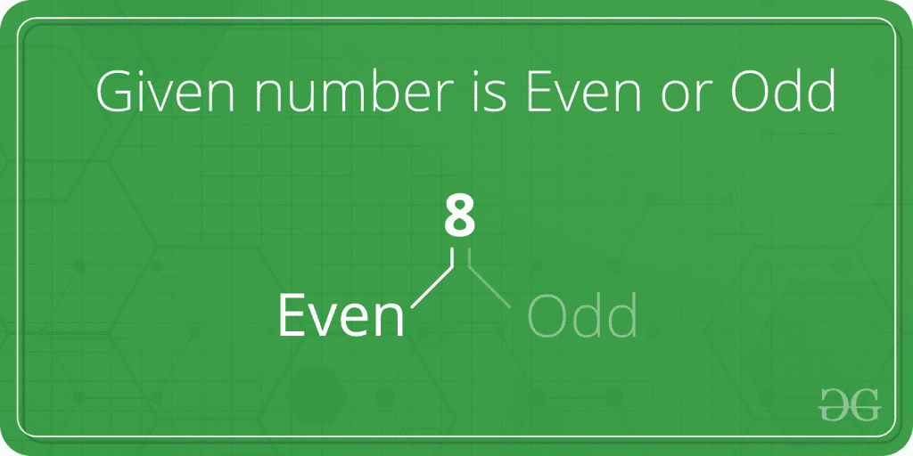

# 检查给定的数字是偶数还是奇数

> 原文:[https://www . geesforgeks . org/check-是否-给定-数字-偶数-奇数/](https://www.geeksforgeeks.org/check-whether-given-number-even-odd/)

给定一个数字，检查它是偶数还是奇数。



**示例:**

```
Input: 2 
Output: even

Input: 5
Output: odd
```

一个**简单的解法**就是除以 2 后求余数。

## C++

```
// A simple C++ program to
// check for even or odd
#include <iostream>
using namespace std;

// Returns true if n is
// even, else odd
bool isEven(int n) { return (n % 2 == 0); }

// Driver code
int main()
{
    int n = 101;
    isEven(n) ? cout << "Even" : cout << "Odd";

    return 0;
}
```

## Java 语言(一种计算机语言，尤用于创建网站)

```
// Java program program to
// check for even or odd

class GFG
{
    // Returns true if n is even, else odd
    public static boolean isEven(int n)
    {
        return (n % 2 == 0);
    }

    // Driver code
    public static void main(String[] args)
    {
        int n = 101;
        if(isEven(n) == true)
            System.out.print("Even");
        else
            System.out.print("Odd");
    }
}

// This code is contributed by rishabh_jain
```

## 蟒蛇 3

```
# A simple Python3 code
# to check for even or odd

# Returns true if n is even, else odd
def isEven(n):
    return (n % 2 == 0)

# Driver code
n = 101
print("Even" if isEven(n) else "Odd")

# This code is contributed by "Sharad_Bhardwaj".
```

## C#

```
// C# program program to
// check for even or odd
using System;

class GFG
{
    // Returns true if n is even, else odd
    public static bool isEven(int n)
    {
        return (n % 2 == 0);
    }

    // Driver code
    public static void Main()
    {
        int n = 101;
        if(isEven(n) == true)
            Console.WriteLine("Even");
        else
            Console.WriteLine("Odd");
    }
}

// This code is contributed by vt_m
```

## 服务器端编程语言（Professional Hypertext Preprocessor 的缩写）

```
<?php
// A simple PHP program to
// check for even or odd

// Returns true if n is
// even, else odd
function isEven($n)
{
    return ($n % 2 == 0);
}

// Driver code
$n = 101;
if(isEven != true)
    echo "Even";
    else
    echo "Odd";

// This code is contributed by Ajit
?>
```

## java 描述语言

```
<script>

// A simple Javascript program to
// check for even or odd

// Returns true if n is
// even, else odd
function isEven(n) { return (n % 2 == 0); }

// Driver code

    let n = 101;
    isEven(n) ? document.write("Even") :document.write("Odd");

// This code is contributed by Mayank Tyagi

</script>
```

**输出:**

```
Odd
```

***时间复杂度:** O(1)*

***辅助空间:** O(1)*
A **更好的解决方案**是使用按位运算符。我们需要检查最后一位是否为 1。如果最后一位是 1，那么数字是奇数，否则总是偶数。
说明:

```
 input : 5    // odd
   00000101              
 & 00000001                
--------------                
   00000001       
--------------

input : 8     //even
   00001000              
 & 00000001                 
--------------               
   00000000        
--------------
```

下面是这个想法的实现。

## C++

```
// A simple C++ program to
// check for even or odd
#include <iostream>
using namespace std;

// Returns true if n is
// even, else odd
bool isEven(int n)
{

// n & 1 is 1, then
// odd, else even
return (!(n & 1));
}

// Driver code
int main()
{
int n = 101;
isEven(n)? cout << "Even" :
           cout << "Odd";

return 0;
}
```

## Java 语言(一种计算机语言，尤用于创建网站)

```
// Java program program to
// check for even or odd

class GFG
{
    // Returns true if n
    // is even, else odd
    public static boolean isEven(int n)
    {
        if((n & 1) == 0)
            return true;
        else
            return false;
    }

    // Driver code
    public static void main(String[] args)
    {
        int n = 101;
        if(isEven(n) == true)
            System.out.print("Even");
        else
            System.out.print("Odd");
    }
}

// This code is contributed by rishabh_jain
```

## 蟒蛇 3

```
# A Python3 code program
# to check for even or odd

# Returns true if n is even, else odd
def isEven(n):

    # n&1 is 1, then odd, else even
    return (not(n & 1))

# Driver code
n = 101;
print("Even" if isEven(n) else "Odd")

# This code is contributed by "Sharad_Bhardwaj".
```

## C#

```
// C# program program to
// check for even or odd
using System;

class GFG
{
    // Returns true if n
    // is even, else odd
    public static bool isEven(int n)
    {
        if((n & 1) == 0)
            return true;
        else
            return false;
    }

    // Driver code
    public static void Main()
    {
        int n = 101;
        if(isEven(n) == true)
            Console.WriteLine("Even");
        else
            Console.WriteLine("Odd");
    }
}

// This code is contributed by vt_m.
```

## 服务器端编程语言（Professional Hypertext Preprocessor 的缩写）

```
<?php
// A simple PHP program to
// check for even or odd

// Returns true if n is
// even, else odd
function isEven($n)
{
    return (!($n & 1));
}

// Driver code
$n = 101;
if(isEven($n) == true)
    echo "Even";
else
    echo "Odd";

// This code is contributed by Smitha
?>
```

## java 描述语言

```
<script>
// A simple JavaScript program to
// check for even or odd

// Returns true if n is
// even, else odd
function isEven(n)
{

    // n & 1 is 1, then
    // odd, else even
    return (!(n & 1));
}

// Driver code
let n = 101;
isEven(n)? document.write("Even") :
        document.write("Odd");

// This code is contributed by Manoj.
</script>
```

**输出:**

```
Odd 
```

时间复杂度:0(1)

辅助空间:0(1)

本文由 [**普拉巴特·劳山**](https://www.facebook.com/prabhat.raushan) 供稿。如果你喜欢 GeeksforGeeks 并想投稿，你也可以使用[write.geeksforgeeks.org](https://write.geeksforgeeks.org)写一篇文章或者把你的文章邮寄到 review-team@geeksforgeeks.org。看到你的文章出现在极客博客主页上，帮助其他极客。
如果发现有不正确的地方，或者想分享更多关于上述话题的信息，请写评论。