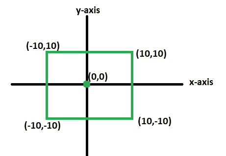
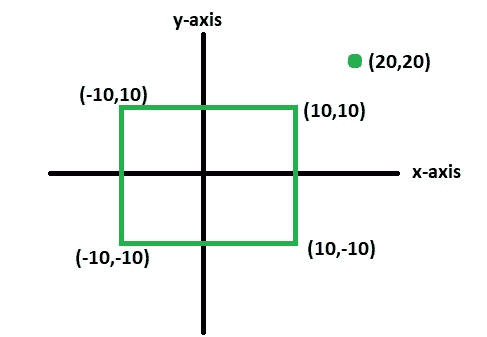

# 检查给定点是否位于矩形内

> 原文:[https://www . geeksforgeeks . org/check-给定点是否位于矩形内部-not/](https://www.geeksforgeeks.org/check-whether-given-point-lies-inside-rectangle-not/)

给定一个矩形的四个点，还有一个点 P。编写一个函数来检查 P 是否位于给定的矩形内。
**例:**

```
Input : R = [(10, 10), (10, -10), 
             (-10, -10), (-10, 10)]
        P = (0, 0)
Output : yes
Illustration : 
```



```
Input : R = [(10, 10), (10, -10),
             (-10, -10), (-10, 10)],
        P = (20, 20)
Output : no
Illustration :

```



**先决条件:** [检查给定点是否位于三角形内](https://www.geeksforgeeks.org/check-whether-a-given-point-lies-inside-a-triangle-or-not/)
**逼近:**让四个角的坐标为 A(x1，y1)、B(x2，y2)、C(x3，y3)和 D(x4，y4)。且给定点 P 的坐标为(x，y)
1)计算给定矩形的面积，即矩形 ABCD 的面积为三角形 ABC 的面积+三角形 ACD 的面积。
面积 A =[x1(y2–y3)+x2(y3–y1)+x3(y1-y2)]/2+[x1(y4–y3)+x4(y3–y1)+x3(y1-y4)]/2
将三角形 PAB 的面积计算为 A1。
3)将三角形 PBC 的面积计算为 A2。
4)将三角形 PCD 的面积计算为 A3。
5)将三角形 PAD 的面积计算为 A4。
6)如果 P 位于三角形内部，那么 A1 + A2 + A3 + A4 必须等于 a。

## C++

```
#include <bits/stdc++.h>
using namespace std;

/* A utility function to calculate area of 
   triangle formed by (x1, y1), (x2, y2) and
  (x3, y3) */
float area(int x1, int y1, int x2, int y2,
                            int x3, int y3)
{
    return abs((x1 * (y2 - y3) + x2 * (y3 - y1) + 
                x3 * (y1 - y2)) / 2.0);
}

/* A function to check whether point P(x, y) 
   lies inside the rectangle formed by A(x1, y1), 
   B(x2, y2), C(x3, y3) and D(x4, y4) */
bool check(int x1, int y1, int x2, int y2, int x3, 
             int y3, int x4, int y4, int x, int y)
{
    /* Calculate area of rectangle ABCD */
    float A = area(x1, y1, x2, y2, x3, y3) + 
              area(x1, y1, x4, y4, x3, y3);

    /* Calculate area of triangle PAB */
    float A1 = area(x, y, x1, y1, x2, y2);

    /* Calculate area of triangle PBC */
    float A2 = area(x, y, x2, y2, x3, y3);

    /* Calculate area of triangle PCD */
    float A3 = area(x, y, x3, y3, x4, y4);

    /* Calculate area of triangle PAD */
    float A4 = area(x, y, x1, y1, x4, y4);

    /* Check if sum of A1, A2, A3 and A4 
       is same as A */
    return (A == A1 + A2 + A3 + A4);
}

/* Driver program to test above function */
int main()
{
    /* Let us check whether the point P(10, 15)
      lies inside the rectangle formed by A(0, 10),
      B(10, 0) C(0, -10) D(-10, 0) */
    if (check(0, 10, 10, 0, 0, -10, -10, 0, 10, 15))
        cout << "yes";
    else
        cout << "no";
    return 0;
}
```

## Java 语言(一种计算机语言，尤用于创建网站)

```
class GFG
{
    /* A utility function to calculate area of 
    triangle formed by (x1, y1), (x2, y2) and
    (x3, y3) */
    static float area(int x1, int y1, int x2, 
                        int y2, int x3, int y3)
    {
        return (float)Math.abs((x1 * (y2 - y3) + 
        x2 * (y3 - y1) + x3 * (y1 - y2)) / 2.0);
    }

    /* A function to check whether point P(x, y) 
    lies inside the rectangle formed by A(x1, y1), 
    B(x2, y2), C(x3, y3) and D(x4, y4) */
    static boolean check(int x1, int y1, int x2, int y2,
    int x3, int y3, int x4, int y4, int x, int y)
    {

        /* Calculate area of rectangle ABCD */
        float A = area(x1, y1, x2, y2, x3, y3)+ 
                area(x1, y1, x4, y4, x3, y3);

        /* Calculate area of triangle PAB */
        float A1 = area(x, y, x1, y1, x2, y2);

        /* Calculate area of triangle PBC */
        float A2 = area(x, y, x2, y2, x3, y3);

        /* Calculate area of triangle PCD */
        float A3 = area(x, y, x3, y3, x4, y4);

        /* Calculate area of triangle PAD */
        float A4 = area(x, y, x1, y1, x4, y4);

        /* Check if sum of A1, A2, A3 and A4 
        is same as A */
        return (A == A1 + A2 + A3 + A4);
    }

    // Driver code
    public static void main (String[] args)
    {

        /* Let us check whether the point P(10, 15)
        lies inside the rectangle formed by A(0, 10),
        B(10, 0) C(0, -10) D(-10, 0) */
        if (check(0, 10, 10, 0, 0, -10, -10, 0, 10, 15))
            System.out.print("yes");
        else
            System.out.print("no");
    }
}

// This code is contributed by Anant Agarwal.
```

## 蟒蛇 3

```
# A utility function to calculate 
# area of triangle formed by (x1, y1), 
# (x2, y2) and (x3, y3) 
def area(x1, y1, x2, y2, x3, y3):

    return abs((x1 * (y2 - y3) + 
                x2 * (y3 - y1) + 
                x3 * (y1 - y2)) / 2.0)

# A function to check whether point 
# P(x, y) lies inside the rectangle 
# formed by A(x1, y1), B(x2, y2), 
# C(x3, y3) and D(x4, y4) 
def check(x1, y1, x2, y2, x3, 
          y3, x4, y4, x, y):

    # Calculate area of rectangle ABCD 
    A = (area(x1, y1, x2, y2, x3, y3) +
         area(x1, y1, x4, y4, x3, y3))

    # Calculate area of triangle PAB 
    A1 = area(x, y, x1, y1, x2, y2)

    # Calculate area of triangle PBC 
    A2 = area(x, y, x2, y2, x3, y3)

    # Calculate area of triangle PCD 
    A3 = area(x, y, x3, y3, x4, y4)

    # Calculate area of triangle PAD 
    A4 = area(x, y, x1, y1, x4, y4);

    # Check if sum of A1, A2, A3 
    # and A4 is same as A 
    return (A == A1 + A2 + A3 + A4)

# Driver Code
if __name__ == '__main__':

    # Let us check whether the point 
    # P(10, 15) lies inside the 
    # rectangle formed by A(0, 10),
    # B(10, 0) C(0, -10) D(-10, 0) 
    if (check(0, 10, 10, 0, 0, -10, 
                    -10, 0, 10, 15)):
        print("yes")
    else:
        print("no")

# This code is contributed by
# Surendra_Gangwar
```

## C#

```
// C# program to Check whether a given 
// point lies inside a rectangle or not
using System;

class GFG {

    // A utility function to calculate area
    // of triangle formed by (x1, y1), 
    // (x2, y2) and (x3, y3)
    static float area(int x1, int y1, int x2, 
                      int y2, int x3, int y3)
    {
        return (float)Math.Abs((x1 * (y2 - y3) + 
                                x2 * (y3 - y1) + 
                                x3 * (y1 - y2)) / 2.0);
    }

    // A function to check whether point P(x, y) 
    // lies inside the rectangle formed by A(x1, y1), 
    // B(x2, y2), C(x3, y3) and D(x4, y4) 
    static bool check(int x1, int y1, int x2,
                      int y2, int x3, int y3, 
                   int x4, int y4, int x, int y)
    {

        // Calculate area of rectangle ABCD 
        float A = area(x1, y1, x2, y2, x3, y3) + 
                  area(x1, y1, x4, y4, x3, y3);

        // Calculate area of triangle PAB 
        float A1 = area(x, y, x1, y1, x2, y2);

        // Calculate area of triangle PBC 
        float A2 = area(x, y, x2, y2, x3, y3);

        // Calculate area of triangle PCD 
        float A3 = area(x, y, x3, y3, x4, y4);

        // Calculate area of triangle PAD
        float A4 = area(x, y, x1, y1, x4, y4);

        // Check if sum of A1, A2, A3  
        // and A4is same as A 
        return (A == A1 + A2 + A3 + A4);
    }

    // Driver code
    public static void Main ()
    {

        // Let us check whether the point 
        // P(10, 15) lies inside the rectangle
        // formed by A(0, 10), B(10, 0), 
        // C(0, -10), D(-10, 0)
        if (check(0, 10, 10, 0, 0, -10, -10, 0, 10, 15))
            Console.Write("yes");
        else
            Console.Write("no");
    }
}

// This code is contributed by Nitin Mittal.
```

## 服务器端编程语言（Professional Hypertext Preprocessor 的缩写）

```
<?php
// PHP program to check whether a 
// given point lies inside a 
// rectangle or not

// A utility function to 
// calculate area of 
// triangle formed by 
// (x1, y1), (x2, y2) 
// and (x3, y3)
function area($x1, $y1, $x2, 
              $y2, $x3, $y3)
{
    return abs(($x1 * ($y2 - $y3) + 
                $x2 * ($y3 - $y1) + 
                $x3 * ($y1 - $y2)) / 2.0);
}

/* A function to check 
whether point P(x, y) 
lies inside the rectangle
formed by A(x1, y1), 
B(x2, y2), C(x3, y3)
and D(x4, y4) */
function check($x1, $y1, $x2, $y2, $x3, 
               $y3, $x4, $y4, $x, $y)
{
    // Calculate area of rectangle ABCD 
    $A = area($x1, $y1, $x2, $y2, $x3, $y3) + 
         area($x1, $y1, $x4, $y4, $x3, $y3);

    // Calculate area of triangle PAB 
    $A1 = area($x, $y, $x1, $y1, $x2, $y2);

    // Calculate area of triangle PBC 
    $A2 = area($x, $y, $x2, $y2, $x3, $y3);

    // Calculate area of triangle PCD
    $A3 = area($x, $y, $x3, $y3, $x4, $y4);

    // Calculate area of triangle PAD 
    $A4 = area($x, $y, $x1, $y1, $x4, $y4);

    // Check if sum of A1, A2, 
    // A3 and A4  is same as A 
    return ($A == $A1 + $A2 + $A3 + $A4);
}

// Driver Code

// Let us check whether 
// the point P(10, 15)
// lies inside the rectangle
// formed by A(0, 10),
// B(10, 0) C(0, -10) 
// D(-10, 0) 
if (check(0, 10, 10, 0, 0, -10,
               -10, 0, 10, 15))
    echo "yes";

else
    echo "no";

// This code is contributed by vt_m.
?>
```

## java 描述语言

```
<script>

/* A utility function to calculate area of 
triangle formed by (x1, y1), (x2, y2) and 
(x3, y3) */
function area(x1, y1, x2, y2, 
                            x3, y3) 
{ 
    return Math.abs((x1 * (y2 - y3) + x2 * (y3 - y1) + 
                x3 * (y1 - y2)) / 2.0); 
} 

/* A function to check whether point P(x, y) 
lies inside the rectangle formed by A(x1, y1), 
B(x2, y2), C(x3, y3) and D(x4, y4) */
function check(x1, y1, x2, y2, x3, 
            y3, x4, y4, x, y) 
{ 
    /* Calculate area of rectangle ABCD */
    let A = area(x1, y1, x2, y2, x3, y3) + 
            area(x1, y1, x4, y4, x3, y3); 

    /* Calculate area of triangle PAB */
    let A1 = area(x, y, x1, y1, x2, y2); 

    /* Calculate area of triangle PBC */
    let A2 = area(x, y, x2, y2, x3, y3); 

    /* Calculate area of triangle PCD */
    let A3 = area(x, y, x3, y3, x4, y4); 

    /* Calculate area of triangle PAD */
    let A4 = area(x, y, x1, y1, x4, y4); 

    /* Check if sum of A1, A2, A3 and A4 
    is same as A */
    return (A == A1 + A2 + A3 + A4); 
} 

/* Driver program to test above function */

    /* Let us check whether the point P(10, 15) 
    lies inside the rectangle formed by A(0, 10), 
    B(10, 0) C(0, -10) D(-10, 0) */
    if (check(0, 10, 10, 0, 0, -10, -10, 0, 10, 15)) 
        document.write("yes"); 
    else
        document.write("no"); 

// This code is contributed by Mayank Tyagi

</script>
```

**输出:**

```
no
```

本文由[**Shivam Pradhan(anuj _ charm)**](http://www.facebook.com/ma5ter6it)供稿。如果你喜欢 GeeksforGeeks 并想投稿，你也可以使用[write.geeksforgeeks.org](https://write.geeksforgeeks.org)写一篇文章或者把你的文章邮寄到 review-team@geeksforgeeks.org。看到你的文章出现在极客博客主页上，帮助其他极客。
如果发现有不正确的地方，或者想分享更多关于上述话题的信息，请写评论。