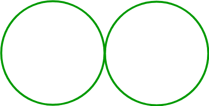
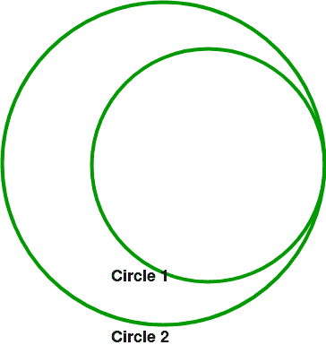
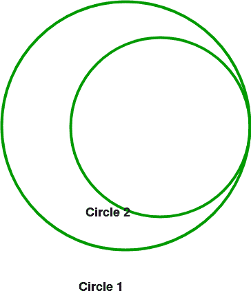
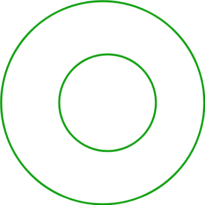

# 检查是否可以将圆上给定的两个点连接起来，使它们之间的距离为 k

> 原文:[https://www . geeksforgeeks . org/check-是否有可能加入两点给定圆，以至于它们之间的距离为-k/](https://www.geeksforgeeks.org/check-whether-it-is-possible-to-join-two-points-given-on-circle-such-that-distance-between-them-is-k/)

给定两个圆和一个长度，k .找出我们是否可以连接两个点(每个圆的周长上有一个点)，这样点之间的距离就是 k(两个点的坐标不需要都是整数值)。
**例:**

```
Input: Circle-1 Center (0, 0) Radius = 5
       Circle-2 Center (8, 3) Radius = 2
       K = 3
Output: Yes
Maximum Distance: 15
Minimum Distance: 2
```

**进场:**

1.  我们必须找到这些圆上任意两点之间可能的最大和最小距离，如果 K 在这个范围内，那么答案是肯定的，否则我们找不到这样的线段。
2.  要查找最小和最大距离:

*   **情况 1:** 两个圆不相交或只在一点接触时。
    在这种情况下，最大距离将是中心之间的距离+半径(圆 1) +半径(圆 2)。最小距离是中心之间的距离–半径(圆 1)–半径(圆 2)。



*   **情况 2:** 当两个圆正好在两点相交时。
    在这种情况下，最大距离将是中心之间的距离+半径(圆 1) +半径(圆 2)。最小距离为 0。(我们在这两个圈子里有两个共同点)。


*   **情况 3:** 当圆 1 完全在圆 2 内时。
    在这种情况下，最大距离将是中心之间的距离+半径(圆 1) +半径(圆 2)。最小距离为半径(圆 2)–中心之间的距离–半径(圆 1)



*   **情况 4:** 当圆 2 完全在圆 1 内时。
    在这种情况下，最大距离将是中心之间的距离+半径(圆 1) +半径(圆 2)。最小距离为半径(圆 1)–中心之间的距离–半径(圆 2)



*   **情况 5:** 两个圆中心相同时
    *   **子例 1:** 半径也相同。最小距离和最大距离均为 0。
    *   **子例 2:** 半径不同(R1 < R2)
        最大距离为 R1+R2
        最小距离为 R2-R1



以下是上述方法的实现:

## C++

```
// C++ program to implement above approach
#include <bits/stdc++.h>
#define ll long long int
using namespace std;

struct t {
    ll x, y, r;
};
typedef struct t node;

// Return distance between the centers
long double dis(ll x1, ll y1, ll x2, ll y2)
{
    return sqrt((x1 - x2) * (x1 - x2)
                + (y1 - y2) * (y1 - y2));
}

bool check(node c1, node c2, int k)
{
    long double min = 0;
    long double max = 0;
    // Distance between centers
    long double de = dis(c1.x, c1.y, c2.x, c2.y);
    // Case 5
    if (de == 0) {
        // SubCase 1
        if (c1.r == c2.r) {
            min = 0;
            max = 0;
        }
        // Subcase 2
        else {
            if (c1.r - c2.r > 0) {
                min = c1.r - c2.r;
                max = min + 2 * c2.r;
            }
            else {
                min = c2.r - c1.r;
                max = min + 2 * c1.r;
            }
        }
    }
    // Case 1
    else if (de >= c1.r + c2.r) {
        min = de - c1.r - c2.r;
        max = de + c1.r + c2.r;
    }
    // Case 3
    else if (de + c2.r < c1.r) {
        max = c2.r + c1.r + de;
        min = c1.r - de - c2.r;
    }
    // Case 4
    else if (de + c1.r < c2.r) {

        max = c2.r + c1.r + de;
        min = c2.r - de - c1.r;
    }
    // Case 2
    else if ((de + c2.r >= c1.r) || (de + c1.r >= c2.r)) {
        max = c2.r + c1.r + de;
        min = 0;
    }
    // Since value of k will always be an integer
    ll temin = (ll)(ceil(min));
    ll re = (ll)max;
    if (k >= temin && k <= re)
        return true;
    return false;
}

// Driver Code
int main()
{
    node circle1, circle2;
    int k = 3;
    circle1.x = 0;
    circle1.y = 0;
    circle1.r = 5;
    circle2.x = 8;
    circle2.y = 3;
    circle2.r = 2;
    if (check(circle1, circle2, k))
        cout << "YES" << endl;
    else
        cout << "NO" << endl;
}
```

## Java 语言(一种计算机语言，尤用于创建网站)

```
// Java program to implement above approach
class GFG
{

    static class node
    {
        long x, y, r;
    };

    // Return distance between the centers
    static long dis(long x1, long y1, long x2, long y2)
    {
        return (long) Math.sqrt((x1 - x2) * (x1 - x2)
                + (y1 - y2) * (y1 - y2));
    }

    static boolean check(node c1, node c2, int k)
    {
        long min = 0;
        long max = 0;

        // Distance between centers
        long de = dis(c1.x, c1.y, c2.x, c2.y);

        // Case 5
        if (de == 0)
        {
            // SubCase 1
            if (c1.r == c2.r)
            {
                min = 0;
                max = 0;
            }
            // Subcase 2
            else if (c1.r - c2.r > 0)
            {
                min = c1.r - c2.r;
                max = min + 2 * c2.r;
            }
            else
            {
                min = c2.r - c1.r;
                max = min + 2 * c1.r;
            }
        }

        // Case 1
        else if (de >= c1.r + c2.r)
        {
            min = de - c1.r - c2.r;
            max = de + c1.r + c2.r;
        }
        // Case 3
        else if (de + c2.r < c1.r)
        {
            max = c2.r + c1.r + de;
            min = c1.r - de - c2.r;
        }
        // Case 4
        else if (de + c1.r < c2.r)
        {

            max = c2.r + c1.r + de;
            min = c2.r - de - c1.r;
        }
        // Case 2
        else if ((de + c2.r >= c1.r) || (de + c1.r >= c2.r))
        {
            max = c2.r + c1.r + de;
            min = 0;
        }

        // Since value of k will always be an integer
        long temin = (long) (Math.ceil(min));
        long re = (long) max;
        if (k >= temin && k <= re)
        {
            return true;
        }
        return false;
    }

    // Driver Code
    public static void main(String[] args)
    {
        node circle1 = new node();
        node circle2 = new node();
        int k = 3;
        circle1.x = 0;
        circle1.y = 0;
        circle1.r = 5;
        circle2.x = 8;
        circle2.y = 3;
        circle2.r = 2;
        if (check(circle1, circle2, k))
        {
            System.out.println("Yes");
        }
        else
        {
            System.out.println("No");
        }
    }
}

// This code is contributed by Princi Singh
```

## 计算机编程语言

```
# Python3 program to implement above approach
from math import sqrt,ceil,floor

# Return distance between the centers
def dis(x1, y1, x2, y2):
    return sqrt((x1 - x2) * (x1 - x2) +
                (y1 - y2) * (y1 - y2))

def check(c1, c2, k):
    min = 0
    max = 0

    # Distance between centers
    de = dis(c1[0], c1[1], c2[0], c2[1])

    # Case 5
    if (de == 0):

        # SubCase 1
        if (c1[2] == c2[2]):
            min = 0
            max = 0

        # Subcase 2
        else:
            if (c1[2] - c2[2] > 0):
                min = c1[2] - c2[2]
                max = min + 2 * c2[2]

            else:
                min = c2[2] - c1[2]
                max = min + 2 * c1[2]

    # Case 1
    elif (de >= c1[2] + c2[2]):
        min = de - c1[2] - c2[2]
        max = de + c1[2] + c2[2]

    # Case 3
    elif (de + c2[2] < c1[2]):
        max = c2[2] + c1[2] + de
        min = c1[2] - de - c2[2]

    # Case 4
    elif (de + c1[2] < c2[2]):

        max = c2[2] + c1[2] + de
        min = c2[2] - de - c1[2]

    # Case 2
    elif ((de + c2[2] >= c1[2]) or (de + c1[2] >= c2[2])):
        max = c2[2] + c1[2] + de
        min = 0

    # Since value of k wialways be an integer
    temin = ceil(min)
    re = max
    if (k >= temin and k <= re):
        return True
    return False

# Driver Code
circle1 = [0, 0, 5]
circle2 = [8, 3, 2]
k = 3

if (check(circle1, circle2, k)):
    print("YES")
else:
    print("NO" )

# This code is contributed by mohit kumar 29
```

## C#

```
// C# program to implement above approach
using System;

class GFG
{

    public class node
    {
        public long x, y, r;
    };

    // Return distance between the centers
    static long dis(long x1, long y1, long x2, long y2)
    {
        return (long) Math.Sqrt((x1 - x2) * (x1 - x2)
                + (y1 - y2) * (y1 - y2));
    }

    static Boolean check(node c1, node c2, int k)
    {
        long min = 0;
        long max = 0;

        // Distance between centers
        long de = dis(c1.x, c1.y, c2.x, c2.y);

        // Case 5
        if (de == 0)
        {
            // SubCase 1
            if (c1.r == c2.r)
            {
                min = 0;
                max = 0;
            }
            // Subcase 2
            else if (c1.r - c2.r > 0)
            {
                min = c1.r - c2.r;
                max = min + 2 * c2.r;
            }
            else
            {
                min = c2.r - c1.r;
                max = min + 2 * c1.r;
            }
        }

        // Case 1
        else if (de >= c1.r + c2.r)
        {
            min = de - c1.r - c2.r;
            max = de + c1.r + c2.r;
        }
        // Case 3
        else if (de + c2.r < c1.r)
        {
            max = c2.r + c1.r + de;
            min = c1.r - de - c2.r;
        }
        // Case 4
        else if (de + c1.r < c2.r)
        {

            max = c2.r + c1.r + de;
            min = c2.r - de - c1.r;
        }
        // Case 2
        else if ((de + c2.r >= c1.r) || (de + c1.r >= c2.r))
        {
            max = c2.r + c1.r + de;
            min = 0;
        }

        // Since value of k will always be an integer
        long temin = (long) (Math.Ceiling((double)min));
        long re = (long) max;
        if (k >= temin && k <= re)
        {
            return true;
        }
        return false;
    }

    // Driver Code
    public static void Main(String[] args)
    {
        node circle1 = new node();
        node circle2 = new node();
        int k = 3;
        circle1.x = 0;
        circle1.y = 0;
        circle1.r = 5;
        circle2.x = 8;
        circle2.y = 3;
        circle2.r = 2;
        if (check(circle1, circle2, k))
        {
            Console.WriteLine("Yes");
        }
        else
        {
            Console.WriteLine("No");
        }
    }
}

// This code contributed by Rajput-Ji
```

## java 描述语言

```
<script>

// JavaScript program to implement above approach

// Return distance between the centers
function dis(x1,y1,x2,y2)
{
    return  Math.sqrt((x1 - x2) * (x1 - x2)
                + (y1 - y2) * (y1 - y2));
}

function check(c1,c2,k)
{
    let min = 0;
        let max = 0;

        // Distance between centers
        let de = dis(c1[0], c1[1], c2[0], c2[1]);

        // Case 5
        if (de == 0)
        {
            // SubCase 1
            if (c1[2] == c2[2])
            {
                min = 0;
                max = 0;
            }
            // Subcase 2
            else if (c1[2] - c2[2] > 0)
            {
                min = c1[2] - c2[2];
                max = min + 2 * c2[2];
            }
            else
            {
                min = c2[2] - c1[2];
                max = min + 2 * c1[2];
            }
        }

        // Case 1
        else if (de >= c1[2] + c2[2])
        {
            min = de - c1[2] - c2[2];
            max = de + c1[2] + c2[2];
        }
        // Case 3
        else if (de + c2[2] < c1[2])
        {
            max = c2[2] + c1[2] + de;
            min = c1[2] - de - c2[2];
        }
        // Case 4
        else if (de + c1[2] < c2[2])
        {

            max = c2[2] + c1[2] + de;
            min = c2[2]- de - c1[2];
        }
        // Case 2
        else if ((de + c2[2] >= c1[2]) ||
        (de + c1[2] >= c2[2]))
        {
            max = c2[2] + c1[2] + de;
            min = 0;
        }

        // Since value of k will always be an integer
        let temin =  (Math.ceil(min));
        let re =  max;
        if (k >= temin && k <= re)
        {
            return true;
        }
        return false;
}

// Driver Code
let circle1 = [0, 0, 5];
let circle2 = [8, 3, 2];

let k = 3;

if (check(circle1, circle2, k))
{
    document.write("YES");
}
else
{
    document.write("NO");
}

// This code is contributed by unknown2108

</script>
```

**Output:** 

```
YES
```