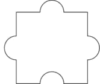
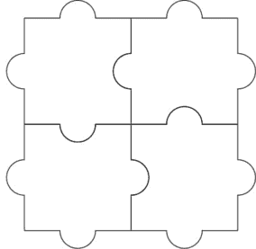
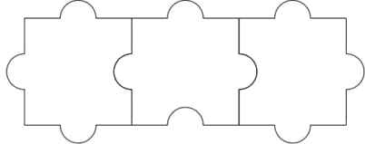

# 检查拼图是否可解

> 原文:[https://www . geesforgeks . org/check-what-jigsaw-拼图-可解或不可解/](https://www.geeksforgeeks.org/check-whether-jigsaw-puzzle-solveable-or-not/)

给定一个特殊的拼图，由 **N** 行和 **M** 列组成，它们都是相同的部分。每件都有三个标签和一个空白。任务是检查拼图是否是可解的，方法是将拼图块以这样的方式放置，即一块拼图的标签与另一块拼图的空白完全吻合。

[](https://media.geeksforgeeks.org/wp-content/uploads/20200923233915/jigsaw.png)

**<u>注</u> :** 旋转平移棋子，解谜。

**<u>例:</u>**

> **输入:** N = 2，M = 2
> T3】输出:是
> 
> [](https://media.geeksforgeeks.org/wp-content/uploads/20200924001502/jigsaw.png)
> 
> **输入:** N = 1，M = 3
> T3】输出:是
> 
> [](https://media.geeksforgeeks.org/wp-content/uploads/20200924110157/jigsaw.png)

**<u>进场:</u>** 问题中的关键观察是:

*   如果拼图只有一行或一列。然后可以通过在共享的一面放置一个空白标签来解决这个难题。
*   如果拼图有两行两列。然后，通过将空白标签放置在一个圆环链中，就可以解决这个难题。
*   否则，不可能解决难题。

下面是上述方法的实现:

## C++

```
// C++ program for the above approach
#include <bits/stdc++.h>
using namespace std;

// Function to check if the jigsaw
// Puzzle is solveable or not
void checkSolveable(int n, int m)
{

    // Base Case
    if (n == 1 or m == 1)
        cout << "YES";

    // By placing the blank tabs
    // as a chain
    else if (m == 2 and n == 2)
        cout << "YES";
    else
        cout << "NO";
}

// Driver Code
int main()
{
    int n = 1, m = 3;

    checkSolveable(n, m);
}

// This code is contributed by jana_sayantan
```

## Java 语言(一种计算机语言，尤用于创建网站)

```
// Java program for the above approach
import java.util.*;

class GFG{

// Function to check if the jigsaw
// Puzzle is solveable or not
static void checkSolveable(int n, int m)
{

    // Base Case
    if (n == 1 || m == 1)
       System.out.print("YES");

    // By placing the blank tabs
    // as a chain
    else if (m == 2 && n == 2)
        System.out.print("YES");
    else
        System.out.print("NO");
}

// Driver Code
public static void main(String[] args)
{
     int n = 1, m = 3;

    checkSolveable(n, m);
}
}

// This code is contributed by sanjoy_62
```

## 计算机编程语言

```
# Python program for the above approach

# Function to check if the jigsaw
# Puzzle is solveable or not
def checkSolveable(n, m):

    # Base Case
    if n == 1 or m == 1:
        print("YES")

    # By placing the blank tabs
    # as a chain
    elif m == 2 and n == 2:
        print("YES")
    else:
        print("NO")

# Driver Code
if __name__ == "__main__":
    n = 1
    m = 3
    checkSolveable(n, m)
```

## C#

```
// C# program for the above approach
using System;

class GFG{

// Function to check if the jigsaw
// Puzzle is solveable or not
static void checkSolveable(int n, int m)
{

    // Base Case
    if (n == 1 || m == 1)
       Console.WriteLine("YES");

    // By placing the blank tabs
    // as a chain
    else if (m == 2 && n == 2)
        Console.WriteLine("YES");
    else
        Console.WriteLine("NO");
}

// Driver Code
public static void Main()
{
    int n = 1, m = 3;

    checkSolveable(n, m);
}
}

// This code is contributed by susmitakundugoaldanga
```

## java 描述语言

```
<script>

// JavaScript implementation of the above approach

// Function to check if the jigsaw
// Puzzle is solveable or not
function checkSolveable(n, m)
{

    // Base Case
    if (n == 1 || m == 1)
       document.write("YES");

    // By placing the blank tabs
    // as a chain
    else if (m == 2 && n == 2)
        document.write("YES");
    else
        document.write("NO");
}

// Driver code

    let n = 1, m = 3;

    checkSolveable(n, m);

    // This code is contributed by code_hunt.
</script>
```

**Output:** 

```
YES
```

***时间复杂度:** O(1)*
***辅助空间:** O(1)*