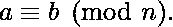

# 检查一个大数是否能被 7 整除

> 原文:[https://www . geesforgeks . org/check-what-大数-整除-7/](https://www.geeksforgeeks.org/check-whether-large-number-divisible-7/)

给你一个 n 位数的大数字，你要检查它是否能被 7 整除。
数字形式为**(ar-1 ar-2…a2 a1 A0)**的一个(r+1)位整数 n 可被 7 整除当且仅当交替数列**(a2 a1 A0)–(a5 a4 a3)+(A8 a7 a6)–……**可被 7 整除。

括号内的三位数代表数字形式的 3 位数。

> 给定的数 n 可以写成 1000 次幂的和，如下所示。
> n =(a2 a1 A0)+(a5 a4 a3)* 1000+(A8 a7 a6)*(1000 * 1000)+…。
> As 1000 = (-1)(mod 7)，根据同余关系为 1000。
> 对于一个正整数 n，如果两个数 a 和 b 的差
> (a–b)是 n 的整数倍(也就是说，如果有一个整数 k 使得 a–b = kn)，则称这两个数 a 和 b 是全等模 n。当 a 和 b 是整数时，通常考虑这种同余关系，表示为
> 
> 因此我们可以写:
> n = {(a2a1a 0)+(a5a4a 3)*(-1)+(a8a 7a 6)*(-1)*(-1)+…..}(mod 7)，
> 因此，当且仅当数列可被 7 整除时，n 可被 7 整除。

**示例:**

```
Input : 8955795758
Output : Divisible by 7
       Explanation:
       We express the number in terms of triplets 
       of digits as follows.
                (008)(955)(795)(758)
       Now, 758- 795 + 955 - 8 = 910, which is 
       divisible by 7

Input : 100000000000
Output : Not Divisible by 7
       Explanation:
       We express the number in terms of triplets 
       of digits as follows.
                (100)(000)(000)(000)
       Now, 000- 000 + 000 - 100 = -100, which is 
       not divisible by 7
```

请注意，n 中的位数不能是 3 的倍数。在这种情况下，我们在取出所有三元组(从 n 的右侧)后，在剩余数字的左侧传递零(s)以形成最后一个三元组。
一种简单高效的方法是以字符串的形式进行输入(如果需要的话，通过在数字的左边加上 0，使其长度为 3*m 的形式)，然后你必须从右到左以三为单位将数字相加，直到它变成一个 3 位数，以形成一个交替序列，并检查该序列是否可被 7 整除。

这里检查 7 的可除性的程序实现完成了。

## C++

```
// C++ code to check divisibility of a
// given large number by 7
#include<bits/stdc++.h>
using namespace std;

int isdivisible7(string num)
{
    int n = num.length(), gSum=0;
    if (n == 0)
        return 1;

    // Append required 0s at the beginning.
    if (n % 3 == 1) {
        num="00" + num;
        n += 2;
    }
    else if (n % 3 == 2) {
        num= "0" + num;
        n++;
    }

    // add digits in group of three in gSum
    int i, GSum = 0, p = 1;
    for (i = n - 1; i >= 0; i--) {

        // group saves 3-digit group
        int group = 0;
        group += num[i--] - '0';
        group += (num[i--] - '0') * 10;
        group += (num[i] - '0') * 100;

        gSum = gSum + group * p;

        // generate alternate series of plus
        // and minus
        p *= (-1);
    }

    return (gSum % 7 == 0);
}

// Driver code
int main()
{
    // Driver method
    string num= "8955795758";
    if (isdivisible7(num))
        cout << "Divisible by 7";
    else
        cout << "Not Divisible by 7";
    return 0;
}

// This code is contributed
// by Akanksha Rai
```

## C

```
// C code to check divisibility of a
// given large number by 7
#include <stdio.h>
#include <string.h>
int isdivisible7(char num[])
{
    int n = strlen(num), gSum=0;
    char final[n+3];
    if (n == 0 && num[0] == '\n')
        return 1;

    // Append required 0s at the beginning.
    if (n % 3 == 1) {
        final[0]='0';
        final[1]='0';
        strcat(final,num);
        n += 2;
    }
    else if (n % 3 == 2) {
        final[0]='0';
        strcat(final,num);
        n++;
    }

    // add digits in group of three in gSum
    int i, GSum = 0, p = 1;
    for (i = n - 1; i >= 0; i--) {

        // group saves 3-digit group
        int group = 0;
        group += final[i--] - '0';
        group += (final[i--] - '0') * 10;
        group += (final[i] - '0') * 100;

        gSum = gSum + group * p;

        // generate alternate series of plus
        // and minus
        p *= (-1);
    }

    return (gSum % 7 == 0);
}

// Driver code
int main()
{
    // Driver method
    char num[] = "8955795758";
    if (isdivisible7(num))
        printf("Divisible by 7");
    else
        printf("Not Divisible by 7");
    return 0;
}
```

## Java 语言(一种计算机语言，尤用于创建网站)

```
// Java code to check divisibility of a given large number by 7

class Test {
    // Method to check divisibility
    static boolean isDivisible7(String num)
    {
        int n = num.length();
        if (n == 0 && num.charAt(0) == '0')
            return true;

        // Append required 0s at the beginning.
        if (n % 3 == 1)
            num = "00" + num;
        if (n % 3 == 2)
            num = "0" + num;
        n = num.length();

        // add digits in group of three in gSum
        int gSum = 0, p = 1;
        for (int i = n - 1; i >= 0; i--) {

            // group saves 3-digit group
            int group = 0;
            group += num.charAt(i--) - '0';
            group += (num.charAt(i--) - '0') * 10;
            group += (num.charAt(i) - '0') * 100;
            gSum = gSum + group * p;
            // generate alternate series of plus and minus
            p = p * -1;
        }

        // calculate result till 3 digit sum
        return (gSum % 7 == 0);
    }

    // Driver method
    public static void main(String args[])
    {
        String num = "8955795758";

        System.out.println(isDivisible7(num) ? "Divisible by 7" : "Not Divisible  by 7");
    }
}
```

## 蟒蛇 3

```
# Python 3 code to check divisibility
# of a given large number by 7

def isdivisible7(num):
    n = len(num)
    if (n == 0 and num[0] == '\n'):
        return 1

    # Append required 0s at the beginning.
    if (n % 3 == 1) :
        num = "00" + str(num)
        n += 2

    elif (n % 3 == 2) :
        num = "0" + str(num)
        n += 1

    # add digits in group of three in gSum
    GSum = 0
    p = 1
    i = n-1
    while i>=0 :

        # group saves 3-digit group
        group = 0
        group += ord(num[i]) - ord('0')
        i -= 1
        group += (ord(num[i]) - ord('0')) * 10
        i -= 1
        group += (ord(num[i]) - ord('0')) * 100

        GSum = GSum + group * p

        # generate alternate series of
        # plus and minus
        p *= (-1)
        i -= 1

    return (GSum % 7 == 0)

# Driver code
if __name__ == "__main__":

    num = "8955795758"
    if (isdivisible7(num)):
        print("Divisible by 7")
    else :
        print("Not Divisible by 7")

# This code is contributed by ChitraNayal
```

## C#

```
// C# code to check divisibility of a
// given large number by 7
using System;

class GFG {

    // Method to check divisibility
    static bool isDivisible7(String num)
    {
        int n = num.Length;
        if (n == 0 && num[0] == '0')
            return true;

        // Append required 0s at the beginning.
        if (n % 3 == 1)
            num = "00" + num;

        if (n % 3 == 2)
            num = "0" + num;

        n = num.Length;

        // add digits in group of three in gSum
        int gSum = 0, p = 1;
        for (int i = n - 1; i >= 0; i--) {

            // group saves 3-digit group
            int group = 0;
            group += num[i--] - '0';
            group += (num[i--] - '0') * 10;
            group += (num[i] - '0') * 100;
            gSum = gSum + group * p;

            // generate alternate series
            // of plus and minus
            p = p * -1;
        }

        // calculate result till 3 digit sum
        return (gSum % 7 == 0);
    }

    // Driver code
    static public void Main()
    {
        String num = "8955795758";

        // Function calling
        Console.WriteLine(isDivisible7(num) ? "Divisible by 7" : "Not Divisible by 7");
    }
}

// This code is contributed by Ajit.
```

## 服务器端编程语言（Professional Hypertext Preprocessor 的缩写）

```
<?php
// PHP code to check divisibility of
// a given large number by 7

// Function to check divisibility
function isDivisible7($num)
{
    $n = strlen($num) ;
    if ($n == 0 && $num[0] == '0')
        return true;

    // Append required 0s at the beginning.
    if ($n % 3 == 1)
        $num = "00" . $num;
    if ($n % 3 == 2)
        $num = "0". $num;
    $n = strlen($num);

    // add digits in group of three in gSum
    $gSum = 0 ;
    $p = 1;
    for ($i = $n - 1; $i >= 0; $i--)
    {

        // group saves 3-digit group
        $group = 0;
        $group += $num[$i--] - '0';
        $group += ($num[$i--] - '0') * 10;
        $group += ($num[$i] - '0') * 100;
        $gSum = $gSum + $group * $p;

        // generate alternate series
        // of plus and minus
        $p = $p * -1;
    }

    // calculate result till 3 digit sum
    return ($gSum % 7 == 0);
}

// Driver Code
$num = "8955795758";

echo (isDivisible7($num) ?
        "Divisible by 7" :
        "Not Divisible by 7");

// This code is contributed by Ryuga
?>
```

## java 描述语言

```
<script>

// Javascript code to check divisibility of
// a given large number by 7

// Function to check divisibility
function isDivisible7(num)
{
    let n = num.length;

    if (n == 0 && num[0] == '0')
        return true;

    // Append required 0s at the beginning.
    if (n % 3 == 1)
        num = "00" + num;
    if (n % 3 == 2)
        num = "0" + num;

    n = num.length;

    // Add digits in group of three in gSum
    gSum = 0 ;
    let p = 1;

    for(let i = n - 1; i >= 0; i--)
    {

        // Group saves 3-digit group
        group = 0;
        group += num[i--] - '0';
        group += (num[i--] - '0') * 10;
        group += (num[i] - '0') * 100;
        gSum = gSum + group * p;

        // Generate alternate series
        // of plus and minus
        p = p * -1;
    }

    // Calculate result till 3 digit sum
    return (gSum % 7 == 0);
}

// Driver Code
let num = "8955795758";

document.write(isDivisible7(num) ?
               "Divisible by 7" :
               "Not Divisible by 7");

// This code is contributed by _saurabh_jaiswal

</script>
```

**输出:**

```
 Divisible by 7
```

本文由 **Sruti Rai** 供稿。如果你喜欢 GeeksforGeeks 并想投稿，你也可以使用[write.geeksforgeeks.org](https://write.geeksforgeeks.org)写一篇文章或者把你的文章邮寄到 review-team@geeksforgeeks.org。看到你的文章出现在极客博客主页上，帮助其他极客。
如果你发现任何不正确的地方，或者你想分享更多关于上面讨论的话题的信息，请写评论。