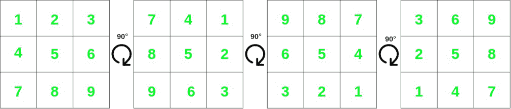
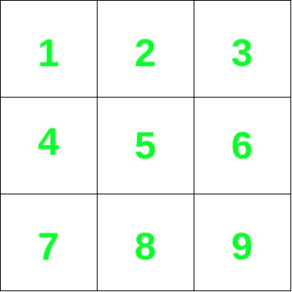
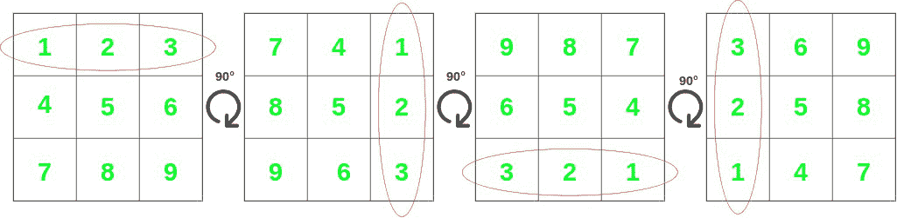

# 检查矩阵 T 是否是矩阵垫一次或多次 90°旋转的结果

> 原文:[https://www . geeksforgeeks . org/check-matrix-t-是矩阵 mat-90 次或多次旋转的结果/](https://www.geeksforgeeks.org/check-whether-matrix-t-is-a-result-of-one-or-more-90-rotations-of-matrix-mat/)

给定两个尺寸分别为 **M×N** 和 **P×Q** 的 [2D 矩阵](https://www.geeksforgeeks.org/multidimensional-arrays-c-cpp/) **mat[][]** 和 **T[][]** 。任务是检查矩阵 **T[][]** 是否是矩阵 **mat[][]** 一次或多次 **90** 旋转的结果。

**示例:**

> **输入:** mat[][] = {{1，2，3}，{4，5，6}，{7，8，9}}，T[][] ={{7，4，1}，{8，5，2}，{9，6，3 } }
> T3】输出:是
> T6】解释:
> 
> [](https://media.geeksforgeeks.org/wp-content/uploads/20210619224916/UntitledDiagram7.jpg)
> 
> 从上面给出的数字可以清楚地看出，T[][]是旋转 90°一次得到的。
> 
> **输入:** mat[][] = {{1，2，3}，{4，5，6}，{7，8，9}}，t[][] = {{1，4，7}，{8，5，2}，{9，6，3 } }
> T3】输出:否

**方法:**给定的问题可以基于以下观察来解决:

> *   考虑以下 2D 矩阵:
> 
> [](https://media.geeksforgeeks.org/wp-content/uploads/20210619221401/UntitledDiagram5.jpg)
> 
> *   将其旋转 90 度，得到以下矩阵:
> 
> [](https://media.geeksforgeeks.org/wp-content/uploads/20210619224916/UntitledDiagram7.jpg)
> 
> *   从上图可以看出，每一行都可以按原样出现，也可以以相反的形式出现**。**
> 
> 
> 
> *   对于柱也可以观察到同样的情况
> 
> 
> 
> 因此，如果 **T[][]** 是 **mat[][]** 的旋转形式之一，则它必须至少有一个原始的或反转的 **mat[][]'** 的行和列作为其行和列出现。

按照以下步骤解决问题:

*   如果**垫[][]** 和 **T[][]** 的尺寸不相等或不相等，则打印“**否**”并返回。
*   初始化一个[向量图](https://www.geeksforgeeks.org/map-of-vectors-in-c-stl-with-examples/)，比如说 **m** 来存储所有行、列及其反转版本的频率。
*   [在范围](https://www.geeksforgeeks.org/range-based-loop-c/)**【0，M-1】**内迭代，使用变量 **i** 执行以下步骤:
    *   通过 **1** 增加**m【mat[I]】**，然后[反转矢量](https://www.geeksforgeeks.org/how-to-reverse-a-vector-using-stl-in-c/) **mat[i]** ，然后通过 **1** 增加**m【mat[I]】**。
*   [在范围](https://www.geeksforgeeks.org/range-based-loop-c/)**【0，N-1】**内迭代，使用变量 **i** 执行以下步骤:
    *   将 **i <sup>th</sup>** 列中的所有元素推成一个矢量，表示 **r.**
    *   将 **m[r]** 增加 **1** ，然后[反转矢量](https://www.geeksforgeeks.org/how-to-reverse-a-vector-using-stl-in-c/) **r** ，然后将 **m[r]** 增加 **1。**
*   [在范围](https://www.geeksforgeeks.org/range-based-loop-c/)**【0，M-1】**内迭代，使用变量 **i** 执行以下步骤:
    *   如果 **m[T[i]]** 小于 **0** ，则打印“ **No** ”并返回。
    *   否则，用 **1** 减去 **m[T[i]]** 。
*   [在范围](https://www.geeksforgeeks.org/range-based-loop-c/)**【0，N-1】**内迭代，使用变量 **i** 执行以下步骤:
    *   将**的**I<sup>th</sup>T3【列】中的所有元素以矢量形式推送到**r******
    *   如果**m【r】**小于 0，则打印“**否**”并返回。
    *   否则，用 **1** 减去**m【r】**。
*   最后，如果以上情况都不满足，则打印“**是**”。

下面是上述方法的实现:

## C++

```
// C++ program for the above approach
#include <bits/stdc++.h>
using namespace std;

// Function to check whether another
// matrix can be created by rotating
// mat one or more times by 90 degrees
string findRotation(vector<vector<int> >& mat,
                    vector<vector<int> >& T)
{
    // If the dimensions of both the
    // arrays don't match
    if (T.size() != mat.size()
        || T[0].size() != mat[0].size()) {
        // Return false
        return "No";
    }

    // Map to store all rows, columns
    // and their reversed versions
    map<vector<int>, int> m;

    // Iterate in the range [0, M-1]
    for (int i = 0; i < mat.size(); i++) {

        // Increment the frequency of the
        // i'th row by 1
        m[mat[i]] += 1;

        // Reverse the i'th row
        reverse(mat[i].begin(), mat[i].end());

        // Increment the frequency of the
        // i'th row by 1
        m[mat[i]] += 1;
    }

    // Iterate in the range [0, N-1]
    for (int i = 0; i < mat[0].size(); i++) {

        // Stores the i'th column
        vector<int> r = {};

        // Iterate in the range [0, M-1]
        for (int j = 0; j < mat.size(); j++) {
            r.push_back(mat[j][i]);
        }

        // Increment the frequency of the
        // i'th column by 1
        m[r] += 1;

        // Reverse the i'th column
        reverse(r.begin(), r.end());

        // Increment the frequency of the
        // i'th column by 1
        m[r] += 1;
    }

    // Iterate in the range [0, M-1]
    for (int i = 0; i < T.size(); i++) {

        // If frequency of the i'th row
        // is more in T[][] than in the
        // mat[][].
        if (m[T[i]] <= 0) {
            return "No";
        }

        // Decrement the frequency of the
        // i'th row by 1
        m[T[i]] -= 1;
    }

    // Iterate in the range [0, N-1]
    for (int i = 0; i < T[0].size(); i++) {

        // Stores the ith column
        vector<int> r = {};

        // Iterate in the range [0, M-1]
        for (int j = 0; j < T.size(); j++) {
            r.push_back(T[j][i]);
        }

        // If frequency of the i'th column
        // is more in T[][] than in mat[][].
        if (m[r] <= 0) {
            return "No";
        }

        // Decrement the frequency of the i'th
        // column by 1
        m[r] -= 1;
    }

    // Return "Yes"
    return "Yes";
}

// Driver code
int main()
{
    // Input
    vector<vector<int> > mat
        = { { 1, 2, 3 }, { 4, 5, 6 }, { 7, 8, 9 } };
    vector<vector<int> > T
        = { { 3, 6, 9 }, { 2, 5, 8 }, { 1, 4, 7 } };

    // Function call
    cout << findRotation(mat, T);

    return 0;
}
```

## java 描述语言

```
<script>

// JavaScript program for the above approach

// Function to check whether another
// matrix can be created by rotating
// mat one or more times by 90 degrees
function findRotation(mat, T)
{
    // If the dimensions of both the
    // arrays don't match
    if (T.length != mat.length
        || T[0].length != mat[0].length) {
        // Return false
        return "No";
    }

    // Map to store all rows, columns
    // and their reversed versions
    let m = new Map();

    // Iterate in the range [0, M-1]
    for (let i = 0; i < mat.length; i++) {

        // Increment the frequency of the
        // i'th row by 1
        if(m.has(mat[i])){
            m.set(mat[i], m.get(mat[i]) + 1)
        }else{
            m.set(mat[i], 1)
        }

        // Reverse the i'th row
        mat[i].reverse();

        // Increment the frequency of the
        // i'th row by 1
        if(m.has(mat[i])){
            m.set(mat[i], m.get(mat[i]) + 1)
        }else{
            m.set(mat[i], 1)
        }
    }

    // Iterate in the range [0, N-1]
    for (let i = 0; i < mat[0].length; i++) {

        // Stores the i'th column
        let r = [];

        // Iterate in the range [0, M-1]
        for (let j = 0; j < mat.length; j++) {
            r.push(mat[j][i]);
        }

        // Increment the frequency of the
        // i'th column by 1

        if(m.has(r)){
            m.set(r, m.get(r) + 1)
        }else{
            m.set(r, 1)
        }

        // Reverse the i'th column
        r.reverse();

        // Increment the frequency of the
        // i'th column by 1
        if(m.has(r)){
            m.set(r, m.get(r) + 1)
        }else{
            m.set(r, 1)
        }
    }

    // Iterate in the range [0, M-1]
    for (let i = 0; i < T.length; i++) {

        // If frequency of the i'th row
        // is more in T[][] than in the
        // mat[][].
        if (m.get(T[i]) <= 0) {
            return "No";
        }

        // Decrement the frequency of the
        // i'th row by 1
        m.set(T[i], m.get(T[i]) - 1);
    }

    // Iterate in the range [0, N-1]
    for (let i = 0; i < T[0].length; i++) {

        // Stores the ith column
        let r = [];

        // Iterate in the range [0, M-1]
        for (let j = 0; j < T.length; j++) {
            r.push(T[j][i]);
        }

        // If frequency of the i'th column
        // is more in T[][] than in mat[][].
        if (m.get(r) <= 0) {
            return "No";
        }

        // Decrement the frequency of the i'th
        // column by 1
        m.set(r, m.get(r) - 1);
    }

    // Return "Yes"
    return "Yes";
}

// Driver code

    // Input
    let mat
        = [ [ 1, 2, 3 ], [ 4, 5, 6 ], [ 7, 8, 9 ] ];
    let T
        = [ [ 3, 6, 9 ], [ 2, 5, 8 ], [ 1, 4, 7 ] ];

    // Function call
    document.write(findRotation(mat, T));

</script>
```

**Output**

```
Yes
```

***时间复杂度:** O(N*M)*
***辅助空间:** (N*M)*