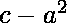

# 检查一个数是否可以用两个平方之和来表示

> 原文:[https://www . geesforgeks . org/check-number-can-presented-sum-two-squares/](https://www.geeksforgeeks.org/check-whether-number-can-represented-sum-two-squares/)

我们有数 n，我们需要找到数 n 是否可以用两个平方之和来表示。

**示例:**

```
Input  : n = 17
Output : Yes
4^2 + 1^2 = 17

Input  : n = 169
Output : Yes
5^2 + 12^2 = 169

Input : n = 24
Output : No
```

**蛮力方法–O(N)**
我们用两个来表示循环，循环一直运行到 N 的平方根，每次我们都要找到循环的两个数的平方和是否等于 N，如果找到那个组合，那么我们就打印 Yes，否则就打印 No

```
for i=1 to sqrt(n)
   for j=i to sqrt(n)
       if (i*i+j*j == n)
           return true;
return false;
```

## C++

```
// A brute force approach based implementation
// to find if a number can be written as sum
// of two squares.
#include <bits/stdc++.h>
using namespace std;

// function to check if there exist two
// numbers sum of whose squares is n.
bool sumSquare(int n)
{
    for (long i = 1; i * i <= n; i++)
        for (long j = 1; j * j <= n; j++)
            if (i * i + j * j == n) {
                cout << i << "^2 + "
                     << j << "^2" << endl;
                return true;
            }
    return false;
}

// driver Program
int main()
{
    int n = 25;
    if (sumSquare(n))
        cout << "Yes";
    else
        cout << "No";
}
```

## Java 语言(一种计算机语言，尤用于创建网站)

```
// A brute force approach based implementation
// to find if a number can be written as sum
// of two squares.

class GFG {

    // function to check if there exist two
    // numbers sum of whose squares is n.
    static boolean sumSquare(int n)
    {
        for (long i = 1; i * i <= n; i++)
            for (long j = 1; j * j <= n; j++)
                if (i * i + j * j == n) {
                    System.out.println(i + "^2 + "
                                       + j + "^2");
                    return true;
     }

        return false;
    }

    // driver Program
    public static void main(String args[])
    {
        int n = 25;
        if (sumSquare(n))
            System.out.println("Yes");
        else
            System.out.println("No");
    }
}

/*This code is contributed by Nikita Tiwari.*/
```

## 蟒蛇 3

```
# A brute force approach based
# implementation to find if a number
# can be written as sum of two squares.

# function to check if there exist two
# numbers sum of whose squares is n.
def sumSquare( n) :
    i = 1
    while i * i <= n :
        j = 1
        while(j * j <= n) :
            if (i * i + j * j == n) :
                print(i, "^2 + ", j , "^2" )
                return True
            j = j + 1
        i = i + 1

    return False

# driver Program
n = 25
if (sumSquare(n)) :
    print("Yes")
else :
    print( "No")

# This code is contributed by Nikita Tiwari.
```

## C#

```
// A brute force approach based
// implementation to find if a
// number can be written as sum
// of two squares
using System;

class GFG {

    // function to check if there exist two
    // numbers sum of whose squares is n
    static bool sumSquare(int n)
    {
        for (long i = 1; i * i <= n; i++)
            for (long j = 1; j * j <= n; j++)
                if (i * i + j * j == n)
                {
                    Console.Write(i + "^2 + "
                                    + j + "^2");
                    return true;
                  }
        return false;
    }

    // Driver Code
    public static void Main(String []args)
    {
        int n = 25;
        if (sumSquare(n))
            Console.Write("\nYes");
        else
            Console.Write("\nNo");
    }
}

// This code is contributed by Smitha Dinesh Semwal.
```

## 服务器端编程语言（Professional Hypertext Preprocessor 的缩写）

```
<?php
// A brute force approach
// based implementation
// to find if a number
// can be written as sum
// of two squares.

// function to check
// if there exist two
// numbers sum of whose
// squares is n.
function sumSquare(int $n)
{
    for ($i = 1; $i * $i <= $n; $i++)
        for ( $j = 1; $j * $j <= $n; $j++)
            if ($i * $i + $j * $j ==$n)
            {
                echo $i , "^2 + ",
                    $j , "^2" ;
                return true;
            }
    return false;
}

    // Driver Code
    $n = 25;
    if (sumSquare($n))
        echo " \n","Yes";
    else
        echo "No";

// This code is contributed by anuj_67.
?>
```

## java 描述语言

```
<script>
// A brute force approach based implementation
// to find if a number can be written as sum
// of two squares.
    // function to check if there exist two
    // numbers sum of whose squares is n.
    function sumSquare(n) {
        for (i = 1; i * i <= n; i++)
            for (j = 1; j * j <= n; j++)
                if (i * i + j * j == n) {
                    document.write(i + "^2 + " + j + "^2"+"<br/>");
                    return true;
                }

        return false;
    }

    // driver Program
        var n = 25;
        if (sumSquare(n))
            document.write("Yes");
        else
            document.write("No");

// This code is contributed by gauravrajput1
</script>
```

**输出:**

```
3^2 + 4^2
Yes
```

**我们也可以在 O(sqrt(n))**
中有这个问题为了在 sqrt(n)复杂度中解决这个问题，我们使用了一个 hashmap，在这个 hashmap 中我们将存储数字的平方直到 sqrt(n)，每次我们都会在 hashmap 中搜索(n–sqrt(I))如果存在，那么返回 Yes 否则返回 n O

```
unordered_map hashmap;
for i = 1 to sqrt(n)
      hashmap[i*i]=1;
      if (hashmap.find(N-i*i) != hashmap.end())
         return true;
return false;

```

## C++

```
// An efficient approach based implementation
// to find if a number can be written as sum
// of two squares.
#include <bits/stdc++.h>
using namespace std;

// function to check if there exist two
// numbers sum of whose squares is n.
bool sumSquare(int n)
{
    unordered_map<int, int> s;
    for (int i = 0; i * i <= n; ++i) {

        // store square value in hashmap
        s[i * i] = 1;
        if (s.find(n - i * i) != s.end()) {
            cout << sqrt(n - i * i) << "^2 + "
                 << i << "^2" << endl;
            return true;
        }
    }
    return false;
}

// driver Program
int main()
{
    int n = 169;
    if (sumSquare(n))
        cout << "Yes";
    else
        cout << "No";
}
```

## Java 语言(一种计算机语言，尤用于创建网站)

```
// An efficient approach based implementation
// to find if a number can be written as sum
// of two squares.
import java.util.*;
class GFG
{

// function to check if there exist two
// numbers sum of whose squares is n.
static boolean sumSquare(int n)
{
    HashMap<Integer,
            Integer> s = new HashMap<Integer,
                                     Integer>();
    for (int i = 0; i * i <= n; ++i)
    {

        // store square value in hashmap
        s.put(i * i, 1);
        if (s.containsKey(n - i * i))
        {
            System.out.println((int)Math.sqrt(n - i * i) +
                                      "^2 + " + i + "^2");
            return true;
        }
    }
    return false;
}

// Driver Code
public static void main(String[] args)
{
    int n = 169;
    System.out.print(sumSquare(n) ?
                          "YES\n" : "NO\n");
}
}

// This code is contributed by Princi Singh
```

## 蟒蛇 3

```
# An efficient approach based implementation
# to find if a number can be written as sum
# of two squares.

# function to check if there exist two
# numbers sum of whose squares is n.
def sumSquare(n):

    s = dict()
    for i in range(n):

        if i * i > n:
            break

        # store square value in hashmap
        s[i * i] = 1

        if (n - i * i) in s.keys():
            print((n - i * i)**(1 / 2),
                       "^2 +", i, "^2")
            return True

    return False

# Driver Code
n = 1
if n==1:
  print('0^2 + 1^2')
elif (sumSquare(n)):
    print("Yes")
else:
    print("No")

# This code is contributed by Mohit Kumar
```

## C#

```
// An efficient approach based implementation
// to find if a number can be written as sum
// of two squares.
using System;
using System.Collections.Generic;
class GFG
{

// function to check if there exist two
// numbers sum of whose squares is n.
static bool sumSquare(int n)
{
    Dictionary<int, int> s = new Dictionary<int, int>();
    for (int i = 0; i * i <= n; ++i)
    {

        // store square value in hashmap
        s.Add(i * i, 1);
        if (s.ContainsKey(n - i * i))
        {
            Console.WriteLine((int)Math.Sqrt(n - i * i) +
                                     "^2 + " + i + "^2");
            return true;
        }
    }
    return false;
}

// Driver Code
public static void Main(String[] args)
{
    int n = 169;
    Console.WriteLine(sumSquare(n) ?
                             "YES" : "NO");
}
}

// This code is contributed by Princi Singh
```

## java 描述语言

```
<script>
    // An efficient approach based implementation
    // to find if a number can be written as sum
    // of two squares.

    // function to check if there exist two
    // numbers sum of whose squares is n.
    function sumSquare(n)
    {
        let s = new Map();
        for (let i = 0; i * i <= n; ++i){

        // store square value in hashmap
            s.set(i * i, 1);
            if (s.has(n - i * i))
            {
                   document.write(Math.sqrt(n - i * i) +
                                      "^2 + " + i + "^2<br>");
                return true;
            }
        }
        return false;
    }

    // Driver Code
    let n = 169;
    document.write(sumSquare(n) ?
                          "YES<br>" : "NO<br>");

// This code is contributed by unknown2108
</script>
```

**输出:**

```
5^2 + 12^2
Yes
```

**我们也可以在 O(sqrt(n)log n)**
中找到这个问题，这个方法是由[萨加尔·舒克拉](https://auth.geeksforgeeks.org/user/Sagar%20Shukla)贡献的。

**二分搜索法方法:**
检查是否是完美正方形的另一种方法是利用二分搜索法。该方法与典型的二分搜索法查找数字的方法相同。唯一的区别在于我们需要在![[0, c - a^2]   ](img/051da28d7580a6e80a9abdbe1d87c483.png "Rendered by QuickLaTeX.com")范围内找到一个整数 **mid** ，这样这个数就是的平方根，或者换句话说，我们需要在![[0, c - a^2]  ](img/10a2fef183344ca1a927a258fc9c8967.png "Rendered by QuickLaTeX.com")范围内找到一个整数 **mid** ，这样 **midxmid** = 

下面是上述方法的实现:

## C++

```
// C++ program for Check whether a number can be
// represented by sum of two squares using binary search.
#include<iostream>
#include<cmath>
using namespace std;

// Function for binary search.
bool binary_search(int num2, int se, int num)
{
    int mid;
    int ss=0;

    while(ss<=se)
    {
        // Calculating mid.
        mid=(ss+se)/2;
        if ((pow(mid,2)+pow(num2,2))==num)
        {
            return true;
        }
        else if ((pow(mid,2)+pow(num2,2))>num)
        {
            se=mid-1;
        }
        else
        {
            ss=mid+1;
        }
    }
    return false;
}

// Driver code
int main()
{
    int rt;
    int num=169;
    rt=sqrt(num);
    bool flag=false;
    for (int i = rt; i >=0; --i)
    {
        if (binary_search(i,i,num))
        {
            flag=true;
            break;
        }
    }
    if (flag)
    {
        cout<<"true";
    }
    else cout<<"false";
    return 0;
}
// This code is contributed by Dhruv Gupta
```

## Java 语言(一种计算机语言，尤用于创建网站)

```
// Java program for Check whether a number can be
// represented by sum of two squares using binary search.
import java.util.*;
import java.lang.*;

public class GfG {
    public static boolean judgeSquareSum(int c)
    {

        // Iterating loop from 0 to c - a * a.
        for (long a = 0; a * a <= c; a++) {
            int b = c - (int)(a * a);

            // If b is a square root of c - a * a
            // then return true.
            if (binary_search(0, b, b))
                return true;
        }
        return false;
    }

    // Function for binary search.
    public static boolean binary_search(long s, long e, int n)
    {

        // If lower limit exceeds upper limit.
        if (s > e)
            return false;

        // Calculating mid.
        long mid = s + (e - s) / 2;
        if (mid * mid == n)
            return true;
        if (mid * mid > n)
            return binary_search(s, mid - 1, n);
        return binary_search(mid + 1, e, n);
    }

    // Driver function
    public static void main(String argc[])
    {
        int c = 17;
        System.out.println(judgeSquareSum(c));
    }
}
```

## 蟒蛇 3

```
# Python3 program for Check whether 
# a number can be represented by
# sum of two squares using binary search.

def judgeSquareSum(c):

    # Iterating loop from 0 to c - a * a.
    a = 0;
    while(a * a <= c):
        b = c - int(a * a);

        # If b is a square root of 
        # c - a * a then return true.
        if (binary_search(0, b, b)):
            return 1;
        a+=1;
    return 0;

# Function for binary search.
def binary_search(s, e, n):
    # If lower limit exceeds 
    # upper limit.
    if (s > e):
        return 0;

    # Calculating mid.
    mid = s + int((e - s) / 2);
    if (int(mid * mid) == n):
        return 1;

    if (int(mid * mid) > n):
        return binary_search(s, mid - 1, n);

    return binary_search(mid + 1, e, n);

# Driver Code
c = 17;
if(judgeSquareSum(c)):
    print("true");
else:
    print("false");

# This code is contributed by mits
```

## C#

```
// C# program for Check whether a
// number can be represented by
// sum of two squares using
// binary search.
using System;
class GFG {

public static bool judgeSquareSum(int c)
    {
        // Iterating loop from 0 to c - a * a.
        for (long a = 0; a * a <= c; a++)
        {
            int b = c - (int)(a * a);

            // If b is a square root of c - a * a
            // then return true.
            if (binary_search(0, b, b))
                return true;
        }
        return false;
    }

    // Function for binary search.
    public static bool binary_search(long s,
                              long e, int n)
    {

        // If lower limit exceeds upper limit.
        if (s > e)
            return false;

        // Calculating mid.
        long mid = s + (e - s) / 2;

        if (mid * mid == n)
            return true;

        if (mid * mid > n)
            return binary_search(s, mid - 1, n);

        return binary_search(mid + 1, e, n);
    }

    // Driver Code
    public static void Main()
    {
        int c = 17;
        Console.WriteLine(judgeSquareSum(c));
    }
}

// This code is contributed by Sam007
```

## 服务器端编程语言（Professional Hypertext Preprocessor 的缩写）

```
<?php
// PHP program for Check whether
// a number can be represented by
// sum of two squares using binary search.

function judgeSquareSum($c)
    {

        // Iterating loop from 0 to c - a * a.
        for ($a = 0; $a * $a <= $c; $a++)
        {
            $b = $c - intval($a * $a);

            // If b is a square root of
            // c - a * a then return true.
            if (binary_search(0, $b, $b))
                return 1;
        }
        return 0;
    }

    // Function for binary search.
    function binary_search($s, $e, $n)
    {

        // If lower limit exceeds
        // upper limit.
        if ($s > $e)
            return 0;

        // Calculating mid.
        $mid = $s + intval(($e - $s) / 2);
        if (intval($mid * $mid) == $n)
            return 1;

        if (intval($mid * $mid) > $n)
            return binary_search($s, $mid - 1, $n);

        return binary_search($mid + 1, $e, $n);
    }

// Driver Code
$c = 17;
if(judgeSquareSum($c))
    echo "true";
else
    echo "false";

// This code is contributed by Sam007
?>
```

## java 描述语言

```
<script>

// javascript program for Check whether a number can be
// represented by sum of two squares using binary search.

    function judgeSquareSum(c) {

        // Iterating loop from 0 to c - a * a.
        for (a = 0; a * a <= c; a++) {
            var b = c - parseInt( (a * a));

            // If b is a square root of c - a * a
            // then return true.
            if (binary_search(0, b, b))
                return true;
        }
        return false;
    }

    // Function for binary search.
    function binary_search(s , e , n) {

        // If lower limit exceeds upper limit.
        if (s > e)
            return false;

        // Calculating mid.
        var mid = s + parseInt((e - s) / 2);
        if (mid * mid == n)
            return true;
        if (mid * mid > n)
            return binary_search(s, mid - 1, n);
        return binary_search(mid + 1, e, n);
    }

    // Driver function
        var c = 17;
        document.write(judgeSquareSum(c));

// This code is contributed by Rajput-Ji
</script>
```

**输出:**

```
true
```

**时间复杂度** : O(sqrt(c)log(c))
这个方法是由[萨加尔·舒克拉](https://auth.geeksforgeeks.org/user/Sagar%20Shukla)贡献的。

### 费马定理方法:

这种方法基于下面的陈述，它基于费马定理:
*“任何正数 **n** 都可以表示为两个平方的和，当且仅当 **n** 的素数因式分解时，形式 **(4k + 3)** 的每个素数出现偶数次。”*
利用上述定理，我们可以直接求出给定的数 n 是否可以表示为两个平方之和。
要做到这一点，我们只需通过重复除法找到给定数字 n 的所有质因数，范围可以从![[2,\sqrt{n}]   ](img/582e24a018d1f1aebd721388d4423683.png "Rendered by QuickLaTeX.com")到这些因数的计数。如果在任何一步，我们发现形式的任何质因数(4k + 3)出现的次数是奇数次，我们可以返回一个假值。
如果 n 本身是质数，它就不能被![[2,\sqrt{n}]  ](img/b0610f6c3ada70f2f8c9e5da6c519f4e.png "Rendered by QuickLaTeX.com")中的任何一个质数整除。因此，我们需要检查 n 是否可以用(4k + 3)的形式表示。如果是这样，我们需要返回一个假值，表示这个素数出现了奇数(1)次。
否则，我们可以返回真值。

## C++

```
// Check whether a number can be represented
// by sum of two squares using Fermat Theorem.
#include<bits/stdc++.h>
using namespace std;

bool judgeSquareSum(int n)
{
for (int i = 2;
        i * i <= n; i++)
{
    int count = 0;
    if (n % i == 0)
    {
        // Count all the prime factors.
        while (n % i == 0)
        {
            count++;
            n /= i;
        }

        // Ifany prime factor of the form
        // (4k+3)(4k+3) occurs an odd
        // number of times.
        if (i % 4 == 3 && count % 2 != 0)
            return false;
    }
}

// If n itself is a x prime number and
// can be expressed in the form of
// 4k + 3 we return false.
return n % 4 != 3;
}

// Driver Code
int main()
{
    int n = 17;
    if(judgeSquareSum(n))
        cout << "Yes";
    else
        cout << "No";
}

// This code is contributed by
// prabhat kumar singh
```

## Java 语言(一种计算机语言，尤用于创建网站)

```
// Java program to Check whether a number 
// can be represented by sum of two
// squares using Fermat Theorem.
import java.util.*;
import java.lang.*;

class GFG
{
public static boolean judgeSquareSum(int n)
{
    for (int i = 2; i * i <= n; i++)
    {
        int count = 0;
        if (n % i == 0)
        {
            // Count all the prime factors.
            while (n % i == 0)
            {
                count++;
                n /= i;
            }

            // Ifany prime factor of the form
            // (4k+3)(4k+3) occurs an odd
            // number of times.
            if (i % 4 == 3 && count % 2 != 0)
                return false;
        }
    }

    // If n itself is a prime number and can
    // be expressed in the form of 4k + 3
    // we return false.
    return n % 4 != 3;
}

// Driver Code
public static void main(String argc[])
{
    int n = 17;
    if(judgeSquareSum(n))
        System.out.println("Yes");
    else
        System.out.println("No");
}
}
```

## 蟒蛇 3

```
# Check whether a number can be represented
# by sum of two squares using Fermat Theorem.
def judgeSquareSum(n):

    i = 2;
    while (i * i <= n):
        count = 0;
        if (n % i == 0):

            # Count all the prime factors.
            while (n % i == 0):
                count += 1;
                n = int(n / i);

            # Ifany prime factor of the
            # form (4k+3)(4k+3) occurs
            # an odd number of times.
            if (i % 4 == 3 and count % 2 != 0):
                return False;
        i += 1;

    # If n itself is a x prime number and
    # can be expressed in the form of 4k + 3
    # we return false.
    return n % 4 != 3;

# Driver Code
n = 17;
if(judgeSquareSum(n)):
    print("Yes");
else:
    print("No");

# This code is contributed by mits
```

## C#

```
// C# program to Check whether a number
// can be represented by sum of two
// squares using Fermat Theorem.
using System;

class GFG
{
public static bool judgeSquareSum(int n)
{
    for (int i = 2; i * i <= n; i++)
    {
        int count = 0;
        if (n % i == 0)
        {
            // Count all the prime factors.
            while (n % i == 0)
            {
                count++;
                n /= i;
            }

            // If any prime factor of the
            // form (4k+3)(4k+3) occurs an
            // odd number of times.
            if (i % 4 == 3 && count % 2 != 0)
                return false;
        }
    }

    // If n itself is a prime number and
    // can be expressed in the form of
    // 4k + 3 we return false.
    return n % 4 != 3;
}

// Driver Code
static public void Main ()
{
    int n = 17;
    if(judgeSquareSum(n))
        Console.WriteLine("Yes");
    else
        Console.WriteLine("No");
}
}

// This code is contributed
// by akt_mit
```

## 服务器端编程语言（Professional Hypertext Preprocessor 的缩写）

```
<?php
// Check whether a number can be represented
// by sum of two squares using Fermat Theorem.
function judgeSquareSum($n)
{
    for ($i = 2; $i * $i <= $n; $i++)
    {
        $count = 0;
        if ($n % $i == 0)
        {
            // Count all the
            // prime factors.
            while ($n % $i == 0)
            {
                $count++;
                $n = (int) $n / $i;
            }

            // Ifany prime factor of the
            // form (4k+3)(4k+3) occurs
            // an odd number of times.
            if ($i % 4 == 3 &&
                $count % 2 != 0)
                return false;
        }
    }

    // If n itself is a x prime number and
    // can be expressed in the form of 4k + 3
    // we return false.
    return $n % 4 != 3;
}

// Driver Code
$n = 17;
if(judgeSquareSum($n))
    echo "Yes";
else
    echo "No";

// This code is contributed by ajit
?>
```

## java 描述语言

```
<script>

// Javascript program to Check whether a number 
// can be represented by sum of two
// squares using Fermat Theorem.
function judgeSquareSum(n)
{
    for(i = 2; i * i <= n; i++)
    {
        var count = 0;

        if (n % i == 0)
        {

            // Count all the prime factors.
            while (n % i == 0)
            {
                count++;
                n = parseInt(n / i);
            }

            // If any prime factor of the form
            // (4k+3)(4k+3) occurs an odd
            // number of times.
            if (i % 4 == 3 && count % 2 != 0)
                return false;
        }
    }

    // If n itself is a prime number and can
    // be expressed in the form of 4k + 3
    // we return false.
    return n % 4 != 3;
}

// Driver Code
var n = 17;
if (judgeSquareSum(n))
    document.write("Yes");
else
    document.write("No");

// This code is contributed by Rajput-Ji

</script>
```

**输出:**

```
Yes
```