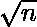

# 检查一个数是否是半素的

> 原文:[https://www . geesforgeks . org/check-when-number-semi prime-not/](https://www.geeksforgeeks.org/check-whether-number-semiprime-not/)

给定一个正整数 n，求一个数是否为**半素**。如果数字为半素，则打印**真**否则打印**假**。半素是两个素数乘积的自然数。
**举例:**

```
Input: 6
Output: True
Explanation
6 is a semiprime number as it is a
product of two prime numbers 2 and 3.

Input: 9
Output: True

Input: 8
Output: False
```

方法很简单，[通过用一个数的除数除以给定的数来分解给定的数，以去除合成数](https://www.geeksforgeeks.org/print-all-prime-factors-of-a-given-number/)。同时不断更新素数的计数变量。

## C++

```
// C++ Program to check whether
// number is semiprime or not
#include <bits/stdc++.h>
using namespace std;

// Utility function to check whether
// number is semiprime or not
int checkSemiprime(int num)
{
    int cnt = 0;

    for (int i = 2; cnt < 2 && i * i <= num; ++i)
        while (num % i == 0)
            num /= i, ++cnt; // Increment count
                             // of prime numbers

    // If number is greater than 1, add it to
    // the count variable as it indicates the
    // number remain is prime number
    if (num > 1)
        ++cnt;

    // Return '1' if count is equal to '2' else
    // return '0'
    return cnt == 2;
}

// Function to print 'True' or 'False'
// according to condition of semiprime
void semiprime(int n)
{
    if (checkSemiprime(n))
        cout << "True\n";
    else
        cout << "False\n";
}

// Driver code
int main()
{
    int n = 6;
    semiprime(n);
    n = 8;
    semiprime(n);
    return 0;
}

// This code is contributed by rutvik_56.
```

## C

```
// C Program to check whether
// number is semiprime or not
#include <stdio.h>

// Utility function to check whether
// number is semiprime or not
int checkSemiprime(int num)
{
    int cnt = 0;

    for (int i = 2; cnt < 2 && i * i <= num; ++i)
        while (num % i == 0)
            num /= i, ++cnt; // Increment count
                             // of prime numbers

    // If number is greater than 1, add it to
    // the count variable as it indicates the
    // number remain is prime number
    if (num > 1)
        ++cnt;

    // Return '1' if count is equal to '2' else
    // return '0'
    return cnt == 2;
}

// Function to print 'True' or 'False'
// according to condition of semiprime
void semiprime(int n)
{
    if (checkSemiprime(n))
        printf("True\n");
    else
        printf("False\n");
}

// Driver code
int main()
{
    int n = 6;
    semiprime(n);

    n = 8;
    semiprime(n);
    return 0;
}
```

## Java 语言(一种计算机语言，尤用于创建网站)

```
// Java Program to check whether
// number is semiprime or not
class GFG{

    // Utility function to check whether
    // number is semiprime or not
    static int checkSemiprime(int num)
    {
        int cnt = 0;

        for (int i = 2; cnt < 2 &&
                     i * i <= num; ++i)

            while (num % i == 0){
                num /= i;

                // Increment count
                // of prime numbers
                ++cnt;
                }

        // If number is greater than 1,
        // add it to the count variable
        // as it indicates the number
        // remain is prime number
        if (num > 1)
            ++cnt;

        // Return '1' if count is equal
        // to '2' else return '0'
        return cnt == 2 ? 1 : 0;
    }

    // Function to print 'True' or 'False'
    // according to condition of semiprime
    static void semiprime(int n)
    {
        if (checkSemiprime(n) != 0)
            System.out.printf("True\n");
        else
            System.out.printf("False\n");
    }

    // Driver code
    public static void main(String[] args)
    {
        int n = 6;
        semiprime(n);

        n = 8;
        semiprime(n);
    }
}

// This code is contributed by
// Smitha Dinesh Semwal
```

## 蟒蛇 3

```
# Python Program to check whether
# number is semiprime or not
import math
# Utility function to check whether
# number is semiprime or not
def checkSemiprime(num):
    cnt = 0

    for i in range(2, int(math.sqrt(num)) + 1):
        while num % i == 0:
            num /= i
            cnt += 1 # Increment count
                    # of prime number

        # If count is greater than 2,
        # break loop
        if cnt >= 2:
            break
    # If number is greater than 1, add it to
    # the count variable as it indicates the
    # number remain is prime number
    if(num > 1):
        cnt += 1

    # Return '1' if count is equal to '2' else
    # return '0'
    return cnt == 2

# Function to print 'True' or 'False'
# according to condition of semiprime
def semiprime(n):
    if checkSemiprime(n) == True:
        print("True")
    else:
        print("False")

# Driver code
n = 6
semiprime(n)

n = 8
semiprime(n);
```

## C#

```
// C# Program to check whether
// number is semiprime or not
using System;
class GFG{

    // Utility function to check whether
    // number is semiprime or not
    static int checkSemiprime(int num)
    {
        int cnt = 0;

        for (int i = 2; cnt < 2 &&
                    i * i <= num; ++i)

            while (num % i == 0){
                num /= i;

                // Increment count
                // of prime numbers
                ++cnt;
                }

        // If number is greater than 1,
        // add it to the count variable
        // as it indicates the number
        // remain is prime number
        if (num > 1)
            ++cnt;

        // Return '1' if count is equal
        // to '2' else return '0'
        return cnt == 2 ? 1 : 0;
    }

    // Function to print 'True' or 'False'
    // according to condition of semiprime
    static void semiprime(int n)
    {
        if (checkSemiprime(n) != 0)
            Console.WriteLine("True");
        else
            Console.WriteLine("False");
    }

    // Driver code
    public static void Main()
    {
        int n = 6;
        semiprime(n);

        n = 8;
        semiprime(n);
    }
}

// This code is contributed by vt_m.
```

## 服务器端编程语言（Professional Hypertext Preprocessor 的缩写）

```
<?php
// PHP Program to check whether
// number is semiprime or not

// Utility function to check whether
// number is semiprime or not
function checkSemiprime($num)
{
    $cnt = 0;

    for ( $i = 2; $cnt < 2 &&
          $i * $i <= $num; ++$i)
        while ($num % $i == 0)
            $num /= $i;

            // Increment count of
            // prime numbers
               ++$cnt;

    // If number is greater than 1,
    // add it to the count variable
    // as it indicates the number
    // remain is prime number
    if ($num > 1)
        ++$cnt;

    // Return '1' if count is
    // equal to '2'
    // else return '0'
    return $cnt == 2;
}

// Function to print 'True' or 'False'
// according to condition of semiprime
function semiprime($n)
{
    if (checkSemiprime($n))
        echo "True\n";
    else
        echo "False\n";
}

// Driver code
$n = 6;
semiprime($n);

$n = 8;
semiprime($n);

// This code is contributed by anuj_67.
?>
```

## java 描述语言

```
<script>

// JavaScript Program to check whether
// number is semiprime or not

    // Utility function to check whether
    // number is semiprime or not
    function checkSemiprime(num)
    {
        let cnt = 0;

        for (let i = 2; cnt < 2 &&
                     i * i <= num; ++i)

            while (num % i == 0){
                num /= i;

                // Increment count
                // of prime numbers
                ++cnt;
                }

        // If number is greater than 1,
        // add it to the count variable
        // as it indicates the number
        // remain is prime number
        if (num > 1)
            ++cnt;

        // Return '1' if count is equal
        // to '2' else return '0'
        return cnt == 2 ? 1 : 0;
    }

    // Function to print 'True' or 'False'
    // according to condition of semiprime
    function semiprime(n)
    {
        if (checkSemiprime(n) != 0)
            document.write("True" + "<br/>");
        else
            document.write("False"  + "<br/>");
    }

// Driver code   

        let n = 6;
        semiprime(n);

        n = 8;
        semiprime(n);

</script>
```

**输出:**

```
True
False
```

**时间复杂度:** O(  )
**辅助空间:** O(1)
**参考:**[https://en.wikipedia.org/wiki/Semiprime](https://en.wikipedia.org/wiki/Semiprime)