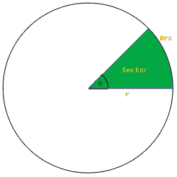

# 检查圆扇区中是否存在点。

> 原文:[https://www . geesforgeks . org/check-point-exists-circle-sector-not/](https://www.geeksforgeeks.org/check-whether-point-exists-circle-sector-not/)

我们有一个以原点(0，0)为中心的圆。作为输入，我们给出圆扇形的起始角度和圆扇形的大小(百分比)。

**示例:**

```
Input :  Radius = 8 
         StartAngle = 0 
         Percentage = 12 
         x = 3 y = 4 
Output : Point (3, 4) exists in the circle 
         sector

Input : Radius = 12 
        Startangle = 45
        Percentage = 25  
        x = 3 y = 4 
Output : Point (3, 4) does not exist in 
         the circle sector
```

[](https://media.geeksforgeeks.org/wp-content/uploads/SectorArc.png)

资料来源:wikibooks.org

在此图像中，起始角度为 0 度，半径为 r，假设着色区域的百分比为 12%，那么我们计算终止角度为**360/百分比+起始角度**。

为了找到一个点(x，y)是否存在于一个圆扇形(以原点为中心)中，我们找到该点的极坐标，然后执行以下步骤:

1.  使用此
    角度= atan(y/x)将 x，y 转换为极坐标；radius = sqrt(x * x+y * y)；
2.  那么角度必须介于起点角度和终点角度之间，半径必须介于 0 和您的半径之间。

## C++

```
// C++ program to check if a point lies inside a circle
// sector.
#include<bits/stdc++.h>
using namespace std;

void checkPoint(int radius, int x, int y, float percent,
                                         float startAngle)
{
    // calculate endAngle
    float endAngle = 360/percent + startAngle;

    // Calculate polar co-ordinates
    float polarradius = sqrt(x*x+y*y);
    float Angle = atan(y/x);

    // Check whether polarradius is less then radius of circle
    // or not and Angle is between startAngle and endAngle
    // or not
    if (Angle>=startAngle && Angle<=endAngle && polarradius<radius)
        printf("Point (%d, %d) exist in the circle sector\n", x, y);
    else
        printf("Point (%d, %d) does not exist in the circle sector\n",
                                                              x, y);
}

// Driver code
int main()
{
    int radius = 8, x = 3, y = 4;
    float percent  = 12, startAngle = 0;
    checkPoint(radius, x, y, percent, startAngle);
    return 0;
}
```

## Java 语言(一种计算机语言，尤用于创建网站)

```
// Java program to check if
// a point lies inside a circle
// sector.

class GFG
{
static void checkPoint(int radius, int x, int y, float percent,
                                         float startAngle)
{

    // calculate endAngle
    float endAngle = 360/percent + startAngle;

    // Calculate polar co-ordinates
    double polarradius = Math.sqrt(x*x+y*y);
    double Angle = Math.atan(y/x);

    // Check whether polarradius is
    // less then radius of circle
    // or not and Angle is between
    // startAngle and endAngle
    // or not
    if (Angle>=startAngle && Angle<=endAngle && polarradius<radius)
        System.out.print("Point"+"("+x+","+y+")"+
        " exist in the circle sector\n");
    else
        System.out.print("Point"+"("+x+","+y+")"+
        " exist in the circle sector\n");
}

// Driver Program to test above function
public static void main(String arg[])
{
    int radius = 8, x = 3, y = 4;
    float percent  = 12, startAngle = 0;
    checkPoint(radius, x, y, percent, startAngle);
}
}

// This code is contributed
// by Anant Agarwal.
```

## 蟒蛇 3

```
# Python3 program to check if a point
# lies inside a circle sector.
import math

def checkPoint(radius, x, y, percent, startAngle):

    # calculate endAngle
    endAngle = 360 / percent + startAngle

    # Calculate polar co-ordinates
    polarradius = math.sqrt(x * x + y * y)
    Angle = math.atan(y / x)

    # Check whether polarradius is less
    # then radius of circle or not and
    # Angle is between startAngle and
    # endAngle or not
    if (Angle >= startAngle and Angle <= endAngle
                        and polarradius < radius):
        print("Point (", x, ",", y, ") "
              "exist in the circle sector")
    else:
        print("Point (", x, ",", y, ") "
              "does not exist in the circle sector")

# Driver code
radius, x, y = 8, 3, 4
percent, startAngle = 12, 0

checkPoint(radius, x, y, percent, startAngle)

# This code is contributed by
# Smitha Dinesh Semwal
```

## C#

```
// C# program to check if a point lies
// inside a circle sector.
using System.IO;
using System;

class GFG {

    static void checkPoint(int radius, int x, int y,
                    float percent, float startAngle)
    {

        // calculate endAngle
        float endAngle = 360 / percent + startAngle;

        // Calculate polar co-ordinates
        float polarradius =
                    (float)Math.Sqrt(x * x + y * y);

        float Angle = (float)Math.Atan(y / x);

        // Check whether polarradius is less then
        // radius of circle or not and Angle is
        // between startAngle and endAngle or not
        if (Angle >= startAngle && Angle <= endAngle
                            && polarradius < radius)
            Console.Write("Point ({0}, {1}) exist in "
                         + "the circle sector", x, y);
        else
            Console.Write("Point ({0}, {1}) does not "
                + "exist in the circle sector", x, y);
    }

    // Driver code
    public static void Main()
    {
        int radius = 8, x = 3, y = 4;
        float percent = 12, startAngle = 0;
        checkPoint(radius, x, y, percent, startAngle);
    }
}

// This code is contributed by Smitha Dinesh Semwal
```

## java 描述语言

```
<script>

// Javascript program to check if
// a point lies inside a circle
// sector.
function checkPoint(radius, x, y, percent, startAngle)
{

    // Calculate endAngle
    let endAngle = 360 / percent + startAngle;

    // Calculate polar co-ordinates
    let polarradius = Math.sqrt(x * x + y * y);
    let Angle = Math.atan(y / x);

    // Check whether polarradius is
    // less then radius of circle
    // or not and Angle is between
    // startAngle and endAngle
    // or not
    if (Angle >= startAngle &&
        Angle <= endAngle &&
        polarradius < radius)
        document.write("Point" + "(" + x + 
                       "," + y + ")" +
        " exist in the circle sector\n");
    else
        document.write("Point" + "(" + x +
                       "," + y + ")" +
        " exist in the circle sector\n");
}

// Driver code   
let radius = 8, x = 3, y = 4;
let percent  = 12, startAngle = 0;

checkPoint(radius, x, y, percent, startAngle);

// This code is contributed by splevel62

</script>
```

**输出:**

```
Point(3, 4) exists in the circle sector
```

时间复杂度= 0(1)

本文由**尼泰什·库马尔**供稿。如果你喜欢 GeeksforGeeks 并想投稿，你也可以使用[contribute.geeksforgeeks.org](http://www.contribute.geeksforgeeks.org)写一篇文章或者把你的文章邮寄到 contribute@geeksforgeeks.org。看到你的文章出现在极客博客主页上，帮助其他极客。
如果你发现任何不正确的地方，或者你想分享更多关于上面讨论的话题的信息，请写评论。