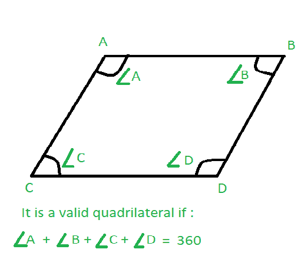

# 如果给定角度，检查四边形是否有效

> 原文:[https://www . geesforgeks . org/check-四边形是否有效-如果给定了角度/](https://www.geeksforgeeks.org/check-whether-quadrilateral-is-valid-or-not-if-angles-are-given/)

给定四个整数 **A** 、 **B** 、 **C** 和 **D** ，以度为单位表示四边形的四个角度。任务是检查给定的四边形是否有效。



**示例:**

> **输入:** A = 80，B = 70，C = 100，D = 110
> T3】输出:有效
> 
> **输入:** A = 70，B = 80，C = 130，D = 60
> T3】输出:无效

**方法:**
如果四个角度之和等于 360 度，则四边形有效。

下面是上述方法的实现:

## C++

```
// C++ program to check if a given
// quadrilateral is valid or not
#include <bits/stdc++.h>
using namespace std;

// Function to check if a given
// quadrilateral is valid or not
bool Valid(int a, int b, int c, int d)
{
    // Check condition
    if (a + b + c + d == 360)
        return true;

    return false;
}

// Driver code
int main()
{
    int a = 80, b = 70, c = 100, d = 110;

    if (Valid(a, b, c, d))
        cout << "Valid quadrilateral";
    else
        cout << "Invalid quadrilateral";

    return 0;
}
```

## Java 语言(一种计算机语言，尤用于创建网站)

```
// Java program to check if a given
// quadrilateral is valid or not
class GFG
{

// Function to check if a given
// quadrilateral is valid or not
public static int Valid(int a, int b,
                        int c, int d)
{
    // Check condition
    if (a + b + c + d == 360)
        return 1;

    return 0;
}

// Driver code
public static void main (String[] args)
{
    int a = 80, b = 70, c = 100, d = 110;

    if (Valid(a, b, c, d) == 1)
        System.out.println("Valid quadrilateral");
    else
        System.out.println("Invalid quadrilateral");
}
}

// This code is contributed
// by apurva_sharma244
```

## 蟒蛇 3

```
# Python program to check if a given
# quadrilateral is valid or not

# Function to check if a given
# quadrilateral is valid or not
def Valid(a, b, c, d):

    # Check condition
    if (a + b + c + d == 360):
        return True;

    return False;

# Driver code
a = 80; b = 70; c = 100; d = 110;

if (Valid(a, b, c, d)):
    print("Valid quadrilateral");
else:
    print("Invalid quadrilateral");

# This code is contributed by Rajput-Ji
```

## C#

```
// C# program to check if a given
// quadrilateral is valid or not 
class GFG
{

// Function to check if a given
// quadrilateral is valid or not
static bool Valid(int a, int b,
                  int c, int d)
{
    // Check condition
    if (a + b + c + d == 360)
        return true;

    return false;
}

// Driver code
public static void Main()
{
    int a = 80, b = 70, c = 100, d = 110;

    if (Valid(a, b, c, d))
        Console.WriteLine("Valid quadrilateral");
    else
        Console.WriteLine("Invalid quadrilateral");
}
}

// This code is contributed by nidhiva
```

## 服务器端编程语言（Professional Hypertext Preprocessor 的缩写）

```
<?php
// PHP program to check if a given
// quadrilateral is valid or not

// Function to check if a given
// quadrilateral is valid or not
function Valid($a, $b, $c, $d)
{
    // Check condition
    if ($a + $b + $c + $d == 360)
        return true;

    return false;
}

// Driver Code
$a = 80;
$b = 70;
$c = 100;
$d = 110;

if (Valid($a, $b, $c, $d))
    echo("Valid quadrilateral");
else
    echo("Invalid quadrilateral");

// This code is contributed by Naman_garg.
?>
```

## java 描述语言

```
<script>

// Javascript program to check if a given
// quadrilateral is valid or not

// Function to check if a given
// quadrilateral is valid or not
function Valid(a, b, c, d)
{

    // Check condition
    if (a + b + c + d == 360)
        return 1;

    return 0;
}

// Driver code
var a = 80, b = 70, c = 100, d = 110;

if (Valid(a, b, c, d) == 1)
    document.write("Valid quadrilateral");
else
    document.write("Invalid quadrilateral");

// This code is contributed by Khushboogoyal499

</script>
```

**Output**

```
Valid quadrilateral
```