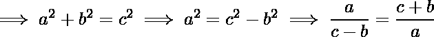

# 检查直角三角形对大边是否有效

> 原文:[https://www . geesforgeks . org/check-what-直角三角形-有效-不算大-边数/](https://www.geeksforgeeks.org/check-whether-right-angled-triangle-valid-not-large-sides/)

给定三个整数 a、b 和 c 作为三元组。检查是否可以制作直角三角形。如果可能，打印**是**，否则打印**否**。10 <sup>-18</sup> < = a、b、c < = 10 <sup>18</sup>
**例:**

```
Input: 3 4 5
Output: Yes
Explanation:
Since 3*3 + 4*4 = 5*5
Hence print "Yes"

Input: 8 5 13
Since 8 + 5 < 13 which violates the property of
triangle. Hence print "No"
```

直角三角形要有效，必须满足以下标准:-

1.  a、b 和 c 应该大于 0。

2.  三角形任意两条边的和必须大于第三条边。

3.  勾股定理即 a<sup>2</sup>+b<sup>2</sup>= c<sup>2</sup>。

前两个条件很容易检查，但是对于第三个条件，我们必须处理溢出。因为 a、b 和 c 可以很大，所以我们不能直接比较它们，除非我们在 Java 中使用 python 或 BigInteger 库。对于像 C 和 C++这样的语言，我们必须减少分数形式的表达式。

在比较分数之前，我们需要通过将分子和分母除以两者的 **gcd** 来以简化形式转换它们。现在比较 LHS 分数和 RHS 分数的分子和分母，如果两者相同，则表示有效的直角三角形，否则表示无效。

## C++

```
// C++ program to check validity of triplets
#include <bits/stdc++.h>
using namespace std;

// Function to check pythagorean triplets
bool Triplets(long long a, long long b, long long c)
{
    if (a <= 0 || b <= 0 || c <= 0)
        return false;

    vector<long long> vec{ a, b, c };
    sort(vec.begin(), vec.end());

    // Re-initialize a, b, c in ascending order
    a = vec[0], b = vec[1], c = vec[2];

    // Check validation of sides of triangle
    if (a + b <= c)
        return false;

    long long p1 = a, p2 = c - b;

    // Reduce fraction to simplified form
    long long div = __gcd(p1, p2);
    p1 /= div, p2 /= div;

    long long q1 = c + b, q2 = a;

    // Reduce fraction to simplified form
    div = __gcd(q1, q2);
    q1 /= div, q2 /= div;

    // If fraction are equal return
    // 'true' else 'false'
    return (p1 == q1 && p2 == q2);
}

// Function that will return 'Yes' or 'No'
// according to the correction of triplets
string checkTriplet(long long a, long long b, long long c)
{
    if (Triplets(a, b, c))
        return "Yes";
    else
        return "No";
}

// Driver code
int main()
{
    long long a = 4, b = 3, c = 5;
    cout << checkTriplet(a, b, c) << endl;

    a = 8, b = 13, c = 5;
    cout << checkTriplet(a, b, c) << endl;

    a = 1200000000000, b = 1600000000000,
    c = 2000000000000;
    cout << checkTriplet(a, b, c) << endl;

    return 0;
}
```

## Java 语言(一种计算机语言，尤用于创建网站)

```
// Java program to check validity of triplets
import java.util.*;

class GFG
{

// Function to check pythagorean triplets
static boolean Triplets(long a,
                        long b, long c)
{
    if (a <= 0 || b <= 0 || c <= 0)
        return false;

    long []vec = { a, b, c };
    Arrays.sort(vec);

    // Re-initialize a, b, c in ascending order
    a = vec[0]; b = vec[1]; c = vec[2];

    // Check validation of sides of triangle
    if (a + b <= c)
        return false;

    long p1 = a, p2 = c - b;

    // Reduce fraction to simplified form
    long div = __gcd(p1, p2);
    p1 /= div; p2 /= div;

    long q1 = c + b, q2 = a;

    // Reduce fraction to simplified form
    div = __gcd(q1, q2);
    q1 /= div; q2 /= div;

    // If fraction are equal return
    // 'true' else 'false'
    return (p1 == q1 && p2 == q2);
}

// Function that will return 'Yes' or 'No'
// according to the correction of triplets
static String checkTriplet(long a,
                           long b, long c)
{
    if (Triplets(a, b, c))
        return "Yes";
    else
        return "No";
}

static long __gcd(long a, long b)
{
    if (b == 0)
        return a;
    return __gcd(b, a % b);

}

// Driver code
public static void main(String[] args)
{
    long a = 4, b = 3, c = 5;
    System.out.println(checkTriplet(a, b, c));

    a = 8; b = 13; c = 5;
    System.out.println(checkTriplet(a, b, c));

    a = 1200000000000L; b = 1600000000000L;
    c = 2000000000000L;
    System.out.println(checkTriplet(a, b, c));
}
}

// This code is contributed
// by Princi Singh
```

## 蟒蛇 3

```
# Python3 program to check validity of triplets
def Triplets(a, b, c):

    if (a <= 0 or b <= 0 or c <= 0):
        return False

    vec = [ a, b, c ]
    vec.sort()

    # Re - initialize a, b, c in ascending order
    a = vec[0]; b = vec[1]; c = vec[2]

    # Check validation of sides of triangle
    if (a + b <= c):
        return False

    p1 = a; p2 = c - b

    # Reduce fraction to simplified form
    div = __gcd(p1, p2)
    p1 //= div
    p2 //= div

    q1 = c + b
    q2 = a

    # Reduce fraction to simplified form
    div = __gcd(q1, q2)
    q1 //= div
    q2 //= div

    # If fraction are equal return
    # 'true' else 'false'
    return (p1 == q1 and p2 == q2)

# Function that will return 'Yes' or 'No'
# according to the correction of triplets
def checkTriplet(a, b, c):

    if (Triplets(a, b, c)):
        return "Yes"
    else:
        return "No"

def __gcd(a, b):
    if (b == 0):
        return a
    return __gcd(b, a % b)

# Driver code
a = 4
b = 3
c = 5
print(checkTriplet(a, b, c))

a = 8
b = 13
c = 5
print(checkTriplet(a, b, c))

a = 1200000000000
b = 1600000000000
c = 2000000000000
print(checkTriplet(a, b, c))

# This code is contributed by ng24_7
```

## C#

```
// C# program to check validity of triplets
using System;

class GFG
{

// Function to check pythagorean triplets
static Boolean Triplets(long a,
                        long b, long c)
{
    if (a <= 0 || b <= 0 || c <= 0)
        return false;

    long []vec = { a, b, c };
    Array.Sort(vec);

    // Re-initialize a, b, c in ascending order
    a = vec[0]; b = vec[1]; c = vec[2];

    // Check validation of sides of triangle
    if (a + b <= c)
        return false;

    long p1 = a, p2 = c - b;

    // Reduce fraction to simplified form
    long div = __gcd(p1, p2);
    p1 /= div; p2 /= div;

    long q1 = c + b, q2 = a;

    // Reduce fraction to simplified form
    div = __gcd(q1, q2);
    q1 /= div; q2 /= div;

    // If fraction are equal return
    // 'true' else 'false'
    return (p1 == q1 && p2 == q2);
}

// Function that will return 'Yes' or 'No'
// according to the correction of triplets
static String checkTriplet(long a,
                        long b, long c)
{
    if (Triplets(a, b, c))
        return "Yes";
    else
        return "No";
}

static long __gcd(long a, long b)
{
    if (b == 0)
        return a;
    return __gcd(b, a % b);

}

// Driver code
public static void Main(String[] args)
{
    long a = 4, b = 3, c = 5;
    Console.WriteLine(checkTriplet(a, b, c));

    a = 8; b = 13; c = 5;
    Console.WriteLine(checkTriplet(a, b, c));

    a = 1200000000000L; b = 1600000000000L;
    c = 2000000000000L;
    Console.WriteLine(checkTriplet(a, b, c));
}
}

// This code has been contributed by 29AjayKumar
```

## java 描述语言

```
<script>

// Javascript program to check validity of triplets

// Function to check pythagorean triplets
function Triplets(a, b, c)
{
    if (a <= 0 || b <= 0 || c <= 0)
        return false;

    let vec = [ a, b, c ];
    vec.sort();

    // Re-initialize a, b, c in ascending order
    a = vec[0]; b = vec[1]; c = vec[2];

    // Check validation of sides of triangle
    if (a + b <= c)
        return false;

    let p1 = a, p2 = c - b;

    // Reduce fraction to simplified form
    let div = __gcd(p1, p2);
    p1 /= div; p2 /= div;

    let q1 = c + b, q2 = a;

    // Reduce fraction to simplified form
    div = __gcd(q1, q2);
    q1 /= div; q2 /= div;

    // If fraction are equal return
    // 'true' else 'false'
    return (p1 == q1 && p2 == q2);
}

// Function that will return 'Yes' or 'No'
// according to the correction of triplets
function checkTriplet(a, b, c){

    if (Triplets(a, b, c))
        return "Yes";
    else
        return "No";
}

function __gcd(a, b)
{
    if (b == 0)
        return a;
    return __gcd(b, a % b);

}

// driver program
    let a = 4, b = 3, c = 5;
    document.write(checkTriplet(a, b, c) + "<br/>");

    a = 8; b = 13; c = 5;
    document.write(checkTriplet(a, b, c)  + "<br/>");

    a = 1200000000000; b = 1600000000000;
    c = 2000000000000;
    document.write(checkTriplet(a, b, c)  + "<br/>");

// This code is contributed by sanjoy_62.
</script>
```

**输出:**

```
Yes
No
Yes
```

**时间复杂度:** O(log(M))其中 M 为 a、b、c 中的最大值
T3】辅助空间: O(1)
本文由 [Shubham Bansal](https://www.quora.com/profile/Shubham-Bansal-209) 供稿。如果你喜欢 GeeksforGeeks 并想投稿，你也可以用[write.geeksforgeeks.org](https://write.geeksforgeeks.org)写一篇文章或者把你的文章邮寄到 contribute@geeksforgeeks.org。看到你的文章出现在极客博客主页上，帮助其他极客。