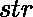
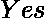

# 检查字符串中所有字符的频率是否为质数

> 原文:[https://www . geesforgeks . org/check-字符串中所有字符的频率是否为质数/](https://www.geeksforgeeks.org/check-whether-the-frequencies-of-all-the-characters-in-a-string-are-prime-or-not/)

给定一个字符串，任务是检查字符串中所有字符的频率是否为质数。如果所有频率都是质数，则打印否则打印。
**示例:**

> **输入:**str = " geeksforgeeks "
> T3】输出:否
> T6】
> 
> | 性格；角色；字母 | 频率 |
> | g | Two |
> | e | four |
> | k | Two |
> | s | Two |
> | f | one |
> | o | one |
> | r | one |
> 
> 很明显，只有 g，k 和 s 的频率是质数。
> **输入:**str = " aabbbccccc "
> T4】输出:是

**方法:**找出字符串中出现的所有字符的频率，并将其存储在地图中。然后检查是否所有频率都是质数，如果所有频率都是质数，则打印否则打印。
以下是上述方法的实施:

## C++

```
// C++ implementation of above approach
#include <bits/stdc++.h>
using namespace std;

// function that returns true
// if n is prime else false
bool isPrime(int n)
{
    int i;

    // 1 is not prime
    if (n == 1)
        return false;

    // check if there is any factor or not
    for (i = 2; i <= sqrt(n); i++)
        if (n % i == 0)
            return false;

    return true;
}

// function that returns true if
// the frequencies of all the
// characters of s are prime
bool check_frequency(string s)
{
    // create a map to store
    // the frequencies of characters
    map<char, int> m;

    for (int i = 0; i < s.length(); i++)
        // update the frequency
        m[s[i]]++;

    // check whether all the frequencies
    // are prime or not
    for (char ch = 'a'; ch <= 'z'; ch++)
        if (m[ch] > 0 && !isPrime(m[ch]))
            return false;

    return true;
}

// Driver code
int main()
{
    string s = "geeksforgeeks";

    // if all the frequencies are prime
    if (check_frequency(s))
        cout << "Yes" << endl;

    else
        cout << "No" << endl;

    return 0;
}
```

## Java 语言(一种计算机语言，尤用于创建网站)

```
import java.util.*;

// Java implementation of above approach
class GFG
{

    // function that returns true
    // if n is prime else false
    static boolean isPrime(int n)
    {
        int i;

        // 1 is not prime
        if (n == 1)
        {
            return false;
        }

        // check if there is any factor or not
        for (i = 2; i <= Math.sqrt(n); i++)
        {
            if (n % i == 0)
            {
                return false;
            }
        }

        return true;
    }

    // function that returns true if
    // the frequencies of all the
    // characters of s are prime
    static boolean check_frequency(char[] s)
    {
        // create a map to store
        // the frequencies of characters
        HashMap<Character, Integer> m = new HashMap<Character, Integer>();

        for (int i = 0; i < s.length; i++) // update the frequency
        {
            if (m.containsKey(s[i]))
            {
                m.put(s[i], m.get(s[i]) + 1);
            }
            else
            {
                m.put(s[i], 1);
            }
        }

        // check whether all the frequencies
        // are prime or not
        for (char ch = 'a'; ch <= 'z'; ch++)
        {
            if (m.get(ch) != null && m.get(ch) > 0 && !isPrime(m.get(ch)))
            {
                return false;
            }
        }

        return true;
    }

    // Driver code
    public static void main(String[] args)
    {
        String s = "geeksforgeeks";

        // if all the frequencies are prime
        if (check_frequency(s.toCharArray()))
        {
            System.out.println("Yes");
        }
        else
        {
            System.out.println("No");
        }
    }
}

// This code contributed by Rajput-Ji
```

## 蟒蛇 3

```
# Python3 implementation of above approach
import math as mt

# function that returns true
# if n is prime else false
def isPrime(n):
    i = 2

    # 1 is not prime
    if (n == 1):
        return False

    # check if there is any factor or not
    for i in range(2, mt.ceil(mt.sqrt(n))):
        if (n % i == 0):
            return False

    return True

# function that returns true if the
# frequencies of all the characters
# of s are prime
def check_frequency(s):

    # create a map to store
    # the frequencies of characters
    m = dict()

    for i in range(len(s)):

        # update the frequency
        if s[i] in m.keys():
            m[s[i]] += 1
        else:
            m[s[i]] = 1

    # check whether all the frequencies
    # are prime or not
    for ch in m:
        if m[ch] > 0 and isPrime(m[ch]) == False:
            return False

    return True

# Driver code
s = "geeksforgeeks"

# if all the frequencies are prime
if (check_frequency(s)):
    print("Yes")
else:
    print("No")

# This code is contributed
# by Mohit kumar 29
```

## C#

```
// C# implementation of above approach
using System;
using System.Collections.Generic;

class GFG
{

    // function that returns true
    // if n is prime else false
    static bool isPrime(int n)
    {
        int i;

        // 1 is not prime
        if (n == 1)
        {
            return false;
        }

        // check if there is any factor or not
        for (i = 2; i <= Math.Sqrt(n); i++)
        {
            if (n % i == 0)
            {
                return false;
            }
        }

        return true;
    }

    // function that returns true if
    // the frequencies of all the
    // characters of s are prime
    static bool check_frequency(char[] s)
    {
        // create a map to store
        // the frequencies of characters
        Dictionary<char, int> m = new Dictionary<char, int>();

        for (int i = 0; i < s.Length; i++) // update the frequency
        {
            if (m.ContainsKey(s[i]))
            {
                var c = m[s[i]]+1;
                m.Remove(s[i]);
                m.Add(s[i], c);
            }
            else
            {
                m.Add(s[i], 1);
            }
        }

        // check whether all the frequencies
        // are prime or not
        for (char ch = 'a'; ch <= 'z'; ch++)
        {
            if (m.ContainsKey(ch) && m[ch] > 0 &&
                                    !isPrime(m[ch]))
            {
                return false;
            }
        }

        return true;
    }

    // Driver code
    public static void Main(String[] args)
    {
        String s = "geeksforgeeks";

        // if all the frequencies are prime
        if (check_frequency(s.ToCharArray()))
        {
            Console.WriteLine("Yes");
        }
        else
        {
            Console.WriteLine("No");
        }
    }
}

/* This code contributed by PrinciRaj1992 */
```

## java 描述语言

```
<script>

// Javascript implementation of above approach

// function that returns true
// if n is prime else false
function isPrime(n)
{
    var i;

    // 1 is not prime
    if (n == 1)
        return false;

    // check if there is any factor or not
    for (i = 2; i <= Math.sqrt(n); i++)
        if (n % i == 0)
            return false;

    return true;
}

// function that returns true if
// the frequencies of all the
// characters of s are prime
function check_frequency(s)
{
    // create a map to store
    // the frequencies of characters
    var m = new Map();

    for (var i = 0; i < s.length; i++)
        // update the frequency
        if(m.has(s[i]))
        {
            m.set(s[i],m.get(s[i])+1);
        }
        else
        {
            m.set(s[i],1);
        }

    // check whether all the frequencies
    // are prime or not
    for (var ch = 'a'.charCodeAt(0); ch <= 'z'.charCodeAt(0); ch++)
        if (m.get(String.fromCharCode(ch)) > 0 && !isPrime(m.get(String.fromCharCode(ch))))
            return false;

    return true;
}

// Driver code
var s = "geeksforgeeks";

// if all the frequencies are prime
if (check_frequency(s))
    document.write( "Yes" );
else
    document.write( "No" );

// This code is contributed byrutvik_56.
</script>   
```

**Output:** 

```
No
```

***时间复杂度:** O((len(str)) <sup>1/2</sup> )*

***辅助空间:** O(len(str))*