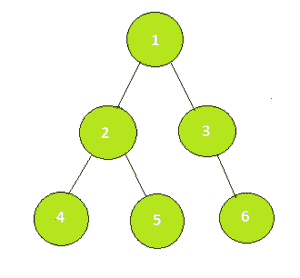
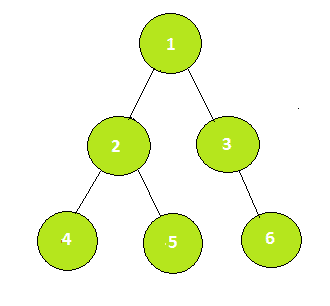

# 检查给定节点是否在节点 U 和 V 之间的路径中

> 原文:[https://www . geesforgeks . org/check-给定节点是否在节点间路径中-u 和-v/](https://www.geeksforgeeks.org/check-whether-the-given-node-is-in-the-path-between-the-nodes-u-and-v/)

给定二叉树的三个顶点 **U** 、 **V** 和 **R** ，任务是检查 **R** 是否位于 **U** 和 **V** 之间的路径中。如果路径中没有，则打印**否**否则打印**是**。
**举例:**

> **输入:** U = 4，V = 6，R = 2
> 
> 
> 
> **输出:**是
> 路径**4->2->1->3->6**包含**2**
> T8】输入: U = 4，V = 6，R = 5
> 
> 
> 
> **输出:**无
> 路径**4->2->1->3->6**不包含 **5**

**方法:**思路是使用两个节点的[最低共同祖先](https://www.geeksforgeeks.org/lca-in-a-tree-using-binary-lifting-technique/)。 **R** 存在于 **U** 和 **V** 之间的路径有以下几种情况:

1.  **R** 是**U****V**的最低共同祖先。
2.  **R** 在**U****V**的最低共同祖先的左子树中，在 **V** 之上。
3.  **R** 在 **U** 和 **V** 的最低共同祖先的右子树中，在 **U** 之上。

想要了解更多关于最低共同祖先的信息，请阅读此处的帖子。
以下是上述办法的实施情况:

## C++

```
// CPP Program to implement the above approach
#include <bits/stdc++.h>
using namespace std;

// Table for storing 2^ith parent
vector<vector<int>> table;

// Variable to store the height of the tree
int height;

// Graph
vector<vector<int>> Graph;

// Arrays to mark start and end time for a node
vector<int> timeIn, timeOut;

// Timer
int cnt_time;

// constructor for initializing
// the global variables
void initialise(int n)
{

  // log(n) with base 2
  height = (int)ceil(log2(n));

  // Filling with -1 as initial
  table.resize(n + 1, vector<int>(height + 1, -1));

  // Fill the graph with empty lists
  Graph.resize(n + 1);
  timeIn.resize(n + 1);
  timeOut.resize(n + 1);
  cnt_time = 0;
}

// Dfs for pre-processing sparse table and
// calculating start and end time
void dfs(int s, int p)
{

  // Parent at 1 node distance is always
  // it's direct parent
  table[s][0] = p;

  // Start time noted
  timeIn[s] = ++cnt_time;

  // Filling sparse table recursively
  for (int i = 1; i <= height; i++)
    table[s][i] = table[table[s][i - 1]][i - 1];

  // Traversing children of source
  for (int child : Graph[s]) {
    if (child == p) continue;
    dfs(child, s);
  }

  // End time noted
  timeOut[s] = ++cnt_time;
}

// Helper function to check lowest common Ancestor
bool check(int u, int v)
{
  return timeIn[u] <= timeIn[v] && timeOut[u] >= timeOut[v];
}

// Function to return Lowest Common Ancestor of U and V
int lowestCommonAncestor(int U, int V)
{
  if (check(U, V)) return U;

  if (check(V, U)) return V;

  for (int i = height; i >= 0; i--)
  {
    if (!check(table[U][i], V)) U = table[U][i];
  }

  return table[U][0];
}

// Function that return true if R
// exists on the path between U
// and V in the given tree
bool isPresent(int U, int V, int R)
{

  // Dfs
  dfs(1, 1);

  // Calculating LCA between U and V
  int LCA = lowestCommonAncestor(U, V);

  // Calculating LCA between U and R
  int LCA_1 = lowestCommonAncestor(U, R);

  // Calculating LCA between U and V
  int LCA_2 = lowestCommonAncestor(V, R);

  if (LCA == R || (LCA_1 == LCA && LCA_2 == R) ||
      (LCA_2 == LCA && LCA_1 == R)) {
    return true;
  }
  return false;
}

// Driver code
int main(int argc, char const *argv[])
{

  // Number of vertices
  int n = 6;
  initialise(n);

  // Create the graph
  Graph[1].push_back(2);
  Graph[2].push_back(1);
  Graph[1].push_back(3);
  Graph[3].push_back(1);
  Graph[2].push_back(4);
  Graph[4].push_back(2);
  Graph[2].push_back(5);
  Graph[5].push_back(2);
  Graph[3].push_back(6);
  Graph[6].push_back(3);

  int U = 4, V = 6, R = 2;
  if (isPresent(U, V, R))
    cout << "Yes" << endl;
  else
    cout << "No" << endl;
}

// This code is contributed by sanjeev2552
```

## Java 语言(一种计算机语言，尤用于创建网站)

```
// Java implementation of the approach
import java.util.*;

class GfG {

    // Table for storing 2^ith parent
    private static int table[][];

    // Variable to store the height of the tree
    private static int height;

    // Graph
    private static ArrayList<ArrayList<Integer> > Graph;

    // Arrays to mark start and end time for a node
    private static int timeIn[];
    private static int timeOut[];

    // Timer
    private static int time;

    // Private constructor for initializing
    // the global variables
    private GfG(int n)
    {

        // log(n) with base 2
        height = (int)Math.ceil(Math.log10(n) / Math.log10(2));
        table = new int[n + 1][height + 1];

        // Fill the graph with empty lists
        Graph = new ArrayList<ArrayList<Integer> >();
        for (int i = 0; i <= n; i++)
            Graph.add(new ArrayList<Integer>());
        timeIn = new int[n + 1];
        timeOut = new int[n + 1];
        time = 0;
    }

    // Filling with -1 as initial
    private static void preprocessing(int n)
    {
        for (int i = 0; i < n + 1; i++) {
            Arrays.fill(table[i], -1);
        }
    }

    // Dfs for pre-processing sparse table and
    // calculating start and end time
    private static void dfs(int s, int p)
    {
        // Parent at 1 node distance is always
        // it's direct parent
        table[s][0] = p;

        // Start time noted
        timeIn[s] = ++time;

        // Filling sparse table recursively
        for (int i = 1; i <= height; i++)
            table[s][i] = table[table[s][i - 1]][i - 1];

        // Traversing children of source
        for (int child : Graph.get(s)) {
            if (child == p)
                continue;
            dfs(child, s);
        }

        // End time noted
        timeOut[s] = ++time;
    }

    // Helper function to check lowest common Ancestor
    private static boolean check(int u, int v)
    {
        return timeIn[u] <= timeIn[v] && timeOut[u] >= timeOut[v];
    }

    // Function to return Lowest Common Ancestor of U and V
    private static int lowestCommonAncestor(int U, int V)
    {
        if (check(U, V))
            return U;

        if (check(V, U))
            return V;

        for (int i = height; i >= 0; i--) {
            if (!check(table[U][i], V))
                U = table[U][i];
        }

        return table[U][0];
    }

    // Function that return true if R
    // exists on the path between U
    // and V in the given tree
    private static boolean isPresent(int U, int V, int R)
    {

        // Dfs
        dfs(1, 1);

        // Calculating LCA between U and V
        int LCA = lowestCommonAncestor(U, V);

        // Calculating LCA between U and R
        int LCA_1 = lowestCommonAncestor(U, R);

        // Calculating LCA between U and V
        int LCA_2 = lowestCommonAncestor(V, R);

        if (LCA == R || (LCA_1 == LCA && LCA_2 == R)
            || (LCA_2 == LCA && LCA_1 == R)) {
            return true;
        }
        return false;
    }

    // Driver code
    public static void main(String args[])
    {
        // Number of vertices
        int n = 6;
        GfG obj = new GfG(n);

        // Create the graph
        preprocessing(n);
        Graph.get(1).add(2);
        Graph.get(2).add(1);
        Graph.get(1).add(3);
        Graph.get(3).add(1);
        Graph.get(2).add(4);
        Graph.get(4).add(2);
        Graph.get(2).add(5);
        Graph.get(5).add(2);
        Graph.get(3).add(6);
        Graph.get(6).add(3);

        int U = 4, V = 6, R = 2;
        if (isPresent(U, V, R))
            System.out.print("Yes");
        else
            System.out.print("No");
    }
}
```

## 蟒蛇 3

```
# Python3 implementation of the approach
import math

n = 6

# Graph
Graph = []

# log(n) with base 2
height = math.ceil(math.log10(n) / math.log10(2))
table = [[-1 for i in range(n + 1)] for j in range(n + 1)]

# Fill the graph with empty lists
for i in range(n + 1):
  Graph.append([])
timeIn = [0]*(n + 1)
timeOut = [0]*(n + 1)
time = 0

# Filling with -1 as initial
def preprocessing(n):
    for i in range(n + 1):
        for j in range(height + 1):
            table[i][j] = -1

# Dfs for pre-processing sparse table and
# calculating start and end time
def dfs(s, p):
    global time
    # Parent at 1 node distance is always
    # it's direct parent
    table[s][0] = p

    # Start time noted
    timeIn[s] = time+1

    # Filling sparse table recursively
    for i in range(1, height + 1):
        table[s][i] = table[table[s][i - 1]][i - 1]

    # Traversing children of source
    for child in range(len(Graph[s])):
        if Graph[s][child] == p:
            continue
        dfs(Graph[s][child], s)

    # End time noted
    time+=1
    timeOut[s] = time

# Helper function to check lowest common Ancestor
def check(u, v):
    return (timeIn[u] <= timeIn[v] and timeOut[u] >= timeOut[v])

# Function to return Lowest Common Ancestor of U and V
def lowestCommonAncestor(U, V):
    if check(U, V):
        return U

    if check(V, U):
        return V

    for i in range(height, -1, -1):
        if not check(table[U][i], V):
            U = table[U][i]

    return table[U][0]

# Function that return true if R
# exists on the path between U
# and V in the given tree
def isPresent(U, V, R):
    # Dfs
    dfs(1, 1)

    # Calculating LCA between U and V
    LCA = lowestCommonAncestor(U, V)

    # Calculating LCA between U and R
    LCA_1 = lowestCommonAncestor(U, R)

    # Calculating LCA between U and V
    LCA_2 = lowestCommonAncestor(V, R)

    if LCA == R or (LCA_1 == LCA and LCA_2 == R) or (LCA_2 == LCA and LCA_1 == R):
        return True
    return False

# Create the graph
preprocessing(n)
Graph[1].append(2)
Graph[2].append(1)
Graph[1].append(3)
Graph[3].append(1)
Graph[2].append(4)
Graph[4].append(2)
Graph[2].append(5)
Graph[5].append(2)
Graph[3].append(6)
Graph[6].append(3)

U, V, R = 4, 6, 2
if isPresent(U, V, R):
  print("Yes")
else:
  print("No")

  # This code is contributed by suresh07.
```

## C#

```
// C# implementation of the approach
using System;
using System.Collections.Generic;

class GfG
{

    // Table for storing 2^ith parent
    private static int [,]table;

    // Variable to store the height of the tree
    private static int height;

    // Graph
    private static List<List<int> > Graph;

    // Arrays to mark start and end time for a node
    private static int []timeIn;
    private static int []timeOut;

    // Timer
    private static int time;

    // Private constructor for initializing
    // the global variables
    private GfG(int n)
    {

        // log(n) with base 2
        height = (int)Math.Ceiling(Math.Log10(n) / Math.Log10(2));
        table = new int[n + 1, height + 1];

        // Fill the graph with empty lists
        Graph = new List<List<int> >();
        for (int i = 0; i <= n; i++)
            Graph.Add(new List<int>());
        timeIn = new int[n + 1];
        timeOut = new int[n + 1];
        time = 0;
    }

    // Filling with -1 as initial
    private static void preprocessing(int n)
    {
        for (int i = 0; i < n + 1; i++)
        {
            for(int j = 0; j < height + 1; j++)
                table[i, j] = -1;
        }
    }

    // Dfs for pre-processing sparse table and
    // calculating start and end time
    private static void dfs(int s, int p)
    {
        // Parent at 1 node distance is always
        // it's direct parent
        table[s, 0] = p;

        // Start time noted
        timeIn[s] = ++time;

        // Filling sparse table recursively
        for (int i = 1; i <= height; i++)
            table[s, i] = table[table[s, i - 1], i - 1];

        // Traversing children of source
        foreach (int child in Graph[s])
        {
            if (child == p)
                continue;
            dfs(child, s);
        }

        // End time noted
        timeOut[s] = ++time;
    }

    // Helper function to check lowest common Ancestor
    private static bool check(int u, int v)
    {
        return timeIn[u] <= timeIn[v] && timeOut[u] >= timeOut[v];
    }

    // Function to return Lowest Common Ancestor of U and V
    private static int lowestCommonAncestor(int U, int V)
    {
        if (check(U, V))
            return U;

        if (check(V, U))
            return V;

        for (int i = height; i >= 0; i--)
        {
            if (!check(table[U, i], V))
                U = table[U, i];
        }

        return table[U, 0];
    }

    // Function that return true if R
    // exists on the path between U
    // and V in the given tree
    private static bool isPresent(int U, int V, int R)
    {

        // Dfs
        dfs(1, 1);

        // Calculating LCA between U and V
        int LCA = lowestCommonAncestor(U, V);

        // Calculating LCA between U and R
        int LCA_1 = lowestCommonAncestor(U, R);

        // Calculating LCA between U and V
        int LCA_2 = lowestCommonAncestor(V, R);

        if (LCA == R || (LCA_1 == LCA && LCA_2 == R)
            || (LCA_2 == LCA && LCA_1 == R))
        {
            return true;
        }
        return false;
    }

    // Driver code
    public static void Main(String []args)
    {
        // Number of vertices
        int n = 6;
        GfG obj = new GfG(n);

        // Create the graph
        preprocessing(n);
        Graph[1].Add(2);
        Graph[2].Add(1);
        Graph[1].Add(3);
        Graph[3].Add(1);
        Graph[2].Add(4);
        Graph[4].Add(2);
        Graph[2].Add(5);
        Graph[5].Add(2);
        Graph[3].Add(6);
        Graph[6].Add(3);

        int U = 4, V = 6, R = 2;
        if (isPresent(U, V, R))
            Console.Write("Yes");
        else
            Console.Write("No");
    }
}

// This code is contributed by PrinciRaj1992
```

## java 描述语言

```
<script>

    // JavaScript implementation of the approach

    let n = 6;

    // Table for storing 2^ith parent
    let table;

    // Variable to store the height of the tree
    let height;

    // Graph
    let Graph = [];

    // Arrays to mark start and end time for a node
    let timeIn;
    let timeOut;

    // Timer
    let time;

    // log(n) with base 2
    height = Math.ceil(Math.log10(n) / Math.log10(2));
    table = new Array(n + 1);

    // Fill the graph with empty lists
    for (let i = 0; i <= n; i++)
      Graph.push([]);
    timeIn = new Array(n + 1);
    timeOut = new Array(n + 1);
    time = 0;

    // Filling with -1 as initial
    function preprocessing(n)
    {
        for (let i = 0; i < n + 1; i++) {
            table[i] = new Array(height + 1);
            for(let j = 0; j < height + 1; j++)
            {
                table[i][j] = -1;
            }
        }
    }

    // Dfs for pre-processing sparse table and
    // calculating start and end time
    function dfs(s, p)
    {
        // Parent at 1 node distance is always
        // it's direct parent
        table[s][0] = p;

        // Start time noted
        timeIn[s] = ++time;

        // Filling sparse table recursively
        for (let i = 1; i <= height; i++)
            table[s][i] = table[table[s][i - 1]][i - 1];

        // Traversing children of source
        for (let child = 0; child < Graph[s].length; child++) {
            if (Graph[s][child] == p)
                continue;
            dfs(Graph[s][child], s);
        }

        // End time noted
        timeOut[s] = ++time;
    }

    // Helper function to check lowest common Ancestor
    function check(u, v)
    {
        return timeIn[u] <= timeIn[v] && timeOut[u] >= timeOut[v];
    }

    // Function to return Lowest Common Ancestor of U and V
    function lowestCommonAncestor(U, V)
    {
        if (check(U, V))
            return U;

        if (check(V, U))
            return V;

        for (let i = height; i >= 0; i--) {
            if (!check(table[U][i], V))
                U = table[U][i];
        }

        return table[U][0];
    }

    // Function that return true if R
    // exists on the path between U
    // and V in the given tree
    function isPresent(U, V, R)
    {

        // Dfs
        dfs(1, 1);

        // Calculating LCA between U and V
        let LCA = lowestCommonAncestor(U, V);

        // Calculating LCA between U and R
        let LCA_1 = lowestCommonAncestor(U, R);

        // Calculating LCA between U and V
        let LCA_2 = lowestCommonAncestor(V, R);

        if (LCA == R || (LCA_1 == LCA && LCA_2 == R)
            || (LCA_2 == LCA && LCA_1 == R)) {
            return true;
        }
        return false;
    }

    // Create the graph
    preprocessing(n);
    Graph[1].push(2);
    Graph[2].push(1);
    Graph[1].push(3);
    Graph[3].push(1);
    Graph[2].push(4);
    Graph[4].push(2);
    Graph[2].push(5);
    Graph[5].push(2);
    Graph[3].push(6);
    Graph[6].push(3);

    let U = 4, V = 6, R = 2;
    if (isPresent(U, V, R))
      document.write("Yes");
    else
      document.write("No");

</script>
```

**Output:** 

```
Yes
```

**时间复杂度:** O(NlogN)用于预处理，logN 用于寻找最低共同祖先。
**辅助空间** : O(NlogN)。