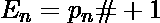
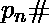

# 检查给定的数字是否是欧几里德数

> 原文:[https://www . geesforgeks . org/check-给定的数字是否是欧几里德数字/](https://www.geeksforgeeks.org/check-whether-the-given-number-is-euclid-number-or-not/)

给定一个正整数 n，任务是检查它是否是欧几里德数。如果给定的数字是欧几里德数，则打印“是”，否则打印“否”。
[**欧几里德数:**](https://en.wikipedia.org/wiki/Euclid_number) 在数学中，欧几里德数是–
形式的整数，其中是前 n 个素数的乘积。
前几个欧几里德数是-

> 3, 7, 31, 211, 2311, 30031, 510511, 9699691, ……….

**例:**

```
Input: N = 31
Output: YES
31 can be expressed in the form of 
pn# + 1 as p3# + 1
(First 3 prime numbers are 2, 3, 5 and their product is 30 )

Input: N = 43
Output: NO
43 cannot be expressed in the form of pn# + 1
```

**天真的方法:**

1.  使用厄拉多塞筛生成该范围内的所有素数。
2.  然后从第一个素数(即 2)开始乘以下一个素数，并继续检查*乘积+ 1 = n* 。
3.  如果乘积+ 1 = n，那么 n 是欧几里德数。否则不会。

以下是上述方法的实现:

## C++

```
// CPP program to check Euclid Number

#include <bits/stdc++.h>
using namespace std;

#define MAX 10000

vector<int> arr;

// Function to generate prime numbers
void SieveOfEratosthenes()
{
    // Create a boolean array "prime[0..n]" and initialize
    // all entries it as true. A value in prime[i] will
    // finally be false if i is Not a prime, else true.
    bool prime[MAX];
    memset(prime, true, sizeof(prime));

    for (int p = 2; p * p < MAX; p++) {
        // If prime[p] is not changed, then it is a prime

        if (prime[p] == true) {

            // Update all multiples of p
            for (int i = p * 2; i < MAX; i += p)
                prime[i] = false;
        }
    }

    // store all prime numbers
    // to vector 'arr'
    for (int p = 2; p < MAX; p++)
        if (prime[p])
            arr.push_back(p);
}

// Function to check the number for Euclid Number
bool isEuclid(long n)
{

    long long product = 1;
    int i = 0;

    while (product < n) {

        // Multiply next prime number
        // and check if product + 1 = n
        // holds or not
        product = product * arr[i];

        if (product + 1 == n)
            return true;

        i++;
    }

    return false;
}

// Driver code
int main()
{

    // Get the prime numbers
    SieveOfEratosthenes();

    // Get n
    long n = 31;

    // Check if n is Euclid Number
    if (isEuclid(n))
        cout << "YES\n";
    else
        cout << "NO\n";

    // Get n
    n = 42;

    // Check if n is Euclid Number
    if (isEuclid(n))
        cout << "YES\n";
    else
        cout << "NO\n";

    return 0;
}
```

## Java 语言(一种计算机语言，尤用于创建网站)

```
// Java program to check Euclid Number

import java.util.*;

class GFG {

    static final int MAX = 10000;
    static Vector<Integer> arr = new Vector<Integer>();

    // Function to get the prime numbers
    static void SieveOfEratosthenes()
    {
        // Create a boolean array "prime[0..n]" and initialize
        // all entries it as true. A value in prime[i] will
        // finally be false if i is Not a prime, else true.
        boolean[] prime = new boolean[MAX];

        for (int i = 0; i < MAX; i++)
            prime[i] = true;

        for (int p = 2; p * p < MAX; p++) {

            // If prime[p] is not changed, then it is a prime
            if (prime[p] == true) {

                // Update all multiples of p
                for (int i = p * 2; i < MAX; i += p)
                    prime[i] = false;
            }
        }

        // store all prime numbers
        // to vector 'arr'
        for (int p = 2; p < MAX; p++)
            if (prime[p])
                arr.add(p);
    }

    // Function to check the number for Euclid Number
    static boolean isEuclid(long n)
    {

        long product = 1;
        int i = 0;
        while (product < n) {

            // Multiply next prime number
            // and check if product + 1 = n
            // holds or not
            product = product * arr.get(i);

            if (product + 1 == n)
                return true;

            i++;
        }

        return false;
    }
    public static void main(String[] args)
    {

        // Get the prime numbers
        SieveOfEratosthenes();

        // Get n
        long n = 31;

        // Check if n is Euclid Number
        if (isEuclid(n))
            System.out.println("YES");
        else
            System.out.println("NO");

        // Get n
        n = 42;

        // Check if n is Euclid Number
        if (isEuclid(n))
            System.out.println("YES");
        else
            System.out.println("NO");
    }
}
```

## 蟒蛇 3

```
# Python 3 program to check
# Euclid Number
MAX = 10000

arr = []

# Function to generate prime numbers
def SieveOfEratosthenes():

    # Create a boolean array "prime[0..n]"
    # and initialize all entries it as
    # true. A value in prime[i] will
    # finally be false if i is Not a
    # prime, else true.
    prime = [True] * MAX

    p = 2
    while p * p < MAX :

        # If prime[p] is not changed,
        # then it is a prime
        if (prime[p] == True):

            # Update all multiples of p
            for i in range(p * 2, MAX, p):
                prime[i] = False

        p += 1

    # store all prime numbers
    # to vector 'arr'
    for p in range(2, MAX):
        if (prime[p]):
            arr.append(p)

# Function to check the number
# for Euclid Number
def isEuclid(n):

    product = 1
    i = 0

    while (product < n) :

        # Multiply next prime number
        # and check if product + 1 = n
        # holds or not
        product = product * arr[i]

        if (product + 1 == n):
            return True

        i += 1

    return False

# Driver code
if __name__ == "__main__":

    # Get the prime numbers
    SieveOfEratosthenes()

    # Get n
    n = 31

    # Check if n is Euclid Number
    if (isEuclid(n)):
        print("YES")
    else:
        print("NO")

    # Get n
    n = 42

    # Check if n is Euclid Number
    if (isEuclid(n)):
        print("YES")
    else:
        print("NO")

# This code is contributed
# by ChitraNayal
```

## C#

```
// C# program to check Euclid Number
using System;
using System.Collections.Generic;

class GFG
{

    static readonly int MAX = 10000;
    static List<int> arr = new List<int>();

    // Function to get the prime numbers
    static void SieveOfEratosthenes()
    {
        // Create a boolean array
        // "prime[0..n]" and initialize
        // all entries it as true.
        // A value in prime[i] will
        // finally be false if i is
        // Not a prime, else true.
        bool[] prime = new bool[MAX];

        for (int i = 0; i < MAX; i++)
            prime[i] = true;

        for (int p = 2; p * p < MAX; p++)
        {

            // If prime[p] is not changed,
            // then it is a prime
            if (prime[p] == true)
            {

                // Update all multiples of p
                for (int i = p * 2; i < MAX; i += p)
                    prime[i] = false;
            }
        }

        // store all prime numbers
        // to vector 'arr'
        for (int p = 2; p < MAX; p++)
            if (prime[p])
                arr.Add(p);
    }

    // Function to check the number for Euclid Number
    static bool isEuclid(long n)
    {

        long product = 1;
        int i = 0;
        while (product < n)
        {

            // Multiply next prime number
            // and check if product + 1 = n
            // holds or not
            product = product * arr[i];

            if (product + 1 == n)
                return true;

            i++;
        }

        return false;
    }

    // Driver code
    public static void Main(String[] args)
    {

        // Get the prime numbers
        SieveOfEratosthenes();

        // Get n
        long n = 31;

        // Check if n is Euclid Number
        if (isEuclid(n))
            Console.WriteLine("YES");
        else
            Console.WriteLine("NO");

        // Get n
        n = 42;

        // Check if n is Euclid Number
        if (isEuclid(n))
            Console.WriteLine("YES");
        else
            Console.WriteLine("NO");
    }
}

// This code has been contributed by 29AjayKumar
```

## java 描述语言

```
<script>

// Javascript program to check Euclid Number
var MAX = 10000;
var arr = [];

// Function to generate prime numbers
function SieveOfEratosthenes()
{

    // Create a boolean array "prime[0..n]" and initialize
    // all entries it as true. A value in prime[i] will
    // finally be false if i is Not a prime, else true.
    var prime = Array(MAX).fill(true);;

    for (var p = 2; p * p < MAX; p++) {
        // If prime[p] is not changed, then it is a prime

        if (prime[p] == true) {

            // Update all multiples of p
            for (var i = p * 2; i < MAX; i += p)
                prime[i] = false;
        }
    }

    // store all prime numbers
    // to vector 'arr'
    for (var p = 2; p < MAX; p++)
        if (prime[p])
            arr.push(p);
}

// Function to check the number for Euclid Number
function isEuclid( n)
{

    var product = 1;
    var i = 0;

    while (product < n) {

        // Multiply next prime number
        // and check if product + 1 = n
        // holds or not
        product = product * arr[i];

        if (product + 1 == n)
            return true;

        i++;
    }

    return false;
}

// Driver code

// Get the prime numbers
SieveOfEratosthenes();

// Get n
var n = 31;

// Check if n is Euclid Number
if (isEuclid(n))
    document.write("YES<br>");
else
    document.write("NO<br>");

// Get n
n = 42;

// Check if n is Euclid Number
if (isEuclid(n))
    document.write("YES<br>");
else
    document.write("NO<br>");

// This code is contributed by itsok.
</script>
```

**Output:** 

```
YES
NO
```

**注:**上述方法对每个查询(每 N 个)取 **O(P <sub>n</sub> #)** ，即要相乘的素数个数，检查 N 是否为欧几里德数。
**高效方法:**

1.  使用厄拉多塞筛生成该范围内的所有素数。
2.  计算一个范围内素数的前缀乘积，以避免使用哈希表重新计算乘积。
3.  如果乘积+ 1 = n，那么 n 是欧几里德数。否则不会。

以下是上述方法的实现:

## C++

```
// CPP program to check Euclid Number

#include <bits/stdc++.h>
using namespace std;

#define MAX 10000

unordered_set<long long int> s;

// Function to generate the Prime numbers
// and store their products
void SieveOfEratosthenes()
{
    // Create a boolean array "prime[0..n]" and initialize
    // all entries it as true. A value in prime[i] will
    // finally be false if i is Not a prime, else true.
    bool prime[MAX];
    memset(prime, true, sizeof(prime));

    for (int p = 2; p * p < MAX; p++) {
        // If prime[p] is not changed, then it is a prime

        if (prime[p] == true) {

            // Update all multiples of p
            for (int i = p * 2; i < MAX; i += p)
                prime[i] = false;
        }
    }

    // store prefix product of prime numbers
    // to unordered_set 's'
    long long int product = 1;

    for (int p = 2; p < MAX; p++) {

        if (prime[p]) {

            // update product by multiplying
            // next prime
            product = product * p;

            // insert 'product+1' to set
            s.insert(product + 1);
        }
    }
}

// Function to check the number for Euclid Number
bool isEuclid(long n)
{

    // Check if number exist in
    // unordered set or not
    // If exist, return true
    if (s.find(n) != s.end())
        return true;
    else
        return false;
}

// Driver code
int main()
{

    // Get the prime numbers
    SieveOfEratosthenes();

    // Get n
    long n = 31;

    // Check if n is Euclid Number
    if (isEuclid(n))
        cout << "YES\n";
    else
        cout << "NO\n";

    // Get n
    n = 42;

    // Check if n is Euclid Number
    if (isEuclid(n))
        cout << "YES\n";
    else
        cout << "NO\n";

    return 0;
}
```

## Java 语言(一种计算机语言，尤用于创建网站)

```
// Java program to check Euclid Number
import java.util.*;

class GFG
{
static int MAX = 10000;

static HashSet<Integer> s = new HashSet<Integer>();

// Function to generate the Prime numbers
// and store their products
static void SieveOfEratosthenes()
{
    // Create a boolean array "prime[0..n]" and
    // initialize all entries it as true.
    // A value in prime[i] will finally be false
    // if i is Not a prime, else true.
    boolean []prime = new boolean[MAX];
    Arrays.fill(prime, true);
    prime[0] = false;
    prime[1] = false;
    for (int p = 2; p * p < MAX; p++)
    {
        // If prime[p] is not changed,
        // then it is a prime
        if (prime[p] == true)
        {

            // Update all multiples of p
            for (int i = p * 2; i < MAX; i += p)
                prime[i] = false;
        }
    }

    // store prefix product of prime numbers
    // to unordered_set 's'
    int product = 1;

    for (int p = 2; p < MAX; p++)
    {
        if (prime[p])
        {

            // update product by multiplying
            // next prime
            product = product * p;

            // insert 'produc+1' to set
            s.add(product + 1);
        }
    }
}

// Function to check the number for Euclid Number
static boolean isEuclid(int n)
{

    // Check if number exist in
    // unordered set or not
    // If exist, return true
    if (s.contains(n))
        return true;
    else
        return false;
}

// Driver code
public static void main(String[] args)
{
    // Get the prime numbers
    SieveOfEratosthenes();

    // Get n
    int n = 31;

    // Check if n is Euclid Number
    if (isEuclid(n))
        System.out.println("Yes");
    else
        System.out.println("No");

    // Get n
    n = 42;

    // Check if n is Euclid Number
    if (isEuclid(n))
        System.out.println("Yes");
    else
        System.out.println("No");
}
}

// This code is contributed by PrinciRaj1992
```

## 蟒蛇 3

```
# Python3 program to check Euclid Number
MAX = 10000

s = set()

# Function to generate the Prime numbers
# and store their products
def SieveOfEratosthenes():

    # Create a boolean array "prime[0..n]"
    # and initialize all entries it as true.
    # A value in prime[i] will finally be
    # false if i is Not a prime, else true.
    prime = [True] * (MAX)
    prime[0], prime[1] = False, False

    for p in range(2, 100):

        # If prime[p] is not changed,
        # then it is a prime
        if prime[p] == True:

            # Update all multiples of p
            for i in range(p * 2, MAX, p):
                prime[i] = False

    # store prefix product of prime numbers
    # to unordered_set 's'
    product = 1

    for p in range(2, MAX):

        if prime[p] == True:

            # update product by multiplying
            # next prime
            product = product * p

            # insert 'produc+1' to set
            s.add(product + 1)

# Function to check the number
# for Euclid Number
def isEuclid(n):

    # Check if number exist in
    # unordered set or not
    # If exist, return true
    if n in s:
        return True
    else:
        return False

# Driver code
if __name__ == "__main__":

    # Get the prime numbers
    SieveOfEratosthenes()

    # Get n
    n = 31

    # Check if n is Euclid Number
    if isEuclid(n) == True:
        print("YES")
    else:
        print("NO")

    # Get n
    n = 42

    # Check if n is Euclid Number
    if isEuclid(n) == True:
        print("YES")
    else:
        print("NO")

# This code is contributed by Rituraj Jain
```

## C#

```
// C# implementation of the approach
using System;
using System.Collections.Generic;

class GFG
{
static int MAX = 10000;
static HashSet<int> s = new HashSet<int>();

// Function to generate the Prime numbers
// and store their products
static void SieveOfEratosthenes()
{
    // Create a boolean array "prime[0..n]" and
    // initialize all entries it as true.
    // A value in prime[i] will finally be false
    // if i is Not a prime, else true.
    Boolean []prime = new Boolean[MAX];
    for (int p = 0; p < MAX; p++)
        prime[p] = true;
    prime[0] = false;
    prime[1] = false;
    for (int p = 2; p * p < MAX; p++)
    {
        // If prime[p] is not changed,
        // then it is a prime
        if (prime[p] == true)
        {

            // Update all multiples of p
            for (int i = p * 2; i < MAX; i += p)
                prime[i] = false;
        }
    }

    // store prefix product of prime numbers
    // to unordered_set 's'
    int product = 1;

    for (int p = 2; p < MAX; p++)
    {
        if (prime[p])
        {

            // update product by multiplying
            // next prime
            product = product * p;

            // insert 'produc+1' to set
            s.Add(product + 1);
        }
    }
}

// Function to check the number
// for Euclid Number
static Boolean isEuclid(int n)
{

    // Check if number exist in
    // unordered set or not
    // If exist, return true
    if (s.Contains(n))
        return true;
    else
        return false;
}

// Driver code
public static void Main(String[] args)
{
    // Get the prime numbers
    SieveOfEratosthenes();

    // Get n
    int n = 31;

    // Check if n is Euclid Number
    if (isEuclid(n))
        Console.WriteLine("Yes");
    else
        Console.WriteLine("No");

    // Get n
    n = 42;

    // Check if n is Euclid Number
    if (isEuclid(n))
        Console.WriteLine("Yes");
    else
        Console.WriteLine("No");
}
}

// This code is contributed by Princi Singh
```

## java 描述语言

```
<script>
// Javascript program to check Euclid Number

let MAX = 10000;
let s = new Set();

// Function to generate the Prime numbers
// and store their products
function SieveOfEratosthenes()
{
    // Create a boolean array "prime[0..n]" and
    // initialize all entries it as true.
    // A value in prime[i] will finally be false
    // if i is Not a prime, else true.
    let prime = new Array(MAX);
    for(let i=0;i<prime.length;i++)
    {
        prime[i]=true;
    }

    prime[0] = false;
    prime[1] = false;
    for (let p = 2; p * p < MAX; p++)
    {
        // If prime[p] is not changed,
        // then it is a prime
        if (prime[p] == true)
        {

            // Update all multiples of p
            for (let i = p * 2; i < MAX; i += p)
                prime[i] = false;
        }
    }

    // store prefix product of prime numbers
    // to unordered_set 's'
    let product = 1;

    for (let p = 2; p < MAX; p++)
    {
        if (prime[p])
        {

            // update product by multiplying
            // next prime
            product = product * p;

            // insert 'produc+1' to set
            s.add(product + 1);
        }
    }
}

// Function to check the number for Euclid Number
function isEuclid(n)
{
    // Check if number exist in
    // unordered set or not
    // If exist, return true
    if (s.has(n))
        return true;
    else
        return false;
}

// Driver code

// Get the prime numbers
SieveOfEratosthenes();   

// Get n
let n = 31;

// Check if n is Euclid Number
if (isEuclid(n))
    document.write("Yes<br>");
else
    document.write("No<br>");

// Get n
n = 42;

// Check if n is Euclid Number
if (isEuclid(n))
    document.write("Yes<br>");
else
    document.write("No<br>");

// This code is contributed by avanitrachhadiya2155
</script>
```

**Output:** 

```
YES
NO
```

**注意:**上述方法将花费 O(1)个时间来回答查询。