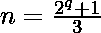

# 检查给定的数字是否是 Wagstaff 质数

> 原文:[https://www . geesforgeks . org/check-给定的数字是-wagstaff-prime-or-not/](https://www.geeksforgeeks.org/check-whether-the-given-number-is-wagstaff-prime-or-not/)

给定一个正整数 n，任务是检查它是否是 Wagstaff 素数。如果给定的数字是 Wagstaff 质数，则打印“是”，否则打印“否”。
[**Wagstaff 素数**](https://en.wikipedia.org/wiki/Wagstaff_prime)T5:在数学中，Wagstaff 素数是形式为
的素数‘n’，其中‘q’是奇素数。
首先，很少有 Wagstaff 质数是:

> 3, 11, 43, 683, 2731, 43691, 174763, 2796203……….

**示例:**

```
Input: 43
Output: Yes
43 can be expressed as - (27 + 1 )/ 3

Input: 31
Output: No
31 can not be expressed in above mentioned form.
```

**进场:**

1.  首先检查给定的数字是否是质数。要检查一个数是否是质数，[参考这个](https://www.geeksforgeeks.org/primality-test-set-1-introduction-and-school-method/)。
2.  然后检查是否可以用**(n * 3–1)**的形式表示，应该是 2 的幂。要检查一个数是否是 2 的幂，请参考此处的[。](https://www.geeksforgeeks.org/program-to-find-whether-a-no-is-power-of-two/)
3.  如果这两个条件都成立，那么这个数就是一个 Wagstaff 素数。因此，打印“是”。否则，打印“否”

下面是上述方法的实现:

## C++

```
// CPP program to check if a number is
// Wagstaff prime or not

#include <bits/stdc++.h>
using namespace std;

// Function to check if a number is prime or not
bool isPrime(int n)
{
    // Corner cases
    if (n <= 1)
        return false;
    if (n <= 3)
        return true;

    // This is checked so that we can skip
    // middle five numbers in below loop
    if (n % 2 == 0 || n % 3 == 0)
        return false;

    for (int i = 5; i * i <= n; i = i + 6) {
        if (n % i == 0 || n % (i + 2) == 0) {
            return false;
        }
    }

    return true;
}

// Utility function to check power of two
bool isPowerOfTwo(int n)
{
    return (n && !(n & (n - 1)));
}

// Driver Program
int main()
{
    int n = 43;

    // Check if number is prime
    // and of the form (2^q +1 )/ 3

    if (isPrime(n) && (isPowerOfTwo(n * 3 - 1))) {
        cout << "YES\n";
    }
    else {
        cout << "NO\n";
    }

    return 0;
}
```

## Java 语言(一种计算机语言，尤用于创建网站)

```
// JAVA program to check if a number is
// Wagstaff prime or not

class GFG {

    // Function to check if a number is prime or not
    static boolean isPrime(int n)
    {
        // Corner cases
        if (n <= 1)
            return false;
        if (n <= 3)
            return true;

        // This is checked so that we can skip
        // middle five numbers in below loop
        if (n % 2 == 0 || n % 3 == 0)
            return false;

        for (int i = 5; i * i <= n; i = i + 6) {
            if (n % i == 0 || n % (i + 2) == 0) {
                return false;
            }
        }
        return true;
    }

    // Utility function to check power of two
    static boolean isPowerOfTwo(int n)
    {
        return n != 0 && ((n & (n - 1)) == 0);
    }

    // Driver Program
    public static void main(String[] args)
    {
        int n = 43;

        // Check if number is prime
        // and of the form ( 2^q +1 )/3
        if (isPrime(n) && (isPowerOfTwo(n * 3 - 1))) {
            System.out.println("YES");
        }
        else {
            System.out.println("NO");
        }
    }
}
```

## 蟒蛇 3

```
# Python 3 program to check if a number is 
# Wagstaff prime or not

# Utility function to check
# if a number is prime or not
def isPrime(n) : 
    # Corner cases 
    if (n <= 1) : 
        return False
    if (n <= 3) : 
        return True

    # This is checked so that we can skip 
    # middle five numbers in below loop 
    if (n % 2 == 0 or n % 3 == 0) : 
        return False

    i = 5
    while(i * i <= n) : 
        if (n % i == 0 or n % (i + 2) == 0) : 
            return False
        i = i + 6

    return True

# Utility function to Check
# power of two

def isPowerOfTwo(n):

    return (n and (not(n & (n - 1))))

# Driver Code 
n = 43

# Check if number is prime 
# and of the form ( 2 ^ q + 1 ) / 3

if(isPrime(n) and isPowerOfTwo(n * 3-1)):

    print("YES")

else:

    print("NO")
```

## C#

```
// C# program to check if a number
// is Wagstaff prime or not
using System;

class GFG
{

// Function to check if a
// number is prime or not
static bool isPrime(int n)
{
    // Corner cases
    if (n <= 1)
        return false;
    if (n <= 3)
        return true;

    // This is checked so that we
    // can skip middle five numbers
    // in below loop
    if (n % 2 == 0 || n % 3 == 0)
        return false;

    for (int i = 5;
             i * i <= n; i = i + 6)
    {
        if (n % i == 0 ||
            n % (i + 2) == 0)
        {
            return false;
        }
    }
    return true;
}

// Utility function to
// check power of two
static bool isPowerOfTwo(int n)
{
    return n != 0 && ((n & (n - 1)) == 0);
}

// Driver Code
public static void Main()
{
    int n = 43;

    // Check if number is prime
    // and of the form ( 2^q +1 )/3
    if (isPrime(n) &&
       (isPowerOfTwo(n * 3 - 1)))
    {
        Console.WriteLine("YES");
    }
    else
    {
        Console.WriteLine("NO");
    }
}
}

// This code is contributed
// by inder_verma
```

## 服务器端编程语言（Professional Hypertext Preprocessor 的缩写）

```
<?php
// PHP program to check if a number
// is Wagstaff prime or not

// Function to check if a
// number is prime or not
function isPrime($n)
{
    // Corner cases
    if ($n <= 1)
        return false;
    if ($n <= 3)
        return true;

    // This is checked so that we
    // can skip middle five numbers
    // in below loop
    if ($n % 2 == 0 or $n % 3 == 0)
        return false;

    for ($i = 5;
         $i * $i <= $n; $i = $i + 6)
    {
        if ($n % $i == 0 or
            $n % ($i + 2) == 0)
        {
            return false;
        }
    }

    return true;
}

// Utility function to
// check power of two
function isPowerOfTwo($n)
{
    return ($n && !($n & ($n - 1)));
}

// Driver Code
$n = 43;

// Check if number is prime
// and of the form (2^q +1 )/ 3

if (isPrime($n) &&
   (isPowerOfTwo($n * 3 - 1)))
{
    echo "YES";
}
else
{
    echo"NO";
}

// This code is contributed
// by Shashank
?>
```

## java 描述语言

```
<script>

// JavaScript program to check if a number is
// Wagstaff prime or not

    // Function to check if a number is prime or not
    function isPrime( n)
    {
        // Corner cases
        if (n <= 1)
            return false;
        if (n <= 3)
            return true;

        // This is checked so that we can skip
        // middle five numbers in below loop
        if (n % 2 == 0 || n % 3 == 0)
            return false;

        for (var i = 5; i * i <= n; i = i + 6) {
            if (n % i == 0 || n % (i + 2) == 0) {
                return false;
            }
        }
        return true;
    }

    // Utility function to check power of two
    function isPowerOfTwo(n)
    {
        return (n != 0 )&& ((n & (n - 1)) == 0);
    }

// Driver Program

     var n = 43;

        // Check if number is prime
        // and of the form ( 2^q +1 )/3
        if (isPrime(n) && (isPowerOfTwo(n * 3 - 1))) {
            document.write("YES");
        }
        else {
            document.write("NO");
        }

</script>
```

**Output:** 

```
YES
```

***时间复杂度:** O(n <sup>1/2</sup> )*

***辅助空间:** O(1)*