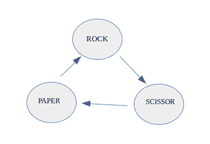
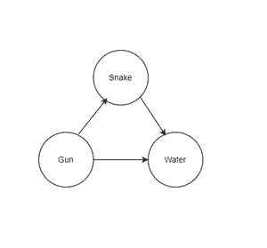

# 检查给定图形的结构是否和石头-纸-剪刀的游戏一样

> 原文:[https://www . geesforgeks . org/check-给定图形的结构是否与石头剪刀布的游戏相同/](https://www.geeksforgeeks.org/check-whether-the-structure-of-given-graph-is-same-as-the-game-of-rock-paper-scissor/)

给定一个表示[有向图](https://www.geeksforgeeks.org/graph-data-structure-and-algorithms/)的**N**T6】对串的[数组](https://www.geeksforgeeks.org/arrays-in-c-cpp/)T2【arr】，其中每对串表示该对串所表示的节点之间的边，任务是检查给定的[有向图](https://www.geeksforgeeks.org/graph-data-structure-and-algorithms/)的结构是否与[石头-纸-剪刀](https://www.geeksforgeeks.org/rock-paper-scissor-in-c/)的游戏相同。如果发现属实，则打印“**是**”。否则，打印“**否**”。

**注:**

> 在[岩石-纸张-剪刀](https://www.geeksforgeeks.org/rock-paper-scissor-in-c/)的真实游戏中，**岩石**支配**剪刀**、**剪刀**支配**纸张**、**纸张**支配**岩石**。游戏可以使用如下的[有向图](https://www.geeksforgeeks.org/graph-data-structure-and-algorithms/)建模，其中有向**边(a，b)** 显示 **a** 支配 **b** 。
> 
> 

**示例:**

> **输入:** arr[] = {“蛇”、“水”}、{“水”、“枪”}、{“枪”、“蛇”} }
> T3】输出:是
> T6】解释:
> 
> 
> 
> 因此，从上图可以看出，给定的图形结构类似于[岩石-纸张-剪刀](https://www.geeksforgeeks.org/rock-paper-scissor-in-c/)。
> 
> **输入:** arr[]={“蛇”、“水”}、{“水”、“枪”}、{“枪”、“枪”} }
> T3】输出:否

**方法:**基于观察到有向图[的岩纸剪](https://www.geeksforgeeks.org/rock-paper-scissor-in-c/)只有三个节点，每个节点的[度数和度数](https://www.geeksforgeeks.org/finding-in-and-out-degrees-of-all-vertices-in-a-graph/)为一，利用图的[度数和度数可以解决这个问题。按照以下步骤解决问题。](https://www.geeksforgeeks.org/finding-in-and-out-degrees-of-all-vertices-in-a-graph/)

*   初始化两个**{字符串**， **int}** 的**映射**和 **outDegree** ，以存储这些[映射](https://www.geeksforgeeks.org/map-associative-containers-the-c-standard-template-library-stl/)中每个节点的[ingree 和 outdegree](https://www.geeksforgeeks.org/finding-in-and-out-degrees-of-all-vertices-in-a-graph/) 。
*   初始化一个[字符串](https://www.geeksforgeeks.org/python-strings/)的[集合](https://www.geeksforgeeks.org/set-in-cpp-stl/)表示 **st** ，在这个[集合](https://www.geeksforgeeks.org/set-in-cpp-stl/)中插入所有节点，即[字符串](https://www.geeksforgeeks.org/python-strings/)。
*   检查任一[地图](https://www.geeksforgeeks.org/map-associative-containers-the-c-standard-template-library-stl/)的大小是否不等于 **3** 或者节点集合 **st** 的大小不等于 **3、**则打印“**否**”。
*   [迭代两个地图](https://www.geeksforgeeks.org/traversing-a-map-or-unordered_map-in-cpp-stl/)并检查任何条目[地图](https://www.geeksforgeeks.org/map-associative-containers-the-c-standard-template-library-stl/)的第二个值是否不是 **1** ，然后打印“**否**”和[中断](https://www.geeksforgeeks.org/break-statement-cc/)。
*   最后，如果以上情况都不满足，则打印“**是**”。

下面是上述方法的实现:

## C++

```
// C++ program for the above approach
#include <bits/stdc++.h>
using namespace std;

// Function to check if the given directed
// graph has same structure to Rock-Paper-Scissor
string similarGame(vector<vector<string> > arr)
{

    // Stores indegree of each node
    unordered_map<string, int> indegree;

    // Stores outdegree of each node
    unordered_map<string, int> outdegree;

    // Stores all nodes
    set<string> st;

    // Traverse through the edges
    for (int i = 0; i < arr.size(); i++) {

        // Check presence of self loop
        if (arr[i][0] == arr[i][1])
            return "No";

        // Insert the node arr[i][0] and arr[i][1]
        // into the set
        st.insert(arr[i][0]);
        st.insert(arr[i][1]);

        // Increment the outdegree and indegree of
        // nodes arr[i][0] and arr[i][1]

        outdegree[arr[i][0]]++;
        indegree[arr[i][1]]++;
    }

    // Check base conditions
    if (outdegree.size() != 3 || indegree.size() != 3
        || st.size() != 3)
        return "No";

    // Traverse the array outdegree
    for (auto it : outdegree) {
        if (it.second != 1)
            return "No";
    }

    // Traverse the array indegree
    for (auto it : indegree) {
        if (it.second != 1)
            return "No";
    }

    // Return
    return "Yes";
}

// Driver Code
int main()
{

    // Given Input
    vector<vector<string> > arr = { { "Snake", "Water" },
                                    { "Water", "Gun" },
                                    { "Gun", "Snake" } };

    // Function Call
    cout << similarGame(arr);

    return 0;
}
```

## 蟒蛇 3

```
# Python 3 program for the above approach

# Function to check if the given directed
# graph has same structure to Rock-Paper-Scissor
def similarGame(arr):
    # Stores indegree of each node
    indegree = {}

    # Stores outdegree of each node
    outdegree = {}

    # Stores all nodes
    st = set()

    # Traverse through the edges
    for i in range(len(arr)):
        # Check presence of self loop
        if (arr[i][0] == arr[i][1]):
            return "No"

        # Insert the node arr[i][0] and arr[i][1]
        # into the set
        st.add(arr[i][0])
        st.add(arr[i][1])

        # Increment the outdegree and indegree of
        # nodes arr[i][0] and arr[i][1]
        if arr[i][0] in outdegree:
            outdegree[arr[i][0]] += 1
        else:
            outdegree[arr[i][0]] = 0
        if arr[i][1] in indegree:
            indegree[arr[i][1]] += 1
        else:
            indegree[arr[i][1]] = 0

    # Check base conditions
    if (len(outdegree) != 3 and len(indegree) != 3 and len(st) != 3):
        return "No";

    # Traverse the array outdegree
    for key,value in outdegree.items():
        if (value == 1):
            return "No"

    # Traverse the array indegree
    for key,value in indegree.items():
        if (value == 1):
            return "No"

    # Return
    return "Yes"

# Driver Code
if __name__ == '__main__':
    # Given Input
    arr = [["Snake", "Water"],["Water", "Gun"],["Gun", "Snake"]]

    # Function Call
    print(similarGame(arr))

    # This code is contributed by SURENDRA_GANGWAR.
```

**Output**

```
Yes
```

***时间复杂度:**O(N)*
T5**辅助空间:** O(N)