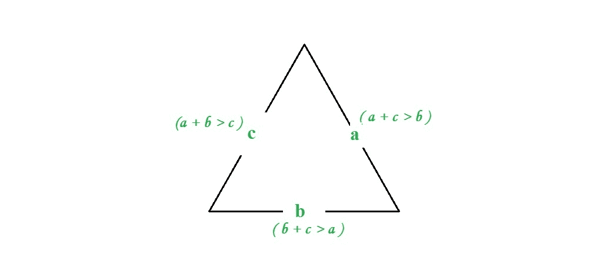

# 如果给定边，检查三角形是否有效

> 原文:[https://www . geesforgeks . org/check-what-triangle-valid-not-sides-given/](https://www.geeksforgeeks.org/check-whether-triangle-valid-not-sides-given/)

给定三条边，检查三角形是否有效。
示例:

```
Input :  a = 7, b = 10, c = 5 
Output : Valid

Input : a = 1 b = 10 c = 12 
Output : Invalid
```

**逼近:**如果三角形的两条边之和大于第三条边，则三角形有效。如果三面是 a、b、c，那么就要满足三个条件。

```
1.a + b > c 
2.a + c > b 
3.b + c > a  
```



## C++

```
// C++ program to check if three
// sides form a triangle or not
#include<bits/stdc++.h>
using namespace std;

// function to check if three sider
// form a triangle or not
bool checkValidity(int a, int b, int c)
{
    // check condition
    if (a + b <= c || a + c <= b || b + c <= a)
        return false;
    else
        return true;
}

// Driver function
int main()
{
    int a = 7, b = 10, c = 5;

    if (checkValidity(a, b, c))
        cout << "Valid";
    else
        cout << "Invalid";    
}
```

## Java 语言(一种计算机语言，尤用于创建网站)

```
// Java program to check 
// validity of any triangle

public class GFG {

    // Function to calculate for validity
    public static int checkValidity(int a,
                                int b, int c)
    {
        // check condition
        if (a + b <= c || a + c <= b || b + c <= a)
            return 0;
        else
            return 1;
    }

    // Driver function
    public static void main(String args[])
    {

        int a = 7, b = 10, c = 5;

        // function calling and print output
        if ((checkValidity(a, b, c)) == 1)
            System.out.print("Valid");
        else
            System.out.print("Invalid");

    }
}

// This article is contributed by 'Akansh Gupta'
```

## 蟒蛇 3

```
# Python3 program to check if three
# sides form a  triangle or not 

# function to check if three sides 
# form a triangle or not 
def checkValidity(a, b, c): 

    # check condition 
    if (a + b <= c) or (a + c <= b) or (b + c <= a) :
        return False
    else:
        return True        

# driver code 
a = 7
b = 10
c = 5
if checkValidity(a, b, c):
    print("Valid") 
else:
    print("Invalid")
```

## C#

```
// C# program to check 
// validity of any triangle
using System;

class GFG {

    // Function to calculate for validity
    public static int checkValidity(int a, int b, 
                                    int c)
    {

        // check condition
        if (a + b <= c || a + c <= b || 
                            b + c <= a)
            return 0;
        else
            return 1;
    }

    // Driver code
    public static void Main()
    {
        int a = 7, b = 10, c = 5;

        // function calling and print output
        if ((checkValidity(a, b, c)) == 1)
          Console.Write("Valid");
        else
          Console.Write("Invalid");

    }
}

// This code is contributed by Nitin Mittal.
```

## 服务器端编程语言（Professional Hypertext Preprocessor 的缩写）

```
<?php
// PHP program to check if three
// sides form a triangle or not

// function to check if three sider
// form a triangle or not
function checkValidity($a, $b, $c)
{

    // check condition
    if ($a + $b <= $c ||
        $a + $c <= $b || 
        $b + $c <= $a)
        return false;
    else
        return true;
}

    // Driver Code
    $a = 7; 
    $b = 10;
    $c = 5;

    if (checkValidity($a, $b, $c))
        echo "Valid";
    else
        echo "Invalid";

// This code is contributed by nitin mittal.
?>
```

## java 描述语言

```
<script>

// Javascript program to check if three 
// sides form a triangle or not 

// function to check if three sider 
// form a triangle or not 
function checkValidity(a, b, c) 
{ 
    // check condition 
    if (a + b <= c || a + c <= b || b + c <= a) 
        return false; 
    else
        return true; 
} 

// Driver function 

    let a = 7, b = 10, c = 5; 

    if (checkValidity(a, b, c)) 
        document.write("Valid"); 
    else
        document.write("Invalid");     

// This code is contributed by Mayank Tyagi

</script>
```

**输出:**

```
Valid
```