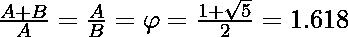
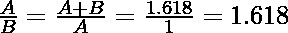
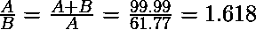
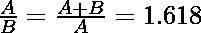

# 检查两个数是否成黄金比例

> 原文:[https://www . geesforgeks . org/check-two-numbers-in-golden-ratio/](https://www.geeksforgeeks.org/check-whether-two-numbers-are-in-golden-ratio/)

给定两个数字 **A** 和 **B** ，任务是检查 A 和 B 是否处于黄金比例。
**黄金分割比例:**两个数的比例等于两个数之和与较大数的比例，则称两个数处于黄金分割比例。这里 a > b > 0，下面是黄金分割比例的几何表示:




**示例:**

```
Input: A = 1, B = 0.618
Output: Yes
Explanation:
These two numbers together forms Golden ratio
```



```
Input: A = 61.77, B = 38.22

Output Yes

Explanation:

These two numbers together forms Golden ratio
```



**方法:**思路是找到两个[比值](https://www.geeksforgeeks.org/ratio-manipulations-in-c-set-1-arithmetic/)，检查这个比值是否等于黄金比值。那是 1.618。

```
// Here A denotes the larger number
```



下面是上述方法的实现:

## C++

```
// C++ implementation to check 
// whether two numbers are in 
// golden ratio with each other
#include <bits/stdc++.h>
using namespace std;

// Function to check that two 
// numbers are in golden ratio
bool checkGoldenRatio(float a,
                      float b)
{
  // Swapping the numbers such 
  // that A contains the maximum
  // number between these numbers
  if(a <= b)
  {
    float temp = a;
    a = b;
    b = temp;
  }

  // First Ratio
  std::stringstream ratio1;
  ratio1 << std :: fixed <<
            std :: setprecision(3) <<
            (a / b);

  // Second Ratio
  std::stringstream ratio2;
  ratio2 << std :: fixed <<
            std :: setprecision(3) <<
            (a + b) / a;

  // Condition to check that two
  // numbers are in golden ratio
  if((ratio1.str() == ratio2.str()) &&
      ratio1.str() == "1.618")
  {
    cout << "Yes" << endl;
    return true;
  }
  else
  {
    cout << "No" << endl;
    return false;
  }
}

// Driver code
int main()
{
  float a = 0.618;
  float b = 1;

  // Function Call
  checkGoldenRatio(a, b);

  return 0;
}

// This code is contributed by divyeshrabadiya07
```

## Java 语言(一种计算机语言，尤用于创建网站)

```
// Java implementation to check 
// whether two numbers are in 
// golden ratio with each other
class GFG{

// Function to check that two 
// numbers are in golden ratio
public static Boolean checkGoldenRatio(float a,
                                       float b)
{

    // Swapping the numbers such 
    // that A contains the maximum
    // number between these numbers
    if (a <= b)
    {
        float temp = a;
        a = b;
        b = temp;
    }

    // First Ratio
    String ratio1 = String.format("%.3f", a / b);

    // Second Ratio
    String ratio2 = String.format("%.3f", (a + b) / a);

    // Condition to check that two
    // numbers are in golden ratio
    if (ratio1.equals(ratio2) &&
        ratio1.equals("1.618"))
    {
        System.out.println("Yes");
        return true;
    }
    else
    {
        System.out.println("No");  
        return false;
    }
}

// Driver code
public static void main(String []args)
{
    float a = (float)0.618;
    float b = 1;

    // Function Call
    checkGoldenRatio(a, b);
}
}

// This code is contributed by rag2127
```

## 蟒蛇 3

```
# Python3 implementation to check
# whether two numbers are in
# golden ratio with each other

# Function to check that two
# numbers are in golden ratio
def checkGoldenRatio(a, b):

    # Swapping the numbers such
    # that A contains the maximum
    # number between these numbers
    a, b = max(a, b), min(a, b)

    # First Ratio
    ratio1 = round(a/b, 3)

    # Second Ratio
    ratio2 = round((a+b)/a, 3)
    # Condition to check that two
    # numbers are in golden ratio
    if ratio1 == ratio2 and\
       ratio1 == 1.618:
        print("Yes")
        return True
    else:
        print("No")
        return False

# Driver Code
if __name__ == "__main__":
    a = 0.618
    b = 1

    # Function Call
    checkGoldenRatio(a, b)
```

## C#

```
// C# implementation to check 
// whether two numbers are in 
// golden ratio with each other
using System;
using System.Collections.Generic;
class GFG {

    // Function to check that two 
    // numbers are in golden ratio
    static bool checkGoldenRatio(float a,
                          float b)
    {
      // Swapping the numbers such 
      // that A contains the maximum
      // number between these numbers
      if(a <= b)
      {
        float temp = a;
        a = b;
        b = temp;
      }

      // First Ratio
      string ratio1 = String.Format("{0:0.000}", a / b);

      // Second Ratio
      string ratio2 = String.Format("{0:0.000}", (a + b) / a);

      // Condition to check that two
      // numbers are in golden ratio
      if(ratio1 == ratio2 && ratio1 == "1.618")
      {
        Console.WriteLine("Yes");
        return true;
      }
      else
      {
        Console.WriteLine("No");
        return false;
      }
    }

  // Driver code 
  static void Main() {
      float a = (float)0.618;
      float b = 1;

      // Function Call
      checkGoldenRatio(a, b);
  }
}

// This code is contributed by divyesh072019
```

## java 描述语言

```
<script>

// Javascript implementation to check
// whether two numbers are in
// golden ratio with each other

// Function to check that two
// numbers are in golden ratio
function checkGoldenRatio(a, b)
{

    // Swapping the numbers such
    // that A contains the maximum
    // number between these numbers
    if (a <= b)
    {
        let temp = a;
        a = b;
        b = temp;
    }

    // First Ratio
    let ratio1 = (a / b).toFixed(3);

    // Second Ratio
    let ratio2 = ((a + b) / a).toFixed(3);

    // Condition to check that two
    // numbers are in golden ratio
    if ((ratio1 == ratio2) &&
        ratio1 == "1.618")
    {
        document.write("Yes");
        return true;
    }
    else
    {
        document.write("No"); 
        return false;
    }
}

// Driver Code

    let a = 0.618;
    let b = 1;

    // Function Call
    checkGoldenRatio(a, b);

</script>
```

**Output:** 

```
Yes
```

**参考文献:**T2】https://en.wikipedia.org/wiki/Golden_ratio