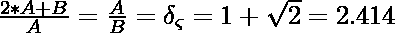
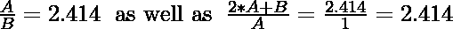

# 检查两个数字是否为白银比例

> 原文:[https://www . geesforgeks . org/check-two-numbers-in-silver-ratio/](https://www.geeksforgeeks.org/check-whether-two-numbers-are-in-silver-ratio/)

给定两个数字 **A** 和 **B** ，任务是检查 A 和 B 的白银比例。

> **银比:**如果两个数字中较小的和两倍较大的数之和与较大的数之比等于较大的数与较小的数之比，则称两个数为银比。以下是银比率的表示:
> 
> 
> 
> 对于 A > 0，B > 0

**示例:**

> **输入:** A = 2.414，B = 1
> T3】输出:是
> T6】说明:
> 
> 
> 
> **输入:** A = 1，B = 0.414
> **输出**否
> **说明:**A 与 B 的比例不形成黄金比例

**进场:**思路是找两个[比](https://www.geeksforgeeks.org/ratio-manipulations-in-c-set-1-arithmetic/)检查是否等于白银比(2.414)。

```
// Here A denotes the larger number

```

下面是上述方法的实现:

## C++

```
// C++ implementation to check
// whether two numbers are in
// silver ratio with each other
#include<bits/stdc++.h>
using namespace std;

// Function to check that two
// numbers are in silver ratio
bool checksilverRatio(float a, float b)
{

    // Swapping the numbers such
    // that A contains the maximum
    // number between these numbers
    if(a < b)
        swap(a, b);

    // First Ratio
    float ratio1 = ((a / b) * 1000.0) / 1000.0;

    // Second Ratio
    float ratio2 = (int)(((2 * a + b) /
                          a) * 1000);
    ratio2 = ratio2 / 1000;

    // Condition to check that two
    // numbers are in silver ratio
    if (ratio1 == ratio2 &&
       (int)(ratio1 - 2.414) == 0)
    {
        cout << "Yes\n";
        return true;
    }
    else
    {
        cout << "No\n";
        return false;
    }
}

// Driver Code
int main()
{
    float a = 2.414;
    float b = 1;

    // Function call
    checksilverRatio(a, b);
}

// This code is contributed by ishayadav181
```

## Java 语言(一种计算机语言，尤用于创建网站)

```
// Java implementation to check
// whether two numbers are in
// silver ratio with each other
import java.util.*;
import java.lang.*;

class GFG{

// Function to check that two
// numbers are in silver ratio
static boolean checksilverRatio(double a,
                                double b)
{

    // Swapping the numbers such
    // that A contains the maximum
    // number between these numbers
    if (a < b)
    {
        a = a + b;
        b = a - b;
        a = a - b;
    }

    // First Ratio
    double ratio1 = ((a / b) * 1000) / 1000;

    // Second Ratio
    double ratio2 = (int)(((2 * a + b) /
                           a) * 1000);
    ratio2 = ratio2 / 1000;

    // Condition to check that two
    // numbers are in silver ratio
    if (ratio1 == ratio2 &&
       (int)(ratio1 - 2.414) == 0)
    {
        System.out.println("Yes");
        return true;
    }
    else
    {
        System.out.println("No");
        return false;
    }
}

// Driver Code
public static void main(String[] args)
{
    double a = 2.414;
    double b = 1;

    // Function call
    checksilverRatio(a, b);
}
}

// This code is contributed by jana_sayantan
```

## 蟒蛇 3

```
# Python3 implementation to check
# whether two numbers are in
# silver ratio with each other

# Function to check that two
# numbers are in silver ratio
def checksilverRatio(a, b):

    # Swapping the numbers such
    # that A contains the maximum
    # number between these numbers
    a, b = max(a, b), min(a, b)

    # First Ratio
    ratio1 = round(a / b, 3)

    # Second Ratio
    ratio2 = round((2 * a + b)/a, 3)
    # Condition to check that two
    # numbers are in silver ratio
    if ratio1 == ratio2 and\
       ratio1 == 2.414:
        print("Yes")
        return True
    else:
        print("No")
        return False

# Driver Code
if __name__ == "__main__":
    a = 2.414
    b = 1

    # Function Call
    checksilverRatio(a, b)
```

## C#

```
// C# implementation to check
// whether two numbers are in
// silver ratio with each other
using System;

class GFG{

// Function to check that two
// numbers are in silver ratio
static bool checksilverRatio(double a,
                             double b)
{

    // Swapping the numbers such
    // that A contains the maximum
    // number between these numbers
    if (a < b)
    {
        a = a + b;
        b = a - b;
        a = a - b;
    }

    // First Ratio
    double ratio1 = ((a / b) * 1000) / 1000;

    // Second Ratio
    double ratio2 = (int)(((2 * a + b) /
                        a) * 1000);
    ratio2 = ratio2 / 1000;

    // Condition to check that two
    // numbers are in silver ratio
    if (ratio1 == ratio2 &&
       (int)(ratio1 - 2.414) == 0)
    {
        Console.WriteLine("Yes");
        return true;
    }
    else
    {
        Console.WriteLine("No");
        return false;
    }
}

// Driver Code
public static void Main()
{
    double a = 2.414;
    double b = 1;

    // Function call
    checksilverRatio(a, b);
}
}

// This code is contributed by sanjoy_62
```

## java 描述语言

```
<script>

// Javascript Program to check
// whether two numbers are in
// silver ratio with each other

// Function to check that two
// numbers are in silver ratio
function checksilverRatio(a, b)
{

    // Swapping the numbers such
    // that A contains the maximum
    // number between these numbers
    if (a < b)
    {
        a = a + b;
        b = a - b;
        a = a - b;
    }

    // First Ratio
    let ratio1 = ((a / b) * 1000) / 1000;

    // Second Ratio
    let ratio2 = Math.floor(((2 * a + b) /
                           a) * 1000);
    ratio2 = ratio2 / 1000;

    // Condition to check that two
    // numbers are in silver ratio
    if (ratio1 == ratio2 &&
       (ratio1 - 2.414) == 0)
    {
        document.write("Yes");
        return true;
    }
    else
    {
        document.write("No");
        return false;
    }
}

// Driver Code
  let a = 2.414;
    let b = 1;

    // Function call
    checksilverRatio(a, b);

    // This code is contributed by chinmoy1997pal.
</script>
```

**Output:** 

```
Yes
```

**参考文献:**T2https://en.wikipedia.org/wiki/Silver_ratio