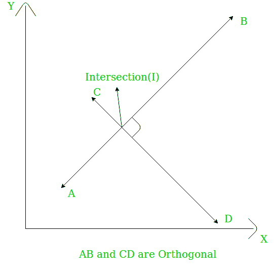

# 检查两条直线是否正交

> 原文:[https://www . geesforgeks . org/check-两条直线是否正交/](https://www.geeksforgeeks.org/check-whether-two-straight-lines-are-orthogonal-or-not/)

给定具有 A(x <sub>1</sub> 、y <sub>1</sub> )、B(x <sub>2</sub> 、y <sub>2</sub> )、C(x <sub>3</sub> 、y <sub>3</sub> )和 D(x <sub>4</sub> 、y <sub>4</sub> 的两条线段 AB 和 CD。任务是检查这两条线是否正交。如果两条线在交点处垂直，则称为正交。



**例:**

```
Input: x1 = 0, y1 = 3, x2 = 0, y2 = -5
        x3 = 2, y3 = 0, x4 = -1, y4 = 0
Output: Yes

Input:  x1 = 0, y1 = 4, x2 = 0, y2 = -9
        x3 = 2, y3 = 0, x4 = -1, y4 = 0
Output: Yes
```

**接近:**如果两条线的斜率是**m<sub>1</sub>T5】和**m<sub>2</sub>T9】，那么为了使它们正交，我们需要检查是否:**** 

*   两条线都有无限的斜率，那么答案是否定的。
*   一条线的斜率为无穷大，如果另一条线的斜率为 0，则答案为是，否则为否。
*   两条线都有有限的斜率，它们的乘积是-1，那么答案是肯定的。

以下是上述方法的实现:

## C++

```
// C++ implementation of above approach
#include <bits/stdc++.h>
using namespace std;

// Function to check if two straight
// lines are orthogonal or not
bool checkOrtho(int x1, int y1, int x2, int y2,
                int x3, int y3, int x4, int y4)
{

    int m1, m2;

    // Both lines have infinite slope
    if (x2 - x1 == 0 && x4 - x3 == 0)
        return false;

    // Only line 1 has infinite slope
    else if (x2 - x1 == 0) {

        m2 = (y4 - y3) / (x4 - x3);

        if (m2 == 0)
            return true;
        else
            return false;
    }

    // Only line 2 has infinite slope
    else if (x4 - x3 == 0) {

        m1 = (y2 - y1) / (x2 - x1);

        if (m1 == 0)
            return true;
        else
            return false;
    }

    else {
        // Find slopes of the lines
        m1 = (y2 - y1) / (x2 - x1);
        m2 = (y4 - y3) / (x4 - x3);

        // Check if their product is -1
        if (m1 * m2 == -1)
            return true;
        else
            return false;
    }
}

// Driver code
int main()
{
    int x1 = 0, y1 = 4, x2 = 0, y2 = -9;
    int x3 = 2, y3 = 0, x4 = -1, y4 = 0;

    checkOrtho(x1, y1, x2, y2, x3, y3, x4, y4) ? cout << "Yes"
                                               : cout << "No";

    return 0;
}
```

## Java 语言(一种计算机语言，尤用于创建网站)

```
//Java implementation of above approach

import java.io.*;

class GFG {

    // Function to check if two straight
    // lines are orthogonal or not
    static boolean checkOrtho(int x1, int y1, int x2, int y2,
                    int x3, int y3, int x4, int y4)
    {

        int m1, m2;

        // Both lines have infinite slope
        if (x2 - x1 == 0 && x4 - x3 == 0)
            return false;

        // Only line 1 has infinite slope
        else if (x2 - x1 == 0)
        {
            m2 = (y4 - y3) / (x4 - x3);
            if (m2 == 0)
                return true;
            else
                return false;
        }

        // Only line 2 has infinite slope
        else if (x4 - x3 == 0)
        {
             m1 = (y2 - y1) / (x2 - x1);
            if (m1 == 0)
                return true;
            else
                return false;
        }

        else
        {
            // Find slopes of the lines
            m1 = (y2 - y1) / (x2 - x1);
            m2 = (y4 - y3) / (x4 - x3);

            // Check if their product is -1
            if (m1 * m2 == -1)
                return true;
            else
                return false;
        }
    }

    // Driver code
    public static void main (String[] args)
    {
        int x1 = 0, y1 = 4, x2 = 0, y2 = -9;
        int x3 = 2, y3 = 0, x4 = -1, y4 = 0;

        if(checkOrtho(x1, y1, x2, y2, x3, y3, x4, y4)==true)
            System.out.println ("Yes");
        else
            System.out.println("No" );
    }
}

//This code is contributed by akt_mit..
```

## 蟒蛇 3

```
# Python 3 implementation of above approach

# Function to check if two straight
# lines are orthogonal or not
def checkOrtho(x1, y1, x2, y2, x3, y3, x4, y4):

    # Both lines have infinite slope
    if (x2 - x1 == 0 and x4 - x3 == 0):
        return False

    # Only line 1 has infinite slope
    elif (x2 - x1 == 0):
        m2 = (y4 - y3) / (x4 - x3)

        if (m2 == 0):
            return True
        else:
            return False

    # Only line 2 has infinite slope
    elif (x4 - x3 == 0):
        m1 = (y2 - y1) / (x2 - x1);

        if (m1 == 0):
            return True
        else:
            return False

    else:

        # Find slopes of the lines
        m1 = (y2 - y1) / (x2 - x1)
        m2 = (y4 - y3) / (x4 - x3)

        # Check if their product is -1
        if (m1 * m2 == -1):
            return True
        else:
            return False

# Driver code
if __name__ == '__main__':
    x1 = 0
    y1 = 4
    x2 = 0
    y2 = -9
    x3 = 2
    y3 = 0
    x4 = -1
    y4 = 0

    if(checkOrtho(x1, y1, x2, y2,
                  x3, y3, x4, y4)):
        print("Yes")
    else:
        print("No")

# This code is contributed by
# Shashank_Sharma
```

## C#

```
// C# implementation of above approach
using System;

class GFG
{

    // Function to check if two straight
    // lines are orthogonal or not
    static bool checkOrtho(int x1, int y1, int x2, int y2,
                    int x3, int y3, int x4, int y4)
    {

        int m1, m2;

        // Both lines have infinite slope
        if (x2 - x1 == 0 && x4 - x3 == 0)
            return false;

        // Only line 1 has infinite slope
        else if (x2 - x1 == 0)
        {
            m2 = (y4 - y3) / (x4 - x3);
            if (m2 == 0)
                return true;
            else
                return false;
        }

        // Only line 2 has infinite slope
        else if (x4 - x3 == 0)
        {
            m1 = (y2 - y1) / (x2 - x1);
            if (m1 == 0)
                return true;
            else
                return false;
        }

        else
        {
            // Find slopes of the lines
            m1 = (y2 - y1) / (x2 - x1);
            m2 = (y4 - y3) / (x4 - x3);

            // Check if their product is -1
            if (m1 * m2 == -1)
                return true;
            else
                return false;
        }
    }

    // Driver code
    public static void Main ()
    {
        int x1 = 0, y1 = 4, x2 = 0, y2 = -9;
        int x3 = 2, y3 = 0, x4 = -1, y4 = 0;

        if(checkOrtho(x1, y1, x2, y2, x3, y3, x4, y4) == true)
            Console.WriteLine("Yes");
        else
            Console.WriteLine("No" );
    }
}

// This code is contributed by Ryuga
```

## 服务器端编程语言（Professional Hypertext Preprocessor 的缩写）

```
<?php
// PHP implementation of above approach

// Function to check if two straight
// lines are orthogonal or not
function checkOrtho($x1, $y1, $x2, $y2,
                    $x3, $y3, $x4, $y4)
{

    // Both lines have infinite slope
    if ($x2 - $x1 == 0 && $x4 - $x3 == 0)
        return false;

    // Only line 1 has infinite slope
    else if ($x2 - $x1 == 0)
    {
        $m2 = (int)(($y4 - $y3) / ($x4 - $x3));

        if ($m2 == 0)
            return true;
        else
            return false;
    }

    // Only line 2 has infinite slope
    else if ($x4 - $x3 == 0)
    {
        $m1 = (int)(($y2 - $y1) / ($x2 - $x1));

        if ($m1 == 0)
            return true;
        else
            return false;
    }

    else
    {

        // Find slopes of the lines
        $m1 = (int)(($y2 - $y1) / ($x2 - $x1));
        $m2 = (int)(($y4 - $y3) / ($x4 - $x3));

        // Check if their product is -1
        if ($m1 * $m2 == -1)
            return true;
        else
            return false;
    }
}

// Driver code
$x1 = 0; $y1 = 4;
$x2 = 0; $y2 = -9;
$x3 = 2; $y3 = 0;
$x4 = -1; $y4 = 0;

if(checkOrtho($x1, $y1, $x2, $y2,
              $x3, $y3, $x4, $y4))
    print("Yes");
else
    print("No");

// This code is contributed by chandan_jnu
?>
```

## java 描述语言

```
<script>
    // Javascript implementation of above approach

    // Function to check if two straight
    // lines are orthogonal or not
    function checkOrtho(x1, y1, x2, y2, x3, y3, x4, y4)
    {

        let m1, m2;

        // Both lines have infinite slope
        if (x2 - x1 == 0 && x4 - x3 == 0)
            return false;

        // Only line 1 has infinite slope
        else if (x2 - x1 == 0)
        {
            m2 = parseInt((y4 - y3) / (x4 - x3), 10);
            if (m2 == 0)
                return true;
            else
                return false;
        }

        // Only line 2 has infinite slope
        else if (x4 - x3 == 0)
        {
            m1 = parseInt((y2 - y1) / (x2 - x1), 10);
            if (m1 == 0)
                return true;
            else
                return false;
        }

        else
        {
            // Find slopes of the lines
            m1 = parseInt((y2 - y1) / (x2 - x1), 10);
            m2 = parseInt((y4 - y3) / (x4 - x3), 10);

            // Check if their product is -1
            if (m1 * m2 == -1)
                return true;
            else
                return false;
        }
    }

    let x1 = 0, y1 = 4, x2 = 0, y2 = -9;
    let x3 = 2, y3 = 0, x4 = -1, y4 = 0;

    if(checkOrtho(x1, y1, x2, y2, x3, y3, x4, y4) == true)
      document.write("Yes");
    else
      document.write("No" );

</script>
```

**Output:** 

```
Yes
```