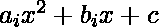

# 检查两条直线是否平行

> 原文:[https://www . geesforgeks . org/check-两条直线是否平行/](https://www.geeksforgeeks.org/check-whether-two-straight-lines-are-parallel-or-not/)

给定两条线 **(a1，b1，c1)** 和 **(a2，b2，c2)** 的方程，使得 **(ai，bi，ci)** 分别是**X<sup>2</sup>T9】、 **X** 的系数和直线的常数项，在一般方程中，任务是检查两条直线是否平行。如果发现平行，则打印**“是”**。否则，打印**“否”**。**

**示例:**

> **输入:** a1 = -2，b1 = 4，a2 = -6，b2 = 12
> **输出:**是
> **说明:**
> 两条线斜率相等即 a1/b1 = a2/ b2 = -2。
> 
> **输入:** a1 = 11，b1 = 3，a2 = 7，b2 = -10
> **输出:**否
> **说明:**
> 两条线斜率不相等，即 a1/b1≠ a2/b2。

**方法:**检查两条直线是否平行，思路是比较给定直线的[斜率。如果给定直线的斜率相等，那么给定直线是平行的。因此，打印**“是”**否则打印**“否”**。](https://www.geeksforgeeks.org/program-find-slope-line/)

下面是上述方法的实现:

## C++

```
// C++ program for the above approach
#include <bits/stdc++.h>
using namespace std;

// Function to check if two lines
// are parallel or not
void parallel(float a1, float b1,
              float c1, float a2,
              float b2, float c2)
{
    // If slopes are equal
    if ((-(a1 / b1)) == (-(a2 / b2))) {
        cout << "Yes";
    }
    else {
        cout << "No";
    }
}

// Driver Code
int main()
{
    float a1 = -2, b1 = 4, c1 = 5;
    float a2 = -6, b2 = 12, c2 = 6;

    // Function Call
    parallel(a1, b1, c1, a2, b2, c2);

    return 0;
}
```

## Java 语言(一种计算机语言，尤用于创建网站)

```
// Java program to implement
// the above approach
import java.util.*;
class GFG
{

// Function to check if two lines
// are parallel or not
static void parallel(float a1, float b1,
              float c1, float a2,
              float b2, float c2)
{

    // If slopes are equal
    if ((-(a1 / b1)) == (-(a2 / b2)))
    {
        System.out.println("Yes");
    }
    else
    {
         System.out.println("No");
    }
}

// Driver Code
public static void main(String args[])
{
    float a1 = -2, b1 = 4, c1 = 5;
    float a2 = -6, b2 = 12, c2 = 6;

    // Function Call
    parallel(a1, b1, c1, a2, b2, c2);
}
}

// This code is contributed by splevel62.
```

## 蟒蛇 3

```
# Python program to implement
# the above approach

# Function to check if two lines
# are parallel or not
def parallel(a1, b1, c1, a2, b2, c2):

    # If slopes are equal
    if ((-(a1 / b1)) == (-(a2 / b2))):
        print("Yes");
    else:
        print("No");

# Driver Code
if __name__ == '__main__':
    a1 = -2; b1 = 4; c1 = 5;
    a2 = -6; b2 = 12; c2 = 6;

    # Function Call
    parallel(a1, b1, c1, a2, b2, c2);

# This code is contributed by 29AjayKumar
```

## C#

```
// C# program to implement
// the above approach
using System;
class GFG
{

// Function to check if two lines
// are parallel or not
static void parallel(float a1, float b1,
              float c1, float a2,
              float b2, float c2)
{

    // If slopes are equal
    if ((-(a1 / b1)) == (-(a2 / b2)))
    {
        Console.Write("Yes");
    }
    else
    {
         Console.Write("No");
    }
}

// Driver Code
public static void Main()
{
    float a1 = -2, b1 = 4, c1 = 5;
    float a2 = -6, b2 = 12, c2 = 6;

    // Function Call
    parallel(a1, b1, c1, a2, b2, c2);
}
}

// This code is contributed by susmitakundugoaldanga.
```

## java 描述语言

```
<script>
// javascript program of the above approach

// Function to check if two lines
// are parallel or not
function parallel(a1, b1,
              c1, a2,
              b2, c2)
{

    // If slopes are equal
    if ((-(a1 / b1)) == (-(a2 / b2)))
    {
        document.write("Yes");
    }
    else
    {
         document.write("No");
    }
}

    // Driver Code

    let a1 = -2, b1 = 4, c1 = 5;
    let a2 = -6, b2 = 12, c2 = 6;

    // Function Call
    parallel(a1, b1, c1, a2, b2, c2);

</script>
```

**Output:** 

```
Yes
```

***时间复杂度:**O(1)*
T5**辅助空间:** O(1)