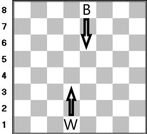

# 棋盘棋子-棋子游戏

> 原文:[https://www.geeksforgeeks.org/chessboard-pawn-pawn-game/](https://www.geeksforgeeks.org/chessboard-pawn-pawn-game/)

有一个 **8*8** 棋盘，两个棋手各有一枚棋子。一个玩家必须在每一轮移动他的棋子，要么向前一步，要么只有当这个动作杀死另一个棋子时才对角移动一步。不能移动的玩家输了。
给定黑白棋子的行列号。任务是预测假设两个游戏都是最佳的，谁会赢。**注意****白**先出，棋子不能移出棋盘。



**例:**

> **输入:** rowW = 2，colW = 2，rowB = 3，colB = 3
> **输出:**白色
> **输入:** rowW = 2，colW = 2，rowB = 3，colB = 3
> **输出:**白色

**进场:**

*   如果轮到白色棋子，我们必须检查白色棋子是否在第 8 排，然后黑色获胜，因为白色棋子没有进一步的移动。如果轮到黑色棋子，那么我们必须检查它是否在第一排，然后白色获胜，因为黑色棋子没有进一步的移动。
*   如果轮到它的白卒和黑卒对角相邻，那么白卒会杀死黑卒，白卒获胜，否则白卒会向前移动一步(如果还没有被黑卒占据)，否则白卒会输。
*   如果轮到黑卒，白卒对角相邻，那么黑卒会杀死白卒，黑卒获胜，否则黑卒会向前移动一步(如果还没有被白卒占据)，否则黑卒会输。

以下是上述方法的实现:

## C++

```
// C++ implementation of the approach
#include <bits/stdc++.h>
using namespace std;

// Function that returns true if white wins
bool whiteWins(int rowW, int colW, int rowB, int colB)
{
    int white = 0, black = 0;

    while (1) {

        // If white can move
        if (rowW != 8) {

            // If white pawn can kill black pawn
            // White wins
            if (rowB == rowW + 1
                && (colB == colW - 1 || colB == colW + 1))
                return true;

            // Make the move forward
            else
                rowW++;
        }

        // White has no moves
        // White loses
        else
            return false;

        // If black can move
        if (rowB != 1) {

            // If black pawn can kill white pawn
            // White loses
            if (rowB == rowW + 1
                && (colB == colW - 1 || colB == colW + 1))
                return false;

            // Make the move forward
            else
                rowB--;
        }

        // Black has no moves
        // White wins
        else
            return true;
    }

    // If white has got more moves
    if (white > black)
        return true;

    return false;
}

// Driver code
int main()
{
    int rowW = 2, colW = 2, rowB = 3, colB = 3;
    if (whiteWins(rowW, colW, rowB, colB))
        cout << "White";
    else
        cout << "Black";
    return 0;
}
```

## Java 语言(一种计算机语言，尤用于创建网站)

```
// Java implementation of the approach
class GFG
{

// Function that returns true if white wins
static boolean whiteWins(int rowW, int colW,
                        int rowB, int colB)
{
    int white = 0, black = 0;
    boolean flag=true;

    while (flag)
    {

        // If white can move
        if (rowW != 8)
        {

            // If white pawn can kill black pawn
            // White wins
            if (rowB == rowW + 1
                && (colB == colW - 1 || colB == colW + 1))
                return true;

            // Make the move forward
            else
                rowW++;
        }

        // White has no moves
        // White loses
        else
            return false;

        // If black can move
        if (rowB != 1)
        {

            // If black pawn can kill white pawn
            // White loses
            if (rowB == rowW + 1
                && (colB == colW - 1 || colB == colW + 1))
                return false;

            // Make the move forward
            else
                rowB--;
        }

        // Black has no moves
        // White wins
        else
            return true;
    }

    // If white has got more moves
    if (white > black)
        return true;

    return false;
}

// Driver code
public static void main(String args[])
{
    int rowW = 2, colW = 2, rowB = 3, colB = 3;
    if (whiteWins(rowW, colW, rowB, colB))
        System.out.println("White");
    else
        System.out.println("Black");
}
}

// This code is contributed by Arnab Kundu
```

## 蟒蛇 3

```
# Print implementation of the approach

# Function that returns true if white wins
def whiteWins(rowW, colW, rowB, colB):
    white = 0;
    black = 0;

    while (1):

        # If white can move
        if (rowW != 8):

            # If white pawn can kill black pawn
            # White wins
            if (rowB == rowW + 1 and
               (colB == colW - 1 or
                colB == colW + 1)):
                return True;

            # Make the move forward
            else:
                rowW += 1;

        # White has no moves
        # White loses
        else:
            return False;

        # If black can move
        if (rowB != 1):

            # If black pawn can kill white pawn
            # White loses
            if (rowB == rowW + 1 and
               (colB == colW - 1 or
                colB == colW + 1)):
                return False;

            # Make the move forward
            else:
                rowB -= 1;

        # Black has no moves
        # White wins
        else:
            return Frue;

    # If white has got more moves
    if (white > black):
        return True;

    return False;

# Driver code
if __name__ == '__main__':
    rowW, colW = 2, 2;
    rowB, colB = 3, 3;
    if (whiteWins(rowW, colW, rowB, colB)):
        print("White");
    else:
        print("Black");

# This code is contributed by Rajput-Ji
```

## C#

```
// C# implementation of the approach
using System;
public class GFG
{

// Function that returns true if white wins
static bool whiteWins(int rowW, int colW,
                        int rowB, int colB)
{
    int white = 0, black = 0;
    bool flag=true;

    while (flag)
    {

        // If white can move
        if (rowW != 8)
        {

            // If white pawn can kill black pawn
            // White wins
            if (rowB == rowW + 1
                && (colB == colW - 1 || colB == colW + 1))
                return true;

            // Make the move forward
            else
                rowW++;
        }

        // White has no moves
        // White loses
        else
            return false;

        // If black can move
        if (rowB != 1)
        {

            // If black pawn can kill white pawn
            // White loses
            if (rowB == rowW + 1
                && (colB == colW - 1 || colB == colW + 1))
                return false;

            // Make the move forward
            else
                rowB--;
        }

        // Black has no moves
        // White wins
        else
            return true;
    }

    // If white has got more moves
    if (white > black)
        return true;

    return false;
}

// Driver code
public static void Main(String []args)
{
    int rowW = 2, colW = 2, rowB = 3, colB = 3;
    if (whiteWins(rowW, colW, rowB, colB))
        Console.WriteLine("White");
    else
        Console.WriteLine("Black");
}
}
/* This code contributed by PrinciRaj1992 */
```

## java 描述语言

```
<script>

// JavaScript implementation of the approach

// Function that returns true if white wins
    function whiteWins(rowW , colW , rowB , colB) {
        var white = 0, black = 0;
        var flag = true;

        while (flag) {

            // If white can move
            if (rowW != 8) {

                // If white pawn can kill black pawn
                // White wins
                if (rowB == rowW + 1 &&
                (colB == colW - 1 || colB == colW + 1))
                    return true;

                // Make the move forward
                else
                    rowW++;
            }

            // White has no moves
            // White loses
            else
                return false;

            // If black can move
            if (rowB != 1) {

                // If black pawn can kill white pawn
                // White loses
                if (rowB == rowW + 1 &&
                (colB == colW - 1 || colB == colW + 1))
                    return false;

                // Make the move forward
                else
                    rowB--;
            }

            // Black has no moves
            // White wins
            else
                return true;
        }

        // If white has got more moves
        if (white > black)
            return true;

        return false;
    }

    // Driver code

        var rowW = 2, colW = 2, rowB = 3, colB = 3;
        if (whiteWins(rowW, colW, rowB, colB))
            document.write("White");
        else
            document.write("Black");

// This code contributed by aashish1995

</script>
```

**Output:** 

```
White
```