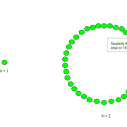
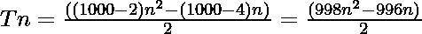

# 奇利亚坎数

> 原文:[https://www.geeksforgeeks.org/chiliagon-number/](https://www.geeksforgeeks.org/chiliagon-number/)

给定一个编号 **N** ，任务是找到**N<sup>th</sup>T5[奇利亚贡编号](https://en.wikipedia.org/wiki/Chiliagon)。** 

> 一个[千位数字](https://en.wikipedia.org/wiki/Chiliagon)是一类数字。它有一个 1000 边的多边形，叫做 chiliagon。第 N 个千位点数是 1000 个点，所有其他点都被一个共同的角包围并形成一个图案。前几个千年数字是 **1，1000，2997，5992……**

**例:**

> **输入:** N = 2
> **输出:** 1000
> **说明:**
> 第二个千位数字是 1000。
> **输入:** N = 3
> **输出:** 2997



**方法:**第 N 个奇利亚贡数由公式给出:

*   s 边多边形的第 n 项= 
*   因此 1000 边多边形的第 n 项为

> 

以下是上述方法的实现:

## C++

```
// C++ program for above approach
#include <bits/stdc++.h>
using namespace std;

// Finding the nth chiliagon Number
int chiliagonNum(int n)
{
    return (998 * n * n - 996 * n) / 2;
}

// Driver Code
int main()
{
    int n = 3;
    cout <<"3rd chiliagon Number is = "
         << chiliagonNum(n);

    return 0;
}

// This code is contributed by shivanisinghss2110
```

## C

```
// C program for above approach
#include <stdio.h>
#include <stdlib.h>

// Finding the nth chiliagon Number
int chiliagonNum(int n)
{
    return (998 * n * n - 996 * n) / 2;
}

// Driver program to test above function
int main()
{
    int n = 3;
    printf("3rd chiliagon Number is = %d",
           chiliagonNum(n));

    return 0;
}
```

## Java 语言(一种计算机语言，尤用于创建网站)

```
// Java program for the above approach
class GFG{

// Finding the nth chiliagon number
static int chiliagonNum(int n)
{
    return (998 * n * n - 996 * n) / 2;
}

// Driver code
public static void main(String[] args)
{
    int n = 3;
    System.out.println("3rd chiliagon Number is = " +
                                    chiliagonNum(n));
}
}

// This code is contributed by rutvik_56
```

## 蟒蛇 3

```
# Python3 program for above approach

# Finding the nth chiliagon Number
def chiliagonNum(n):

    return (998 * n * n - 996 * n) // 2;

# Driver Code
n = 3;
print("3rd chiliagon Number is = ",
                  chiliagonNum(n));

# This code is contributed by Akanksha_Rai
```

## C#

```
// C# program for the above approach
using System;
class GFG{

// Finding the nth chiliagon number
static int chiliagonNum(int n)
{
    return (998 * n * n - 996 * n) / 2;
}

// Driver code
public static void Main()
{
    int n = 3;
    Console.Write("3rd chiliagon Number is = " +
                               chiliagonNum(n));
}
}

// This code is contributed by Akanksha_Rai
```

## java 描述语言

```
<script>

// javascript program for above approach

// Finding the nth chiliagon Number
function chiliagonNum( n)
{
    return (998 * n * n - 996 * n) / 2;
}

// Driver code
let n = 3;
document.write("3rd chiliagon Number is "
+ chiliagonNum(n));

// This code contributed by gauravrajput1

</script>
```

**Output:** 

```
3rd chiliagon Number is = 2997
```

**时间复杂度:** O(1)

**辅助空间:** O(1)

**参考资料:**[https://en . Wikipedia . org/wiki/chilla ion](https://en.wikipedia.org/wiki/Chiliagon)