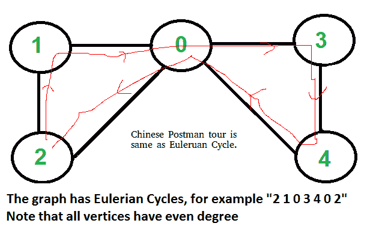

# 中国邮递员或路线检查|第一套(介绍)

> 原文:[https://www . geesforgeks . org/Chinese-postman-route-inspection-set-1-introduction/](https://www.geeksforgeeks.org/chinese-postman-route-inspection-set-1-introduction/)

[中国邮差问题](https://en.wikipedia.org/wiki/Route_inspection_problem)是无向图的[欧拉回路](https://www.geeksforgeeks.org/eulerian-path-and-circuit/)问题的变种。欧拉回路是一个封闭的行走，一旦开始和结束位置相同，它就覆盖每条边。中国邮差问题定义为连通图和无向图。问题是找到访问图的每条边至少一次的最短路径或迂回路径。

**如果输入图包含欧拉回路，那么问题的一个解就是欧拉回路**
如果“<u>所有顶点都有偶度</u>，则无向图和连通图都有欧拉循环。



不管图是加权的还是不加权的，中国邮差路线如果存在的话，总是和欧拉回路一样。在加权图中，邮差旅行的最小可能权重是我们通过欧拉回路得到的所有边权重之和。我们不能走一条更短的路线，因为我们必须访问所有的边-至少一次。

**如果输入图形不包含欧拉回路**
在这种情况下，任务简化为如下。
1)在未加权图中，复制的最小边数，以便给定的图转换成具有欧拉循环的图。


2)在加权图中，要复制的边的最小总权重，以便给定的图转换成具有欧拉循环的图。


```
Algorithm to find shortest closed path or optimal 
Chinese postman route in a weighted graph that may
not be Eulerian.
step 1 : If graph is Eulerian, return sum of all 
         edge weights.Else do following steps.
step 2 : We find all the vertices with odd degree 
step 3 : List all possible pairings of odd vertices  
         For n odd vertices total number of pairings 
         possible are, (n-1) * (n-3) * (n -5)... * 1
step 4 : For each set of pairings, find the shortest 
         path connecting them.
step 5 : Find the pairing with minimum shortest path 
         connecting pairs.
step 6 : Modify the graph by adding all the edges that  
         have been found in step 5.
step 7 : Weight of Chinese Postman Tour is sum of all 
         edges in the modified graph.
step 8 : Print Euler Circuit of the modified graph. 
         This Euler Circuit is Chinese Postman Tour.   
```

插图:

```
               3
        (a)-----------------(b)
     1 /  |                  |  \1
      /   |                  |   \
     (c)  | 5               6|   (d)
      \   |                  |   /
     2 \  |         4        |  /1
        (e)------------------(f)
As we see above graph does not contain Eulerian circuit
because is has odd degree vertices [a, b, e, f]
they all are odd degree vertices . 

First we make all possible pairs of odd degree vertices
[ae, bf], [ab, ef], [af, eb] 
so pairs with min sum of weight are [ae, bf] :
ae = (ac + ce = 3 ),  bf = ( bd + df = 2 ) 
Total : 5

We add edges ac, ce, bd and df to the original graph and
create a modified graph.
```


```
Optimal chinese postman route is of length : 5 + 23 = 
28 [ 23 = sum  of all edges of modified graph ]

Chinese Postman Route :  
a - b - d - f - d - b - f - e - c - a - c - e - a 
This route is Euler Circuit of the modified graph. 
```

**参考文献:**
[【https://en.wikipedia.org/wiki/Route_inspection_problem】](https://en.wikipedia.org/wiki/Route_inspection_problem)
[http://www . suffolkmaths . co . uk/pages/数学系% 20 project/project/Topology % 20 和% 20 graph % 20 theory/Chinese % 20 postman % 20 problem . pdf](http://www.suffolkmaths.co.uk/pages/Maths%20Projects/Projects/Topology%20and%20Graph%20Theory/Chinese%20Postman%20Problem.pdf)

本文由 [**尼尚辛格**](https://practice.geeksforgeeks.org/user-profile.php?user=_code) 供稿。如果你喜欢 GeeksforGeeks 并想投稿，你也可以使用[write.geeksforgeeks.org](https://write.geeksforgeeks.org)写一篇文章或者把你的文章邮寄到 review-team@geeksforgeeks.org。看到你的文章出现在极客博客主页上，帮助其他极客。

如果你发现任何不正确的地方，或者你想分享更多关于上面讨论的话题的信息，请写评论。