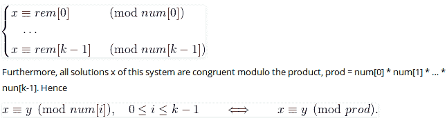

# 中国剩余定理|集合 1(简介)

> 原文:[https://www . geesforgeks . org/Chinese-余数-定理-集合-1-引言/](https://www.geeksforgeeks.org/chinese-remainder-theorem-set-1-introduction/)

给我们两个数组 num[0..k-1]和 rem[0..k-1]。在 num[0..k-1]，每对都是互质的(每对的 gcd 为 1)。我们需要找到最小正数 x，这样:

```
     x % num[0]    =  rem[0], 
     x % num[1]    =  rem[1], 
     .......................
     x % num[k-1]  =  rem[k-1] 
```

基本上，我们给出了成对互素的 k 个数，并给出了当一个未知数 x 被它们除时这些数的余数。我们需要找到产生给定余数的 x 的最小可能值。
**例:**

```
Input:  num[] = {5, 7}, rem[] = {1, 3}
Output: 31
Explanation: 
31 is the smallest number such that:
  (1) When we divide it by 5, we get remainder 1\. 
  (2) When we divide it by 7, we get remainder 3.

Input:  num[] = {3, 4, 5}, rem[] = {2, 3, 1}
Output: 11
Explanation: 
11 is the smallest number such that:
  (1) When we divide it by 3, we get remainder 2\. 
  (2) When we divide it by 4, we get remainder 3.
  (3) When we divide it by 5, we get remainder 1.
```

***中国剩余定理指出，总是存在一个满足给定同余的 x。*** 以下是定理陈述改编自[维基百科](https://en.wikipedia.org/wiki/Chinese_remainder_theorem)。
设 num[0]，num[1]，…num[k-1]为成对互素正整数。然后，对于任意给定的整数 rem[0]，rem[1]，… rem[k-1]序列，存在一个整数 x 来求解下面的同余系统。



第一部分明确存在一个 x，第二部分基本说明所有的解(包括最小的一个)在除以 n[0]，num[1]的副产品时产生相同的余数，..num[k-1]。在上面的例子中，乘积是 3*4*5 = 60。11 是一个解决方案，其他解决方案是 71，131，..等等。当除以 60 时，所有这些解产生相同的余数，即它们的形式为 11 + m*60，其中 m >= 0。
寻找 x 的一种**简单方法是从 1 开始，一个接一个地递增它，并检查用 num[]中的给定元素划分它是否会产生相应的 rem[]余数。一旦我们找到这样一个 x，我们就归还它。
下面是天真方法的实现。** 

## C++

```
// A C++ program to demonstrate working of Chinise remainder
// Theorem
#include<bits/stdc++.h>
using namespace std;

// k is size of num[] and rem[].  Returns the smallest
// number x such that:
//  x % num[0] = rem[0],
//  x % num[1] = rem[1],
//  ..................
//  x % num[k-2] = rem[k-1]
// Assumption: Numbers in num[] are pairwise coprime
// (gcd for every pair is 1)
int findMinX(int num[], int rem[], int k)
{
    int x = 1; // Initialize result

    // As per the Chinese remainder theorem,
    // this loop will always break.
    while (true)
    {
        // Check if remainder of x % num[j] is
        // rem[j] or not (for all j from 0 to k-1)
        int j;
        for (j=0; j<k; j++ )
            if (x%num[j] != rem[j])
               break;

        // If all remainders matched, we found x
        if (j == k)
            return x;

        // Else try next number
        x++;
    }

    return x;
}

// Driver method
int main(void)
{
    int num[] = {3, 4, 5};
    int rem[] = {2, 3, 1};
    int k = sizeof(num)/sizeof(num[0]);
    cout << "x is " << findMinX(num, rem, k);
    return 0;
}
```

## Java 语言(一种计算机语言，尤用于创建网站)

```
// A Java program to demonstrate the working of Chinese remainder
// Theorem
import java.io.*;

class GFG {

    // k is size of num[] and rem[].  Returns the smallest
    // number x such that:
    //  x % num[0] = rem[0],
    //  x % num[1] = rem[1],
    //  ..................
    //  x % num[k-2] = rem[k-1]
    // Assumption: Numbers in num[] are pairwise coprime
    // (gcd for every pair is 1)
    static int findMinX(int num[], int rem[], int k)
    {
        int x = 1; // Initialize result

        // As per the Chinese remainder theorem,
        // this loop will always break.
        while (true)
        {
            // Check if remainder of x % num[j] is
            // rem[j] or not (for all j from 0 to k-1)
            int j;
            for (j=0; j<k; j++ )
                if (x%num[j] != rem[j])
                   break;

            // If all remainders matched, we found x
            if (j == k)
                return x;

            // Else try next number
            x++;
        }

    }

    // Driver method
    public static void main(String args[])
    {
        int num[] = {3, 4, 5};
        int rem[] = {2, 3, 1};
        int k = num.length;
        System.out.println("x is " + findMinX(num, rem, k));
    }
}

/*This code is contributed by Nikita Tiwari.*/
```

## 蟒蛇 3

```
# A Python3 program to demonstrate
# working of Chinise remainder Theorem

# k is size of num[] and rem[].
# Returns the smallest number x
# such that:
# x % num[0] = rem[0],
# x % num[1] = rem[1],
# ..................
# x % num[k-2] = rem[k-1]
# Assumption: Numbers in num[]
# are pairwise coprime (gcd for
# every pair is 1)
def findMinX(num, rem, k):
    x = 1; # Initialize result

    # As per the Chinise remainder
    # theorem, this loop will
    # always break.
    while(True):

        # Check if remainder of
        # x % num[j] is rem[j]
        # or not (for all j from
        # 0 to k-1)
        j = 0;
        while(j < k):
            if (x % num[j] != rem[j]):
                break;
            j += 1;

        # If all remainders
        # matched, we found x
        if (j == k):
            return x;

        # Else try next number
        x += 1;

# Driver Code
num = [3, 4, 5];
rem = [2, 3, 1];
k = len(num);
print("x is", findMinX(num, rem, k));

# This code is contributed by mits
```

## C#

```
// C# program to demonstrate working
// of Chinise remainder Theorem
using System;

class GFG
{

    // k is size of num[] and rem[].
    // Returns the smallest
    // number x such that:
    // x % num[0] = rem[0],
    // x % num[1] = rem[1],
    // ..................
    // x % num[k-2] = rem[k-1]
    // Assumption: Numbers in num[]
    // are pairwise coprime
    // (gcd for every pair is 1)
    static int findMinX(int []num, int []rem,
                        int k)
    {

        // Initialize result
        int x = 1;

        // As per the Chinese remainder theorem,
        // this loop will always break.
        while (true)
        {
            // Check if remainder of x % num[j] is
            // rem[j] or not (for all j from 0 to k-1)
            int j;
            for (j = 0; j < k; j++ )
                if (x % num[j] != rem[j])
                break;

            // If all remainders matched, we found x
            if (j == k)
                return x;

            // Else try next number
            x++;
        }

    }

    // Driver code
    public static void Main()
    {
        int []num = {3, 4, 5};
        int []rem = {2, 3, 1};
        int k = num.Length;
        Console.WriteLine("x is " + findMinX(num,
                                        rem, k));
    }
}

// This code is contributed by Sam007.
```

## 服务器端编程语言（Professional Hypertext Preprocessor 的缩写）

```
<?php
// A PHP program to demonstrate
// working of Chinise remainder Theorem

// k is size of num[] and rem[].
// Returns the smallest number x
// such that:
// x % num[0] = rem[0],
// x % num[1] = rem[1],
// ..................
// x % num[k-2] = rem[k-1]
// Assumption: Numbers in num[]
// are pairwise coprime (gcd for
// every pair is 1)
function findMinX($num, $rem, $k)
{
    $x = 1; // Initialize result

    // As per the Chinise remainder
    // theorem, this loop will
    // always break.
    while (true)
    {
        // Check if remainder of
        // x % num[j] is  rem[j]
        // or not (for all j from
        // 0 to k-1)
        $j;
        for ($j = 0; $j < $k; $j++ )
            if ($x % $num[$j] != $rem[$j])
            break;

        // If all remainders
        // matched, we found x
        if ($j == $k)
            return $x;

        // Else try next number
        $x++;
    }

    return $x;
}

// Driver Code
$num = array(3, 4, 5);
$rem = array(2, 3, 1);
$k = sizeof($num);
echo "x is " ,
    findMinX($num, $rem, $k);

// This code is contributed by ajit
?>
```

## java 描述语言

```
<script>

// A javascript program to demonstrate the working of Chinese remainder
// Theorem

// k is size of num and rem.  Returns the smallest
// number x such that:
//  x % num[0] = rem[0],
//  x % num[1] = rem[1],
//  ..................
//  x % num[k-2] = rem[k-1]
// Assumption: Numbers in num are pairwise coprime
// (gcd for every pair is 1)
function findMinX(num , rem , k)
{
    var x = 1; // Initialize result

    // As per the Chinese remainder theorem,
    // this loop will always break.
    while (true)
    {
        // Check if remainder of x % num[j] is
        // rem[j] or not (for all j from 0 to k-1)
        var j;
        for (j=0; j<k; j++ )
            if (x%num[j] != rem[j])
               break;

        // If all remainders matched, we found x
        if (j == k)
            return x;

        // Else try next number
        x++;
    }

}

// Driver method
var num = [3, 4, 5];
var rem = [2, 3, 1];
var k = num.length;
document.write("x is " + findMinX(num, rem, k));

// This code is contributed by 29AjayKumar

</script>
```

**输出:**

```
x is 11
```

**时间复杂度:** O(M)，M 是 num[]数组所有元素的乘积。

**辅助空间:** O(1)

参见下面的链接找到一个有效的方法来找到 x.
[**中国剩余定理|集合 2(基于逆模的实现)**](https://www.geeksforgeeks.org/chinese-remainder-theorem-set-2-implementation/)
本文由 **Ruchir Garg** 供稿。如果发现有不正确的地方，请写评论，或者想分享更多关于以上讨论话题的信息