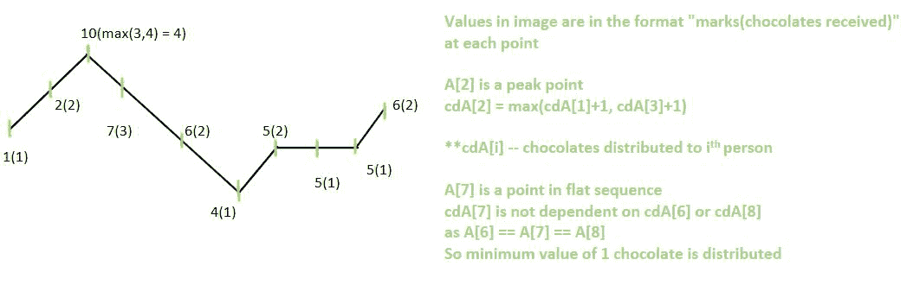

# 巧克力配送问题|第二集

> 原文:[https://www . geesforgeks . org/巧克力-配送-问题集-2/](https://www.geeksforgeeks.org/chocolate-distribution-problem-set-2/)

给定一个由 **N** 个整数组成的[数组](https://www.geeksforgeeks.org/arrays-in-c-cpp/)**A【】**，其中每个值代表第**个<sup>个</sup>个**学生的分数，任务是找到**个需要分发的巧克力**的最小数量，以便:

*   每个学生至少应该得到一块巧克力
*   一个分数高的学生应该得到比邻近学生更多的巧克力。

**示例:**

> **输入:** A[] = {10，30，20}
> **输出:** 4
> **说明:**既然，30 比它相邻的大，那么第二个学生一定要多拿巧克力。因此，最小巧克力可以分配为{1，2，1} = 1 + 2 + 1 = 4
> 
> **输入:** A[] = {23，14，15，14，56，29，14}
> **输出:** 12

**方法 1:**

**进场:**使用[贪婪进场](https://www.geeksforgeeks.org/greedy-algorithms/)可以解决问题。按照以下步骤解决问题:

*   用 **1** 初始化长度为 **N** 的数组 **B[]** 。
*   从 **i = 1 到 N–1**从左向右遍历，如果**A【I】**大于**A【I-1】**，则将**B【I】**更新为**B【I】= B【I-1】+1**。
*   完成上述步骤后，从**I = N–2 到 0** 再次从右向左遍历，如果 **A[i]** 大于 **A[i + 1]** ，则将 **B[i]** 更新为 **B[i] = max(B[i]，B[i+1]+1)** 。否则，将 **B[i]** 更新为 **B[i] = max(B[i]，1)** 。
*   遍历后，[计算数组](https://www.geeksforgeeks.org/program-find-sum-elements-given-array/)**【B】**的和，并打印为所需的最小糖果数。

下面是上述方法的实现:

## C++

```
// C++ program for the above approach

#include <iostream>
using namespace std;

// FUnction to print minimum number
// of candies required
void minChocolates(int A[], int N)
{
    int B[N];

    // Distribute 1 chocolate to each
    for (int i = 0; i < N; i++) {
        B[i] = 1;
    }

    // Traverse from left to right
    for (int i = 1; i < N; i++) {
        if (A[i] > A[i - 1])
            B[i] = B[i - 1] + 1;
        else
            B[i] = 1;
    }

    // Traverse from right to left
    for (int i = N - 2; i >= 0; i--) {
        if (A[i] > A[i + 1])
            B[i] = max(B[i + 1] + 1, B[i]);
        else
            B[i] = max(B[i], 1);
    }

    // Initialize sum
    int sum = 0;

    // Find total sum
    for (int i = 0; i < N; i++) {
        sum += B[i];
    }

    // Return sum
    cout << sum << "\n";
}

// Driver Code
int main()
{

    // Given array
    int A[] = { 23, 14, 15, 14, 56, 29, 14 };

    // Size of the given array
    int N = sizeof(A) / sizeof(A[0]);

    minChocolates(A, N);
}
```

## Java 语言(一种计算机语言，尤用于创建网站)

```
// Java program for the above approach
import java.util.*;
class GFG {

    // FUnction to print minimum number
    // of candies required
    static void minChocolates(int A[], int N)
    {
        int[] B = new int[N];

        // Distribute 1 chocolate to each
        for (int i = 0; i < N; i++) {
            B[i] = 1;
        }

        // Traverse from left to right
        for (int i = 1; i < N; i++) {
            if (A[i] > A[i - 1])
                B[i] = B[i - 1] + 1;
            else
                B[i] = 1;
        }

        // Traverse from right to left
        for (int i = N - 2; i >= 0; i--) {
            if (A[i] > A[i + 1])
                B[i] = Math.max(B[i + 1] + 1, B[i]);
            else
                B[i] = Math.max(B[i], 1);
        }

        // Initialize sum
        int sum = 0;

        // Find total sum
        for (int i = 0; i < N; i++) {
            sum += B[i];
        }

        // Return sum
        System.out.print(sum + "\n");
    }

    // Driver Code
    public static void main(String[] args)
    {

        // Given array
        int A[] = { 23, 14, 15, 14, 56, 29, 14 };

        // Size of the given array
        int N = A.length;
        minChocolates(A, N);
    }
}

// This code contributed by shikhasingrajput
```

## 蟒蛇 3

```
# Python3 program for the above approach

# Function to print minimum number
# of candies required

def minChocolates(A, N):

    B = [1 for i in range(N)]

    # Traverse from left to right
    for i in range(1, N):
        if (A[i] > A[i - 1]):
            B[i] = B[i - 1] + 1
        else:
            B[i] = 1

    # Traverse from right to left
    for i in range(N - 2, -1, -1):
        if (A[i] > A[i + 1]):
            B[i] = max(B[i + 1] + 1, B[i])
        else:
            B[i] = max(B[i], 1)

    # Initialize sum
    sum = 0

    # Find total sum
    for i in range(N):
        sum += B[i]

    # Return sum
    print(sum)

# Driver Code
if __name__ == '__main__':

    # Given array
    A = [23, 14, 15, 14,
         56, 29, 14]

    # Size of the given array
    N = len(A)

    minChocolates(A, N)

# This code is contributed by mohit kumar 29
```

## C#

```
// C# program for the above approach
using System;
public class GFG {

    // FUnction to print minimum number
    // of candies required
    static void minChocolates(int[] A, int N)
    {
        int[] B = new int[N];

        // Distribute 1 chocolate to each
        for (int i = 0; i < N; i++) {
            B[i] = 1;
        }

        // Traverse from left to right
        for (int i = 1; i < N; i++) {
            if (A[i] > A[i - 1])
                B[i] = B[i - 1] + 1;
            else
                B[i] = 1;
        }

        // Traverse from right to left
        for (int i = N - 2; i >= 0; i--) {
            if (A[i] > A[i + 1])
                B[i] = Math.Max(B[i + 1] + 1, B[i]);
            else
                B[i] = Math.Max(B[i], 1);
        }

        // Initialize sum
        int sum = 0;

        // Find total sum
        for (int i = 0; i < N; i++) {
            sum += B[i];
        }

        // Return sum
        Console.Write(sum + "\n");
    }

    // Driver Code
    public static void Main(String[] args)
    {

        // Given array
        int[] A = { 23, 14, 15, 14, 56, 29, 14 };

        // Size of the given array
        int N = A.Length;
        minChocolates(A, N);
    }
}

// This code is contributed by 29AjayKumar
```

## java 描述语言

```
<script>

// javascript program for the above approach

    // FUnction to print minimum number
    // of candies required
    function minChocolates(A, N)
    {
        let B = new Array(N).fill(0);

        // Distribute 1 chocolate to each
        for (let i = 0; i < N; i++) {
            B[i] = 1;
        }

        // Traverse from left to right
        for (let i = 1; i < N; i++) {
            if (A[i] > A[i - 1])
                B[i] = B[i - 1] + 1;
            else
                B[i] = 1;
        }

        // Traverse from right to left
        for (let i = N - 2; i >= 0; i--) {
            if (A[i] > A[i + 1])
                B[i] = Math.max(B[i + 1] + 1, B[i]);
            else
                B[i] = Math.max(B[i], 1);
        }

        // Initialize sum
        let sum = 0;

        // Find total sum
        for (let i = 0; i < N; i++) {
            sum += B[i];
        }

        // Return sum
        document.write(sum + "<br/>");
    }

// Driver Code

    // Given array
        let A = [ 23, 14, 15, 14, 56, 29, 14 ];

        // Size of the given array
        let N = A.length;
        minChocolates(A, N);

</script>
```

**Output:** 

```
12
```

***时间复杂度:** O(N)，其中 N 是给定数组的长度。*
***辅助空间:** O(N)*

**方法 2:高效方法**

仔细观察，空间复杂度可以降低到 **O(1)。**

**一、观察:**

*   标记阵列将是严格递增、严格递减或平坦(值与两个相邻子阵列相同)子阵列的组合。
*   为了尽量减少分发的巧克力总数，一个人和至少一个邻居收到的巧克力数量应该相差 1 个或更少。

**下文提到第二种意见的一个例外

**二。分发巧克力**

***情况 1:斯巴莱正在严格增加***

如果数值严格递增，则给予**I<sup>th</sup>******学生**的巧克力数量将比给予 **(i-1) <sup>th</sup>** **学生**的巧克力数量多一颗(对于任何 i > 0)**

**一个巧克力会给斯巴莱最左边的人，两个在下一个，以此类推，直到分数最高的人。**

**对于长度为 k 的严格递增子阵列，巧克力分布将为[1，2，…，k]。**

*****情况二:斯巴鲁严格递减*****

**给 **i <sup>th</sup>** **学生**的巧克力数量将比给 **(i+1) <sup>th</sup>** **学生**(对于任何 i < n-1)的巧克力数量多一个，其中一个巧克力给最右边的人，最大数量给子阵列最左边的人。**

**对于长度为 k 的严格递减子阵，巧克力分布为[k，k-1，…，1]。**

*****例 3:平序*****

**考虑到分数最高的学生将获得比邻居更多的巧克力。因此，如果值相等，则不存在依赖性。最小值将被指定为最佳结果。**

**如果两个相邻的值都等于 a[i]，即 a[I-1]= = a[I]= = a[I]= = a[I+1]，则将在位置 **i** 处给人一块巧克力**

**对于长度为 k 的平坦子阵列，巧克力分布将是[1，1，…，1]。**

*** *如果平面序列中有单个元素，并且正好位于递增和递减序列之间，则两个相邻元素的赋值之差可能大于 1**

*****过渡点:*** 子阵趋势(增/减/平性质)变化的点。**

*   ****峰值点:**一个递增序列的终点和另一个递减序列的起点**

**那么分配的值将是**最大值(k1，k2)****

**其中 k1–从递增序列中获得的值，**

**k2–从递减序列中获得的值。**

**这一点将仅被视为递增或递减序列的一部分**

****三。结果:****

**由于递增/递减序列中的值相差 1，在 k 个元素的特定子阵列中分配给学生的巧克力数量将是 k 个自然数的总和。对于平面序列，计数为 k，因为所有值都是 1。所需值将是子阵列结果的总和。**

****IV。实施:****

**考虑变量 **i，j** 最初指向第一个元素，val = 1，res = 0。**

**遍历数组后 **res** 给出分发的巧克力总数。**

****val** 同时迭代 index **j** (递增/递减子阵列中)表示此人在 **j** 收到的巧克力数量**

**如果子阵列增加或为平面序列，则 **res 中增加**val**；** **i，j** 前移，根据下一个值(a[j + 1])更新**值**。**

**如果子阵列在减少，则 **i** 指向子阵列的起点， **j** 向前移动，直到下一个过渡点。 **val，res** 直到子阵结束才更新。在这种情况下**值**保持从先前子阵列获得的峰值元素的值。在递减序列结束时 **res** 使用 get_sum 函数& **进行更新，val** 进行更新以指向下一个人持有的巧克力数量。**

****V .示例:****

> *****输入:A[ ] = {1，2，10，7，6，4，5，5，5，6}*****
> 
> *****输出:19*****
> 
> *****解说:*****
> 
> *****子阵列—序列类型—巧克力计数*****
> 
> ***A[0-1] —递增序列— [1，2]***
> 
> ***A[2-5] —递减序列— [4，3，2，1]***
> 
> ***A[5-6] —递增序列— [1，2]***
> 
> ***A[7-7] —平面序列— [1]***
> 
> ***A[8-9] —递增序列— [1，2]***
> 
> ***A[2]、A[9]为峰值点***
> 
> ***巧克力配送将为***
> 
> *****【1、2、4、3、2、1、2、1、1、2】*****
> 
> *****所有数值之和= 19*****

****

**下面是上述方法的代码**

## **C**

```
// C program for above approach
#include <stdio.h>

// Helper function to get sum of decreasing sequence
int get_sum(int peak, int start, int end)
{
    /* peak is the value obtained at peak point
       from previous flat/increasing sequence */

    /* value obtained from decreasing sequence
     also the count of values in the sequence*/
    int count = end - start + 1;

    /* assigning max of values obtained from
     increasing and decreasing sequences */
    peak = (peak > count) ? peak : count;

    /* sum of count - 1 values & peak value
     sum of natural numbers : (n * (n + 1))/2 */
    int s = peak + (((count - 1) * count) >> 1);

    return s;
}

// Function to return minimum number of chocolates
int minChocolates(int a[], int n)
{
    int i = 0, j = 0;
    int res = 0, val = 1;

    while (j < n - 1) {

        if (a[j] > a[j + 1]) {
            // decreasing sequence
            j += 1;
            continue;
        }

        if (i == j)
            // add the chocolates received by that person
            res += val;
        else {
            // end point of decreasing sequence
            res += get_sum(val, i, j);
            val = 1; // reset value at that index
        }

        if (a[j] < a[j + 1])
            // increasing sequence
            val += 1;
        else
            // flat sequence
            val = 1;

        j += 1;
        i = j;
    }
    // add value of chocolates at position n-1
    if (i == j)
        res += val;
    else
        res += get_sum(val, i, j);

    return res;
}

// Driver code
int main()
{

    int a[] = { 5, 5, 4, 3, 2, 1 };
    int n = sizeof(a) / sizeof(a[0]);
    printf("Minimum number of chocolates = %d",
           minChocolates(a, n));
    return 0;
}

// This code is contributed by saitejagampala
```

## **C++**

```
// C++ program for above approach

#include <iostream>
using namespace std;

// Helper function to get sum of decreasing sequence
int get_sum(int peak, int start, int end)
{
    /* peak is the value obtained at peak point
       from previous flat/increasing sequence */

    /* value obtained from decreasing sequence
     also the count of values in the sequence*/
    int count = end - start + 1;

    /* assigning max of values obtained from
     increasing and decreasing sequences */
    peak = max(peak, count);

    /* sum of count - 1 values & peak value
     sum of natural numbers : (n * (n + 1))/2 */
    int s = peak + (((count - 1) * count) >> 1);

    return s;
}

// Function to return minimum number of chocolates
int minChocolates(int a[], int n)
{
    int i = 0, j = 0;
    int res = 0, val = 1;

    while (j < n - 1) {

        if (a[j] > a[j + 1]) {
            // decreasing sequence
            j += 1;
            continue;
        }

        if (i == j)
            // add the chocolates received by that person
            res += val;
        else {
            // end point of decreasing sequence
            res += get_sum(val, i, j);
            val = 1; // reset value at that index
        }

        if (a[j] < a[j + 1])
            // increasing sequence
            val += 1;
        else
            // flat sequence
            val = 1;

        j += 1;
        i = j;
    }
    // add value of chocolates at position n-1
    if (i == j)
        res += val;
    else
        res += get_sum(val, i, j);

    return res;
}

// Driver code
int main()
{

    int a[] = { 5, 5, 4, 3, 2, 1 };
    int n = sizeof(a) / sizeof(a[0]);
    cout << "Minimum number of chocolates = "
         << minChocolates(a, n) << "\n";
    return 0;
}

// This code is contributed by saitejagampala
```

## **Java 语言(一种计算机语言，尤用于创建网站)**

```
// Java program for above approach

import java.io.*;

class GFG {
    public static void main(String[] args)
    {
        int[] a = { 5, 5, 4, 3, 2, 1 };
        int n = a.length;
        System.out.print("Minimum number of chocolates = "
                         + minChocolates(a, n));
    }

    // Function to return minimum number of chocolates
    public static int minChocolates(int[] a, int n)
    {
        int i = 0, j = 0;
        int res = 0, val = 1;

        while (j < n - 1) {

            if (a[j] > a[j + 1]) {
                // decreasing sequence
                j += 1;
                continue;
            }

            if (i == j)
                // add the chocolates received by that
                // person
                res += val;
            else {
                // end point of decreasing sequence
                res += get_sum(val, i, j);
                val = 1; // reset value at that index
            }

            if (a[j] < a[j + 1])
                // increasing sequence
                val += 1;
            else
                // flat sequence
                val = 1;

            j += 1;
            i = j;
        }

        // add value of chocolates at position n-1
        if (i == j)
            res += val;
        else
            res += get_sum(val, i, j);

        return res;
    }

    // helper function to get sum of decreasing sequence
    public static int get_sum(int peak, int start, int end)
    {
        /* peak is the value obtained at peak point
           from previous flat/increasing sequence */

        /* value obtained from decreasing sequence
         also the count of values in the sequence*/
        int count = end - start + 1;

        /* assigning max of values obtained from
         increasing and decreasing sequences */
        peak = (peak > count) ? peak : count;

        /* sum of count - 1 values & peak value
         sum of natural numbers : (n * (n + 1))/2 */
        int s = peak + (((count - 1) * count) >> 1);

        return s;
    }
}

// This code is contributed by saitejagampala
```

## **蟒蛇 3**

```
# Python3 program for above approach

# Function to return minimum number of chocolates

def minChocolates(a, n):
    i, j = 0, 0
    val, res = 1, 0

    while(j < n - 1):

        if(a[j] > a[j + 1]):
            # decreasing sequence
            j += 1
            continue

        if(i == j):
            # add the chocolates received by that person
            res += val
        else:
            # end point of decreasing sequence
            res += get_sum(val, i, j)
            val = 1  # reset value at that index

        if(a[j] < a[j + 1]):
            # increasing sequence
            val += 1
        else:
            # flat sequence
            val = 1

        j += 1
        i = j

    # add value of chocolates at position n-1
    if(i == j):
        res += val
    else:
        res += get_sum(val, i, j)

    return res

# Helper function to get sum of decreasing sequence
def get_sum(peak, start, end):
    # peak is the value obtained at peak point
    # from previous flat/increasing sequence

    # value obtained from decreasing sequence
    # also the count of values in the sequence
    count = end - start + 1

    # assigning max of values obtained from increasing
    # and decreasing sequences
    peak = max(peak, count)

    # sum of count - 1 values & peak value
    # sum of natural numbers : (n * (n + 1))/2
    s = peak + (((count-1) * count) >> 1)

    return s

# Driver code
if __name__ == '__main__':
    a = [5, 5, 4, 3, 2, 1]
    n = len(a)
    print('Minimum number of chocolates =', minChocolates(a, n))

 # This code is contributed by saitejagampala
```

## **java 描述语言**

```
<script>
// Javascript program for above approach

// Function to return minimum number of chocolates
function minChocolates(a,n)
{
    let i = 0, j = 0;
        let res = 0, val = 1;

        while (j < n - 1) 
        { 
            if (a[j] > a[j + 1])
            {

                // decreasing sequence
                j += 1;
                continue;
            }

            if (i == j)

                // add the chocolates received by that
                // person
                res += val;
            else 
            {

                // end point of decreasing sequence
                res += get_sum(val, i, j);
                val = 1; // reset value at that index
            }

            if (a[j] < a[j + 1])
                // increasing sequence
                val += 1;
            else
                // flat sequence
                val = 1;

            j += 1;
            i = j;
        }

        // add value of chocolates at position n-1
        if (i == j)
            res += val;
        else
            res += get_sum(val, i, j);

        return res;
}

// helper function to get sum of decreasing sequence
function get_sum(peak,start,end)
{
    /* peak is the value obtained at peak point
           from previous flat/increasing sequence */

        /* value obtained from decreasing sequence
         also the count of values in the sequence*/
        let count = end - start + 1;

        /* assigning max of values obtained from
         increasing and decreasing sequences */
        peak = (peak > count) ? peak : count;

        /* sum of count - 1 values & peak value
         sum of natural numbers : (n * (n + 1))/2 */
        let s = peak + (((count - 1) * count) >> 1);

        return s;
}

let a = [5, 5, 4, 3, 2, 1];
let n = a.length;
document.write("Minimum number of chocolates = "
                         + minChocolates(a, n));

// This code is contributed by unknown2108
</script>
```

## **C#**

```
// C# program for above approach

using System;

public class GFG{

    // Function to return minimum number of chocolates
    public static int minChocolates(int[] a, int n)
    {
        int i = 0, j = 0;
        int res = 0, val = 1;

        while (j < n - 1) {

            if (a[j] > a[j + 1]) {
                // decreasing sequence
                j += 1;
                continue;
            }

            if (i == j)
                // add the chocolates received by that
                // person
                res += val;
            else {
                // end point of decreasing sequence
                res += get_sum(val, i, j);
                val = 1; // reset value at that index
            }

            if (a[j] < a[j + 1])
                // increasing sequence
                val += 1;
            else
                // flat sequence
                val = 1;

            j += 1;
            i = j;
        }

        // add value of chocolates at position n-1
        if (i == j)
            res += val;
        else
            res += get_sum(val, i, j);

        return res;
    }

    // helper function to get sum of decreasing sequence
    public static int get_sum(int peak, int start, int end)
    {
        /* peak is the value obtained at peak point
           from previous flat/increasing sequence */

        /* value obtained from decreasing sequence
         also the count of values in the sequence*/
        int count = end - start + 1;

        /* assigning max of values obtained from
         increasing and decreasing sequences */
        peak = (peak > count) ? peak : count;

        /* sum of count - 1 values & peak value
         sum of natural numbers : (n * (n + 1))/2 */
        int s = peak + (((count - 1) * count) >> 1);

        return s;
    }

    static public void Main (){

        int[] a = { 5, 5, 4, 3, 2, 1 };
        int n = a.Length;
        Console.WriteLine("Minimum number of chocolates = "
                         + minChocolates(a, n));

    }
}

// This code is contributed by patel2127
```

****Output**

```
Minimum number of chocolates = 16
```** 

*****时间复杂度:** O(N)，N 是数组的长度***

*****空间复杂度:** O(1)***

**如果你发现任何不正确的地方，或者你想分享更多关于上面讨论的话题的信息，请写评论。**