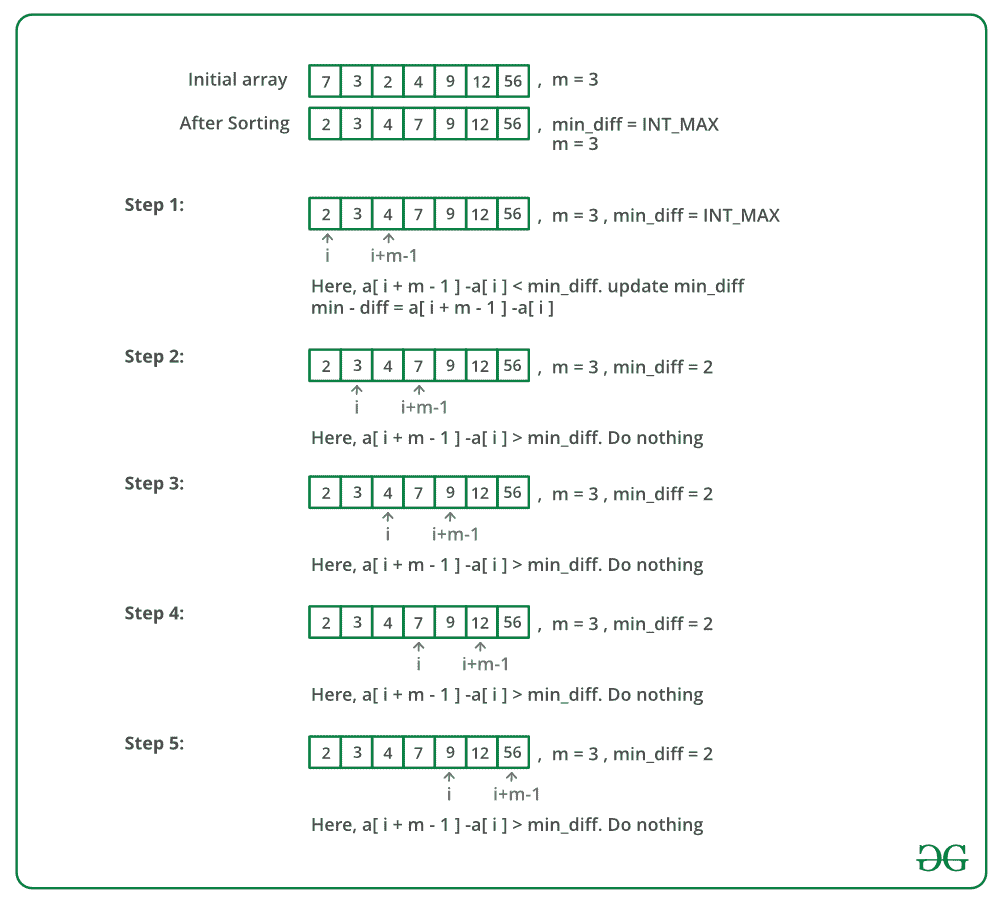

# 巧克力配送问题

> 原文:[https://www . geesforgeks . org/巧克力-配送-问题/](https://www.geeksforgeeks.org/chocolate-distribution-problem/)

给定 n 个整数的数组，其中每个值代表一包巧克力的数量。每包可以有不同数量的巧克力。有 m 名学生，任务是分发巧克力包，以便:

1.  每个学生得到一包。
2.  给学生的巧克力最多的一包和巧克力最少的一包的巧克力数量之差是最小的。

**示例:**

> **输入:** arr[] = {7，3，2，4，9，12，56}，m = 3
> **输出:**最小差为 2
> **解释:**
> 我们有 7 包巧克力，
> 我们需要为 3 个学生挑选 3 包
> 如果我们挑选 2，3 和 4，我们得到最大和最小包
> 大小之间的最小
> 差。
> 
> **输入:** arr[] = {3，4，1，9，56，7，9，12}，m = 5
> **输出:**最小差值为 6
> **解释:**
> 该集合类似于 3，4，7，9，9，输出
> 为 9-3 = 6
> 
> **输入:** arr[] = {12，4，7，9，2，23，25，41，
> 30，40，28，42，30，44，48，
> 43，50}，m = 7
> T5】输出:最小差为 10
> **说明:**
> 我们需要挑 7 包。我们选择 40、41、
> 42、44、48、43 和 50 来最小化最大值和最小值之间的差异
> 。

来源: [Flipkart 采访体验](https://www.geeksforgeeks.org/flipkart-interview-experience-set-24/)

一个简单的解决方案是生成 arr[0]的大小为 m 的所有子集..n-1]。对于每个子集，找出其中最大和最小元素之间的差异。最后，返回最小差值。
一个**有效的解决方案**是基于这样的观察:为了最小化差异，我们必须从一个排序的包中选择连续的元素。我们首先对数组 arr[0..n-1]，然后找到最后一个元素和第一个元素之间差异最小的 m 大小的子阵列。

下图是上述方法的模拟运行:



下面是上述方法的实现:

## C++

```
// C++ program to solve chocolate distribution
// problem
#include <bits/stdc++.h>
using namespace std;

// arr[0..n-1] represents sizes of packets
// m is number of students.
// Returns minimum difference between maximum
// and minimum values of distribution.
int findMinDiff(int arr[], int n, int m)
{
    // if there are no chocolates or number
    // of students is 0
    if (m == 0 || n == 0)
        return 0;

    // Sort the given packets
    sort(arr, arr + n);

    // Number of students cannot be more than
    // number of packets
    if (n < m)
        return -1;

    // Largest number of chocolates
    int min_diff = INT_MAX;

    // Find the subarray of size m such that
    // difference between last (maximum in case
    // of sorted) and first (minimum in case of
    // sorted) elements of subarray is minimum.

    for (int i = 0; i + m - 1 < n; i++) {
        int diff = arr[i + m - 1] - arr[i];
        if (diff < min_diff)
            min_diff = diff;
    }
    return min_diff;
}

int main()
{
    int arr[] = { 12, 4,  7,  9,  2,  23, 25, 41, 30,
                  40, 28, 42, 30, 44, 48, 43, 50 };
    int m = 7; // Number of students
    int n = sizeof(arr) / sizeof(arr[0]);
    cout << "Minimum difference is "
         << findMinDiff(arr, n, m);
    return 0;
}
```

## Java 语言(一种计算机语言，尤用于创建网站)

```
// JAVA Code For Chocolate Distribution 
// Problem
import java.util.*;

class GFG {

    // arr[0..n-1] represents sizes of
    // packets. m is number of students.
    // Returns minimum difference between
    // maximum and minimum values of 
    // distribution.
    static int findMinDiff(int arr[], int n, 
                                    int m)
    {
        // if there are no chocolates or 
        // number of students is 0
        if (m == 0 || n == 0)
            return 0;

        // Sort the given packets
        Arrays.sort(arr);

        // Number of students cannot be
        // more than number of packets
        if (n < m)
           return -1;

        // Largest number of chocolates
        int min_diff = Integer.MAX_VALUE;

        // Find the subarray of size m 
        // such that difference between 
        // last (maximum in case of 
        // sorted) and first (minimum in
        // case of sorted) elements of 
        // subarray is minimum.

        for (int i = 0; i + m - 1 < n; i++)
        {
            int diff = arr[i+m-1] - arr[i];
            if (diff < min_diff)
                min_diff = diff;
        }
        return min_diff;
    }

    /* Driver program to test above function */
    public static void main(String[] args) 
    {
        int arr[] = {12, 4, 7, 9, 2, 23,
                    25, 41, 30, 40, 28,
                    42, 30, 44, 48, 43,
                   50};

        int m = 7;  // Number of students

        int n = arr.length;
        System.out.println("Minimum difference is "
                + findMinDiff(arr, n, m));

    }
}
// This code is contributed by Arnav Kr. Mandal.
```

## 蟒蛇 3

```
# Python3 program to solve 
# chocolate distribution
# problem

# arr[0..n-1] represents sizes of packets
# m is number of students.
# Returns minimum difference between maximum
# and minimum values of distribution.
def findMinDiff(arr, n, m):

    # if there are no chocolates or number
    # of students is 0
    if (m==0 or n==0):
        return 0

    # Sort the given packets
    arr.sort()

    # Number of students cannot be more than
    # number of packets
    if (n < m):
        return -1

    # Largest number of chocolates
    min_diff = arr[n-1] - arr[0]

    # Find the subarray of size m such that
    # difference between last (maximum in case
    # of sorted) and first (minimum in case of
    # sorted) elements of subarray is minimum.
    for i in range(len(arr) - m + 1):
        min_diff = min(min_diff ,  arr[i + m - 1] - arr[i])

    return min_diff

# Driver Code
if __name__ == "__main__":
    arr = [12, 4, 7, 9, 2, 23, 25, 41,
          30, 40, 28, 42, 30, 44, 48, 
          43, 50]
    m = 7 # Number of students
    n = len(arr)
    print("Minimum difference is", findMinDiff(arr, n, m))

#This code is contributed by Smitha
```

## C#

```
// C# Code For Chocolate Distribution 
// Problem
using System;

class GFG {

    // arr[0..n-1] represents sizes of
    // packets. m is number of students.
    // Returns minimum difference between
    // maximum and minimum values of 
    // distribution.
    static int findMinDiff(int []arr, int n, 
                                    int m)
    {

        // if there are no chocolates or 
        // number of students is 0
        if (m == 0 || n == 0)
            return 0;

        // Sort the given packets
        Array.Sort(arr);

        // Number of students cannot be
        // more than number of packets
        if (n < m)
            return -1;

        // Largest number of chocolates
        int min_diff = int.MaxValue;

        // Find the subarray of size m 
        // such that difference between 
        // last (maximum in case of 
        // sorted) and first (minimum in
        // case of sorted) elements of 
        // subarray is minimum.

        for (int i = 0; i + m - 1 < n; i++)
        {
            int diff = arr[i+m-1] - arr[i];

            if (diff < min_diff)
                min_diff = diff;
        }

        return min_diff;
    }

    /* Driver program to test above function */
    public static void Main() 
    {
        int []arr = {12, 4, 7, 9, 2, 23,
                    25, 41, 30, 40, 28,
                    42, 30, 44, 48, 43,
                                    50};

        int m = 7; // Number of students

        int n = arr.Length;

        Console.WriteLine("Minimum difference is "
                    + findMinDiff(arr, n, m));

    }
}

// This code is contributed by vt_m.
```

## 服务器端编程语言（Professional Hypertext Preprocessor 的缩写）

```
<?php
// PHP program to solve 
// chocolate distribution
// problem

// arr[0..n-1] represents 
// sizes of packets m is
// number of students.
// Returns minimum difference 
// between maximum and minimum 
// values of distribution.
function findMinDiff($arr, $n, $m)
{
    // if there are no 
    // chocolates or number
    // of students is 0
    if ($m == 0 || $n == 0)
        return 0;

    // Sort the given packets
    sort($arr);

    // Number of students
    // cannot be more than
    // number of packets
    if ($n < $m)
    return -1;

    // Largest number 
    // of chocolates
    $min_diff = PHP_INT_MAX;

    // Find the subarray of size
    // m such that difference
    // between last (maximum in 
    // case of sorted) and first 
    // (minimum in case of sorted) 
    // elements of subarray is minimum.

    for ($i = 0; 
         $i + $m - 1 < $n; $i++)
    {
        $diff = $arr[$i + $m - 1] -
                $arr[$i];
        if ($diff < $min_diff)
            $min_diff = $diff;
    }
    return $min_diff;
}

// Driver Code
$arr = array(12, 4, 7, 9, 2, 23, 
             25, 41, 30, 40, 28, 
             42, 30, 44, 48, 43, 50);

$m = 7; // Number of students
$n = sizeof($arr);
echo "Minimum difference is ",
    findMinDiff($arr, $n, $m);

// This code is contributed by ajit
?>
```

## java 描述语言

```
<script>

// Javascript Code For Chocolate 
// Distribution Problem

// arr[0..n-1] represents sizes of
// packets. m is number of students.
// Returns minimum difference between
// maximum and minimum values of
// distribution.
function findMinDiff(arr, n, m)
{

    // If there are no chocolates or
    // number of students is 0
    if (m == 0 || n == 0)
        return 0;

    // Sort the given packets
    arr.sort(function(a, b){return a - b});

    // Number of students cannot be
    // more than number of packets
    if (n < m)
        return -1;

    // Largest number of chocolates
    let min_diff = Number.MAX_VALUE;

    // Find the subarray of size m
    // such that difference between
    // last (maximum in case of
    // sorted) and first (minimum in
    // case of sorted) elements of
    // subarray is minimum.
    for(let i = 0; i + m - 1 < n; i++)
    {
        let diff = arr[i + m - 1] - arr[i];

        if (diff < min_diff)
            min_diff = diff;
    }
    return min_diff;
}

// Driver code
let arr = [ 12, 4, 7, 9, 2, 23, 25, 
            41, 30, 40, 28, 42, 30, 
            44, 48, 43, 50 ];

// Number of students
let m = 7; 
let n = arr.length;

document.write("Minimum difference is " + 
               findMinDiff(arr, n, m));

// This code is contributed by divyesh072019

</script>
```

**Output**

```
Minimum difference is 10
```

**时间复杂度:** O(n Log n)因为我们在子阵列搜索之前应用了排序。

本文由 **Roshni Agarwal** 供稿。如果你喜欢 GeeksforGeeks 并想投稿，你也可以使用[write.geeksforgeeks.org](https://write.geeksforgeeks.org)写一篇文章或者把你的文章邮寄到 review-team@geeksforgeeks.org。看到你的文章出现在极客博客主页上，帮助其他极客。
如果你发现任何不正确的地方，或者你想分享更多关于上面讨论的话题的信息，请写评论。