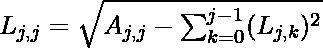

# 乔莱斯基分解:矩阵分解

> 原文:[https://www . geeksforgeeks . org/chole sky-分解-矩阵-分解/](https://www.geeksforgeeks.org/cholesky-decomposition-matrix-decomposition/)

在线性代数中，**矩阵分解**或**矩阵分解**是将矩阵分解成矩阵的乘积。有许多不同的矩阵分解。其中一个就是**乔莱斯基分解**。

**乔莱斯基分解**或**乔莱斯基因子分解**是厄米正定矩阵分解成下三角矩阵及其共轭转置的乘积。对于求解线性方程组，乔莱斯基分解分解的效率大约是 [LU 分解](https://www.geeksforgeeks.org/l-u-decomposition-system-linear-equations/)的两倍。

埃尔米特正定矩阵 A 的乔莱斯基分解是形式**A =【L】【L】<sup>T</sup>**的分解，其中 **L** 是具有实对角和正对角条目的下三角矩阵， **L <sup>T</sup>** 表示 L 的共轭转置。每个埃尔米特正定矩阵(以及每个实值对称正定矩阵)都有唯一的乔莱斯基分解。

![\left[\begin{array}{lll} A_{00} & A_{01} & A_{02} \\ A_{10} & A_{11} & A_{12} \\ A_{20} & A_{21} & A_{22} \end{array}\right]=\left[\begin{array}{lll} L_{00} & 0 & 0 \\ L_{10} & L_{11} & 0 \\ L_{20} & L_{21} & L_{22} \end{array}\right]\left[\begin{array}{ccc} L_{00} & L_{10} & L_{20} \\ 0 & L_{11} & L_{21} \\ 0 & 0 & L_{22} \end{array}\right]   ](img/25cd538df8e77633ae471a08b825800b.png "Rendered by QuickLaTeX.com")

每一个对称的正定矩阵 A 都可以分解成一个唯一的下三角矩阵 L 及其转置的乘积:**A = L L<sup>T</sup>T3】**

下面的公式是通过求解上述下三角矩阵及其转置得到的。这些是乔莱斯基分解算法的基础:



**例**:

```
Input : 
```

![\left[\begin{array}{ccc} 4 & 12 & -16 \\ 12 & 37 & -43 \\ -16 & -43 & 98 \end{array}\right]  ](img/d08348b48bd9593e2ef4e85796c00e8f.png "Rendered by QuickLaTeX.com")

```
Output :
```

![\left[\begin{array}{ccc} 2 & 0 & 0 \\ 6 & 1 & 0 \\ -8 & 5 & 3 \end{array}\right]\left[\begin{array}{ccc} 2 & 6 & -8 \\ 0 & 1 & 5 \\ 0 & 0 & 3 \end{array}\right]  ](img/a7c84dfa600b52a17784a78f3183cf57.png "Rendered by QuickLaTeX.com")

下面是 Cholesky 分解的实现。

## C++

```
// CPP program to decompose a matrix using
// Cholesky Decomposition
#include <bits/stdc++.h>
using namespace std;

const int MAX = 100;

void Cholesky_Decomposition(int matrix[][MAX],
                                      int n)
{
    int lower[n][n];
    memset(lower, 0, sizeof(lower));

    // Decomposing a matrix into Lower Triangular
    for (int i = 0; i < n; i++) {
        for (int j = 0; j <= i; j++) {
            int sum = 0;

            if (j == i) // summation for diagonals
            {
                for (int k = 0; k < j; k++)
                    sum += pow(lower[j][k], 2);
                lower[j][j] = sqrt(matrix[j][j] -
                                        sum);
            } else {

                // Evaluating L(i, j) using L(j, j)
                for (int k = 0; k < j; k++)
                    sum += (lower[i][k] * lower[j][k]);
                lower[i][j] = (matrix[i][j] - sum) /
                                      lower[j][j];
            }
        }
    }

    // Displaying Lower Triangular and its Transpose
    cout << setw(6) << " Lower Triangular" 
         << setw(30) << "Transpose" << endl;
    for (int i = 0; i < n; i++) {

        // Lower Triangular
        for (int j = 0; j < n; j++)
            cout << setw(6) << lower[i][j] << "\t";
        cout << "\t";

        // Transpose of Lower Triangular
        for (int j = 0; j < n; j++)
            cout << setw(6) << lower[j][i] << "\t";
        cout << endl;
    }
}

// Driver Code
int main()
{
    int n = 3;
    int matrix[][MAX] = { { 4, 12, -16 },
                        { 12, 37, -43 },
                        { -16, -43, 98 } };
    Cholesky_Decomposition(matrix, n);
    return 0;
}
```

## Java 语言(一种计算机语言，尤用于创建网站)

```
// Java program to decompose
// a matrix using Cholesky
// Decomposition

class GFG {

    // static int MAX = 100;
    static void Cholesky_Decomposition(int[][] matrix,
                                       int n)
    {
        int[][] lower = new int[n][n];

        // Decomposing a matrix
        // into Lower Triangular
        for (int i = 0; i < n; i++) {
            for (int j = 0; j <= i; j++) {
                int sum = 0;

                // summation for diagonals
                if (j == i) {
                    for (int k = 0; k < j; k++)
                        sum += (int)Math.pow(lower[j][k],
                                             2);
                    lower[j][j] = (int)Math.sqrt(
                        matrix[j][j] - sum);
                }

                else {

                    // Evaluating L(i, j)
                    // using L(j, j)
                    for (int k = 0; k < j; k++)
                        sum += (lower[i][k] * lower[j][k]);
                    lower[i][j] = (matrix[i][j] - sum)
                                  / lower[j][j];
                }
            }
        }

        // Displaying Lower
        // Triangular and its Transpose
        System.out.println(" Lower Triangular\t Transpose");
        for (int i = 0; i < n; i++) {

            // Lower Triangular
            for (int j = 0; j < n; j++)
                System.out.print(lower[i][j] + "\t");
            System.out.print("");

            // Transpose of
            // Lower Triangular
            for (int j = 0; j < n; j++)
                System.out.print(lower[j][i] + "\t");
            System.out.println();
        }
    }

    // Driver Code
    public static void main(String[] args)
    {
        int n = 3;
        int[][] matrix = new int[][] { { 4, 12, -16 },
                                       { 12, 37, -43 },
                                       { -16, -43, 98 } };

        Cholesky_Decomposition(matrix, n);
    }
}

// This code is contributed by mits
```

## 蟒蛇 3

```
# Python3 program to decompose
# a matrix using Cholesky
# Decomposition
import math
MAX = 100;

def Cholesky_Decomposition(matrix, n):

    lower = [[0 for x in range(n + 1)]
                for y in range(n + 1)];

    # Decomposing a matrix
    # into Lower Triangular
    for i in range(n):
        for j in range(i + 1):
            sum1 = 0;

            # summation for diagonals
            if (j == i):
                for k in range(j):
                    sum1 += pow(lower[j][k], 2);
                lower[j][j] = int(math.sqrt(matrix[j][j] - sum1));
            else:

                # Evaluating L(i, j)
                # using L(j, j)
                for k in range(j):
                    sum1 += (lower[i][k] *lower[j][k]);
                if(lower[j][j] > 0):
                    lower[i][j] = int((matrix[i][j] - sum1) /
                                               lower[j][j]);

    # Displaying Lower Triangular
    # and its Transpose
    print("Lower Triangular\t\tTranspose");
    for i in range(n):

        # Lower Triangular
        for j in range(n):
            print(lower[i][j], end = "\t");
        print("", end = "\t");

        # Transpose of
        # Lower Triangular
        for j in range(n):
            print(lower[j][i], end = "\t");
        print("");

# Driver Code
n = 3;
matrix = [[4, 12, -16],
          [12, 37, -43],
          [-16, -43, 98]];
Cholesky_Decomposition(matrix, n);

# This code is contributed by mits
```

## C#

```
// C# program to decompose
// a matrix using Cholesky
// Decomposition
using System;

class GFG {

    // static int MAX = 100;
    static void Cholesky_Decomposition(int[, ] matrix,
                                       int n)
    {
        int[, ] lower = new int[n, n];

        // Decomposing a matrix
        // into Lower Triangular
        for (int i = 0; i < n; i++) {
            for (int j = 0; j <= i; j++) {
                int sum = 0;

                // summation for diagonals
                if (j == i) {
                    for (int k = 0; k < j; k++)
                        sum += (int)Math.Pow(lower[j, k],
                                             2);
                    lower[j, j] = (int)Math.Sqrt(
                        matrix[j, j] - sum);
                }

                else {

                    // Evaluating L(i, j)
                    // using L(j, j)
                    for (int k = 0; k < j; k++)
                        sum += (lower[i, k] * lower[j, k]);
                    lower[i, j] = (matrix[i, j] - sum)
                                  / lower[j, j];
                }
            }
        }

        // Displaying Lower
        // Triangular and its Transpose
        Console.WriteLine(
            "  Lower Triangular\t   Transpose");
        for (int i = 0; i < n; i++) {

            // Lower Triangular
            for (int j = 0; j < n; j++)
                Console.Write(lower[i, j] + "\t");
            Console.Write("");

            // Transpose of
            // Lower Triangular
            for (int j = 0; j < n; j++)
                Console.Write(lower[j, i] + "\t");
            Console.WriteLine();
        }
    }

    // Driver Code
    static int Main()
    {
        int n = 3;
        int[, ] matrix = { { 4, 12, -16 },
                           { 12, 37, -43 },
                           { -16, -43, 98 } };

        Cholesky_Decomposition(matrix, n);
        return 0;
    }
}

// This code is contributed by mits
```

## 服务器端编程语言（Professional Hypertext Preprocessor 的缩写）

```
<?php
// PHP program to decompose
// a matrix using Cholesky
// Decomposition
$MAX = 100;

function Cholesky_Decomposition($matrix, $n)
{
    $lower;
    for ($i = 0; $i <= $n; $i++)
    for ($j = 0; $j <= $n; $j++)
    $lower[$i][$j] = 0;

    // Decomposing a matrix
    // into Lower Triangular
    for ($i = 0; $i < $n; $i++)
    {
        for ($j = 0; $j <= $i; $j++)
        {
            $sum = 0;

            // summation for diagonals
            if ($j == $i)
            {
                for ($k = 0; $k < $j; $k++)
                    $sum += pow($lower[$j][$k], 2);
                $lower[$j][$j] = sqrt($matrix[$j][$j] -
                                      $sum);
            }
            else
            {
                // Evaluating L(i, j)
                // using L(j, j)
                for ($k = 0; $k < $j; $k++)
                    $sum += ($lower[$i][$k] *
                             $lower[$j][$k]);
                $lower[$i][$j] = ($matrix[$i][$j] - $sum) /
                                  $lower[$j][$j];
            }
        }
    }

    // Displaying Lower Triangular
    // and its Transpose
    echo "     Lower Triangular" .
           str_pad("Transpose", 30, " ",
                   STR_PAD_BOTH) . "\n";
    for ($i = 0; $i < $n; $i++)
    {

        // Lower Triangular
        for ($j = 0; $j < $n; $j++)
            echo str_pad($lower[$i][$j], 6,
                         " ", STR_PAD_BOTH)."\t";
        echo "\t";

        // Transpose of
        // Lower Triangular
        for ($j = 0; $j < $n; $j++)
            echo str_pad($lower[$j][$i], 6,
                         " ", STR_PAD_BOTH)."\t";
        echo "\n";
    }
}

// Driver Code
$n = 3;
$matrix = array(array(4, 12, -16),
                array(12, 37, -43),
                array(-16, -43, 98));
Cholesky_Decomposition($matrix, $n);

// This code is contributed by vt_m.
?>
```

## java 描述语言

```
<script>
// javascript program to decompose
// a matrix using Cholesky
// Decomposition
   // function MAX = 100;
function Cholesky_Decomposition(matrix,n)
{
    var lower = Array(n).fill(0).map(x => Array(n).fill(0));

    // Decomposing a matrix
    // into Lower Triangular
    for (var i = 0; i < n; i++) {
        for (var j = 0; j <= i; j++) {
            var sum = 0;

            // summation for diagonals
            if (j == i) {
                for (var k = 0; k < j; k++)
                    sum += parseInt(Math.pow(lower[j][k],
                                         2));
                lower[j][j] = parseInt(Math.sqrt(
                    matrix[j][j] - sum));
            }

            else {

                // Evaluating L(i, j)
                // using L(j, j)
                for (var k = 0; k < j; k++)
                    sum += (lower[i][k] * lower[j][k]);
                lower[i][j] = (matrix[i][j] - sum)
                              / lower[j][j];
            }
        }
    }

    // Displaying Lower
    // Triangular and its Transpose
    document.write(" Lower Triangular     Transpose<br>");
    for (var i = 0; i < n; i++) {

        // Lower Triangular
        for (var j = 0; j < n; j++)
            document.write(lower[i][j] + "        ");

        // Transpose of
        // Lower Triangular
        for (var j = 0; j < n; j++)
            document.write(lower[j][i] + "        ");
        document.write('<br>');
    }
}

// Driver Code
var n = 3;
var matrix = [[ 4, 12, -16 ],
                               [ 12, 37, -43 ],
                               [ -16, -43, 98 ] ];

Cholesky_Decomposition(matrix, n);

// This code contributed by Princi Singh
</script>
```

**输出:**

```
Lower Triangular     Transpose
2  0  0              2  6  -8    
6  1  0              0  1   5    
-8 5  3              0  0   3    
```

**参考文献:** [维基百科-乔莱斯基分解](https://en.wikipedia.org/wiki/Cholesky_decomposition)

本文由 [**舒巴姆拉纳**](https://auth.geeksforgeeks.org/profile.php?user=shubham_rana_77&list=practice) 供稿。如果你喜欢 GeeksforGeeks 并想投稿，你也可以使用[write.geeksforgeeks.org](https://write.geeksforgeeks.org)写一篇文章或者把你的文章邮寄到 review-team@geeksforgeeks.org。看到你的文章出现在极客博客主页上，帮助其他极客。
如果发现有不正确的地方，或者想分享更多关于上述话题的信息，请写评论。