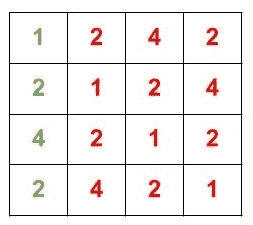

# 使用矩阵方法的循环卷积

> 原文:[https://www . geesforgeks . org/circular-卷积-使用-矩阵-方法/](https://www.geeksforgeeks.org/circular-convolution-using-matrix-method/)

给定两个长度分别为 **N** 和 **M** 的数组 **X[]** 和 **H[]** ，任务是用矩阵法求给定数组的[循环卷积](https://en.wikipedia.org/wiki/Circular_convolution)。循环移位矩阵和列向量的乘法是阵列的循环卷积。
**举例:**

> **输入:** X[] = {1，2，4，2}，H[] = {1，1，1}
> **输出:** 7 5 7 8
> **输入:** X[] = {5，7，3，2}，H[] = {1，5}
> **输出:** 15 32 38 17

**说明:**

*   使用长度最大的数组元素创建 K * K 的循环移位矩阵**循环移位矩阵**，其中 K 是最大值(N，M)。



阵列的循环移位矩阵 X <sub>n</sub> 。

*   创建一个长度为 K 的列向量 **col_vec**
*   将数组 H <sub>m</sub> 的元素插入 col_vec 中的位置【0，m】。
*   作为 K = max(N，M)，这里 N；因此，用 0 填充 col_vec [m，K]的其余位置。因此，col_vec 将是

```
col_vec = { 1, 1, 1, 0 }
```

*   将**循环移位垫**与**坐标**相乘
*   循环移位矩阵和列向量的乘积是数组的循环卷积。

**进场:**

*   使用最大长度的数组元素创建一个 N * N 的循环移位矩阵。
*   使用另一个数组的元素创建一个长度为 N 的列向量，并用 0 填充其余位置。
*   矩阵和列向量的乘法是数组的循环卷积。

下面是上述方法的实现。

## C++

```
// C++ program to compute circular
// convolution of two arrays
#include <bits/stdc++.h>
using namespace std;

#define MAX_SIZE 10

// Function to find circular convolution
void convolution(vector<int>& x, vector<int>& h, int n, int m)
{
    int row_vec[MAX_SIZE], col_vec[MAX_SIZE];
    int out[MAX_SIZE] = { 0 };
    int circular_shift_mat[MAX_SIZE][MAX_SIZE];

    // Finding the maximum size between the
    // two input sequence sizes
    int maxSize = n > m ? n : m;

    // Copying elements of x to row_vec and padding
    // zeros if size of x < maxSize
    for (int i = 0; i < maxSize; i++) {
        if (i >= n) {
            row_vec[i] = 0;
        }
        else {
            row_vec[i] = x[i];
        }
    }

    // Copying elements of h to col_vec and padding
    // zeros if size of h is less than maxSize
    for (int i = 0; i < maxSize; i++) {
        if (i >= m) {
            col_vec[i] = 0;
        }
        else {
            col_vec[i] = h[i];
        }
    }

    // Generating 2D matrix of
    // circularly shifted elements
    int k = 0, d = 0;

    for (int i = 0; i < maxSize; i++) {
        int curIndex = k - d;
        for (int j = 0; j < maxSize; j++) {
            circular_shift_mat[j][i] = row_vec
                [curIndex % maxSize];
            curIndex++;
        }
        k = maxSize;
        d++;
    }

    // Computing result by matrix
    // multiplication and printing results
    for (int i = 0; i < maxSize; i++) {
        for (int j = 0; j < maxSize; j++) {

            out[i] += circular_shift_mat[i][j]
                      * col_vec[j];
        }
        cout << out[i] << " ";
    }
}

// Driver program
int main()
{
    vector<int> x = { 5, 7, 3, 2 };
    int n = x.size();
    vector<int> h = { 1, 5 };
    int m = h.size();

    convolution(x, h, n, m);

    return 0;
}
```

## Java 语言(一种计算机语言，尤用于创建网站)

```
// Java program to compute circular
// convolution of two arrays
class GFG
{
    final static int MAX_SIZE = 10 ;

    // Function to find circular convolution
    static void convolution(int []x, int []h, int n, int m)
    {
        int row_vec[] = new int[MAX_SIZE];
        int col_vec[] = new int[MAX_SIZE];
        int out[] = new int [MAX_SIZE];
        int circular_shift_mat[][] = new int[MAX_SIZE][MAX_SIZE];

        // Finding the maximum size between the
        // two input sequence sizes
        int maxSize = n > m ? n : m;

        // Copying elements of x to row_vec and padding
        // zeros if size of x < maxSize
        for (int i = 0; i < maxSize; i++)
        {
            if (i >= n)
            {
                row_vec[i] = 0;
            }
            else
            {
                row_vec[i] = x[i];
            }
        }

        // Copying elements of h to col_vec and padding
        // zeros if size of h is less than maxSize
        for (int i = 0; i < maxSize; i++)
        {
            if (i >= m)
            {
                col_vec[i] = 0;
            }
            else
            {
                col_vec[i] = h[i];
            }
        }

        // Generating 2D matrix of
        // circularly shifted elements
        int k = 0, d = 0;

        for (int i = 0; i < maxSize; i++)
        {
            int curIndex = k - d;
            for (int j = 0; j < maxSize; j++)
            {
                circular_shift_mat[j][i] =
                row_vec[curIndex % maxSize];
                curIndex++;
            }
            k = maxSize;
            d++;
        }

        // Computing result by matrix
        // multiplication and printing results
        for (int i = 0; i < maxSize; i++)
        {
            for (int j = 0; j < maxSize; j++)
            {

                out[i] += circular_shift_mat[i][j] * col_vec[j];
            }
            System.out.print(out[i] + " ");
        }
    }

    // Driver program
    public static void main (String[] args)
    {
        int x[] = { 5, 7, 3, 2 };
        int n = x.length;
        int h[] = { 1, 5 };
        int m = h.length;

        convolution(x, h, n, m);
    }
}

// This code is contributed by AnkitRai01
```

## 蟒蛇 3

```
# Python program to compute circular
# convolution of two arrays
MAX_SIZE = 10;

# Function to find circular convolution
def convolution(x, h, n, m):
    row_vec = [0] * MAX_SIZE;
    col_vec = [0] * MAX_SIZE;
    out = [0] * MAX_SIZE;
    circular_shift_mat = [[0 for i in range(MAX_SIZE)]
                            for j in range(MAX_SIZE)] ;

    # Finding the maximum size between the
    # two input sequence sizes
    if(n > m ):
        maxSize = n;
    else:
        maxSize = m;

    # Copying elements of x to row_vec and padding
    # zeros if size of x < maxSize
    for i in range(maxSize):
        if (i >= n):
            row_vec[i] = 0;
        else:
            row_vec[i] = x[i];

    # Copying elements of h to col_vec and padding
    # zeros if size of h is less than maxSize
    for i in range(maxSize):
        if (i >= m):
            col_vec[i] = 0;
        else:
            col_vec[i] = h[i];

    # Generating 2D matrix of
    # circularly shifted elements
    k = 0;
    d = 0;

    for i in range(maxSize):
        curIndex = k - d;
        for j in range(maxSize):
            circular_shift_mat[j][i] = \
            row_vec[curIndex % maxSize];
            curIndex += 1;

        k = maxSize;
        d += 1;

    # Computing result by matrix
    # multiplication and printing results
    for i in range(maxSize):
        for j in range(maxSize):
            out[i] += circular_shift_mat[i][j] * \
                                    col_vec[j];

        print(out[i], end = " ");

# Driver program
if __name__ == '__main__':
    x = [ 5, 7, 3, 2 ];
    n = len(x);
    h = [ 1, 5 ];
    m = len(h);

    convolution(x, h, n, m);

# This code is contributed by 29AjayKumar
```

## C#

```
// C# program to compute circular
// convolution of two arrays
using System;

class GFG
{
    readonly static int MAX_SIZE = 10 ;

    // Function to find circular convolution
    static void convolution(int []x, int []h,
                            int n, int m)
    {
        int []row_vec = new int[MAX_SIZE];
        int []col_vec = new int[MAX_SIZE];
        int []out_ = new int [MAX_SIZE];
        int [,]circular_shift_mat =
            new int[MAX_SIZE,MAX_SIZE];

        // Finding the maximum size between the
        // two input sequence sizes
        int maxSize = n > m ? n : m;

        // Copying elements of x to row_vec and padding
        // zeros if size of x < maxSize
        for (int i = 0; i < maxSize; i++)
        {
            if (i >= n)
            {
                row_vec[i] = 0;
            }
            else
            {
                row_vec[i] = x[i];
            }
        }

        // Copying elements of h to col_vec and padding
        // zeros if size of h is less than maxSize
        for (int i = 0; i < maxSize; i++)
        {
            if (i >= m)
            {
                col_vec[i] = 0;
            }
            else
            {
                col_vec[i] = h[i];
            }
        }

        // Generating 2D matrix of
        // circularly shifted elements
        int k = 0, d = 0;

        for (int i = 0; i < maxSize; i++)
        {
            int curIndex = k - d;
            for (int j = 0; j < maxSize; j++)
            {
                circular_shift_mat[j, i] =
                row_vec[curIndex % maxSize];
                curIndex++;
            }
            k = maxSize;
            d++;
        }

        // Computing result by matrix
        // multiplication and printing results
        for (int i = 0; i < maxSize; i++)
        {
            for (int j = 0; j < maxSize; j++)
            {

                out_[i] += circular_shift_mat[i, j] *
                            col_vec[j];
            }
            Console.Write(out_[i] + " ");
        }
    }

    // Driver program
    public static void Main(String[] args)
    {
        int []x = {5, 7, 3, 2};
        int n = x.Length;
        int []h = {1, 5};
        int m = h.Length;

        convolution(x, h, n, m);
    }
}

// This code is contributed by PrinciRaj1992
```

## java 描述语言

```
<script>

    // JavaScript program to compute circular
    // convolution of two arrays

    let MAX_SIZE = 10 ;

    // Function to find circular convolution
    function convolution(x, h, n, m)
    {
        let row_vec = new Array(MAX_SIZE);
        row_vec.fill(0);
        let col_vec = new Array(MAX_SIZE);
        col_vec.fill(0);
        let out = new Array(MAX_SIZE);
        out.fill(0);
        let circular_shift_mat = new Array(MAX_SIZE);
        circular_shift_mat.fill(0);
        for (let i = 0; i < MAX_SIZE; i++)
        {
            circular_shift_mat[i] = new Array(MAX_SIZE);
            for (let j = 0; j < MAX_SIZE; j++)
            {
                circular_shift_mat[i][j] = 0;
            }
        }

        // Finding the maximum size between the
        // two input sequence sizes
        let maxSize = n > m ? n : m;

        // Copying elements of x to row_vec and padding
        // zeros if size of x < maxSize
        for (let i = 0; i < maxSize; i++)
        {
            if (i >= n)
            {
                row_vec[i] = 0;
            }
            else
            {
                row_vec[i] = x[i];
            }
        }

        // Copying elements of h to col_vec and padding
        // zeros if size of h is less than maxSize
        for (let i = 0; i < maxSize; i++)
        {
            if (i >= m)
            {
                col_vec[i] = 0;
            }
            else
            {
                col_vec[i] = h[i];
            }
        }

        // Generating 2D matrix of
        // circularly shifted elements
        let k = 0, d = 0;

        for (let i = 0; i < maxSize; i++)
        {
            let curIndex = k - d;
            for (let j = 0; j < maxSize; j++)
            {
                circular_shift_mat[j][i] =
                row_vec[curIndex % maxSize];
                curIndex++;
            }
            k = maxSize;
            d++;
        }

        // Computing result by matrix
        // multiplication and printing results
        for (let i = 0; i < maxSize; i++)
        {
            for (let j = 0; j < maxSize; j++)
            {

                out[i] += circular_shift_mat[i][j] * col_vec[j];
            }
            document.write(out[i] + " ");
        }
    }

    let x = [ 5, 7, 3, 2 ];
    let n = x.length;
    let h = [ 1, 5 ];
    let m = h.length;

    convolution(x, h, n, m);

</script>
```

**Output:** 

```
15 32 38 17
```

**时间复杂度:**O(MAX _ SIZE * MAX _ SIZE)
T3】辅助空间: O(MAX_SIZE * MAX_SIZE)