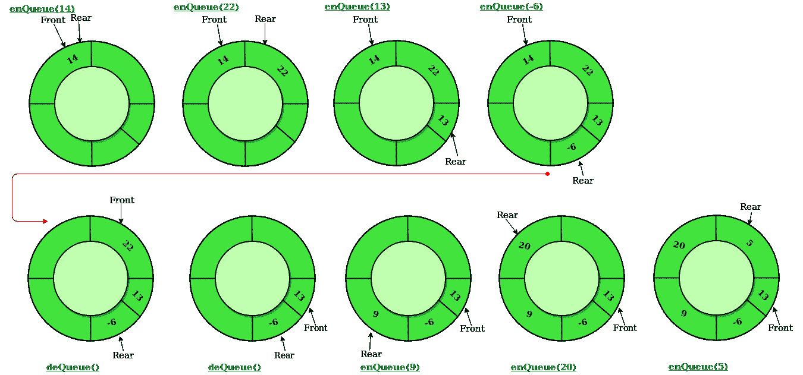

# 循环队列|集合 1(介绍和数组实现)

> 原文:[https://www . geesforgeks . org/circular-queue-set-1-introduction-array-implementation/](https://www.geeksforgeeks.org/circular-queue-set-1-introduction-array-implementation/)

先决条件–[队列](https://www.geeksforgeeks.org/queue-set-1introduction-and-array-implementation/)
循环队列是一种线性数据结构，其中操作基于先进先出(FIFO)原理执行，最后一个位置连接回第一个位置以形成一个圆。也叫**【环形缓冲区】**。


在正常的队列中，我们可以插入元素，直到队列变满。但是一旦队列变满，即使队列前面有空间，我们也不能插入下一个元素。



循环队列上的操作:

*   **前置:**从队列中获取前置项目。
*   **后方:**从队列中获取最后一个物品。
*   **enQueue(值)**这个函数用于将一个元素插入循环队列。在循环队列中，新元素总是插入到后面的位置。
    1.  检查队列是否已满–检查((后== SIZE-1 &&前== 0) ||(后==前-1))。
    2.  如果已满，则显示队列已满。如果队列未满，则检查(后==大小–1 & &前！= 0)如果为真，则设置 rear=0 并插入元素。
*   **出列()**这个函数用于从循环队列中删除一个元素。在循环队列中，元素总是从前面的位置删除。
    1.  检查队列是否为空意味着检查(front==-1)。
    2.  如果为空，则显示队列为空。如果队列不为空，则执行步骤 3
    3.  检查(前= =后)是否为真，然后设置前=后= -1，否则检查(前= =尺寸-1)，如果为真，则设置前=0 并返回元件。

## C++

```
// C or C++ program for insertion and
// deletion in Circular Queue
#include<bits/stdc++.h>
using namespace std;

class Queue
{
    // Initialize front and rear
    int rear, front;

    // Circular Queue
    int size;
    int *arr;

    Queue(int s)
    {
       front = rear = -1;
       size = s;
       arr = new int[s];
    }

    void enQueue(int value);
    int deQueue();
    void displayQueue();
};

/* Function to create Circular queue */
void Queue::enQueue(int value)
{
    if ((front == 0 && rear == size-1) ||
            (rear == (front-1)%(size-1)))
    {
        printf("\nQueue is Full");
        return;
    }

    else if (front == -1) /* Insert First Element */
    {
        front = rear = 0;
        arr[rear] = value;
    }

    else if (rear == size-1 && front != 0)
    {
        rear = 0;
        arr[rear] = value;
    }

    else
    {
        rear++;
        arr[rear] = value;
    }
}

// Function to delete element from Circular Queue
int Queue::deQueue()
{
    if (front == -1)
    {
        printf("\nQueue is Empty");
        return INT_MIN;
    }

    int data = arr[front];
    arr[front] = -1;
    if (front == rear)
    {
        front = -1;
        rear = -1;
    }
    else if (front == size-1)
        front = 0;
    else
        front++;

    return data;
}

// Function displaying the elements
// of Circular Queue
void Queue::displayQueue()
{
    if (front == -1)
    {
        printf("\nQueue is Empty");
        return;
    }
    printf("\nElements in Circular Queue are: ");
    if (rear >= front)
    {
        for (int i = front; i <= rear; i++)
            printf("%d ",arr[i]);
    }
    else
    {
        for (int i = front; i < size; i++)
            printf("%d ", arr[i]);

        for (int i = 0; i <= rear; i++)
            printf("%d ", arr[i]);
    }
}

/* Driver of the program */
int main()
{
    Queue q(5);

    // Inserting elements in Circular Queue
    q.enQueue(14);
    q.enQueue(22);
    q.enQueue(13);
    q.enQueue(-6);

    // Display elements present in Circular Queue
    q.displayQueue();

    // Deleting elements from Circular Queue
    printf("\nDeleted value = %d", q.deQueue());
    printf("\nDeleted value = %d", q.deQueue());

    q.displayQueue();

    q.enQueue(9);
    q.enQueue(20);
    q.enQueue(5);

    q.displayQueue();

    q.enQueue(20);
    return 0;
}
```

## Java 语言(一种计算机语言，尤用于创建网站)

```
// Java program for insertion and
// deletion in Circular Queue
import java.util.ArrayList;

class CircularQueue{

// Declaring the class variables.
private int size, front, rear;

// Declaring array list of integer type.
private ArrayList<Integer> queue = new ArrayList<Integer>();

// Constructor
CircularQueue(int size)
{
    this.size = size;
    this.front = this.rear = -1;
}

// Method to insert a new element in the queue.
public void enQueue(int data)
{

    // Condition if queue is full.
    if((front == 0 && rear == size - 1) ||
      (rear == (front - 1) % (size - 1)))
    {
        System.out.print("Queue is Full");
    }

    // condition for empty queue.
    else if(front == -1)
    {
        front = 0;
        rear = 0;
        queue.add(rear, data);
    }

    else if(rear == size - 1 && front != 0)
    {
        rear = 0;
        queue.set(rear, data);
    }

    else
    {
        rear = (rear + 1);

        // Adding a new element if
        if(front <= rear)
        {
            queue.add(rear, data);
        }

        // Else updating old value
        else
        {
            queue.set(rear, data);
        }
    }
}

// Function to dequeue an element
// form th queue.
public int deQueue()
{
    int temp;

    // Condition for empty queue.
    if(front == -1)
    {
        System.out.print("Queue is Empty");

        // Return -1 in case of empty queue
        return -1;
    }

    temp = queue.get(front);

    // Condition for only one element
    if(front == rear)
    {
        front = -1;
        rear = -1;
    }

    else if(front == size - 1)
    {
        front = 0;
    }
    else
    {
        front = front + 1;
    }

    // Returns the dequeued element
    return temp;
}

// Method to display the elements of queue
public void displayQueue()
{

    // Condition for empty queue.
    if(front == -1)
    {
        System.out.print("Queue is Empty");
        return;
    }

    // If rear has not crossed the max size
    // or queue rear is still greater then
    // front.
    System.out.print("Elements in the " +
                     "circular queue are: ");

    if(rear >= front)
    {

        // Loop to print elements from
        // front to rear.
        for(int i = front; i <= rear; i++)
        {
            System.out.print(queue.get(i));
            System.out.print(" ");
        }
        System.out.println();
    }

    // If rear crossed the max index and
    // indexing has started in loop
    else
    {

        // Loop for printing elements from
        // front to max size or last index
        for(int i = front; i < size; i++)
        {
            System.out.print(queue.get(i));
            System.out.print(" ");
        }

        // Loop for printing elements from
        // 0th index till rear position
        for(int i = 0; i <= rear; i++)
        {
            System.out.print(queue.get(i));
            System.out.print(" ");
        }
        System.out.println();
    }
}

// Driver code
public static void main(String[] args)
{

    // Initialising new object of
    // CircularQueue class.
    CircularQueue q = new CircularQueue(5);

    q.enQueue(14);
    q.enQueue(22);
    q.enQueue(13);
    q.enQueue(-6);

    q.displayQueue();

    int x = q.deQueue();

    // Checking for empty queue.
    if(x != -1)
    {
        System.out.print("Deleted value = ");
        System.out.println(x);
    }

    x = q.deQueue();

    // Checking for empty queue.
    if(x != -1)
    {
        System.out.print("Deleted value = ");
        System.out.println(x);
    }

    q.displayQueue();

    q.enQueue(9);
    q.enQueue(20);
    q.enQueue(5);

    q.displayQueue();

    q.enQueue(20);
}
}

// This code is contributed by Amit Mangal.
```

## 蟒蛇 3

```
class CircularQueue():

    # constructor
    def __init__(self, size): # initializing the class
        self.size = size

        # initializing queue with none
        self.queue = [None for i in range(size)]
        self.front = self.rear = -1

    def enqueue(self, data):

        # condition if queue is full
        if ((self.rear + 1) % self.size == self.front):
            print(" Queue is Full\n")

        # condition for empty queue
        elif (self.front == -1):
            self.front = 0
            self.rear = 0
            self.queue[self.rear] = data
        else:

            # next position of rear
            self.rear = (self.rear + 1) % self.size
            self.queue[self.rear] = data

    def dequeue(self):
        if (self.front == -1): # condition for empty queue
            print ("Queue is Empty\n")

        # condition for only one element
        elif (self.front == self.rear):
            temp=self.queue[self.front]
            self.front = -1
            self.rear = -1
            return temp
        else:
            temp = self.queue[self.front]
            self.front = (self.front + 1) % self.size
            return temp

    def display(self):

        # condition for empty queue
        if(self.front == -1):
            print ("Queue is Empty")

        elif (self.rear >= self.front):
            print("Elements in the circular queue are:",
                                              end = " ")
            for i in range(self.front, self.rear + 1):
                print(self.queue[i], end = " ")
            print ()

        else:
            print ("Elements in Circular Queue are:",
                                           end = " ")
            for i in range(self.front, self.size):
                print(self.queue[i], end = " ")
            for i in range(0, self.rear + 1):
                print(self.queue[i], end = " ")
            print ()

        if ((self.rear + 1) % self.size == self.front):
            print("Queue is Full")

# Driver Code
ob = CircularQueue(5)
ob.enqueue(14)
ob.enqueue(22)
ob.enqueue(13)
ob.enqueue(-6)
ob.display()
print ("Deleted value = ", ob.dequeue())
print ("Deleted value = ", ob.dequeue())
ob.display()
ob.enqueue(9)
ob.enqueue(20)
ob.enqueue(5)
ob.display()

# This code is contributed by AshwinGoel
```

**输出:**

```
Elements in Circular Queue are: 14 22 13 -6 
Deleted value = 14
Deleted value = 22
Elements in Circular Queue are: 13 -6 
Elements in Circular Queue are: 13 -6 9 20 5 
Queue is Full
```

**时间复杂度:**enQueue()，出列()操作的时间复杂度为 O(1)，因为任何操作都没有循环。
**应用:**

1.  **内存管理:**普通队列中未使用的内存位置可以在循环队列中使用。
2.  **交通系统:**在计算机控制的交通系统中，环形队列用于按照设定的时间一个接一个地重复打开红绿灯。
3.  **CPU 调度:**操作系统通常会维护一个准备执行或等待特定事件发生的进程队列。

本文由**阿卡什·古普塔**供稿。如果你喜欢 GeeksforGeeks 并想投稿，你也可以使用[write.geeksforgeeks.org](https://write.geeksforgeeks.org)写一篇文章或者把你的文章邮寄到 review-team@geeksforgeeks.org。看到你的文章出现在极客博客主页上，帮助其他极客。如果你发现任何不正确的地方，或者你想分享更多关于上面讨论的话题的信息，请写评论。