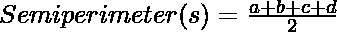
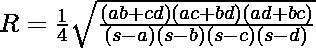
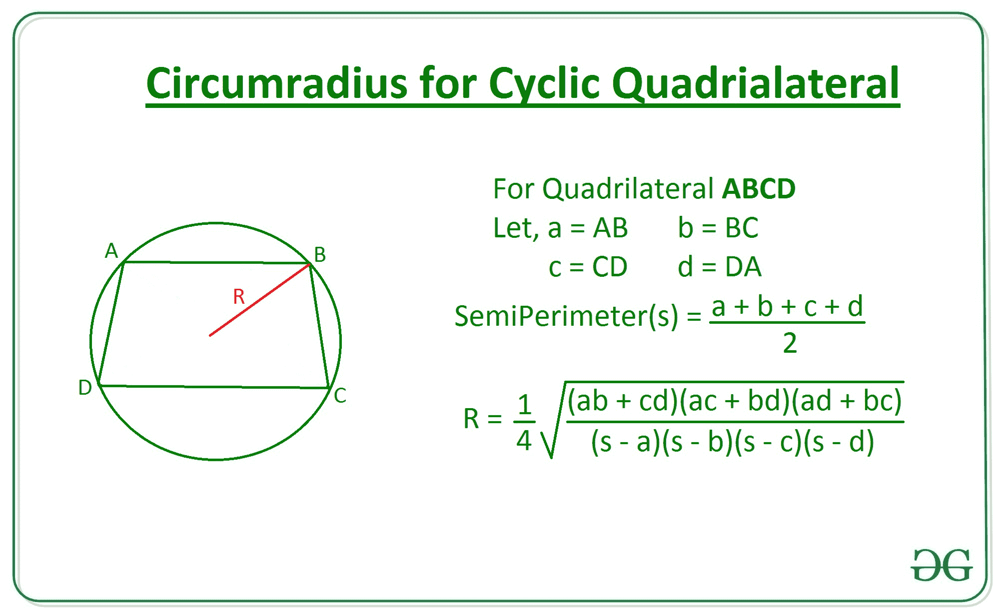

# 使用边长的循环四边形的外半径

> 原文:[https://www . geeksforgeeks . org/环半径四边形-使用边长/](https://www.geeksforgeeks.org/circumradius-of-a-cyclic-quadrilateral-using-the-length-of-sides/)

给定整数 **A、B、C** ，以及表示[循环四边形](https://en.wikipedia.org/wiki/Cyclic_quadrilateral)边长的 **D** ，任务是求外圆半径，即给定循环四边形的外圆半径。

**示例:**

> **输入:** A = 3，B = 4，C = 5，D = 6
> T3】输出: 3.29
> 
> **输入:** A = 10，B = 30，C = 50，D = 20
> T3】输出: 27.78

**方法:**按照以下步骤解决问题:

*   用以下公式计算带边循环四边形的[半周](https://en.wikipedia.org/wiki/Semiperimeter)**A，B，C** 和 **D** :

> 

*   现在，使用如下所示的[帕拉梅什瓦拉的外接圆半径公式](https://en.wikipedia.org/wiki/Cyclic_quadrilateral#Parameshvara's_circumradius_formula)，计算外接圆的半径:

> 

> [](https://media.geeksforgeeks.org/wp-content/uploads/20200813165628/AreaofRhombus.jpg)

下面是上述方法的实现:

## C++14

```
// C++ program to find circumradius of
// a cyclic quadrilateral using sides
#include <bits/stdc++.h>
using namespace std;

// Function to return the circumradius
// of a cyclic quadrilateral using sides
double Circumradius(int a, int b, int c, int d)
{

    // Find semiperimeter
    double s = (a + b + c + d) / 2.0;

    // Calculate the radius
    double radius = sqrt(((a * b) + (c * d)) *
                         ((a * c) + (b * d)) *
                         ((a * d) + (b * c)) /
                         ((s - a) * (s - b) *
                          (s - c) * (s - d)));

    return radius / 4;
}

// Driver Code
int main()
{
    int A = 3;
    int B = 4;
    int C = 5;
    int D = 6;

    // Function call
    double ans = Circumradius(A, B, C, D);

    // Print the radius
    cout << setprecision(3) << ans;

    return 0;
}

// This code is contributed by mohit kumar 29
```

## Java 语言(一种计算机语言，尤用于创建网站)

```
// Java program to find circumradius of
// a cyclic quadrilateral using sides
import java.util.*;

class GFG{

// Function to return the circumradius
// of a cyclic quadrilateral using sides
static double Circumradius(int a, int b,
                           int c, int d)
{

    // Find semiperimeter
    double s = (a + b + c + d) / 2.0;

    // Calculate the radius
    double radius = Math.sqrt(((a * b) + (c * d)) *
                              ((a * c) + (b * d)) *
                              ((a * d) + (b * c)) /
                              ((s - a) * (s - b) *
                               (s - c) * (s - d)));

    return radius / 4;
}

// Driver Code
public static void main(String[] args)
{
    int A = 3;
    int B = 4;
    int C = 5;
    int D = 6;

    // Function call
    double ans = Circumradius(A, B, C, D);

    // Print the radius
    System.out.format("%.2f", ans);
}
}

// This code is contributed by 29AjayKumar
```

## 蟒蛇 3

```
# Program to find Circumradius of
# a cyclic quadrilateral using sides

import math 

# Function to return the Circumradius
# of  a cyclic quadrilateral using sides
def Circumradius(a, b, c, d):

# Find semiperimeter
    s = (a + b + c + d) / 2

    # Calculate the radius
    radius = (1 / 4)*math.sqrt(((a * b)+(c * d))*
        ((a * c)+(b * d))*((a * d)+(b * c))
        /((s-a)*(s-b)*(s-c)*(s-d)))

    return radius 

# Driver Code

# Given sides
A = 3
B = 4
C = 5
D = 6

# Function Call 
ans = Circumradius(A, B, C, D) 

# Print the radius
print(round(ans, 2))
```

## C#

```
// C# program to find circumradius of
// a cyclic quadrilateral using sides
using System;

class GFG{

// Function to return the circumradius
// of a cyclic quadrilateral using sides
static double Circumradius(int a, int b,
                           int c, int d)
{

    // Find semiperimeter
    double s = (a + b + c + d) / 2.0;

    // Calculate the radius
    double radius = Math.Sqrt(((a * b) + (c * d)) *
                              ((a * c) + (b * d)) *
                              ((a * d) + (b * c)) /
                              ((s - a) * (s - b) *
                               (s - c) * (s - d)));

    return radius / 4;
}

// Driver Code
public static void Main(String[] args)
{
    int A = 3;
    int B = 4;
    int C = 5;
    int D = 6;

    // Function call
    double ans = Circumradius(A, B, C, D);

    // Print the radius
    Console.Write("{0:F2}", ans);
}
}

// This code is contributed by 29AjayKumar
```

## java 描述语言

```
<script>

// Javascript program to find circumradius of
// a cyclic quadrilateral using sides

// Function to return the circumradius
// of a cyclic quadrilateral using sides
function Circumradius(a, b, c, d)
{

    // Find semiperimeter
    var s = (a + b + c + d) / 2.0;

    // Calculate the radius
    var radius = Math.sqrt(((a * b) + (c * d)) *
                          ((a * c) + (b * d)) *
                          ((a * d) + (b * c)) /
                          ((s - a) * (s - b) *
                          (s - c) * (s - d)));

    return radius / 4;
}

// Driver code
var A = 3;
var B = 4;
var C = 5;
var D = 6;

// Function call
var ans = Circumradius(A, B, C, D);

// Print the radius
document.write(ans.toFixed(2));

// This code is contributed by Khushboogoyal499

</script>
```

**Output:** 

```
3.29
```

***时间复杂度:**O(1)*
T5**辅助空间:** O(1)