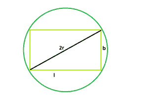

# 矩形的周长

> 原文:[https://www . geeksforgeeks . org/外圆角矩形/](https://www.geeksforgeeks.org/circumradius-of-the-rectangle/)

这里我们有一个长方形的长度 **l** &宽度 **b** 。我们必须找到矩形的外半径。

**示例:**

```
Input : l = 3, b = 4 
Output :2.5

Input :l = 10, b = 12
Output :3.95227774224
```



**逼近** :
从图中我们可以清楚的了解到外半径 **r** 是矩形对角线的一半。

> **r =√l ^ 2+b ^ 2)/2**

**以下是上述方法**的实现:

## C++

```
// C++ Program to find the radius
// of the circumcircle of the given rectangle

#include <bits/stdc++.h>
using namespace std;

// Function to find the radius
// of the circumcircle
float findRadiusOfcircumcircle(float l, float b)
{

    // the sides cannot be negative
    if (l < 0 || b < 0)
        return -1;

    // Radius of the circumcircle
    float radius = sqrt(pow(l, 2) + pow(b, 2)) / 2;

    // Return the radius
    return radius;
}

// Driver code
int main()
{

    // Get the sides of the triangle
    float l = 4, b = 3;
    // Find the radius of the circumcircle
    cout << findRadiusOfcircumcircle(l, b) << endl;

    return 0;
}
```

## Java 语言(一种计算机语言，尤用于创建网站)

```
// Java Program to find the radius
// of the circumcircle of the given
// rectangle
import java.util.*;
import java.lang.*;
import java.io.*;

class GFG
{

// Function to find the radius
// of the circumcircle
static float findRadiusOfcircumcircle(float l,
                                      float b)
{

    // the sides cannot be negative
    if (l < 0 || b < 0)
        return -1;

    // Radius of the circumcircle
    float radius = (float) Math.sqrt(Math.pow(l, 2) +
                           Math.pow(b, 2)) / 2;

    // Return the radius
    return radius;
}

// Driver code
public static void main(String args[])
{

    // Get the sides of the triangle
    float l = 4, b = 3;
    // Find the radius of the circumcircle
    System.out.println(findRadiusOfcircumcircle(l, b));
}
}

// This code is contributed by Subhadeep
```

## 蟒蛇 3

```
# Python Program to find the
# radius of the circumcircle
# of the given rectangle
import math

# Function to find the radius
# of the circumcircle
def findRadiusOfcircumcircle(l, b):

    # the sides cannot be negative
    if (l < 0 or b < 0):
        return -1;

    # Radius of the circumcircle
    radius = (math.sqrt(pow(l, 2) +
                        pow(b, 2)) / 2);

    # Return the radius
    return radius;

# Driver code

# Get the sides of the triangle
l = 4;
b = 3;

# Find the radius of the circumcircle
print(findRadiusOfcircumcircle(l, b));

# This code is contributed
# by Shivi_Aggarwal
```

## C#

```
// C# Program to find the radius
// of the circumcircle of the
// given rectangle
using System;

class GFG
{

// Function to find the radius
// of the circumcircle
static float findRadiusOfcircumcircle(float l,
                                       float b)
{

    // the sides cannot be negative
    if (l < 0 || b < 0)
        return -1;

    // Radius of the circumcircle
    float radius = (float) Math.Sqrt(Math.Pow(l, 2) +
                           Math.Pow(b, 2)) / 2;

    // Return the radius
    return radius;
}

// Driver code
public static void Main()
{

    // Get the sides of the triangle
    float l = 4, b = 3;

    // Find the radius of the circumcircle
    Console.WriteLine(findRadiusOfcircumcircle(l, b));
}
}

// This code is contributed by anuj_67
```

## 服务器端编程语言（Professional Hypertext Preprocessor 的缩写）

```
<?php
// PHP Program to find the radius
// of the circumcircle of the
// given rectangle

// Function to find the radius
// of the circumcircle
function findRadiusOfcircumcircle($l, $b)
{

    // the sides cannot be negative
    if ($l < 0 || $b < 0)
        return -1;

    // Radius of the circumcircle
    $radius = sqrt(pow($l, 2) +
                   pow($b, 2)) / 2;

    // Return the radius
    return $radius;
}

// Driver code

// Get the sides of the triangle
$l = 4; $b = 3;

// Find the radius of the circumcircle
echo findRadiusOfcircumcircle($l, $b);

// This code is contributed by anuj_67
?>
```

## java 描述语言

```
<script>

// javascript Program to find the radius
// of the circumcircle of the given
// rectangle

// Function to find the radius
// of the circumcircle
function findRadiusOfcircumcircle(l,b)
{

    // the sides cannot be negative
    if (l < 0 || b < 0)
        return -1;

    // Radius of the circumcircle
    var radius = Math.sqrt(Math.pow(l, 2) +
                           Math.pow(b, 2)) / 2;

    // Return the radius
    return radius;
}

// Driver code

// Get the sides of the triangle
var l = 4, b = 3;
// Find the radius of the circumcircle
document.write(findRadiusOfcircumcircle(l, b).toFixed(6));

// This code contributed by shikhasingrajput

</script>
```

**输出:**

```
2.5
```