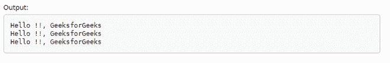

# 类标准::C++17 中的 string _ view

> 原文:[https://www . geesforgeks . org/class-stdstring _ view-in-CPP-17/](https://www.geeksforgeeks.org/class-stdstring_view-in-cpp-17/)

[**STD::string**](https://www.geeksforgeeks.org/stdstring-class-in-c/)**有一些缺点，最常见的一种情况就是恒弦。下面的程序演示了用 std::string 处理常量字符串时出现的问题:**

****程序 1:****

## **C++**

```
// C++ program to demonstrate the
// problem occurred in string
#include <iostream>
#include <string>
using namespace std;

// Driver Code
int main()
{
    char str_1[]{ "Hello !!, GeeksforGeeks" };

    string str_2{ str_1 };
    string str_3{ str_2 };

    // Print the string
    cout << str_1 << '\n'
         << str_2 << '\n'
         << str_3 << '\n';

    return 0;
}
```

 ****输出:****

****

****说明:**输出与预期相同。但是，为了查看**“你好！！，GeeksforGeeks"** 两次 **std::string** 对内存执行两次开销。但是这里的任务是读取字符串**(“你好！！，geeksforgeks ")**，不需要对其进行写操作。所以仅仅为了显示一个字符串，为什么要多次分配内存。为了更高效地处理字符串， [C++17](https://www.geeksforgeeks.org/c17-new-feature-else-switch-statements-initializers/) 提出了 **std::string_view()** 提供了预定义 char str[]的视图，而无需在内存中创建新对象。**

****<u>STD::string</u>:**的缺点在上面的示例中，通过分配两个不同的字符串变量，将同一字符串 **str_1** 打印两次。所以对于变量 **str_2** 和 **str_3** 来说，内存都是使用[静态内存分配](https://www.geeksforgeeks.org/difference-between-static-allocation-and-stack-allocation/)来分配的，这导致我们的内存开销增加了两倍。**

****<u>STD 的好处::string_view</u> :****

*   ****更轻更便宜:****STD::string _ view**是一款非常轻更便宜的，主要用来提供字符串的视图。无论何时创建**字符串 _ 视图**，都不需要[以上述示例中的方式复制字符串](https://www.geeksforgeeks.org/c-program-copy-string-without-using-strcpy-function/)，这种方式效率低下，并且会导致内存开销。它使字符串的复制过程非常高效，并且当在查看的字符串中进行修改时，不会创建字符串的任何副本。所做的更改已经出现在 **std::string_view** 中。**
*   ****更好的性能:****STD::string _ view**比 const **std::string &** 更好，因为它取消了在字符串的最开始有一个 **std::string** 对象作为 **std::string_view** 的约束，该对象由两个元素组成第一个是指向数组起始位置的 **const char*** ，第二个是 **size** 。**
*   ****支持关键功能:****STD::string _ view**主要支持应用于 **std::string** 上的所有关键功能，如[子字符串](https://www.geeksforgeeks.org/stdsubstr-in-ccpp/)、比较、查找、重载比较运算符**(例如，==、<、>、！=)** 。所以在大多数情况下，当我们的首选项为只读时，它消除了拥有 std::string 对象声明的约束。**

****<u>std::string _ view</u>:**c++ 17 库提出了一种不同于通常的 STD::string 的标准类型的字符串( **std::string_view** )。**

*   ****std::string_view** 提供了一个轻量级对象，该对象使用类似于 **std::_string** 的接口提供对字符串或字符串的一部分的只读访问，并且仅引用连续的字符序列。与保留自己的字符串副本的 std::string 不同，它还提供了在源代码的其他地方定义的字符串的视图。**
*   **它由两个成员组成:一个指向字符数组开始的**常量字符*** ，以及 _size。它本身是对字符串的非自有引用。**
*   **在[表头](https://www.geeksforgeeks.org/header-files-in-c-cpp-and-its-uses/)(#包含<字符串 _ 视图>)中定义，std::字符串 _ 视图[类模板](https://www.geeksforgeeks.org/templates-cpp/)如下:**

> ****模板<类 CharT，类 Traits = STD::char _ Traits<CharT>T5】类 basic _ string _ view****
> 
> **类模板 **string_view** 解释了一个对象，该对象可以引用一个连续的字符序列或类似字符的对象数组，该序列的第一个元素位于零位置。**

**下面是使用 **std::string_view** 的上述源代码的确切版本:**

****程序 2:****

## **C++**

```
// C++ program to implement
// the above approach
#include <iostream>
using namespace std;
#include <string_view>

// Driver code
int main()
{
    // View the text "hello", which is
    // stored in the binary
    string_view str_1{ "Hello !!, GeeksforGeeks" };

    // View of the same "hello"
    string_view str_2{ str_1 };

    // View of the same "hello"
    string_view str_3{ str_2 };

    std::cout << str_1 << '\n' << str_2 << '\n' << str_3 << '\n';
    return 0;
}
```

****输出-****

****

****解释:**输出将与上面相同，但是不再有字符串的副本**“你好！！，极客 forgeeks”**在内存中创建。**

****<u>参数在 std::string_view</u> :****

****字符类型:**
字符类型定义存储在 string_view 中的字符类型。C++标准库为上述模板的专门化提供了以下类型定义。**

1.  ****字符串 _ 视图**类型的元素**字符****
2.  ****wstring_view** ，为 **wchar_t****
3.  ****u16string_view** 为 **char16_t****
4.  ****u32string_view** 为 **char32_t****

**下面是说明字符类型的 C++程序:**

****程序 3:****

## **C++**

```
// C++ program for the above approach
#include <iostream>
#include <string>
#include <string_view>
using namespace std;

string_view sur_name(wstring_view x)
{
    return x.substr(6);
}

// Driver Code
int main()
{
    // Basic_string_view<wchar_t> wstr
    // (L"Madhav_Mohan"); both are equivalent
    const wchar_t* str1{ L"Madhav_Mohan" };

    cout << your_name(str1);

    return 0;
}
```