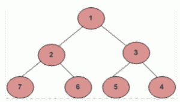
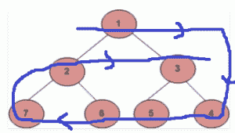

# 二叉树顺时针螺旋遍历

> 原文:[https://www . geesforgeks . org/顺时针-螺旋-遍历二叉树/](https://www.geeksforgeeks.org/clockwise-spiral-traversal-of-binary-tree/)

给定一棵二叉树。任务是打印给定二叉树的圆形顺时针螺旋顺序遍历。


对于上面的二叉树，循环顺时针螺旋顺序遍历将是 **1，4，5，6，7，2，3** 。



**示例:**

```
Input : 
                       10
                     /     \
                   12       13
                          /     \
                       14       15
                      /   \     /  \
                     21   22   23   24
Output : 10, 24, 23, 22, 21, 12, 13, 15, 14

```

**接近**:

1.  首先计算给定树的宽度。
2.  创建一个有序的辅助 2D 数组(宽度*宽度)
3.  对二叉树进行级别顺序遍历，并将级别逐个存储在新创建的 2D 矩阵的相应行中。也就是说，将 0 级节点存储在索引为 0 的行中，将 1 级节点存储在索引为 1 的行中，依此类推。
4.  最后，以下面的方式遍历 2d 数组:
    *   从第一行开始从左到右打印元素。
    *   然后从右向左遍历最后一行并打印元素。
    *   再次从左到右遍历第二行并打印。
    *   然后从右向左倒数第二行，以此类推，重复这些步骤，直到遍历完整个二维数组。

以下是上述方法的实现:

## C++

```
// C++ program for Clockwise Spiral Traversal 
// of Binary Tree 

#include <bits/stdc++.h> 
using namespace std; 

// A Tree node 
struct Node { 
    int key; 
    struct Node *left, *right; 
}; 

// Utility function to create a new node 
Node* newNode(int key) 
{ 
    Node* temp = new Node; 
    temp->key = key; 
    temp->left = temp->right = NULL; 
    return (temp); 
} 
//function to calculate the height of the tree
int findHeight(struct Node* node)
{
    //Base condition
    if(node == NULL) return 0;
    int leftHeight = findHeight(node->left);
    int rightHeight = findHeight(node->right);
    //return maximum of left or right subtree height addition with one
    return 1+(leftHeight > rightHeight ? leftHeight : rightHeight );
}
// Function to find the width of tree 
void findWidth(struct Node* node, int& maxValue, 
            int& minValue, int hd) 
{ 
    if (node == NULL) 
        return; 

    if (hd > maxValue) { 
        maxValue = hd; 
    } 

    if (hd < minValue) { 
        minValue = hd; 
    } 

    findWidth(node->left, maxValue, minValue, hd - 1); 
    findWidth(node->right, maxValue, minValue, hd + 1); 
} 

// Function to traverse the tree and 
// store level order traversal in a matrix 
void BFS(int** mtrx, struct Node* node) 
{ 
    // Create queue for storing 
    // the addresses of nodes 
    queue<struct Node*> qu; 

    qu.push(node); 

    int i = -1, j = -1; 

    struct Node* poped_node = NULL; 

    while (!qu.empty()) { 

        i++; 

        int qsize = qu.size(); 

        while (qsize--) { 
            j++; 

            poped_node = qu.front(); 

            // Store data of node into the matrix 
            mtrx[i][j] = poped_node->key; 
            qu.pop(); 

            if (poped_node->left != NULL) { 
                qu.push(poped_node->left); 
            } 

            if (poped_node->right != NULL) { 
                qu.push(poped_node->right); 
            } 
        } 

        j = -1; 
    } 
} 

// Function for Clockwise Spiral Traversal 
// of Binary Tree 
void traverse_matrix(int** mtrx, int height, int width) 
{ 
    int j = 0, k1 = 0, k2 = 0, k3 = height - 1; 
    int k4 = width - 1; 

    for (int round = 0; round < height / 2; round++) { 
        for (j = k2; j < width; j++) { 

            // only print those values which 
            // are not MAX_INTEGER 
            if (mtrx[k1][j] != INT_MAX) { 
                cout << mtrx[k1][j] << ", "; 
            } 
        } 

        k2 = 0; 
        k1++; 

        for (j = k4; j >= 0; j--) { 

            // only print those values which are 
            // not MAX_INTEGER 
            if (mtrx[k3][j] != INT_MAX) { 
                cout << mtrx[k3][j] << ", "; 
            } 
        } 

        k4 = width - 1; 
        k3--; 
    } 

    // condition (one row may be left traversing) 
    // if number of rows in matrix are odd 
    if (height % 2 != 0) { 
        for (j = k2; j < width; j++) { 

            // only print those values which are 
            // not MAX_INTEGER 
            if (mtrx[k1][j] != INT_MAX) { 
                cout << mtrx[k1][j] << ", "; 
            } 
        } 
    } 
} 

// A utility function to print clockwise 
// spiral traversal of tree 
void printPattern(struct Node* node) 
{ 
    // max, min has taken for 
    // calculating width of tree 
    int max_value = INT_MIN; 
    int min_value = INT_MAX; 
    int hd = 0; 

    // calculate the width of a tree 
    findWidth(node, max_value, min_value, hd); 
    int width = max_value + abs(min_value); 

    //calculate the height of the tree
    int height = findHeight(node); 

    // use double pointer to create 2D array 
    int** mtrx = new int*[height]; 

    // initialize width for each row of matrix 
    for (int i = 0; i < height; i++) { 
        mtrx[i] = new int[width]; 
    } 

    // initialize complete matrix with 
    // MAX INTEGER(purpose garbage) 
    for (int i = 0; i < height; i++) { 
        for (int j = 0; j < width; j++) { 
            mtrx[i][j] = INT_MAX; 
        } 
    } 

    // Store the BFS traversal of the tree 
    // into the 2-D matrix 
    BFS(mtrx, node); 

    // Print the circular clockwise spiral 
    // traversal of the tree 
    traverse_matrix(mtrx, height, width); 

    // release extra memory 
    // allocated for matrix 
    free(mtrx); 
} 

// Driver Code 
int main() 
{ 
    /*     10 
        /     \ 
    12     13 
        /     \ 
        14     15 
        / \     / \ 
        21 22 23 24 

    Let us create Binary Tree as shown 
    in above example */

    Node* root = newNode(10); 
    root->left = newNode(12); 
    root->right = newNode(13); 

    root->right->left = newNode(14); 
    root->right->right = newNode(15); 

    root->right->left->left = newNode(21); 
    root->right->left->right = newNode(22); 
    root->right->right->left = newNode(23); 
    root->right->right->right = newNode(24); 

    cout << "Circular Clockwise Spiral Traversal : \n"; 

    printPattern(root); 

    return 0; 
} 
// This code is contributed by MOHAMMAD MUDASSIR
```

## 蟒蛇 3

```
# Python3 program for Clockwise Spiral 
# Traversal of Binary Tree
INT_MAX = 2**31
INT_MIN = -2**31

# Binary tree node 
class newNode: 

    # Constructor to create a newNode 
    def __init__(self, data): 
        self.key = data 
        self.left = None
        self.right = None

# Function to find the width of tree 
def findWidth(node, maxValue, minValue, hd):

    if (node == None):
        return

    if (hd > maxValue[0]):
        maxValue[0] = hd 

    if (hd < minValue[0]):
        minValue[0] = hd 

    findWidth(node.left, maxValue,
                         minValue, hd - 1) 
    findWidth(node.right, maxValue,
                          minValue, hd + 1) 

# Function to traverse the tree and 
# store level order traversal in a matrix 
def BFS(mtrx,node): 

    # Create queue for storing 
    # the addresses of nodes 
    qu = [] 

    qu.append(node) 

    i = -1
    j = -1

    poped_node = None

    while (len(qu)):
        i += 1

        qsize = len(qu)

        while (qsize > 0):
            qsize -= 1
            j += 1

            poped_node = qu[0] 

            # Store data of node into the matrix 
            mtrx[i][j] = poped_node.key 
            qu.pop(0) 

            if (poped_node.left != None):
                qu.append(poped_node.left) 

            if (poped_node.right != None): 
                qu.append(poped_node.right) 

        j = -1

# Function for Clockwise Spiral 
# Traversal of Binary Tree 
def traverse_matrix(mtrx, width):

    j = 0
    k1 = 0
    k2 = 0
    k3 = width - 1
    k4 = width - 1

    for round in range(width // 2): 
        for j in range(k2, width): 

            # only prthose values which 
            # are not MAX_INTEGER 
            if (mtrx[k1][j] != INT_MAX):
                print(mtrx[k1][j], ", ", end = "")
        k2 = 0
        k1 += 1

        for j in range(k4, -1, -1):

            # only prthose values which are 
            # not MAX_INTEGER 
            if (mtrx[k3][j] != INT_MAX):
                print(mtrx[k3][j], ", ", end = "") 

        k4 = width - 1
        k3 -= 1

    # condition (one row may be left traversing) 
    # if number of rows in matrix are odd 
    if (width % 2 != 0): 
        for j in ramge(k2, width):

            # only prthose values which 
            # are not MAX_INTEGER 
            if (mtrx[k1][j] != INT_MAX):
                print(mtrx[k1][j], ", ", end = "")

# A utility function to prclockwise 
# spiral traversal of tree 
def printPattern(node): 

    # max, min has taken for 
    # calculating width of tree 
    max_value = [INT_MIN] 
    min_value = [INT_MAX ]
    hd = 0

    # calculate the width of a tree 
    findWidth(node, max_value, min_value, hd) 
    width = max_value[0] + abs(min_value[0]) 

    # use double pointer to 
    # create 2D array 
    mtrx = [0]*width 

    # initialize width for each
    # row of matrix 
    for i in range(width): 
        mtrx[i] = [0] * width

    # initialize complete matrix with 
    # MAX INTEGER(purpose garbage) 
    for i in range(width): 
        for j in range(width): 
            mtrx[i][j] = INT_MAX 

    # Store the BFS traversal of the 
    # tree into the 2-D matrix 
    BFS(mtrx, node)

    # Print the circular clockwise spiral 
    # traversal of the tree 
    traverse_matrix(mtrx, width) 

# Driver Code
if __name__ == '__main__':

    """     10 
        /     \ 
    12     13 
        /     \ 
        14     15 
        / \     / \ 
        21 22 23 24 

    Let us create Binary Tree as shown 
    in above example """

    root = newNode(10) 
    root.left = newNode(12) 
    root.right = newNode(13) 

    root.right.left = newNode(14) 
    root.right.right = newNode(15) 

    root.right.left.left = newNode(21) 
    root.right.left.right = newNode(22) 
    root.right.right.left = newNode(23) 
    root.right.right.right = newNode(24) 

    print("Circular Clockwise Spiral Traversal :") 

    printPattern(root)

# This code is contributed by 
# SHUBHAMSINGH10
```

**Output:**

```
Circular Clockwise Spiral Traversal : 
10, 24, 23, 22, 21, 12, 13, 15, 14,

```