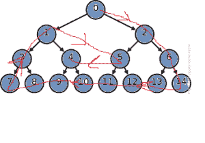

# 二叉树的顺时针三角遍历

> 原文:[https://www . geesforgeks . org/顺时针-三角遍历二叉树/](https://www.geeksforgeeks.org/clockwise-triangular-traversal-of-a-binary-tree/)

给定一个完整的二叉树，任务是按顺时针遍历顺序打印元素。
树的顺时针遍历定义为:

> 
> 
> 对于上面的二叉树，顺时针三角遍历将是
> **0，2，6，14，13，12，11，10，9，8，7，3，1，5，4**

**例:**

```
Input:
          1
      /       \
     2         3
   /   \      /   \
  4     5    6    7
 / \    /\
8   9  10 11     
Output: 1, 3, 7, 11, 10, 9, 8, 4, 2, 6, 5

Input:
        1
      /   \
     2     3
Output: 1, 3, 2
```

**方法:**
创建一个向量**树【】**，其中**树【I】**将存储该树在第 **i** 级的所有节点。取一个整数 **k** 来记录我们正在遍历的另一个整数是哪个级别，取**周期**来记录已经完成了多少个周期。现在，开始打印节点最右边剩余的还没有被遍历的节点&继续向下移动，直到到达最后一个还没有被遍历的层现在从右向左打印这个层，然后从最后一层开始移动打印每个层最左边剩余的最左边的元素，移动到最上面的层，它的元素还没有被遍历完，现在再次做同样的事情，直到所有的元素都没有被遍历完。
以下是上述方法的实施:

## C++

```
// C++ program for the
// above approach
#include <bits/stdc++.h>
using namespace std;

// Function to create an
// edge between two vertices
void addEdge(int a, int b, vector<int> tree[])
{

    // Add a to b's list
    tree[a].push_back(b);

    // Add b to a's list
    tree[b].push_back(a);
}

// Function to create
// complete binary tree
void createTree(int n, vector<int> tree[])
{
    for (int i = 1;; i++) {
        // Adding edge to
        // a binary tree
        int c = 0;
        if (2 * i <= n) {
            addEdge(i, 2 * i, tree);
            c++;
        }
        if (2 * i + 1 <= n) {
            addEdge(i, 2 * i + 1, tree);
            c++;
        }

        if (c == 0)
            break;
    }
}

// Modified Breadth-First Function
void bfs(int node, vector<int> tree[], bool vis[],
         int level[], vector<int> nodes[], int& maxLevel)
{

    // Create a queue of
    // {child, parent}
    queue<pair<int, int> > qu;

    // Push root node in the front of
    // the queue and mark as visited
    qu.push({ node, 0 });
    nodes[0].push_back(node);
    vis[node] = true;
    level[1] = 0;

    while (!qu.empty()) {

        pair<int, int> p = qu.front();

        // Dequeue a vertex
        // from queue
        qu.pop();
        vis[p.first] = true;

        // Get all adjacent vertices of the dequeued
        // vertex s. If any adjacent has not
        // been visited then enqueue it
        for (int child : tree[p.first]) {
            if (!vis[child]) {
                qu.push({ child, p.first });
                level[child] = level[p.first] + 1;
                maxLevel = max(maxLevel, level[child]);
                nodes[level[child]].push_back(child);
            }
        }
    }
}

// Function to display the pattern
void display(vector<int> nodes[], int maxLevel)
{

    // k represents the level no.
    // cycle represents how many
    // cycles has been completed
    int k = 0, cycle = 0;

    // While there are nodes
    // left to traverse
    while (cycle - 1 <= maxLevel / 2) {

        // Traversing rightmost element
        // in each cycle as we move down
        while (k < maxLevel - cycle) {
            int j = nodes[k].size() - 1;
            cout << nodes[k][j - cycle] << " ";
            k++;
        }

        // Traversing each element of remaining
        // last level from right to left
        if (k == maxLevel - cycle) {
            int j = nodes[k].size() - 1;
            for (j -= cycle; j >= cycle; j--)
                cout << nodes[k][j] << " ";
        }
        k--;

        // Traversing leftmost remaining element
        // in each cycle as we move up
        while (k > cycle) {
            cout << nodes[k][cycle] << " ";
            k--;
        }

        // No of cycles
        // completed
        cycle++;

        // updating from which level to
        // start new cycle
        k = cycle + 1;
    }
}

// Driver code
int main()
{

    // Number of vertices
    int n = 12;

    const int sz = 1e5;
    int maxLevel = 0;

    vector<int> tree[sz + 1];
    bool vis[sz + 1];
    int level[sz + 1];

    vector<int> nodes[sz + 1];

    createTree(n, tree);

    bfs(1, tree, vis, level, nodes, maxLevel);

    display(nodes, maxLevel);

    return 0;
}
```

## 蟒蛇 3

```
# Python3 program for the
# above approach

# Function to create an
# edge between two vertices
def addEdge(a, b):

    # Add a to b's list
    tree[a].append(b);

    # Add b to a's list
    tree[b].append(a); 

# Function to create
# complete binary tree
def createTree(n):

    i = 1   
    while True:

        # Adding edge to
        # a binary tree
        c = 0;
        if (2 * i <= n):
            addEdge(i, 2 * i);
            c += 1;

        if (2 * i + 1 <= n):
            addEdge(i, 2 * i + 1);
            c += 1       

        if (c == 0):
            break;

        i += 1   

# Modified Breadth-First
# Function
def bfs(node, maxLevel):

    # Create a queue of
    # {child, parent}
    qu = []

    # Push root node in the
    # front of the queue and
    # mark as visited
    qu.append([node, 0]);
    nodes[0].append(node);
    vis[node] = True;
    level[1] = 0;

    while (len(qu) != 0):       
        p = qu[0];

        # Dequeue a vertex
        # from queue
        qu.pop(0);
        vis[p[0]] = True;

        # Get all adjacent vertices
        # of the dequeued vertex s.
        # If any adjacent has not
        # been visited then enqueue it
        for child in tree[p[0]]:           
            if (not vis[child]):
                qu.append([child, p[0]]);
                level[child] = level[p[0]] + 1;
                maxLevel = max(maxLevel,
                               level[child]);
                nodes[level[child]].append(child);

    return maxLevel

# Function to display
# the pattern
def display(maxLevel):

    # k represents the level no.
    # cycle represents how many
    # cycles has been completed
    k = 0
    cycle = 0;

    # While there are nodes
    # left to traverse
    while (cycle - 1 <= maxLevel // 2):

        # Traversing rightmost element
        # in each cycle as we move down
        while(k < maxLevel - cycle):
            j = len(nodes[k]) - 1;
            print(nodes[k][j - cycle],
                  end = ' ')
            k += 1

        # Traversing each element of
        # remaining last level from right
        # to left
        if (k == maxLevel - cycle):
            j = len(nodes[k]) - 1 - cycle;
            while(j >= cycle):               
                print(nodes[k][j],
                      end = ' ')
                j -= 1               
        k -= 1

        # Traversing leftmost remaining
        # element in each cycle as we
        # move up
        while (k > cycle):
            print(nodes[k][cycle],
                  end = ' ')
            k -= 1

        # No of cycles
        # completed
        cycle += 1

        # updating from which
        # level to start new cycle
        k = cycle + 1;   

# Driver code
if __name__=="__main__":

    # Number of vertices
    n = 12;

    sz = 100005;
    maxLevel = 0;   
    tree = [[] for i in range(sz + 1)]   
    vis = [False for i in range(sz + 1)]
    level = [0 for i in range(sz + 1)]
    nodes = [[] for i in range(sz + 1)]
    createTree(n);
    maxLevel = bfs(1, maxLevel);
    display(maxLevel);

# This code is contributed by Rutvik_56
```

## java 描述语言

```
<script>

    // JavaScript program for the above approach

    let sz = 1e5;
    let tree = new Array(sz + 1);
    let nodes = new Array(sz + 1);
    let vis = new Array(sz + 1);
    let level = new Array(sz + 1);

    // Function to create an
    // edge between two vertices
    function addEdge(a, b)
    {

        // Add a to b's list
        tree[a].push(b);

        // Add b to a's list
        tree[b].push(a);
    }

    // Function to create
    // complete binary tree
    function createTree(n)
    {
        let i = 1;
        while(true) {
            // Adding edge to
            // a binary tree
            let c = 0;
            if (2 * i <= n) {
                addEdge(i, 2 * i);
                c++;
            }
            if (2 * i + 1 <= n) {
                addEdge(i, 2 * i + 1);
                c++;
            }

            if (c == 0)
                break;
              i+=1;
        }
    }

    // Modified Breadth-First Function
    function bfs(node, maxLevel)
    {

        // Create a queue of
        // {child, parent}
        let qu = [];

        // Push root node in the front of
        // the queue and mark as visited
        qu.push([ node, 0 ]);
        nodes[0].push(node);
        vis[node] = true;
        level[1] = 0;

        while (qu.length > 0)
        {

            let p = qu[0];

            // Dequeue a vertex
            // from queue
            qu.shift();
            vis[p[0]] = true;

            // Get all adjacent vertices of the dequeued
            // vertex s. If any adjacent has not
            // been visited then enqueue it
            for (let child = 0; child < tree[p[0]].length; child++) {
                if (!vis[tree[p[0]][child]]) {
                    qu.push([ tree[p[0]][child], p[0] ]);
                    level[tree[p[0]][child]] =
                    level[p[0]] + 1;

                    maxLevel =
                    Math.max(maxLevel, level[tree[p[0]][child]]);

                    nodes[level[tree[p[0]][child]]].
                    push(tree[p[0]][child]);
                }
            }
        }
        return maxLevel;
    }

    // Function to display the pattern
    function display(maxLevel)
    {

        // k represents the level no.
        // cycle represents how many
        // cycles has been completed
        let k = 0, cycle = 0;

        // While there are nodes
        // left to traverse
        while (cycle - 1 <= parseInt(maxLevel / 2, 10)) {

            // Traversing rightmost element
            // in each cycle as we move down
            while (k < maxLevel - cycle) {
                let j = nodes[k].length - 1;
                document.write(nodes[k][j - cycle] + " ");
                k++;
            }

            // Traversing each element of remaining
            // last level from right to left
            if (k == maxLevel - cycle) {
                let j = nodes[k].length - 1;
                for (j -= cycle; j >= cycle; j--)
                    document.write(nodes[k][j] + " ");
            }
            k--;

            // Traversing leftmost remaining element
            // in each cycle as we move up
            while (k > cycle) {
                document.write(nodes[k][cycle] + " ");
                k--;
            }

            // No of cycles
            // completed
            cycle++;

            // updating from which level to
            // start new cycle
            k = cycle + 1;
        }
    }

    // Number of vertices
    let n = 12;

    for(let i = 0; i < sz + 1; i++)
    {
        tree[i] = [];
        vis[i] = false;
        level[i] = 0;
        nodes[i] = [];
    }

    let maxLevel = 0;

    createTree(n);

    maxLevel = bfs(1, maxLevel);

    display(maxLevel);

</script>
```

**Output:** 

```
1 3 7 12 11 10 9 8 4 2 6 5
```

**时间复杂度:** O(n)