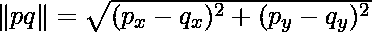

# 最接近的点对| 0(nlogn)实现

> 原文:[https://www . geeksforgeeks . org/最近点对 onlogn-implementation/](https://www.geeksforgeeks.org/closest-pair-of-points-onlogn-implementation/)

给我们一个平面上 n 个点的数组，问题是找出数组中最近的一对点。这个问题出现在许多应用中。例如，在空中交通管制中，你可能希望监控靠得太近的飞机，因为这可能意味着可能发生碰撞。回想一下下面两点 p 和 q 之间距离的公式

我们已经讨论过这个问题的[分治解决方案](https://www.geeksforgeeks.org/closest-pair-of-points/)。上一篇文章中提供的实现的时间复杂度是 O(n (Logn)^2).在这篇文章中，我们讨论时间复杂度为 O(nLogn)的实现。
以下是上一篇文章中讨论的算法的摘要。
**1)** 我们根据 x 坐标对所有点进行排序。
**2)** 将所有的点分成两半。
**(3)**递归寻找两个子阵中的最小距离。
**4)** 取两个最小距离中的最小值。让最小值为 d .
**(5)**创建一个数组条[]，该数组条存储距离划分两个集合的中间线最多 d 距离的所有点。
**6)** 找出长条中的最小距离[]。
**7)** 返回 d 的最小值和上面第 6 步计算的最小距离。
上述方法的伟大之处在于，如果数组 strip[]按照 y 坐标排序，那么我们可以在 O(n)时间内找到 strip[]中的最小距离。在上一篇文章中讨论的实现中，假设排序步骤花费 O(nLogn)时间，那么 strip[]在每个时间复杂度为 O(n (Logn)^2)的递归调用中都被显式排序。
在这篇文章中，我们讨论一个时间复杂度为 O(nLogn)的实现。这个想法是根据 y 坐标对所有的点进行预排序。让排序后的数组为 Py[]。当我们进行递归调用时，也需要根据垂直线来划分 Py[]的点。我们可以通过简单地处理每个点，并将它的 x 坐标与中线的 x 坐标进行比较来做到这一点。
下面是 O(nLogn)方法的 C++实现。

## 卡片打印处理机（Card Print Processor 的缩写）

```
// A divide and conquer program in C++ to find the smallest distance from a
// given set of points.

#include <iostream>
#include <float.h>
#include <stdlib.h>
#include <math.h>
using namespace std;

// A structure to represent a Point in 2D plane
struct Point
{
    int x, y;
};

/* Following two functions are needed for library function qsort().
   Refer: http://www.cplusplus.com/reference/clibrary/cstdlib/qsort/ */

// Needed to sort array of points according to X coordinate
int compareX(const void* a, const void* b)
{
    Point *p1 = (Point *)a,  *p2 = (Point *)b;
    return (p1->x != p2->x) ? (p1->x - p2->x) : (p1->y - p2->y);
}
// Needed to sort array of points according to Y coordinate
int compareY(const void* a, const void* b)
{
    Point *p1 = (Point *)a,   *p2 = (Point *)b;
    return (p1->y != p2->y) ? (p1->y - p2->y) : (p1->x - p2->x);
}

// A utility function to find the distance between two points
float dist(Point p1, Point p2)
{
    return sqrt( (p1.x - p2.x)*(p1.x - p2.x) +
                 (p1.y - p2.y)*(p1.y - p2.y)
               );
}

// A Brute Force method to return the smallest distance between two points
// in P[] of size n
float bruteForce(Point P[], int n)
{
    float min = FLT_MAX;
    for (int i = 0; i < n; ++i)
        for (int j = i+1; j < n; ++j)
            if (dist(P[i], P[j]) < min)
                min = dist(P[i], P[j]);
    return min;
}

// A utility function to find a minimum of two float values
float min(float x, float y)
{
    return (x < y)? x : y;
}

// A utility function to find the distance between the closest points of
// strip of a given size. All points in strip[] are sorted according to
// y coordinate. They all have an upper bound on minimum distance as d.
// Note that this method seems to be a O(n^2) method, but it's a O(n)
// method as the inner loop runs at most 6 times
float stripClosest(Point strip[], int size, float d)
{
    float min = d;  // Initialize the minimum distance as d

    // Pick all points one by one and try the next points till the difference
    // between y coordinates is smaller than d.
    // This is a proven fact that this loop runs at most 6 times
    for (int i = 0; i < size; ++i)
        for (int j = i+1; j < size && (strip[j].y - strip[i].y) < min; ++j)
            if (dist(strip[i],strip[j]) < min)
                min = dist(strip[i], strip[j]);

    return min;
}

// A recursive function to find the smallest distance. The array Px contains
// all points sorted according to x coordinates and Py contains all points
// sorted according to y coordinates
float closestUtil(Point Px[], Point Py[], int n)
{
    // If there are 2 or 3 points, then use brute force
    if (n <= 3)
        return bruteForce(Px, n);

    // Find the middle point
    int mid = n/2;
    Point midPoint = Px[mid];

    // Divide points in y sorted array around the vertical line.
    // Assumption: All x coordinates are distinct.
    Point Pyl[mid];   // y sorted points on left of vertical line
    Point Pyr[n-mid];  // y sorted points on right of vertical line
    int li = 0, ri = 0;  // indexes of left and right subarrays
    for (int i = 0; i < n; i++)
    {
      if ((Py[i].x < midPoint.x || (Py[i].x == midPoint.x && Py[i].y < midPoint.y)) && li<mid)
         Pyl[li++] = Py[i];
      else
         Pyr[ri++] = Py[i];
    }

    // Consider the vertical line passing through the middle point
    // calculate the smallest distance dl on left of middle point and
    // dr on right side
    float dl = closestUtil(Px, Pyl, mid);
    float dr = closestUtil(Px + mid, Pyr, n-mid);

    // Find the smaller of two distances
    float d = min(dl, dr);

    // Build an array strip[] that contains points close (closer than d)
    // to the line passing through the middle point
    Point strip[n];
    int j = 0;
    for (int i = 0; i < n; i++)
        if (abs(Py[i].x - midPoint.x) < d)
            strip[j] = Py[i], j++;

    // Find the closest points in strip.  Return the minimum of d and closest
    // distance is strip[]
    return stripClosest(strip, j, d);
}

// The main function that finds the smallest distance
// This method mainly uses closestUtil()
float closest(Point P[], int n)
{
    Point Px[n];
    Point Py[n];
    for (int i = 0; i < n; i++)
    {
        Px[i] = P[i];
        Py[i] = P[i];
    }

    qsort(Px, n, sizeof(Point), compareX);
    qsort(Py, n, sizeof(Point), compareY);

    // Use recursive function closestUtil() to find the smallest distance
    return closestUtil(Px, Py, n);
}

// Driver program to test above functions
int main()
{
    Point P[] = {{2, 3}, {12, 30}, {40, 50}, {5, 1}, {12, 10}, {3, 4}};
    int n = sizeof(P) / sizeof(P[0]);
    cout << "The smallest distance is " << closest(P, n);
    return 0;
}
```

**Output**

```
The smallest distance is 1.41421
```

**时间复杂度:**让上述算法的时间复杂度为 T(n)。让我们假设我们使用一个 O(nLogn)排序算法。上述算法将所有的点分成两组，并递归调用两组。分割后，它在 O(n)时间内找到条带。此外，围绕中间垂直线分割 Py 数组需要 O(n)个时间。最终在 O(n)时间内找到条带中最近的点。所以 T(n)可以表示如下
T(n)= 2T(n/2)+O(n)+O(n)+O(n)
T(n)= 2T(n/2)+O(n)
T(n)= T(nLogn)
**参考文献:**
[http://www . cs . UMD . edu/class/fall 2013/CMS 451/Lects/lect 10 . pdf](http://www.cs.umd.edu/class/fall2013/cmsc451/Lects/lect10.pdf)